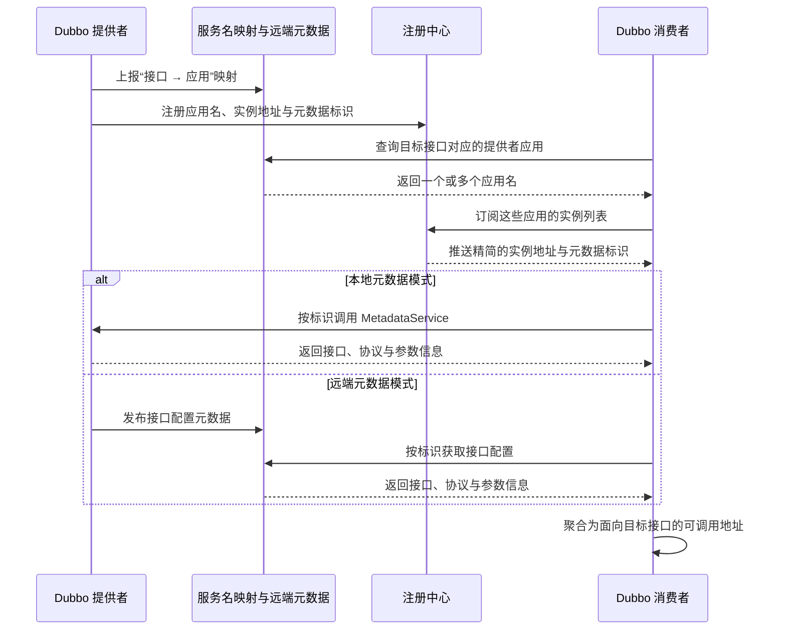

Dubbo 3 的应用级服务发现改变了注册中心组织和推送地址的粒度：Dubbo 2 主要按 RPC 服务接口聚合提供者 URL，Dubbo 3 的目标模型则按应用名聚合实例地址。消费者仍然引用具体 RPC 接口，接口、版本、分组和方法配置并未被应用名取代。本文以 Apache Dubbo Java SDK 3.x 为范围，说明这次调整要解决的扩展性问题，以及 Dubbo 如何在应用级地址之上恢复接口级调用信息。

## 改变的是服务发现粒度

接口级服务发现以服务键为订阅入口。提供者导出 RPC 服务时，会生成包含 IP、端口、接口、版本、分组以及部分调用配置的 URL，并注册到对应的服务节点。消费者已知目标接口，可以直接订阅该节点，再将收到的 URL 转换为运行时调用地址。

这种模型把“有哪些实例”和“实例如何提供某个 RPC 服务”放在同一份注册数据中。接口级信息可以直接参与服务治理，但实例地址和接口元数据也会随接口与实例组合而重复。

应用级服务发现将这些信息拆成三部分：

| 信息 | 主要职责 | 获取位置 |
| --- | --- | --- |
| 应用实例地址 | 表示某个应用有哪些可访问实例 | 注册中心 |
| 接口到应用的映射 | 回答某个 RPC 服务由哪些应用提供 | 服务名映射数据 |
| 接口配置元数据 | 描述实例实际导出的接口、协议和参数 | 提供者的 `MetadataService` 或远端元数据中心 |

注册中心以 `dubbo.application.name` 为聚合键保存精简后的实例信息，消费者在本地组合映射、实例和元数据，恢复出面向接口的可调用地址。因此，发现粒度改为应用级，并不意味着 RPC 编程模型变成按应用调用。

## 接口级模型为什么会遇到容量问题

设一个提供者应用部署了 `N` 个实例，每个实例导出 `S` 个 RPC 服务。在忽略多协议、分组和版本进一步拆分的简化模型中，接口级注册产生的提供者记录数量约为：

$$
R_{interface}=N\times S
$$

应用级注册则主要按实例登记，记录数量约为：

$$
R_{application}=N
$$

记录数量只是问题的一部分。接口级 URL 同时携带实例地址和接口配置：同一实例地址随每个接口重复，同一套接口元数据又随每个实例重复。官方文档给出的示例中，10 个服务部署在 100 个实例上，会形成 1000 条接口级地址数据；应用级模型的核心实例记录则与 100 个实例对应。

实例上下线时，注册中心还要聚合并推送地址，消费者则要解析通知并重建本地目录。集群较小时，这些重复数据通常不会形成瓶颈；当接口数、实例数和消费者数同时增长时，压力会扩散到注册中心存储与推送、网络传输，以及消费者解析地址所需的 CPU 和内存。Dubbo 3 调整聚合粒度，优化的是服务发现控制面，而不是单次 RPC 调用的编码或传输性能。

## 应用级服务发现如何恢复接口调用

消费者通常只声明目标接口，并不知道由哪个应用提供该接口。因此，应用级发现不能只是把注册键从接口名换成应用名，还要先完成接口到应用的转换，再取得接口元数据。

完整过程分为四步：

1. 提供者启动时发布“接口名到应用名”的映射。一个接口可以由多个应用提供，因此映射不是一对一关系。
2. 消费者根据自己引用的接口查询映射，只订阅实际提供该接口的应用实例，而不是加载注册中心中的所有应用。
3. 注册中心返回应用级实例地址，以及元数据版本标识、存储方式等少量信息。
4. 消费者取得接口配置元数据，将其与实例信息组合，在本地恢复出供服务目录、路由和负载均衡使用的地址。

接口配置元数据有两种主要传递方式。`metadata-type=local` 时，元数据保存在提供者进程中，消费者通过提供者暴露的 `MetadataService` 获取；`metadata-type=remote` 时，提供者将元数据报告到远端元数据中心，消费者从该中心读取。多个实例的导出内容一致时，可以共享同一个元数据版本标识（revision），不必按实例重复保存整份接口配置。

这样，变化频繁的实例地址与相对稳定的接口元数据被分开处理，注册中心不再集中推送所有接口配置。应用级发现减少的是地址发现链路中的重复数据，并没有删除接口维度。

## 为什么选择应用作为聚合边界

应用是部署和扩缩容的基本单元。一个进程可能导出多个 RPC 接口，但这些接口通常随同一个应用实例一起启动、停止和迁移。以应用为边界登记实例，可以避免同一地址在多个接口节点中重复出现。

这一边界也更接近 Kubernetes、Service Mesh 以及常见微服务注册系统的实例模型：基础设施通常维护“应用或服务到实例”的关系，并不理解 Java 接口、Dubbo 分组和方法配置。Dubbo 3 将基础地址发现收敛到应用实例，再通过服务名映射和元数据保留 RPC 接口语义，使底层注册模型与接口级治理不必共享同一种数据结构。

应用级也不等于全量订阅。消费者先根据接口到应用的映射确定依赖，再订阅相关应用的实例列表。例如，消费者只依赖 `order-app` 和 `inventory-app`，就无须接收其他应用的实例变化。模型改变了地址的聚合方式，但仍保留按消费关系订阅的能力。

## 收益与成立条件

应用级服务发现主要带来以下变化：

| 维度 | 接口级发现 | 应用级发现 |
| --- | --- | --- |
| 地址聚合键 | RPC 服务接口 | 应用名 |
| 同一实例的地址登记 | 随导出的接口重复 | 主要登记一次应用实例 |
| 注册数据内容 | 地址与较多接口配置混合 | 地址精简，接口配置走元数据通道 |
| 消费者订阅入口 | 直接订阅接口节点 | 先解析接口到应用映射，再订阅应用实例 |
| 基础设施适配 | 注册中心需要理解 Dubbo 服务模型 | 地址层更接近通用应用实例模型 |

收益大小取决于应用结构。单个应用只导出少量接口且实例规模较小时，记录数量下降有限；一个应用导出较多接口并部署大量同构实例时，消除接口数与实例数的乘法放大会带来更明显的收益。多协议、多版本、多分组或不同实例导出内容不一致时，实际数据量还会受其他维度影响，不能只用 `N` 和 `S` 推算生产容量。

应用级聚合也会扩大单次通知覆盖的接口范围。同一个应用承载多个接口时，只消费其中一个接口的消费者仍会接收该应用的实例变化。如果大量无关服务被放入同一应用，精准订阅的收益会随之降低。应用级发现解决的是接口记录重复，不能代替合理的应用边界设计。

## 新模型增加了哪些依赖

接口级 URL 直接携带目标接口信息；应用级发现则把两类数据变成了地址可用的前置条件。

第一类是接口到应用的映射。映射缺失时，消费者无法确定应订阅哪个应用；映射残留时，消费者可能继续订阅已经不再提供该接口的应用。一个接口由多个应用共同提供时，还要保证并发更新不会丢失其他应用的映射。

第二类是接口配置元数据。消费者取得应用实例地址后，仍要确认实例实际导出了目标接口，并获得协议及必要参数。使用本地元数据时，消费者必须能够访问提供者的 `MetadataService`；使用远端元数据时，提供者和消费者必须连接到一致的元数据中心。元数据版本、实例地址与真实导出状态不一致时，就可能出现“注册中心中有实例，但消费者没有可调用地址”。

故障排查也要随之分层：先检查接口到应用的映射，再检查应用实例，最后检查元数据以及消费者恢复出的接口地址。只在注册中心按接口名寻找提供者 URL，无法覆盖完整的应用级发现链路。

## 迁移不能只看 Dubbo 主版本号

“Dubbo 3 改用应用级服务发现”描述的是架构方向，不表示所有 Dubbo 3.x 应用升级依赖后都会立即只注册、只订阅应用级地址。为了与 Dubbo 2.x 互通，Dubbo 3 支持两套地址模型并存；官方不同时期文档中的默认值也存在差异。生产环境应以实际 Dubbo 小版本、配置和运行日志为准，不能根据主版本号推断当前模型。

提供者注册模式主要包括：

- `interface`：只注册接口级地址；
- `instance`：只注册应用级实例；
- `all`：同时注册接口级与应用级地址，用于兼容迁移。

消费者迁移模式主要包括：

- `FORCE_INTERFACE`：只订阅接口级地址；
- `APPLICATION_FIRST`：同时具备两种订阅能力，优先选择可用的应用级地址；
- `FORCE_APPLICATION`：只订阅应用级地址。

旧集群迁移时，通常先让提供者双注册，再让 Dubbo 3 消费者双订阅并验证应用级地址。确认旧消费者已经退出，且映射、实例和元数据均稳定后，才能切换到只注册、只订阅应用级地址。提供者过早停止接口级注册，会使仍按 Dubbo 2.x 模型订阅的消费者失去地址；消费者过早强制使用应用级发现，则无法发现尚未完成应用级注册或映射上报的提供者。

迁移验收不能只检查注册中心中是否存在节点，还应验证消费者解析出的应用集合、两种模型恢复出的有效地址、实例上下线的收敛情况和元数据获取失败的可观测性，并演练回退到接口级发现的开关。

## 总结

接口级模型按“接口数 × 实例数”组织实例地址和接口元数据，规模扩大后会增加注册中心存储与推送、网络传输以及消费者解析地址的成本。Dubbo 3 改为按应用聚合实例，并将接口到应用的关系、接口配置分别交给服务名映射和元数据通道，从而减少交叉重复，也使地址模型更接近 Kubernetes 和 Service Mesh 等基础设施。

Dubbo 的接口语义没有因此消失：消费者仍按接口发起引用，框架在运行时组合应用实例和接口元数据，恢复出面向接口的地址目录。代价是发现链路增加了映射与元数据依赖，通知范围受到应用边界影响，迁移期间还要同时维护两套地址模型。应用级服务发现是否真正降低控制面成本，取决于这些环节能否保持一致并得到有效观测。

## 参考资料

- [Apache Dubbo：应用级服务发现与接口级服务发现](https://dubbo.apache.org/en/overview/mannual/java-sdk/reference-manual/registry/service-discovery-application-vs-interface/)
- [Apache Dubbo：服务发现](https://dubbo.apache.org/en/overview/what/core-features/service-discovery/)
- [Apache Dubbo：元数据中心概述](https://dubbo.apache.org/en/overview/mannual/java-sdk/reference-manual/metadata-center/overview/)
- [Apache Dubbo：升级到应用级服务发现](https://dubbo.apache.org/en/overview/mannual/java-sdk/reference-manual/upgrades-and-compatibility/migration-service-discovery/)
- [Apache Dubbo：地址找不到异常排查](https://dubbo.apache.org/en/overview/mannual/java-sdk/tasks/troubleshoot/no-provider/)
