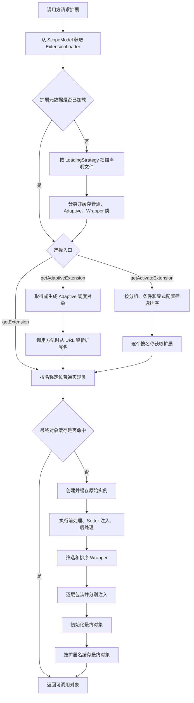

# Dubbo 扩展点：发现、选择与运行时组装

本文以 Apache Dubbo 3.3.6 为基线，沿着一次扩展获取请求说明三个连续阶段：Dubbo 如何发现候选实现，如何从候选集合中选择目标，以及如何把实现类组装成最终可调用对象。核心代码位于 `dubbo-common` 的 [`ExtensionDirector`](https://github.com/apache/dubbo/blob/dubbo-3.3.6/dubbo-common/src/main/java/org/apache/dubbo/common/extension/ExtensionDirector.java) 与 [`ExtensionLoader`](https://github.com/apache/dubbo/blob/dubbo-3.3.6/dubbo-common/src/main/java/org/apache/dubbo/common/extension/ExtensionLoader.java)。

## 一、完整流程总览

Dubbo SPI 不是在启动时创建某个接口的全部实现。`ExtensionLoader` 首次需要扩展元数据时扫描声明文件，将实现类分类并缓存；具体扩展被选中后，才创建、注入、包装和初始化对应对象。官方的[扩展点开发指南](https://dubbo.apache.org/zh-cn/overview/mannual/java-sdk/reference-manual/architecture/dubbo-spi/)把主过程概括为读取配置、缓存实现、按名称实例化以及 IOC 与 Wrapper 处理。3.3.6 的源码还需要补上作用域、后置处理器和多种选择入口。



这张图包含两次不同性质的选择。第一次由调用方选择入口：固定名称、Adaptive 调度或 Activate 批量激活。Adaptive 调度对象还会在方法被调用时执行第二次选择，从 `URL` 中解析扩展名，再转入普通扩展的创建路径。Activate 则先得到一组名称，再逐个调用普通扩展路径。

因此，发现阶段处理的是“有哪些候选类”，选择阶段处理的是“本次需要哪个或哪些名称”，组装阶段处理的是“这些类如何成为可调用对象”。三者共享 `ExtensionLoader`，但缓存的数据和发生时机不同。

## 二、核心对象与职责边界

### 1. `ScopeModel` 与 `ExtensionDirector`

Dubbo 3.3.6 不应再把扩展系统理解为一个进程级静态容器。`FrameworkModel`、`ApplicationModel` 和 `ModuleModel` 分别代表框架、应用和模块作用域；每个 `ScopeModel` 通过 `ExtensionDirector` 管理本作用域的 `ExtensionLoader`。子级 Director 找不到本地加载器时会向父级查找，最终由 `@SPI.scope` 决定加载器创建在哪一级。

`@SPI` 的默认作用域是 `APPLICATION`，还可以声明 `FRAMEWORK`、`MODULE` 或特殊的 `SELF`。作用域决定缓存和实例共享边界：应用级扩展可以在同一应用的模块间共享，但不会因此成为整个 JVM 的全局单例。具体规则见 3.3.6 的 [`ExtensionScope`](https://github.com/apache/dubbo/blob/dubbo-3.3.6/dubbo-common/src/main/java/org/apache/dubbo/common/extension/ExtensionScope.java)。

旧式静态入口 `ExtensionLoader.getExtensionLoader(Class)` 在 3.3.6 中已经标记为弃用，它实际委托给默认应用的默认模块。业务代码需要明确作用域时，应从对应的 `ScopeModel` 获取加载器。

### 2. `ExtensionLoader` 管理一个扩展接口

一个 `ExtensionLoader<T>` 只负责一个带 `@SPI` 的接口 `T`。它同时保存四类关键状态：

| 状态 | 键与值 | 含义 |
| --- | --- | --- |
| `cachedClasses` | 扩展名 → 实现类 | 已发现的普通候选实现 |
| `extensionInstances` | 实现类 → 原始实例 | 尚未套用 Wrapper 的实例 |
| `cachedInstances` | 扩展名 → 最终实例 | 已完成包装和初始化、可直接返回的对象 |
| `cachedAdaptiveInstance` | 单个 Adaptive 实例 | 负责运行时转发的调度对象 |

另外，Adaptive 类、Wrapper 类和 `@Activate` 元数据分别进入独立缓存。这里的“原始实例”和“最终实例”不能合并理解：多个名称可以映射到同一个实现类，此时它们可能共享按类缓存的原始实例，但仍各自拥有按名称缓存的最终包装结果。

### 3. 名称是发现、选择与实例之间的连接点

扩展声明先建立“名称 → 类”的映射，固定选择直接使用名称，Adaptive 从调用上下文计算名称，Activate 得到一组名称，组装结果最后也按名称缓存。实现类本身不能表达某次调用为什么选择它；这一决策由扩展名及其来源承担。

## 三、发现：建立候选扩展集合

### 1. 加载策略决定扫描位置

`ExtensionLoader` 首次调用 `getExtensionClasses()` 时加锁加载，后续直接复用类映射。加载策略自身通过 JDK `ServiceLoader` 发现，3.3.6 内置三种策略：

| 策略 | 声明目录 | 处理特征 |
| --- | --- | --- |
| `DubboInternalLoadingStrategy` | `META-INF/dubbo/internal/` | 优先扫描，主要存放框架内建扩展 |
| `DubboLoadingStrategy` | `META-INF/dubbo/` | 随后扫描，允许覆盖此前的同名映射 |
| `ServicesLoadingStrategy` | `META-INF/services/` | 最后扫描，兼容 JDK SPI 目录并允许覆盖 |

这些目录和覆盖标记直接定义在 [`DubboInternalLoadingStrategy`](https://github.com/apache/dubbo/blob/dubbo-3.3.6/dubbo-common/src/main/java/org/apache/dubbo/common/extension/DubboInternalLoadingStrategy.java)、[`DubboLoadingStrategy`](https://github.com/apache/dubbo/blob/dubbo-3.3.6/dubbo-common/src/main/java/org/apache/dubbo/common/extension/DubboLoadingStrategy.java) 和 [`ServicesLoadingStrategy`](https://github.com/apache/dubbo/blob/dubbo-3.3.6/dubbo-common/src/main/java/org/apache/dubbo/common/extension/ServicesLoadingStrategy.java) 中。覆盖结果由策略顺序和 `overridden()` 共同决定，不能只根据 classpath 中某个文件的位置推断。

每个声明文件以扩展接口的全限定名命名，例如：

```text
META-INF/dubbo/com.example.format.MessageFormatter
```

文件内容通常使用 `名称=实现类全限定名`：

```properties
plain=com.example.format.PlainMessageFormatter
upper=com.example.format.UpperMessageFormatter
```

解析时会删除 `#` 之后的注释和空白行。一个声明名还可以用逗号分隔成多个别名，但显式使用一个稳定名称更容易定位配置冲突和加载异常。

### 2. 加载类不等于创建全部实例

扫描到一行声明后，Dubbo 会加载并校验实现类：实现类必须能赋值给扩展接口，并且需要满足当前策略的包名和类加载器约束。这里会得到 `Class<?>` 并触发类初始化，但不会创建所有扩展对象。对象创建仍推迟到某个名称真正被获取时。

`loadClass` 按以下顺序分类：

1. 类上带 `@Adaptive`：缓存为 Adaptive 类。一个加载器最终只能保留一个有效的 Adaptive 类。
2. 类具有唯一参数类型为扩展接口的公共构造器：识别为 Wrapper 类。
3. 其他实现：作为普通扩展写入名称映射，并同时记录其 `@Activate` 元数据。

这意味着 Wrapper 不需要额外的声明语法。只要声明文件包含该类，且公共构造器形如 `WrapperType(MessageFormatter delegate)`，加载器就会把它归入 Wrapper 集合，而不会当作普通名称实现。

`@Activate(onClass = ...)` 还会参与发现阶段：只有指定类全部存在时，该实现才进入候选集合。它与后面根据 `group`、`value` 进行的运行时激活不是同一个判断。

### 3. 错误先记录，使用时再关联

单行声明加载失败时，`ExtensionLoader` 会把原始行和异常记录到 `exceptions`，继续处理同一资源中的其他行。同一名称在不允许覆盖的策略中映射到不同实现时，也会作为重复扩展错误被记录。之后请求一个不存在的名称时，`findException` 会尝试附带名称相近的已记录原因。

这种处理方式不会保证所有配置错误都在扫描瞬间终止应用。未被请求的错误扩展可能只留下日志；当对应名称进入选择路径时，获取操作才会失败。因此，启动检查需要显式遍历或获取期望使用的扩展，不能仅以应用成功启动作为声明文件正确的证据。

## 四、选择：确定目标扩展

三种入口都依赖已经发现的候选集合，但返回数量、决策时机和输入不同。

| 入口 | 选择输入 | 决策时机 | 返回结果 |
| --- | --- | --- | --- |
| `getExtension(name)` | 明确扩展名 | 获取对象时 | 一个具体扩展的最终对象 |
| `getAdaptiveExtension()` | Adaptive 类或方法上的 `@Adaptive` 规则 | 先返回调度对象，调用方法时再读取 `URL` | 一个 Adaptive 调度对象，随后委托给具体扩展 |
| `getActivateExtension(...)` | `URL`、分组、激活条件和显式名称 | 获取列表时 | 零个或多个已排序的具体扩展对象 |

### 1. 固定名称：`getExtension`

`getExtension("upper")` 直接在 `cachedClasses` 中定位实现类。如果名称对应的最终对象已经缓存，则立即返回；否则进入创建和组装流程。`getDefaultExtension()` 会读取扩展接口 `@SPI("...")` 中的默认名称，再调用相同路径。为兼容旧用法，字符串 `"true"` 也表示获取默认扩展，但直接调用 `getDefaultExtension()` 更能表达意图。

固定名称选择在对象获取阶段完成，之后调用方法不会重新选择实现。适用于配置已经被解析成扩展名，或调用方明确要求某个实现的场景。

### 2. 运行时选择：`getAdaptiveExtension`

`getAdaptiveExtension()` 返回的通常不是业务实现，而是一个调度对象。它有两种来源：

- 声明文件中存在类级 `@Adaptive` 实现时，直接创建该类。
- 没有类级 Adaptive 实现时，根据接口中带方法级 `@Adaptive` 的方法生成 Java 源码，再通过 Dubbo 的 `Compiler` 扩展编译成类。

如果接口没有任何方法标记 `@Adaptive`，又没有手写 Adaptive 类，生成过程会拒绝创建。生成逻辑可在 [`AdaptiveClassCodeGenerator`](https://github.com/apache/dubbo/blob/dubbo-3.3.6/dubbo-common/src/main/java/org/apache/dubbo/common/extension/AdaptiveClassCodeGenerator.java) 中核对。

生成方法的职责可以压缩成下面几步：

1. 从方法参数直接取得 `URL`，或从参数对象的公开无参方法取得 `URL`。
2. 按 `@Adaptive` 给出的键从 `URL` 读取扩展名；存在 `Invocation` 参数时优先读取方法级参数。
3. 如果键没有命中，回退到 `@SPI` 的默认名称；特殊键 `protocol` 对应 `URL` 的协议部分。
4. 从当前 `URL` 关联的 `ScopeModel` 获取同一接口的加载器。
5. 调用 `getExtension(extName)` 得到具体扩展，再转发原方法和参数。

例如，生成后的核心逻辑与下面的简化代码等价：

```java
String extName = url.getParameter("format", "plain");
ScopeModel scopeModel = ScopeModelUtil.getOrDefault(
        url.getScopeModel(), MessageFormatter.class);
MessageFormatter extension = scopeModel
        .getExtensionLoader(MessageFormatter.class)
        .getExtension(extName);
return extension.format(url, message);
```

所以 Adaptive 的动态性位于方法调用边界：Adaptive 对象本身会缓存，但每次调用仍可以从不同 `URL` 解析出不同名称。解析出的具体实现继续走普通扩展路径，因此依赖注入和 Wrapper 不会被绕过。未标记 `@Adaptive` 的接口方法在生成类中会抛出 `UnsupportedOperationException`。

### 3. 条件批量选择：`getActivateExtension`

Activate 解决的是“当前上下文应启用哪些扩展”，不是“从多个实现中挑一个”。它常用于 Filter、Listener 等可以组成有序列表的扩展点。

自动激活需要同时满足以下条件：

- `@Activate.group` 与调用方传入的分组匹配；调用方未传分组时不限制分组。
- `@Activate.value` 为空，或者其中至少一个键在 `URL` 或方法级参数中存在且值满足条件。
- 显式名称列表没有通过 `-name` 排除该扩展，也没有通过 `-default` 关闭全部自动激活项。

自动激活项与显式加入项合并后，根据 `before`、`after` 和 `order` 元数据排序；其中 `before`、`after` 在 3.3.6 已标记为弃用。显式列表中的 `default` 还能控制显式扩展位于自动激活集合之前还是之后。最终每个名称仍通过 `getExtension(name)` 获取，因此列表元素都是已经完成运行时组装的对象。

## 五、组装：生成最终运行时对象

选择阶段得到普通扩展名后，`createExtension(name, wrap)` 才开始组装。3.3.6 的实际顺序可以表示为：

```text
名称定位实现类
  → 创建或复用按实现类缓存的原始实例
  → 原始实例：前处理 → Setter 注入 → 后处理
  → 筛选并排序 Wrapper
  → 每层 Wrapper：构造 → 前处理 → Setter 注入 → 后处理
  → 对最终最外层对象执行 Lifecycle.initialize()
  → 按扩展名缓存并返回最终对象
```

### 1. 实例创建与两层缓存

原始实例以实现类为键保存在 `extensionInstances`。默认实例化策略优先寻找参数均为 `ScopeModel`、`FrameworkModel`、`ApplicationModel` 或 `ModuleModel` 的唯一公共构造器；没有匹配构造器时使用公共无参构造器。它不提供任意业务依赖的构造器注入，具体边界见 [`InstantiationStrategy`](https://github.com/apache/dubbo/blob/dubbo-3.3.6/dubbo-common/src/main/java/org/apache/dubbo/common/beans/support/InstantiationStrategy.java)。

Wrapper 链完成后的对象以扩展名为键保存在 `cachedInstances`。因此，常规 `getExtension(name)` 重复调用不会重复创建 Wrapper，也不会重复执行初始化。按类缓存与按名称缓存同时存在，是因为原始实现的复用维度和最终对象的选择维度不同。

### 2. 前后处理与依赖注入

原始实例在首次创建时、每一层 Wrapper 在本次新建时，都会依次经过：

1. `ExtensionPostProcessor.postProcessBeforeInitialization`。
2. `injectExtension`。
3. `ExtensionPostProcessor.postProcessAfterInitialization`。

`injectExtension` 只检查公共、名称以 `set` 开头且只有一个参数的方法；基本类型参数、标记 `@DisableInject` 的方法以及部分框架感知接口方法会被跳过。依赖由自适应 `ExtensionInjector` 链按顺序查找。内置 SPI 注入器只处理带 `@SPI` 的接口，并返回其 Adaptive 扩展；使用 Dubbo Spring 模块时，Spring 注入器还能从容器中查找对象。

Setter 注入失败的处理边界需要单独说明：单个 Setter 抛出异常时，`injectExtension` 记录错误并继续，创建流程不一定失败。这可能产生依赖未注入完整但仍被返回的对象。扩展实现如果不能在缺少该依赖时安全工作，应在初始化阶段主动校验，而不能只依赖注入日志。

### 3. Wrapper 链

Wrapper 类必须有一个公共构造器，其唯一参数类型就是扩展接口。组装时，Dubbo 先根据 `@Wrapper.matches` 和 `mismatches` 判断 Wrapper 是否适用于当前扩展名，再按照 `@Wrapper.order` 排序并反向遍历：

```java
MessageFormatter current = raw;
current = new MetricsMessageFormatterWrapper(current);
current = new LoggingMessageFormatterWrapper(current);
```

每次构造都把上一层对象作为 delegate，最后创建的 Wrapper 位于最外层。Wrapper 本身也经过前后处理和 Setter 注入。扫描顺序不会直接决定调用嵌套顺序；应使用 `@Wrapper.order` 明确控制，并结合最终的反向遍历理解外层与内层位置。

### 4. 生命周期与失败行为

Wrapper 全部完成后，`ExtensionLoader` 只对最终对象调用一次 `Lifecycle.initialize()`。如果原始实例实现了 `Lifecycle`，但最外层 Wrapper 没有实现该接口，原始实例不会通过这条路径收到初始化回调；源码在 `createExtension` 中对此有明确警告。需要初始化原始实现时，Wrapper 必须正确传递生命周期，或者设计成由最终对象统一完成初始化。

不同失败位置的缓存行为也不同：

- 声明行解析或类加载失败会被记录，稍后可能通过缺失名称异常关联出来。
- 固定扩展在构造、后处理、Wrapper 或初始化阶段失败时，不会把未完成对象写入按名称缓存；后续调用会重新执行 `createExtension`，但此前已写入按类缓存的原始实例可能被复用。
- Adaptive 对象创建失败时会缓存 `createAdaptiveInstanceError`，后续获取会直接再次抛出该错误。
- Setter 注入的单方法异常只记录日志，不会自动终止组装。

这些差异决定了排障位置：名称不存在先检查发现结果，Adaptive 创建失败检查生成和编译条件，具体实例创建失败则沿构造、处理器、注入、Wrapper 和生命周期顺序定位。

## 六、最小自定义扩展示例

下面定义一个可按 `URL` 参数选择实现的格式化扩展。示例使用应用作用域默认值，不包含 Wrapper，以便把发现和选择链路单独呈现。

### 1. 定义扩展接口

```java
package com.example.format;

import org.apache.dubbo.common.URL;
import org.apache.dubbo.common.extension.Adaptive;
import org.apache.dubbo.common.extension.SPI;

@SPI("plain")
public interface MessageFormatter {

    @Adaptive("format")
    String format(URL url, String message);
}
```

`@SPI("plain")` 定义默认扩展名，`@Adaptive("format")` 指定 Adaptive 方法从 `URL` 的 `format` 参数读取扩展名。

### 2. 提供两个实现

```java
package com.example.format;

import org.apache.dubbo.common.URL;

public class PlainMessageFormatter implements MessageFormatter {

    @Override
    public String format(URL url, String message) {
        return message;
    }
}
```

```java
package com.example.format;

import java.util.Locale;
import org.apache.dubbo.common.URL;

public class UpperMessageFormatter implements MessageFormatter {

    @Override
    public String format(URL url, String message) {
        return message.toUpperCase(Locale.ROOT);
    }
}
```

在 `src/main/resources/META-INF/dubbo/com.example.format.MessageFormatter` 中建立名称映射：

```properties
plain=com.example.format.PlainMessageFormatter
upper=com.example.format.UpperMessageFormatter
```

### 3. 固定选择与 Adaptive 选择

```java
import org.apache.dubbo.common.URL;
import org.apache.dubbo.common.extension.ExtensionLoader;
import org.apache.dubbo.rpc.model.ApplicationModel;

ExtensionLoader<MessageFormatter> loader = ApplicationModel.defaultModel()
        .getDefaultModule()
        .getExtensionLoader(MessageFormatter.class);

MessageFormatter fixed = loader.getExtension("upper");
String fixedResult = fixed.format(
        URL.valueOf("demo://localhost/message"),
        "Dubbo"
);

MessageFormatter adaptive = loader.getAdaptiveExtension();
String adaptiveResult = adaptive.format(
        URL.valueOf("demo://localhost/message?format=upper"),
        "Dubbo"
);
```

两次调用都得到 `DUBBO`，但路径不同：

- 固定路径在调用 `getExtension("upper")` 时完成选择，然后创建或复用 `UpperMessageFormatter`。
- Adaptive 路径先创建或复用调度对象；调用 `format` 时读取 `format=upper`，再执行 `getExtension("upper")`。
- 如果 Adaptive 调用的 `URL` 没有 `format` 参数，则使用 `@SPI("plain")`，最终返回原字符串。
- 两条路径汇合到同一个普通扩展获取入口，所以命名缓存、依赖注入、Wrapper 和生命周期规则完全一致。
