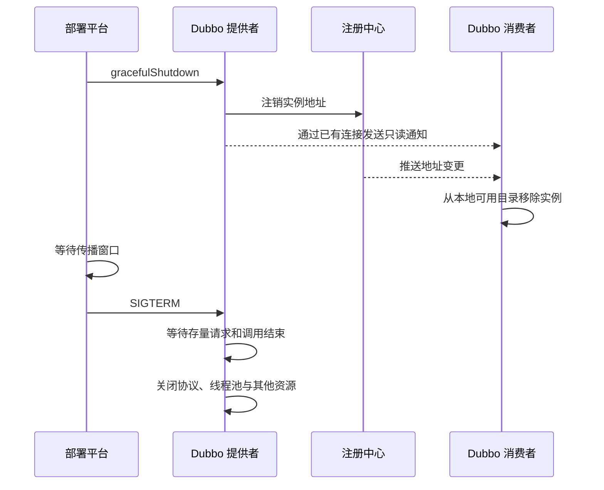

Dubbo 服务的优雅上下线不是单个开关，而是一组有顺序约束的生命周期操作。上线时，实例应在依赖和业务资源就绪后才进入消费者的地址列表；下线时，实例应先阻止新流量进入，再等待地址变更传播和存量请求结束，最后退出进程。本文以 Apache Dubbo Java SDK 3.3.x 为基线，说明这两条路径及其在常规主机和 Kubernetes 中的落地方式。

## 优雅上下线需要保证什么

上线过程需要满足两个条件：实例具备处理请求的能力后才发布地址；新实例刚接入时不会立即承担超出当前处理能力的流量。缓存加载、连接池建立、JIT 编译和下游依赖检查都可能使“进程已启动”早于“实例可接流”。

下线过程需要满足另外两个条件：消费者不再向待下线实例发起新请求；已经进入实例的请求有时间返回结果。只从注册中心删除地址不能立即满足这两个条件，因为地址变更还要经过注册中心处理、通知消费者以及消费者更新本地目录。这个传播窗口内，仍可能有请求到达旧实例。

因此，需要区分以下状态：

| 状态 | 表示的含义 | 不能替代的状态 |
| --- | --- | --- |
| 进程存活 | JVM 仍在运行 | 依赖已就绪、服务已注册 |
| Dubbo 已启动 | 框架完成启动流程 | 业务缓存和外部资源可用 |
| 服务已暴露 | 协议端口能够接收调用 | 注册中心和消费者已经看到地址 |
| 地址已注册 | 注册中心保存了实例地址 | 所有消费者已经完成本地刷新 |
| 地址已注销 | 注册中心不再发布实例地址 | 旧连接上已不存在新请求 |

优雅上下线的关键不是让这些状态同时改变，而是按正确顺序推进状态。

## 上线：准备完成后再发布地址

上线顺序应为：启动进程，完成必要初始化，验证实例能够处理请求，发布服务地址，最后让流量逐步增加。对于需要确定接流时点的服务，可以使用人工注册，而不是依赖一个估算的固定延迟。

Dubbo 3.3.x 的全局配置如下：

```yaml
dubbo:
  application:
    name: order-provider
    manual-register: true
    qos-enable: true
    qos-port: 22222
    qos-accept-foreign-ip: false
    qos-anonymous-access-permission-level: PROTECTED
  provider:
    delay: -1
```

`delay: -1` 阻止服务自动发布，`manual-register: true` 允许部署系统在检查完成后执行 QoS `online` 命令：

```bash
curl --fail --silent http://127.0.0.1:22222/online
```

这里不能使用 `dubbo.provider.register=false` 或 `dubbo.registry.register=false` 代替 `delay=-1`。从 Dubbo 3.3 开始，`register=false` 表示不允许注册，之后执行 `online` 也不会把服务注册回去；Dubbo 3.2.x 及更早版本在这一行为上不同。

固定延迟适合初始化时长稳定、无需部署平台确认的场景。例如 `delay: 5000` 会延迟发布服务，但五秒到期并不代表业务一定就绪。初始化时间受数据量或外部依赖影响时，人工注册更容易形成可验证的发布条件。

地址发布后，Dubbo 消费端可以根据提供者的启动时间和 `warmup` 参数降低新实例的初始权重，再逐步恢复到正常权重。预热只能缓解新实例短时间内承压过高，不能替代发布前的就绪检查：一个尚不能正确处理请求的实例，即使只收到少量流量，仍会产生错误。

## 下线：先摘流，再排空，最后退出

下线必须把“从地址列表移除”和“销毁进程”拆成两个阶段。Dubbo 3.3.x 的 QoS 命令中，三类操作的作用不同：

| 命令 | 作用 | 是否可恢复 |
| --- | --- | --- |
| `offline` | 从注册中心注销一个或多个服务 | 可通过 `online` 恢复 |
| `gracefulShutdown` | 注销当前实例的服务，并通过已有 TCP 连接通知消费者停止调用该实例 | 可通过 `online` 恢复 |
| `shutdown` | 销毁 Dubbo 应用及其资源 | 进程重启前不可恢复 |

正常发布流程优先使用 `gracefulShutdown` 完成摘流，再向进程发送 `SIGTERM`。如果当前版本或部署环境只使用 `offline`，则必须为注册中心通知和消费者地址刷新预留等待时间。



Dubbo 在正常关闭期间会通知消费者停止向当前实例发送新请求，并等待正在执行的请求结束。默认等待时间是 10 秒，可以通过 JVM 参数调整：

```bash
java -Ddubbo.service.shutdown.wait=30000 -jar order-provider.jar
```

这个值不是注册中心传播等待时间。传播等待发生在发送 `SIGTERM` 之前，`dubbo.service.shutdown.wait` 则用于进程进入关闭流程后等待存量请求。部署平台允许的总终止时间至少应覆盖以下四部分：

1. QoS 摘流命令执行时间；
2. 注册中心通知和消费者地址刷新时间；
3. Dubbo 存量请求等待时间；
4. Spring 容器及业务资源的清理时间，并保留调度抖动余量。

传播等待时间不能直接照搬固定值。应在真实注册中心、消费者规模和网络条件下观测从注销开始到消费者不再选中该地址的耗时，再按高分位值设置。存量请求等待时间也应覆盖正常长请求，但不能无限增大；超过上限仍未完成的请求会在资源关闭时失败。

Dubbo 的正常关闭依赖 JDK Shutdown Hook。`kill PID` 默认发送 `SIGTERM`，可以触发该流程；`kill -9 PID` 发送 `SIGKILL`，JVM 无法执行 Shutdown Hook，因此不存在请求排空和资源清理阶段。日志中的 `Run shutdown hook now.` 可用于确认关闭钩子是否执行。

## Kubernetes 中的配置

使用 Nacos、ZooKeeper 等注册中心时，Kubernetes readiness 与 Dubbo 注册状态属于两套流量控制面。readiness 失败会影响 Kubernetes Service 是否把 Pod 作为后端，但不会直接删除 Dubbo 消费者从 Nacos 或 ZooKeeper 获取的地址。因此，Dubbo RPC 摘流仍需调用 Dubbo 的下线命令。

下面的配置在 `preStop` 中先执行 `gracefulShutdown`，等待地址变更传播，然后由 kubelet 向容器主进程发送 `SIGTERM`：

```yaml
spec:
  terminationGracePeriodSeconds: 45
  containers:
    - name: order-provider
      image: example/order-provider:1.0.0
      lifecycle:
        preStop:
          exec:
            command:
              - /bin/sh
              - -c
              - >-
                if ! curl --fail --silent --show-error
                http://127.0.0.1:22222/gracefulShutdown; then
                  echo "Dubbo gracefulShutdown failed" >&2;
                fi;
                sleep 10
```

Kubernetes 从执行 `preStop` 前就开始计算 `terminationGracePeriodSeconds`，而不是在钩子结束后重新计时。示例中的 45 秒必须同时容纳 10 秒传播等待、Dubbo 关闭等待和应用清理；如果 Dubbo 配置了 30 秒关闭等待，剩余 5 秒通常没有足够余量，应继续增大终止宽限期或缩短各阶段的可接受上限。

该示例还依赖两个运行条件：镜像中存在 `curl`，QoS 允许本机执行受保护命令。QoS 不应通过 Service 或 Ingress 暴露；即使文档所用版本已有安全默认值，也应显式设置 `qos-accept-foreign-ip: false`。将匿名权限设为 `PROTECTED` 会允许本机调用 `online`、`offline` 等管理命令，因此需要把 Pod 内部命令执行权限纳入安全边界。

`preStop` 失败不会取消 Pod 删除，kubelet 仍会继续发送 `SIGTERM`。示例在调用失败时记录错误并继续等待，使注册中心因瞬时延迟完成注销时仍有传播窗口，但它无法保证摘流成功。生产环境需要采集钩子错误和发布期间的调用指标；对于无法接受该风险的服务，应在删除 Pod 之前由外部发布控制器完成摘流确认。

QoS 还提供 `startup`、`ready` 和 `live` 状态命令，可以作为生命周期探针的数据来源。探针通过 Pod IP 请求 QoS 时会与禁止远程访问的配置冲突；生产环境可以使用仅访问 `127.0.0.1` 的 `exec` 探针，或由应用自己的健康端点聚合 Dubbo 状态。readiness 的通过条件仍应包含业务所需的关键依赖，而不能只检查端口是否监听。

## 常规主机中的发布脚本

在 systemd、虚拟机或物理机中，时序与 Kubernetes 相同，只是由发布脚本承担编排职责：

```bash
curl --fail --silent http://127.0.0.1:22222/gracefulShutdown
sleep 10
kill -TERM "${APP_PID}"
```

进程管理器自身的停止超时必须大于传播等待与应用关闭时间之和，否则管理器可能在 Dubbo 排空请求前发送 `SIGKILL`。脚本还应检查 QoS 调用结果；忽略摘流失败并继续停机，会把本应可见的发布故障重新变成调用错误。

上线脚本则应先检查进程、Dubbo 状态、关键依赖和业务初始化结果，再执行 `online`。如果上线检查失败，实例应保持未注册状态并终止本次发布，而不是为了满足发布超时强行接流。

## 常见失败模式

### 注销后立即退出

注册中心中的地址消失，不表示所有消费者同时完成刷新。注销后立即退出会使持有旧地址的消费者遇到连接失败。需要在摘流和 `SIGTERM` 之间保留经过测量的传播窗口。

### 只延长 Shutdown Hook 等待时间

`dubbo.service.shutdown.wait` 解决的是关闭阶段的存量请求，不会提前完成注册中心传播。单纯把该值从 10 秒增加到 30 秒，不能替代先摘流再发送 `SIGTERM` 的顺序。

### 使用 `kill -9`

`SIGKILL` 不允许 JVM 执行清理逻辑。即使 Dubbo 和 Spring 都配置了优雅关闭，强制终止仍会中断正在执行的请求。

### 把 readiness 当作 Dubbo 下线

当消费者通过 Dubbo 注册中心选址时，Kubernetes Service 的端点变化不会自动更新 Dubbo 地址目录。两套入口并存时，需要分别处理 Kubernetes 流量和 Dubbo RPC 流量。

### 单副本滚动发布

优雅下线只能把流量转移到其他可用实例，不能凭空提供容量。服务只有一个副本，或者剩余实例没有足够容量时，摘流后仍会出现无提供者或过载。发布策略需要保证切换期间至少有一个已就绪实例，并为剩余实例保留容量。

### 依赖重试掩盖发布错误

消费者重试可能降低短暂连接失败的可见度，但非幂等调用可能因此产生重复副作用。重试不是优雅上下线的替代方案，发布验证应同时观察失败、超时和重复处理。

## 如何验证发布流程

优雅上下线需要通过持续流量测试验证，不能只检查注册中心控制台。至少覆盖以下场景：

1. 持续发送带唯一请求标识的短请求，执行滚动发布，检查超时、连接重置、无可用提供者和重复处理数量；
2. 发起执行时间接近关闭等待上限的请求，确认摘流后不再新增调用，存量调用能够完成；
3. 发起超过关闭等待上限的请求，确认平台会按预期结束实例，并记录被强制中断的调用；
4. 记录注销时刻与各消费者最后一次选中旧地址的时刻，据此校准传播等待时间；
5. 检查 QoS 命令返回值、消费者地址列表、提供者活动请求数和 Shutdown Hook 日志；
6. 模拟注册中心不可用、QoS 调用失败和终止宽限期不足：常规发布脚本应停止操作，Kubernetes 场景则应确认钩子失败能够触发告警，并由外部发布控制器阻止后续实例继续下线。

上线完成的判据应是新实例通过业务就绪检查、成功注册且实际接收到受控流量；下线完成的判据应是消费者不再选择旧实例、存量请求结束且进程在宽限期内正常退出。注册中心页面上的单个状态只能证明其中一个环节。

## 总结

Dubbo 服务上线的顺序是“完成初始化、确认就绪、发布地址、逐步接流”；下线的顺序是“注销并通知消费者、等待地址传播、发送 `SIGTERM`、排空存量请求、释放资源”。人工上线应在 Dubbo 3.3.x 使用 `delay=-1` 与 `manual-register=true`，不能使用 `register=false` 代替。部署平台的终止宽限期需要覆盖摘流传播、Dubbo 关闭等待和应用清理三个阶段，任何阶段被 `SIGKILL` 截断都会破坏优雅关闭。

## 参考资料

- [Apache Dubbo：服务发现、延迟注册与优雅上下线](https://dubbo.apache.org/en/overview/mannual/java-sdk/tasks/service-discovery/registry/)
- [Apache Dubbo：QoS 命令列表](https://dubbo.apache.org/en/overview/mannual/java-sdk/reference-manual/qos/qos-list/)
- [Apache Dubbo：QoS 配置与权限](https://dubbo.apache.org/en/overview/mannual/java-sdk/reference-manual/qos/overview/)
- [Apache Dubbo：从 3.2 升级到 3.3 的兼容性说明](https://dubbo.apache.org/en/overview/mannual/java-sdk/reference-manual/upgrades-and-compatibility/version/3.2-to-3.3-compatibility-guide/)
- [Apache Dubbo：在 Kubernetes 中部署应用](https://dubbo.apache.org/en/overview/mannual/java-sdk/tasks/deploy/deploy-on-kubernetes/)
- [Kubernetes：Pod 终止流程](https://kubernetes.io/docs/concepts/workloads/pods/pod-lifecycle/)
- [Kubernetes：容器生命周期钩子](https://kubernetes.io/docs/concepts/containers/container-lifecycle-hooks)
