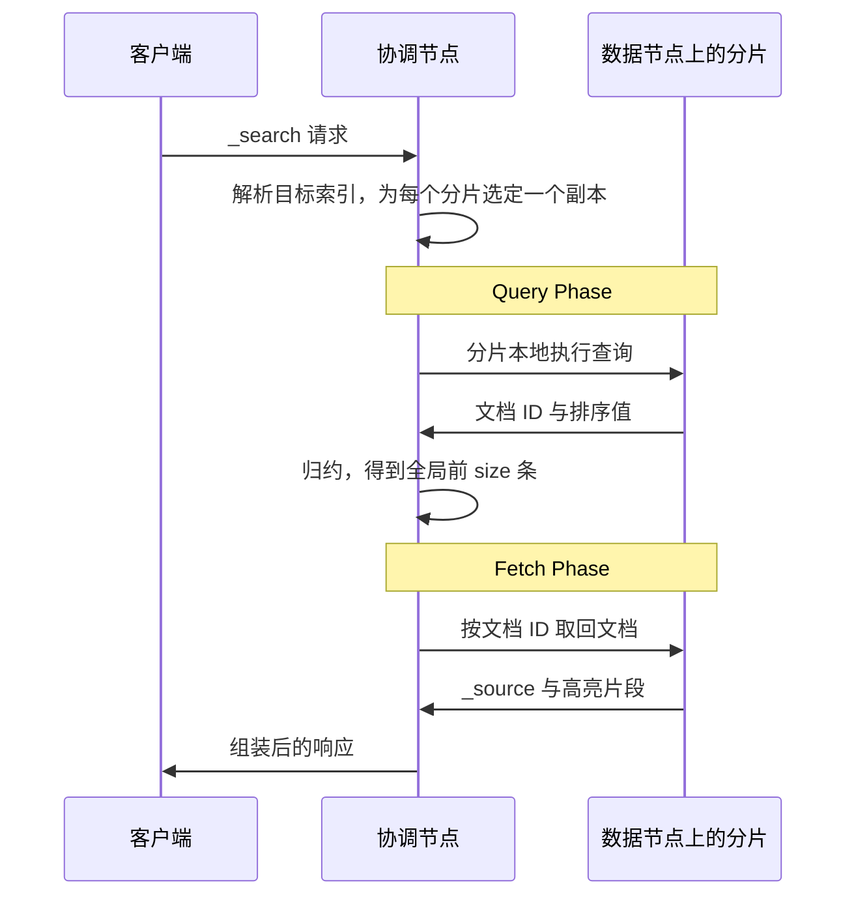

一次 `_search` 请求要在多个分片上分别执行，再把分散的结果拼成一份响应。本文以 Elasticsearch 8.19 为基线，跟踪这条路径从请求进入集群到返回响应的每一步，说明每个阶段承担什么职责、为什么必须分成两段执行，以及分页策略与缓存分别在流程的哪一个位置改变成本。文中涉及的版本差异单独标注。

## 一次查询的完整路径

一次查询分成两个阶段。Query Phase 也叫 scatter 阶段，负责确定哪些文档命中；Fetch Phase 也叫 gather 阶段，负责取回这些文档的内容。请求落到的那个节点成为本次查询的协调节点，它解析目标索引、为每个分片选定副本、向分片发起查询，再把各分片返回的结果归约成一份全局结果。持有分片的节点称为数据节点。协调节点自己也可能持有相关分片，这部分查询不必经过网络。

## 协调节点如何确定要搜索哪些分片

请求可以发往集群中任意一个节点，接收它的节点即成为协调节点。协调节点先把请求中的目标展开成具体索引，别名、数据流和通配符都要落到实际索引上，再为每个分片选出一个副本。

副本的选择默认交给 adaptive replica selection，它参考的信息包括协调节点与该节点之间既有请求的响应时间、该节点执行历史查询的耗时、该节点搜索线程池的队列长度。三项指标指向的是同一件事：哪个副本当下跑得更快。关掉这个机制，请求会在各个副本之间轮询，延迟可能变高。

查询默认覆盖索引的全部主分片，每个主分片命中一个副本。`routing` 参数可以让查询只命中与索引时同一路由值对应的分片；`preference` 参数把查询限制在特定节点或分片集合上，用同一个自定义 preference 字符串反复查询，请求会落在同一批分片上，同一份分片级缓存也就能被反复命中。

正式查询之前还有一步预过滤（can_match）：协调节点借助分片的统计信息，跳过不可能匹配的分片。查询只涉及最近一段时间时，按时间分区的日志索引里大部分历史分片会被直接排除。

分片选择只能精确到“整分片”这一粒度。每个分片是一份独立的 Lucene 索引，只持有自己那部分文档，协调节点无法在不执行查询的前提下判断哪些文档匹配。“是否命中”只能在分片内部判断，这是查询被拆成两段的前提。

## Query Phase：分片本地查询与全局归约

Query Phase 里，分片先各自在本地查出候选，协调节点再把这些候选归约成一份全局结果。

分片在自己的段上执行查询，按排序要求维护一个长度为 `from + size` 的本地优先队列，然后把队列内容回传给协调节点。队列里只有文档 ID 和排序值，没有文档内容：按相关性排序时排序值是打分，指定排序字段时是字段值。协调节点收齐所有分片的候选后重新排序，保留全局排在最前面的 `size` 条。

归约之所以必要，是因为分片之间互不可见。全局排名最靠前的若干条命中可能集中在某一个分片，也可能分散在所有分片，在看到全部分片的结果之前，任何一个分片都无法判断自己返回的候选是否够用。最坏情况下，协调节点要处理“分片数 × (`from` + `size`)”条分片级候选，最终保留的只有 `size` 条。

既然绝大多数候选都会在归约中被丢弃，Query Phase 就没有必要传文档内容。文档内容的体积远大于 ID 与排序值，先确定命中哪些文档、再对最终保留的少量文档取回内容，这一阶段的传输量便只与分片数和结果集大小相关，与 `_source` 的体积无关。

相关性打分同样受分片局部性影响。默认情况下每个分片用自己的词频统计打分，同一份文档在不同分片划分方式下可能得到不同分数。需要全局词频时，可以改用 DFS 阶段先统计一遍全局词频再执行查询，代价是多一次往返。

## Fetch Phase：取回文档内容

Query Phase 结束时，协调节点手上只有一份排好序的文档 ID 列表。

Fetch Phase 按分片对这些 ID 分组，向持有这些文档的分片取回内容。分片加载文档的 `_source`，以及请求中要求的字段值和高亮片段，返回给协调节点；协调节点按全局顺序把它们组装成最终响应。

`from` 参数在这一步的体现很直接：进入归约的前 `from` 条候选不会被取回，只保留紧随其后的 `size` 条。分页越深，白白丢弃的候选越多。

## 同一条流程的两种变体

前面描述的是这条路径的基准形态。分页策略和缓存在不同位置改变它的成本：前者改变每个分片要返回多少候选，后者决定流程中的某一步是否真的执行。

### 深分页：成本来自每个分片都要返回候选

`from` 和 `size` 的代价随页深线性增长。根源在 Query Phase：每个分片要构建的本地队列长度是 `from + size`，协调节点要排序的候选数还要再乘上分片数，两个量都随 `from` 一起变大。`index.max_result_window` 的默认值 10000 限制的正是 `from` 与 `size` 之和，它是防止深页拖垮内存与 CPU 的保护，不是查询能力的上限。

`search_after` 把分页从“跳过多少条”改成“从哪里继续”。它拿上一页最后一条命中的排序值当起点，每个分片只需返回这个起点之后的 `size` 条候选，返回量和归约量都不再随页深增长。代价是请求要连续发多次，每次的 `query` 与 `sort` 必须保持一致，排序里还得有一个取值唯一的字段充当 tiebreaker，否则翻页会漏掉或重复文档。

翻页还有一个容易踩的时序问题。两次请求之间如果发生 refresh，结果的先后顺序可能变化，跨页就不一致了。Point in Time（PIT）通过固定住当前索引状态消除这一点，所有基于 PIT 的查询还会隐式带上 `_shard_doc` 作为 tiebreaker。Elastic 文档给出的建议就是 `search_after` 与 PIT 一起用。

`scroll` 是更早的深分页方案，它把查询上下文在集群中保持一段时间，用游标逐批取回结果，返回的是初始请求时刻的数据视图，不能当作实时查询接口。Elastic 文档现在已经不再推荐用它做深分页，只把它留给一次性遍历大量数据的场景。

### 缓存与段合并：哪一步被跳过

这条路径上有三层缓存，粒度和省下的步骤各不相同。

| 缓存 | 缓存内容 | 粒度 | 命中时跳过的步骤 |
| --- | --- | --- | --- |
| 节点查询缓存 | filter 上下文中查询的匹配结果 | 节点级，按段缓存 | 在段上求解该 filter |
| 分片请求缓存 | 请求在该分片上的局部结果 | 分片级 | 该分片上的整次查询 |
| 文件系统页缓存 | 段文件内容 | 操作系统 | 从磁盘读取段 |

节点查询缓存只缓存 filter 上下文中的匹配结果，条目按段建立，且有准入门槛：段至少有 10000 篇文档，并且至少占该分片文档总数的 3%。它按 LRU 淘汰，默认最多占节点堆的 10%。命中时被跳过的是“在段上求解 filter”，归约、Fetch 以及其余查询条件的求解照常进行。

分片请求缓存存的是整次请求在某个分片上的局部结果，默认只针对 `size: 0` 的请求，缓存的内容是聚合结果与 `hits.total`，不含文档列表。命中时跳过的步骤更多，Query Phase 在这个分片上的执行整个省掉。命中要求请求体的 JSON 完全一致，只要分片上的数据变了，条目会在 refresh 时失效。

两层缓存的失效条件并不相同。节点查询缓存的条目绑定在段上，段合并产生新段、删除旧段时随之作废；分片请求缓存以分片为粒度，由 refresh 触发失效。结果是一样的：在写入频繁、refresh 间隔很短的索引上，这两层缓存几乎来不及被复用；不再更新的历史索引命中率则高得多。这是冷热分层在查询侧的价值来源。

## 聚合在流程中的位置

聚合也遵循分片本地计算、协调节点归约的模式，与文档检索的区别主要在两点。

聚合先在每个分片上算出一份局部结果，再由协调节点归约成全局结果。单个分片只看得见自己的文档，全局分布无法由分片独立得出，桶聚合因此允许为每个分片单独指定返回候选桶数：候选桶数通常大于最终要展示的桶数，多出来的部分用来降低归约后的计数偏差。这些多出来的桶要在网络上传输，也要在协调节点上占内存。

聚合结果在 Query Phase 结束时就已经产生，不依赖 Fetch Phase 取回的文档内容。`size: 0` 的聚合请求因此可以完全省略 Fetch Phase，比其他条件相同但要返回 hits 的请求便宜。

## 分片数量为什么直接决定查询成本

参与查询的分片数会同时放大三样东西：每个分片的本地查询、协调节点要归约的候选，以及分片请求的往返次数。

归约只在协调节点上执行，是流程中的单点环节。参与的分片越多，需要归约的分片级候选越多，协调节点承受的内存与 CPU 压力越大。往返次数也随分片数增长：协调节点默认向每个数据节点并发发出至多 5 个分片请求，分片更多时需要更多轮才能覆盖全部目标。

所以分片不是越多越好。更多分片意味着更小的单分片数据量和更高的并行度，代价是线性放大的协调开销。Elastic 在分片设计建议中给出的方向是使用更少、更大的分片，`action.search.shard_count.limit` 这类设置则更直接：命中分片数过多的查询会被集群直接拒绝。

## 小结

两个阶段各自只做一件事。Query Phase 在分片的局部视图上找出候选并归约出全局顺序，Fetch Phase 只对最终保留的 `size` 条文档取回内容。分片无法单独完成第一件事，因为全局顺序是分片之间比较的结果；协调节点也不能省掉第二件事，因为候选里只有 ID。整条路径的代价集中在协调节点的归约与往返次数上，并且随分片数量增长，分片数量的选择实际上是在单分片效率与协调成本之间取平衡。

这套流程也在变。Elasticsearch 9.5.0 及 Serverless 引入了 batched query phase：协调节点把发往同一个数据节点的多个分片查询合并为一个传输请求，再由数据节点先做部分归约，最后交给协调节点做最终归约。Elastic 公布的基准测试中，在查询成本以协调为主、命中 5000 个分片的场景下，这项改动把耗时减少约一半。8.x 及更早版本执行的仍是本文描述的逐分片扇出模型。
