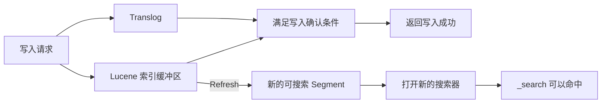

Elasticsearch 写入成功后，新文档可能暂时无法被 `_search` 命中。原因是写入确认与搜索可见属于两个阶段：写入操作完成后，文档还需要经过 Refresh，才能进入搜索器可读取的 Lucene Segment。本文以 Elasticsearch 8.19 为版本基线，并根据截至 2026 年 8 月的 Elastic 当前文档核对相关行为；文中单独标注自管 Elastic Stack 与 Elastic Cloud Serverless 的默认值差异。

## 写入成功不等于搜索可见

一个 Elasticsearch Index 会被拆分为多个 Shard，每个 Shard 副本本身都是一个 Lucene Index，而一个 Lucene Index 由一个或多个 Segment 组成。Segment 是可以独立参与搜索的子索引，保存一批文档的倒排索引、Stored Fields、Doc Values 等数据。查询一个 Shard 时，Lucene 会搜索当前已经打开的各个 Segment，再合并结果。

Segment 的核心索引文件写成后基本不可变。新增文档不会直接修改已有 Segment，而是先进入 Lucene 索引缓冲区；更新和删除也通过追加新版本、记录删除状态以及后续 Segment Merge 完成。这种结构让搜索可以稳定读取已有 Segment，但也意味着缓冲区中的新数据不能直接参与搜索。

写入请求处理文档时，操作还会记录到分片的 Translog。写入接口返回成功，表示该操作已经满足当前配置要求的写入确认条件，但不表示搜索器已经打开包含该文档的新 Segment。



默认使用 `index.translog.durability=request` 时，Elasticsearch 会在主分片和每个已分配副本的 Translog 完成 `fsync` 与提交后确认写入。Translog 用于恢复尚未包含在 Lucene Commit 中的操作，解决的是故障恢复和持久性问题，不负责让文档对 `_search` 可见。

Refresh 会把索引缓冲区中的变更写入新的 Segment，并打开新的搜索器，使上次 Refresh 之后的变更可被搜索。新 Segment 可以先通过文件系统缓存被读取，不需要等待完整的 Lucene Commit，因此 Refresh 可以比 Flush 更频繁地执行。这种先写入、后开放搜索的模型称为近实时搜索。

## 为什么不在每次写入后 Refresh

对每次写入都立即 Refresh，会持续生成只包含少量变更的小 Segment。搜索需要访问更多 Segment，后台也需要执行更多合并工作，因此成本会同时出现在写入、搜索和后续合并阶段。

Elasticsearch 默认通过周期 Refresh 让一批变更同时可见，以换取较稳定的写入和搜索开销。Elasticsearch 8.19 的自管 Elastic Stack 默认 `index.refresh_interval` 为 1 秒；当前 Elastic Cloud Serverless 的默认值为 5 秒。

自管集群还有一项空闲优化：没有显式设置 `index.refresh_interval` 时，分片连续 30 秒未收到搜索或 Get 请求后会进入 search idle 状态，不再执行后台周期 Refresh。后续搜索如果遇到待刷新的空闲分片，会为该分片触发 Refresh。因此，固定休眠 1 秒既不能表达业务的一致性要求，也不能覆盖不同部署和索引配置。

## 实时 Get 与近实时 Search 的区别

按 `_id` 调用 Get API 时，默认 `realtime=true`，读取不受 Refresh 间隔影响。因此同一篇文档可能已经能通过 Get API 取得，但暂时不能被 `_search` 命中。

下面关闭测试索引的自动 Refresh，以稳定观察这一差异：

```http
PUT /nrt-demo
{
  "settings": {
    "index.refresh_interval": "-1"
  }
}

PUT /nrt-demo/_doc/1
{
  "title": "理解 Elasticsearch Refresh"
}

GET /nrt-demo/_doc/1

GET /nrt-demo/_search
{
  "query": {
    "ids": {
      "values": ["1"]
    }
  }
}

POST /nrt-demo/_refresh

GET /nrt-demo/_search
{
  "query": {
    "ids": {
      "values": ["1"]
    }
  }
}
```

第一次 Get 可以返回文档，Refresh 前的 Search 不会命中新写入的数据；执行 `_refresh` 后，Search 可以命中。`index.refresh_interval=-1` 仅用于这个受控示例，不应直接作为在线索引的默认配置。

实时 Get 适合已知索引和 `_id` 的点查，不支持全文匹配、条件组合、聚合或排序。使用自定义 routing 写入文档时，Get 请求还必须携带相同的 routing，才能定位到正确分片。

## 如何选择 Refresh 策略

Index、Update、Delete 和 Bulk API 支持通过 `refresh` 参数控制本次变更何时对搜索可见。

| 方式 | 返回时的搜索可见性 | 行为与代价 | 适用场景 |
| --- | --- | --- | --- |
| 省略参数或 `refresh=false` | 不保证 | 不额外等待或触发 Refresh | 日志、指标、批量同步等吞吐优先场景 |
| `refresh=wait_for` | 保证本次变更已经可见 | 通常等待下一次 Refresh，不主动制造小 Segment，但会增加请求延迟 | 同一业务流程必须写后搜索 |
| `refresh=true` | 保证本次变更已经可见 | 立即刷新相关主分片和副本分片，可能产生更多小 Segment | 低频且必须立即可见的操作 |
| `POST /<index>/_refresh` | 目标索引的近期变更可见 | 同步刷新指定索引或数据流，资源成本作用于整个目标范围 | 故障诊断或受控批量流程 |

业务必须在写入完成后立即搜索时，优先使用：

```http
PUT /products/_doc/42?refresh=wait_for
{
  "name": "机械键盘"
}
```

`refresh=wait_for` 正常情况下只等待 Refresh，不会立即触发一次 Refresh。若 `index.refresh_interval=-1`，请求会一直等待，直到其他操作触发 Refresh；当分片的 Refresh 等待监听器耗尽时，它也可能转为强制 Refresh。批量写入需要同步可见时，应在一个 Bulk 请求上使用 `refresh=wait_for`，而不是连续发送多个单条等待请求。

`refresh=true` 会立即刷新本次操作涉及的分片，而不是整个索引。它缩短了当前请求的可见性等待，但频繁使用会生成更多小 Segment，不适合作为所有在线写入的默认值。

显式 `_refresh` 是同步 API，会等待 Refresh 完成。它适合验证问题是否由搜索可见性引起，不适合在每次生产写入后调用。

## Refresh、Flush 与 Merge 的边界

Refresh 的目标是让近期变更可搜索。Flush 会执行 Lucene Commit 并开始新的 Translog 世代，主要用于控制故障恢复所需的日志范围；Merge 用于合并 Segment。三者可能在运行过程中相互关联，但 Flush 和 Merge 都不是处理写后搜索问题的正确开关。

## Refresh 后仍然查不到时如何排查

Refresh 只能解决“写入已经成功，但新 Segment 尚未对搜索器开放”的问题。可以按以下顺序确定故障层级：

1. **检查实际写入结果**：单条请求检查 `result` 和 `_shards`；Bulk 请求还要检查顶层 `errors` 以及每个 item 的 `status`、`error`。Bulk 返回 HTTP 200 不表示其中每条操作都成功。
2. **使用实际 `_index` 和 `_id` 执行 Get**：Get 也找不到时，优先检查写入失败、目标索引或数据流错误，以及自定义 routing 是否一致。
3. **手动 Refresh 后使用最小查询验证**：Refresh 后能够命中，说明原因是搜索可见性窗口；仍然无法命中，则不应继续调整 Refresh。
4. **检查搜索范围与文档内容**：确认读写别名指向一致，搜索 routing 覆盖目标分片，别名过滤器没有排除文档，查询字段和分析方式正确，时间范围与分页条件没有过滤新数据，并检查 ingest pipeline 是否改写了字段。

这个顺序把问题分为写入、实时点查、搜索可见性和查询条件四层，避免通过延长休眠或反复调用 `_refresh` 掩盖实际错误。

## 总结

Elasticsearch 写入成功后不能立即搜索到，是近实时搜索模型的结果。写入确认和 Translog 处理写入接受与故障恢复，Refresh 将索引缓冲区中的变更转换为搜索器可读取的 Segment；只有 Refresh 完成后，`_search` 才能命中新数据。

已知 `_id` 的写后读取应使用实时 Get API；必须写后搜索时优先使用 `refresh=wait_for`；吞吐优先的链路保留默认 `refresh=false`。`refresh=true` 和显式 `_refresh` 会主动产生 Refresh，应限制在明确、低频或受控的场景中。

## 参考资料

- [Elasticsearch 8.19：Index modules](https://www.elastic.co/guide/en/elasticsearch/reference/8.19/index-modules.html)
- [Elastic Docs：Near real-time search](https://www.elastic.co/docs/manage-data/data-store/near-real-time-search)
- [Elasticsearch Reference：The refresh parameter](https://www.elastic.co/docs/reference/elasticsearch/rest-apis/refresh-parameter)
- [Elasticsearch API：Refresh an index](https://www.elastic.co/docs/api/doc/elasticsearch/v8/operation/operation-indices-refresh)
- [Elasticsearch API：Get a document by its ID](https://www.elastic.co/docs/api/doc/elasticsearch/v8/operation/operation-get)
- [Elasticsearch API：Bulk index or delete documents](https://www.elastic.co/docs/api/doc/elasticsearch/v8/operation/operation-bulk)
- [Elasticsearch Reference：Search shard routing](https://www.elastic.co/docs/reference/elasticsearch/rest-apis/search-shard-routing)
- [Elastic Docs：Aliases](https://www.elastic.co/docs/manage-data/data-store/aliases)
- [Elastic Docs：Elasticsearch ingest pipelines](https://www.elastic.co/docs/manage-data/ingest/transform-enrich/ingest-pipelines)
- [Elasticsearch Reference：Translog settings](https://www.elastic.co/docs/reference/elasticsearch/index-settings/translog)
