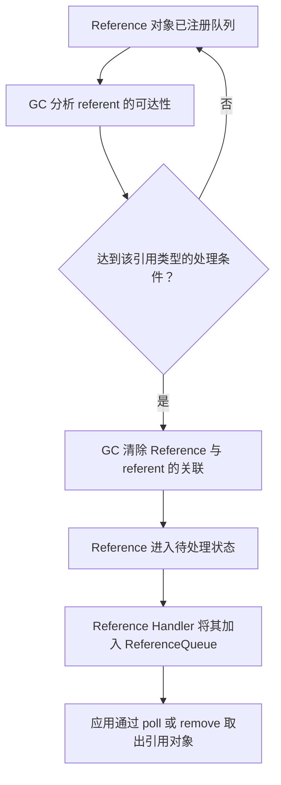

Java 中的强引用、软引用、弱引用与虚引用，描述的不是四种变量语法，而是垃圾收集器判断对象生命周期时的四种可达性强度。引用越弱，程序对对象存活时间的控制越少；`ReferenceQueue` 则把部分可达性变化转换成应用可以处理的通知。

## 两个容易混淆的“引用”

讨论四种引用前，需要区分普通引用和引用对象：

```java
Object target = new Object();                         // 普通强引用
WeakReference<Object> ref = new WeakReference<>(target); // 引用对象
```

`target` 是一个普通引用变量，它直接指向目标对象。`ref` 指向堆中的 `WeakReference` 对象，后者内部关联的目标称为 referent，本文称为“被引用对象”。

强引用没有对应的 `StrongReference` 类。`java.lang.ref.Reference` 的公开子类只有 `SoftReference`、`WeakReference` 和 `PhantomReference`；强引用就是程序日常使用的普通对象引用。

引用对象本身也受普通可达性规则约束。如果程序希望从 `ReferenceQueue` 收到通知，就必须让对应 `Reference` 对象保持强可达。队列只接收已入队的引用对象，不会反向保存所有注册到它的引用对象。

## 引用强度建立在可达性分析之上

垃圾收集器从 GC Roots 出发遍历对象图。对某个对象而言，只要仍存在更强的可达路径，就不会按更弱的引用处理；所有强路径消失后，才会继续判断它是否软可达、弱可达或虚可达。按照从强到弱的顺序，Java 定义了以下状态：

1. **强可达**：从某个线程出发，不经过任何 `Reference` 对象就能到达。
2. **软可达**：不再强可达，但可以经过软引用到达。
3. **弱可达**：既不强可达也不软可达，但可以经过弱引用到达。
4. **虚可达**：既不强、软、弱可达，对象已完成终结处理（未覆写 `finalize()` 的普通对象直接视为已终结），并且存在指向它的虚引用。
5. **不可达**：不属于以上任何状态，可以回收其存储空间。

这些状态是互斥的。一个对象同时被普通引用和弱引用指向时，它仍然是强可达对象；弱引用不会削弱已经存在的强引用。

```java
Object target = new Object();
WeakReference<Object> weak = new WeakReference<>(target);

// target 仍直接指向对象，因此对象是强可达的。
target = null;
// 若没有其他强引用，对象才可能在下一次相关 GC 中被判定为弱可达。
```

调用软引用或弱引用的 `get()` 并得到非 `null` 结果时，返回值本身会形成新的强引用。使用期间应先把结果保存到局部变量，再检查一次：

```java
Object value = weak.get();
if (value != null) {
    use(value);
}
```

不要先判断 `weak.get() != null`，随后再调用一次 `get()`。两次调用之间可能发生 GC，第二次结果可以是 `null`。

## 四种引用的核心差异

| 引用类型 | 如何创建 | 被引用对象的处理条件 | `get()` | 是否可配合引用队列 | 典型用途 |
| --- | --- | --- | --- | --- | --- |
| 强引用 | 普通赋值、字段或集合元素 | 不会因为内存压力而被回收 | 直接访问对象 | 不适用 | 正常对象关系和明确所有权 |
| 软引用 | `SoftReference<T>` | 对象仅软可达时，由 GC 根据内存需求决定是否清除 | 未清除时返回对象 | 可以 | 对丢失后可重建数据的内存敏感持有 |
| 弱引用 | `WeakReference<T>` | GC 发现对象仅弱可达时清除 | 未清除时返回对象 | 可以 | 不应阻止目标回收的关联关系 |
| 虚引用 | `PhantomReference<T>` | GC 发现对象虚可达时清除，并在同时或稍后入队 | 始终返回 `null` | 构造函数要求队列参数；传 `null` 时不会入队 | 回收后通知、外部资源清理 |

表中的“清除”是指断开 `Reference` 对象与 referent 的关联，不是立即释放 `Reference` 对象本身。引用对象只有在自身也不可达后，才会像普通堆对象一样被回收。

### 强引用：明确保持对象存活

只要从 GC Roots 出发仍存在一条强引用路径，对象就不会被 GC 回收。将某个变量设为 `null` 只会删除一条引用边；其他字段、集合、线程栈或 JNI 句柄仍可能让对象保持强可达。

```java
Object first = new Object();
Object second = first;

first = null;
System.out.println(second != null); // true，second 仍是强引用
```

强引用适合表达正常所有权。若对象必须存活到某个操作完成，不能用弱引用代替生命周期管理。在少数涉及原生资源或异步清理的底层代码中，JIT 可能以“最后一次实际使用”而不是局部变量作用域结束作为可达性边界；`Reference.reachabilityFence(obj)` 可以显式保证对象至少强可达到该调用之后。

### 软引用：允许 GC 在内存需要时舍弃对象

对象仅能通过 `SoftReference` 到达时，它处于软可达状态。GC 可以清除软引用，但 Java API 不规定具体清除时刻，也不规定多个软引用之间的清除顺序。规范只提供一项下界保证：虚拟机抛出 `OutOfMemoryError` 前，会清除所有指向软可达对象的软引用。这不意味着本次分配一定成功，也不意味着软引用能避免所有类型的内存溢出。

```java
SoftReference<byte[]> soft = new SoftReference<>(new byte[1024 * 1024]);

byte[] value = soft.get();
if (value == null) {
    value = reloadData();
    soft = new SoftReference<>(value);
}
use(value);
```

在 HotSpot 中，软引用的最近访问时间会参与清除决策，`SoftReference.get()` 成功时会更新内部时间戳。`-XX:SoftRefLRUPolicyMSPerMB` 可以影响近似保留时间，默认值为每兆字节可用堆空间 1000 毫秒。这个参数是 HotSpot 策略，不是 Java 对其他 JVM 实现的要求；软引用也只在 GC 发生时才可能被清除，因此不能把该值理解为精确过期时间。

软引用缺少业务缓存通常需要的容量上限、过期时间、命中率统计和确定的淘汰顺序。它可以表达“内存紧张时允许丢失”，但不适合单独承担通用缓存策略。

### 弱引用：不阻止下一次相关 GC 清除对象

当 GC 判定对象仅弱可达时，会原子地清除指向该对象的所有弱引用；弱可达性还可以沿该对象上的普通引用或软引用继续传递，使后续对象同样处于弱可达状态。已经注册队列的弱引用会在同时或稍后入队。

```java
ReferenceQueue<Object> queue = new ReferenceQueue<>();
Object target = new Object();
WeakReference<Object> weak = new WeakReference<>(target, queue);

target = null;
System.gc(); // 只是请求，不保证何时执行，也不保证 weak 已被处理

Reference<?> observed = queue.remove(1_000);
System.out.println("已清除: " + weak.refersTo(null));
System.out.println("已入队: " + (observed == weak));
```

这个示例用于观察语义，不能作为结果必须为 `true` 的单元测试。`System.gc()` 只是尽力请求；即使 GC 已清除 referent，从清除到入队也可能存在时间间隔。

弱引用适合表达“只要其他地方不用了，这条关联也不应让对象继续存活”。`WeakHashMap` 的键采用弱引用，但值仍是强引用。如果值直接或间接强引用对应的键，就可能形成从 Map 到值再到键的强路径，使条目无法按预期消失。

### 虚引用：只能观察生命周期变化，不能取回对象

`PhantomReference.get()` 从创建开始就始终返回 `null`。这样可以保证程序不能在收到回收通知后重新取得 referent，并把它恢复成强可达对象。

从 JDK 9 开始，GC 发现对象虚可达时，会原子地清除相关虚引用，并在同时或稍后把注册了队列的虚引用入队。JDK 8 中“虚引用入队后必须由程序调用 `clear()` 才能完成回收”的语义不适用于 JDK 9 及后续版本。

```java
ReferenceQueue<Object> queue = new ReferenceQueue<>();
Object target = new Object();
PhantomReference<Object> phantom = new PhantomReference<>(target, queue);

System.out.println(phantom.get()); // 始终为 null
target = null;
System.gc();                       // 仍然只是尽力请求

Reference<?> observed = queue.remove(1_000);
System.out.println("已入队: " + (observed == phantom));
```

虚引用对象必须保存在集合或其他强引用结构中，直到应用处理完队列通知。需要清理的原生地址、文件句柄标识等状态应保存在虚引用子类或独立状态对象中，不能让清理状态直接或间接引用被监视对象，否则对象不会进入虚可达状态。

实际项目通常优先使用 JDK 9 引入的 `Cleaner` 封装虚引用与队列处理。显式资源仍应优先通过 `AutoCloseable` 和 `try-with-resources` 按时释放，Cleaner 只适合作为无法显式关闭时的兜底机制，因为 GC 和清理动作都没有确定的执行期限。

虚引用也不等同于 `finalize()`。终结方法运行在对象本身，能够访问甚至复活该对象；虚引用入队后只能取得引用对象及其独立状态，不能重新取得 referent。`finalize()` 从 JDK 9 开始被弃用，JDK 18 又通过 JEP 421 将终结机制标记为待移除；新代码不应使用终结方法管理资源。

## GC、Reference 与 ReferenceQueue 如何协作

引用处理包含三个不同对象：referent、`Reference` 对象和 `ReferenceQueue`。队列中保存的是已经发生状态变化的 `Reference` 对象，不是 referent。



图中的待处理状态和 `Reference Handler` 属于 HotSpot 实现。Java API 对应用承诺的是：GC 检测到相应可达性变化后清除引用，并在同时或稍后的某个时间把已注册队列的引用对象入队。应用不应依赖内部线程名称、优先级或清除到入队之间的具体时间。

OpenJDK 源码用两组状态描述 `Reference` 对象：一组是 active、pending、inactive，表示它仍受 GC 特殊处理、正在等待处理，还是已经完成处理；另一组是 registered、enqueued、dequeued、unregistered，表示它与引用队列的关系。这些状态解释了“referent 已清除但引用尚未入队”的窗口，但它们不是应用可以直接操作的公开状态机。

### `get()`、`clear()`、`enqueue()` 的边界

- `get()` 返回 referent 的强引用；若引用已被清除则返回 `null`。虚引用的 `get()` 始终返回 `null`。
- `clear()` 只清除 referent，不会让引用对象自动入队。
- `enqueue()` 会清除 referent，并尝试把引用对象加入构造时注册的队列；未注册队列或已经入队时返回 `false`。
- `ReferenceQueue.poll()` 立即返回并移除一个已入队引用，没有元素时返回 `null`。
- `ReferenceQueue.remove()` 阻塞等待，带超时的重载到期后返回 `null`。

`Reference.isEnqueued()` 从 JDK 16 起已弃用。它只能表示引用对象是否正位于队列中，不能可靠表示 referent 是否已被清除；引用也可能在检查前被其他线程取出。需要确认入队时应消费 `ReferenceQueue`，需要确认关联是否已清除时可以使用 `refersTo(null)`。

### 清除、入队与回收不是同一个时刻

一次典型过程可以分成：

1. 业务代码移除最后一条更强的引用路径。
2. 某次 GC 发现对象达到软、弱或虚可达状态。
3. GC 按对应规则清除引用对象中的 referent。
4. 已注册队列的引用对象在同时或稍后入队。
5. 应用从队列取出引用对象并执行索引删除、统计或资源清理。
6. referent 的存储空间和引用对象自身的存储空间分别在满足回收条件时被回收。

因此，`get() == null` 不能证明引用已经入队，已经入队也不提供应用清理动作完成或堆空间立即复用的实时保证。

## 一个可运行的观察程序

下面的程序同时观察弱引用和虚引用。它把引用对象保存在 `references` 中，避免通知产生前引用对象自身先被回收；超时结果也被视为合法，因为显式 GC 没有完成时间保证。

```java
import java.lang.ref.PhantomReference;
import java.lang.ref.Reference;
import java.lang.ref.ReferenceQueue;
import java.lang.ref.WeakReference;
import java.util.HashSet;
import java.util.Set;

public class ReferenceQueueDemo {
    private static final ReferenceQueue<Object> QUEUE = new ReferenceQueue<>();
    private static final Set<Reference<?>> REFERENCES = new HashSet<>();

    public static void main(String[] args) throws InterruptedException {
        registerObjects();
        System.gc();

        long deadline = System.nanoTime() + 2_000_000_000L;
        while (!REFERENCES.isEmpty() && System.nanoTime() < deadline) {
            Reference<?> reference = QUEUE.remove(200);
            if (reference != null) {
                System.out.println(reference.getClass().getSimpleName());
                REFERENCES.remove(reference);
            }
        }

        System.out.println("超时后仍未观察到的引用数: " + REFERENCES.size());
    }

    private static void registerObjects() {
        Object weakTarget = new Object();
        Object phantomTarget = new Object();

        REFERENCES.add(new WeakReference<>(weakTarget, QUEUE));
        REFERENCES.add(new PhantomReference<>(phantomTarget, QUEUE));
    }
}
```

`registerObjects()` 返回后，两个目标对象不再存在强引用路径。一次运行可能观察到两个类型，也可能在超时前只观察到部分或完全没有观察到。该程序适合演示队列协作，不适合验证 GC 延迟、清除顺序或收集器性能。

## 常见误区

### `System.gc()` 后弱引用一定变成 `null`

`System.gc()` 只建议 JVM 尽力回收未使用对象。规范不保证它处理任意数量的对象、清除任意数量的引用或在特定时间完成，JVM 参数还可能禁用显式 GC。业务正确性不能依赖该调用。

### 软引用就是自动淘汰的缓存

软引用的清除由 JVM 和内存状态决定，应用无法获得稳定的容量、过期或淘汰顺序。生产缓存通常需要显式的容量与过期策略，软引用最多作为特定场景中的一层可丢失持有关系。

### 弱引用会在赋值为 `null` 时立即清除

最后一条强引用消失只改变对象图。弱引用要等 GC 发现对象仅弱可达后才会被清除，清除后还可能稍晚才入队。

### 虚引用可以在回收前读取对象

虚引用从不通过 `get()` 暴露 referent。它提供的是可达性变化通知，不是对象访问能力，也不是 Java 析构函数。

### 队列会替程序保管所有引用对象

`ReferenceQueue` 不记录尚未入队的注册关系。如果引用对象自身提前变得不可达，应用就无法从队列收到它。跟踪集合应保存引用对象及清理所需的独立状态，并在消费队列后删除对应条目。

## 选择准则

| 需求 | 建议 |
| --- | --- |
| 对象必须在持有期间保持可用 | 使用强引用，并显式管理所有权和释放时机 |
| 数据可重建，允许 JVM 在内存需要时舍弃 | 谨慎使用软引用；缓存仍应有显式容量和过期策略 |
| 建立不应延长目标生命周期的映射、监听或规范化关系 | 使用弱引用，并处理目标随 GC 消失的情况 |
| 在对象不可再访问后接收通知或清理外部资源 | 使用虚引用与 `ReferenceQueue`，通常优先采用 `Cleaner` |
| 文件、连接、锁或必须及时释放的原生资源 | 使用 `AutoCloseable` 与 `try-with-resources`，不要依赖 GC 通知 |

四种引用的核心不是“哪一种更容易被回收”，而是谁拥有对象生命周期的决定权。强引用由程序明确保持；软引用把部分决定交给内存策略；弱引用不再延长目标生命周期；虚引用完全放弃对象访问，只保留生命周期变化通知。

## 参考资料

- [Java API：java.lang.ref 包规范与可达性定义](https://docs.oracle.com/en/java/javase/17/docs/api/java.base/java/lang/ref/package-summary.html)
- [Java API：Reference](https://docs.oracle.com/en/java/javase/17/docs/api/java.base/java/lang/ref/Reference.html)
- [Java API：SoftReference](https://docs.oracle.com/en/java/javase/17/docs/api/java.base/java/lang/ref/SoftReference.html)
- [Java API：WeakReference](https://docs.oracle.com/en/java/javase/17/docs/api/java.base/java/lang/ref/WeakReference.html)
- [Java API：PhantomReference](https://docs.oracle.com/en/java/javase/17/docs/api/java.base/java/lang/ref/PhantomReference.html)
- [Java API：ReferenceQueue](https://docs.oracle.com/en/java/javase/17/docs/api/java.base/java/lang/ref/ReferenceQueue.html)
- [Java API：Cleaner](https://docs.oracle.com/en/java/javase/17/docs/api/java.base/java/lang/ref/Cleaner.html)
- [HotSpot GC 调优指南：Reference Objects 与软引用策略](https://docs.oracle.com/en/java/javase/17/gctuning/other-considerations.html)
- [OpenJDK：Reference.java 的状态与 Reference Handler 实现](https://github.com/openjdk/jdk17u/blob/master/src/java.base/share/classes/java/lang/ref/Reference.java)
- [OpenJDK：SoftReference.java 的时间戳更新](https://github.com/openjdk/jdk17u/blob/master/src/java.base/share/classes/java/lang/ref/SoftReference.java)
- [JEP 421：弃用终结机制并迁移到显式清理或 Cleaner](https://openjdk.org/jeps/421)
