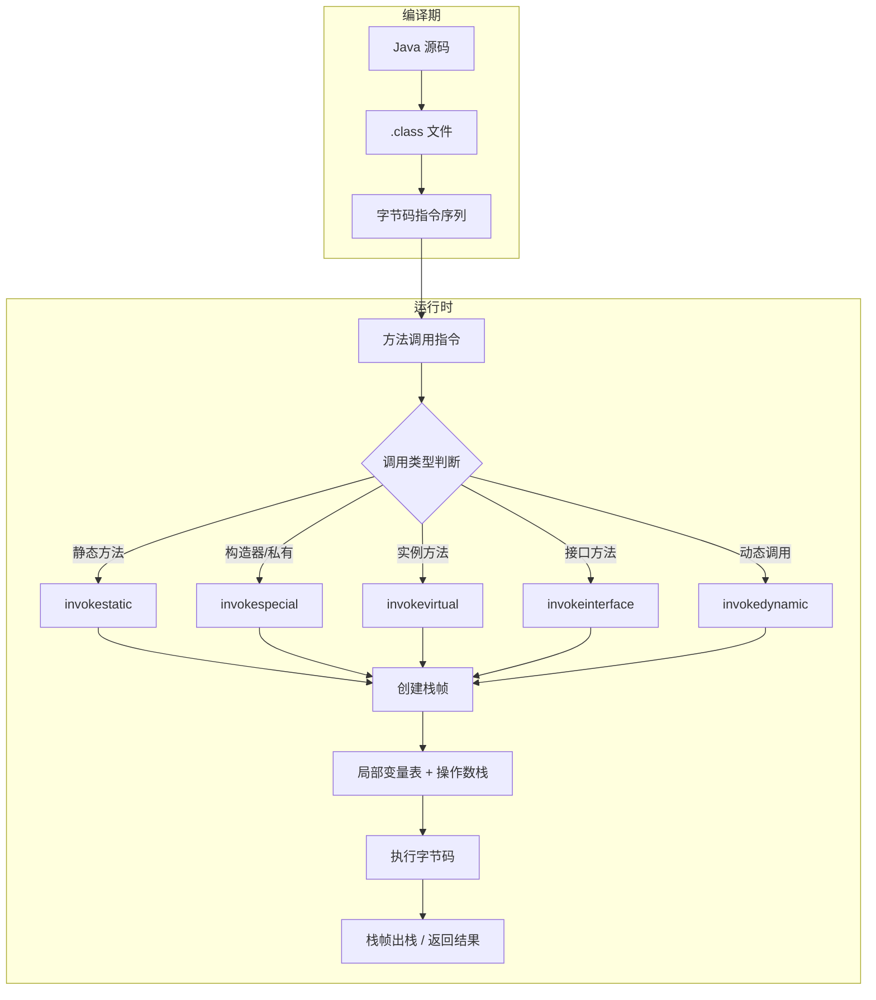
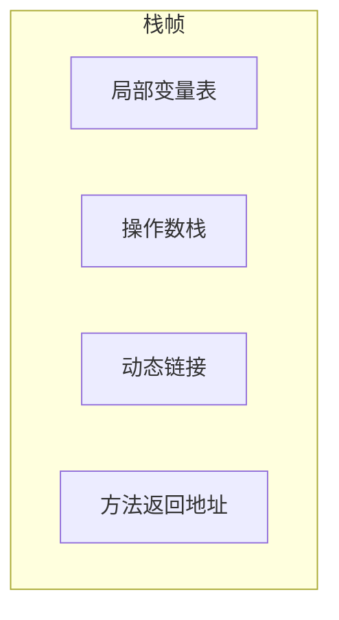
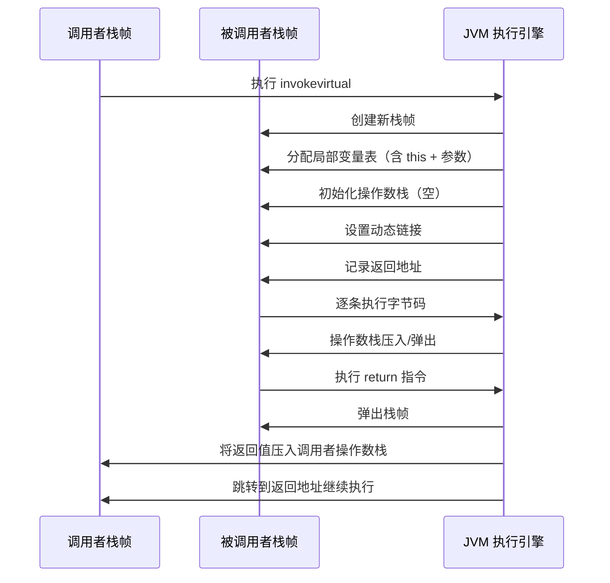
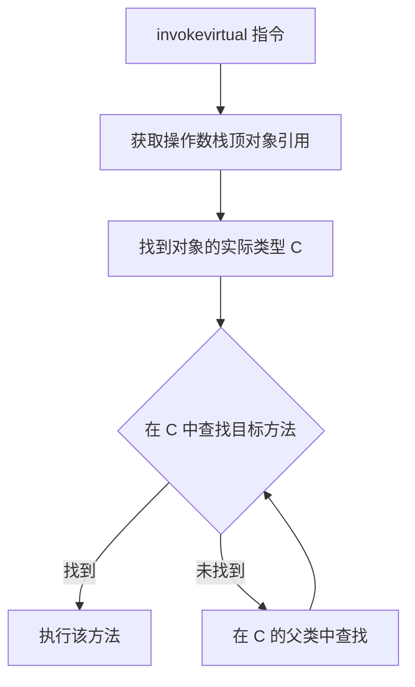
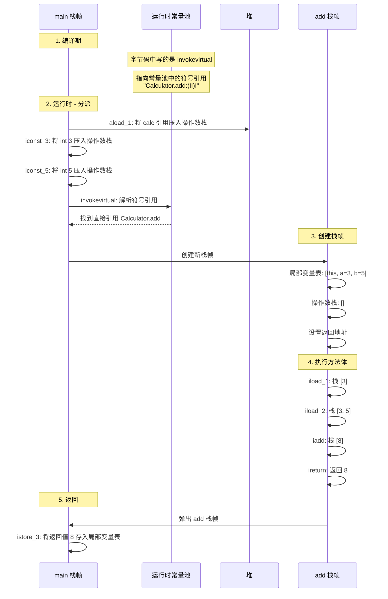

# JVM 字节码、栈帧与方法调用机制：从指令到分派

> 写 Java 代码时，一个方法调用看起来再简单不过 —— 写个 `obj.method()` 就行了。但如果你往下追问：
> - JVM 到底怎么找到这个方法？
> - 参数是怎么传进去的？
> - 返回值又是怎么拿回来的？
> - `invokevirtual` 和 `invokeinterface` 有什么区别？
> - 重载和重写，JVM 底层分别是怎么处理的？
> 
> 这些问题，最终都会落到三个核心概念上：字节码、栈帧和分派机制。
> 
> 把这三条线串起来，你就不是在"背八股文"，而是真的理解了 JVM 方法调用的完整图景。

## 一、先看全貌：一次方法调用，JVM 里发生了什么

先从一张图建立整体认知：



图中的主线很清晰：

- 编译器先把 Java 源码翻译成 `.class` 文件里的字节码指令。
- 运行时，JVM 遇到方法调用指令，先确定调用类型。
- 然后创建新的栈帧，分配局部变量表和操作数栈。
- 接着执行方法体里的字节码指令。
- 执行完毕后，栈帧出栈，把返回值交还给调用者。

下面分别把字节码、栈帧和方法调用机制拆开来讲。

## 二、字节码：JVM 真正的"母语"

### 1. 字节码是什么

字节码是 JVM 执行的中间指令集。它不是机器码，CPU 不能直接执行，但它是理解 JVM 运行时行为的关键。

可以把字节码理解成 JVM 的"汇编语言"，只是它的指令集是面向栈的，而不是面向寄存器的。

一个简单的例子：

```java
public int add(int a, int b) {
    return a + b;
}
```

这段代码编译后的字节码大致是：

```
iload_1      // 将局部变量表中第 1 个变量（参数 a）压入操作数栈
iload_2      // 将局部变量表中第 2 个变量（参数 b）压入操作数栈
iadd         // 弹出栈顶两个 int，相加后把结果压回栈顶
ireturn      // 返回栈顶的 int 值
```

从这里能看出两个关键特征：

- 字节码是基于栈的：运算前先把操作数压入操作数栈，运算结果也放回栈上。
- 字节码指令很短：大多数指令只有一个字节的操作码，后面可能跟几个字节的操作数。

### 2. 字节码指令的分类

JVM 规范定义了大约 200 多条指令，可以按功能分成以下几类：

| 分类 | 典型指令 | 说明 |
|------|---------|------|
| 加载与存储 | `iload`, `istore`, `aload`, `astore`, `iconst_0`, `bipush` | 在局部变量表和操作数栈之间搬数据 |
| 算术运算 | `iadd`, `isub`, `imul`, `idiv`, `iinc` | 栈上的整数/浮点运算 |
| 类型转换 | `i2l`, `i2f`, `l2d`, `checkcast` | int 转 long、类型检查等 |
| 对象创建与操作 | `new`, `newarray`, `getfield`, `putfield`, `getstatic`, `putstatic` | 创建对象、访问字段 |
| 操作数栈管理 | `pop`, `dup`, `swap` | 直接操作栈顶元素 |
| 控制转移 | `ifeq`, `ifne`, `goto`, `tableswitch`, `lookupswitch` | 条件判断与跳转 |
| 方法调用与返回 | `invokevirtual`, `invokespecial`, `invokestatic`, `invokeinterface`, `invokedynamic`, `return`, `ireturn`, `areturn` | 调用方法和返回 |
| 同步 | `monitorenter`, `monitorexit` | 实现 `synchronized` |
| 异常处理 | `athrow` | 抛出异常 |

不需要把每条都背下来，但理解分类和核心指令，会让你在读字节码时有一个大致的坐标。

### 3. .class 文件的结构

字节码不是孤立存在的，它嵌在 `.class` 文件里。一个 `.class` 文件的结构大致如下：


其中几个关键部分：

- **魔数**：每个 `.class` 文件的前 4 个字节固定是 `0xCAFEBABE`，用来标识这是一个合法的 class 文件。
- **常量池**：存放类名、方法名、字段名、字符串常量、字面量等。它是字节码里符号引用的"字典"。
- **方法表**：每个方法都包含自己的字节码指令（存放在 `Code` 属性中），以及异常表、行号表等辅助信息。

常量池尤其重要。字节码指令里不会直接写类名和方法名的字符串，而是写常量池的索引号。比如 `invokevirtual #5` 里的 `#5`，就是去常量池第 5 项找到实际的方法引用。

## 三、栈帧：方法执行的"运行容器"

### 1. 栈帧是什么

每个方法被执行的时候，JVM 都会为它创建一个栈帧，然后压入当前线程的虚拟机栈。方法执行结束后，栈帧再出栈。

一个栈帧的内部结构如下：



下面逐一拆解这四部分。

### 2. 局部变量表

局部变量表存储方法的参数和方法体内定义的局部变量。它以槽（Slot）为单位，一个槽可以存放一个 32 位以内的数据类型。

关键点：

- `boolean`、`byte`、`char`、`short`、`int`、`float` 和引用类型占一个槽。
- `long` 和 `double` 占两个槽。
- 对于实例方法，第 0 号槽固定存放 `this` 引用。

举例：

```java
public void example(int x, long y, String s) {
    int z = 10;
}
```

这个方法对应的局部变量表如下：

| 槽编号 | 内容 |
|--------|------|
| 0 | this（隐式传入） |
| 1 | x（int） |
| 2-3 | y（long，占两个槽） |
| 4 | s（String 引用） |
| 5 | z（int） |

理解局部变量表是读懂字节码的前提。`iload_1` 里的 `1`，就是指第 1 号槽。

### 3. 操作数栈

操作数栈是一个后进先出的栈结构，用于存放字节码指令执行过程中产生的中间结果。

JVM 采用基于栈的指令集架构，而不是基于寄存器的。这意味着：

- 算术运算不直接操作寄存器，而是先把操作数压栈，运算后再把结果压回栈。
- 方法调用时，参数也是先压入操作数栈，再执行调用指令。

看一个稍复杂一点的例子：

```java
public int calculate(int a, int b, int c) {
    return (a + b) * c;
}
```

对应的字节码（简化）：

```
iload_1      // 栈: [a]
iload_2      // 栈: [a, b]
iadd         // 栈: [a+b]
iload_3      // 栈: [a+b, c]
imul         // 栈: [(a+b)*c]
ireturn      // 返回栈顶值
```

每一步操作数栈的变化都在注释中标出，这就是基于栈的计算模型。

### 4. 动态链接

每个栈帧都包含一个指向运行时常量池中该方法的引用。这个引用用来支持方法体中的动态链接。

什么是动态链接？

- 字节码里的方法调用指令，比如 `invokevirtual #5`，写的是常量池索引。
- 这些索引最初指向的是符号引用 —— 也就是"类名 + 方法名 + 方法描述符"的字符串组合。
- 在类加载的解析阶段，部分符号引用会被替换成直接引用（指向方法在内存中的实际地址）。
- 但对于多态方法调用，这个转换不能提前做，必须在运行时根据实际对象类型来"动态链接"。

动态链接的意义在于：它让同一个 `invokevirtual` 指令，在不同对象上可以调用到不同的方法实现。

### 5. 方法返回地址

方法返回地址记录的是方法执行完后，应该回到调用者的哪条指令继续执行。

有两种情况：

- 正常返回：字节码执行到 `return` 系列指令（如 `ireturn`、`areturn`、`return`），按返回地址回到调用者的下一条指令继续执行。
- 异常返回：方法在执行过程中抛出了异常，JVM 会先查询当前方法的异常表（`Code` 属性中的 `exception_table`），寻找匹配的异常处理器。如果找到，就在本方法内跳转到对应的 `catch` 块继续执行；如果没找到，当前栈帧被弹出，异常继续向调用者的栈帧传播，直到被捕获或到达栈顶导致线程终止。

### 6. 栈帧的完整生命周期

把上面四部分串起来，一个栈帧的完整生命周期如下：



## 四、方法调用：五种指令，五种场景

JVM 提供了五条方法调用指令，分别对应不同的调用场景。这是理解方法调用机制的基石。

### 1. invokestatic —— 调用静态方法

`invokestatic` 用于调用静态方法，特点：

- 编译期就确定了目标方法，不需要多态查找。
- 不需要传递 `this`。
- 在类加载的解析阶段就可以把符号引用替换成直接引用。

这是最高效的调用方式，因为不需要任何运行时分派。

### 2. invokespecial —— 调用构造器、私有方法和父类方法

`invokespecial` 用于以下三种场景：

- 调用实例初始化方法 `<init>`（即构造器）。注意区分：`<init>` 是实例构造器，每个 `new` 都会调用；而 `<clinit>` 是类初始化方法（静态代码块），由 JVM 在类加载时自动调用，不出现在字节码指令中。
- 调用私有方法（`private`）。
- 调用父类方法（通过 `super` 关键字）。

这些方法的共同特点是：编译期就能确定唯一的目标，不存在多态。

```java
class Child extends Parent {
    public Child() {
        super();           // invokespecial -> Parent.<init>
    }

    private void secret() {
        // invokespecial -> Child.secret
    }

    public void call() {
        super.doSth();     // invokespecial -> Parent.doSth
    }
}
```

### 3. invokevirtual —— 调用实例方法（虚方法分派）

`invokevirtual` 是最常见的实例方法调用指令。它的核心机制是动态分派：

- 编译期只能确定方法签名，不能确定具体调用哪个实现。
- 运行时根据操作数栈顶对象引用的实际类型，找到对应的方法实现。

分派过程可以简化为：

1. 找到操作数栈顶的对象引用指向的实际类型 C。
2. 在 C 中查找与方法描述符和名称都匹配的方法。
3. 如果 C 中没有，去 C 的父类中查找。
4. 直到找到为止。

这就是 Java 方法重写（多态）的底层实现。

### 4. invokeinterface —— 调用接口方法

`invokeinterface` 专门用于通过接口引用调用方法：

```java
List<String> list = new ArrayList<>();
list.add("hello");  // invokeinterface
```

它和 `invokevirtual` 最大的区别在于：

- `invokevirtual` 使用类继承体系中的虚方法表（vtable），按固定偏移查找。
- `invokeinterface` 使用接口方法表（itable），需要先找到接口、再在 itable 中定位，查找链路更长，所以理论上比 `invokevirtual` 略慢。

但在现代 JVM 中，通过内联缓存等手段，两者的性能差距在日常场景中基本可以忽略。

### 5. invokedynamic —— 动态调用，lambda 的基石

`invokedynamic` 是 Java 7 引入的指令，在 Java 8 之后因为 lambda 表达式而大规模使用。

它的设计初衷是让 JVM 支持动态语言（如 JRuby、Groovy），但最终最大的受益者是 Java 自身的 lambda。

传统的方法调用，目标方法在编译期就已经写入字节码。但 `invokedynamic` 不同：

- 编译期只写一句 `invokedynamic` 指令，不指定具体目标。
- 运行时，JVM 会回调一个引导方法（bootstrap method）。
- 引导方法返回一个 `CallSite` 对象，真正的方法调用通过 `CallSite` 完成。

`CallSite` 内部持有一个 `MethodHandle`（方法句柄），它是对目标方法的类型安全引用。可以把 `MethodHandle` 理解为一个轻量级的反射调用，但性能更好。`CallSite` 有三种类型：

- `ConstantCallSite`：目标方法固定不变。
- `VolatileCallSite`：目标方法可以随时更改，每次调用都会读取最新值。
- `MutableCallSite`：目标方法可以更改，但 JVM 可以做更多优化。

lambda 表达式通常使用 `ConstantCallSite`，因为一个 lambda 的实现方法在运行期是固定的。

对于 lambda 表达式，编译器会：

1. 生成一个 `invokedynamic` 指令。
2. 指定一个引导方法 `LambdaMetafactory.metafactory`。
3. 运行时，`LambdaMetafactory` 动态生成一个实现函数式接口的类，并把方法调用链接到这个新类上。

这也解释了为什么 lambda 不像匿名内部类那样每次都生成一个新的 `.class` 文件 —— 它的实现类是运行时动态生成的。

### 6. 五种指令对比总结

| 指令 | 调用目标 | 分派方式 | 典型场景 |
|------|---------|---------|---------|
| `invokestatic` | 静态方法 | 静态绑定 | `Math.abs()`, 工具类方法 |
| `invokespecial` | 构造器、私有方法、`super` 调用 | 静态绑定 | `new Object()`, `super.toString()` |
| `invokevirtual` | 实例方法 | 动态分派（vtable） | `obj.method()`, 方法重写 |
| `invokeinterface` | 接口方法 | 动态分派（itable） | `List.add()`, 接口回调 |
| `invokedynamic` | 动态确定 | 引导方法 + CallSite | lambda 表达式, 字符串拼接（Java 9+） |

## 五、方法分派：静态分派与动态分派

方法调用指令解决的是"怎么调"的问题，而分派机制解决的是"调用谁"的问题。

### 1. 静态分派 —— 方法重载的底层原理

静态分派在编译期就完成了目标方法的确定，依据是变量的静态类型。

```java
class Dispatching {
    void greet(Human h)  { System.out.println("human"); }
    void greet(Man m)    { System.out.println("man"); }
    void greet(Woman w)  { System.out.println("woman"); }
}

Dispatching dispatching = new Dispatching();
Human man = new Man();
Human woman = new Woman();

dispatching.greet(man);   // 输出: human
dispatching.greet(woman); // 输出: human
```

虽然是 `new Man()`，但变量声明类型是 `Human`，所以编译器按照 `Human` 类型来选择重载版本，最终输出都是 `human`。

这就是静态分派的核心：**编译器看的是变量的静态类型，而不是实际对象类型**。

静态分派的关键在于：编译器在编译期就已经选定了具体的重载版本，并把确定的方法签名（如 `greet(Human)`）写入字节码的常量池引用中。运行时虽然仍然走 `invokevirtual` 指令，但由于方法签名已经锁定，不存在"选哪个重载"的问题 —— 分派决策在编译期就已经完成了。

### 2. 动态分派 —— 方法重写的底层原理

动态分派在运行期根据对象的实际类型确定方法实现，这是多态的基础。

```java
class Animal {
    void speak() { System.out.println("..."); }
}

class Dog extends Animal {
    @Override
    void speak() { System.out.println("汪汪"); }
}

Animal a = new Dog();
a.speak();  // 输出: 汪汪
```

对应的字节码大致是：

```
aload_1              // 将 a 压入操作数栈
invokevirtual #5     // 调用 Animal.speak
```

这里的 `#5` 在常量池里指向 `Animal.speak`，但运行时 JVM 会根据 `a` 的实际类型 `Dog`，找到 `Dog.speak` 并执行。

动态分派的过程：



为了提高效率，JVM 在方法区为每个类维护了一张虚方法表（vtable），存放该类所有虚方法的实际入口地址。子类如果重写了某个方法，vtable 中对应的条目就会指向子类的实现。

所以 `invokevirtual` 的分派在实现上不需要每次都遍历继承链，只需通过 vtable 按偏移量查找即可。

### 3. 静态分派与动态分派的对比

| 维度 | 静态分派 | 动态分派 |
|------|---------|---------|
| 发生时机 | 编译期 | 运行期 |
| 依据 | 变量的静态类型 | 对象的实际类型 |
| 典型场景 | 方法重载 | 方法重写 |
| 对应指令 | 编译期选定方法签名，运行时仍走 `invokevirtual`（但目标已锁定） | `invokevirtual` / `invokeinterface` |
| 性能 | 高（编译期已确定签名） | 略低（需要运行时通过 vtable/itable 查找） |

## 六、把三条线串起来：一次完整的方法调用过程

假设有如下代码：

```java
public class Main {
    public static void main(String[] args) {
        Calculator calc = new Calculator();
        int result = calc.add(3, 5);
        System.out.println(result);
    }
}

class Calculator {
    public int add(int a, int b) {
        return a + b;
    }
}
```

从 `main` 里调用 `calc.add(3, 5)` 这行开始，JVM 内部经历的完整流程：



图中可以清楚地看到五个阶段：

1. **编译期**：字节码里写入 `invokevirtual #N`，常量池中存放符号引用。
2. **运行时 - 分派**：操作数压栈后，JVM 解析符号引用，确定实际调用的方法。
3. **创建栈帧**：为 `add` 方法分配局部变量表、操作数栈，设置返回地址。
4. **执行方法体**：逐条执行 `add` 方法的字节码指令。
5. **返回**：弹出 `add` 的栈帧，将返回值压入 `main` 的操作数栈，继续执行 `main` 的后续指令。

## 七、常见误区与补充

### 1. "字节码执行就是解释执行"

不完全是。现代 JVM 默认采用**混合模式**：先解释执行，热点代码再由 JIT 编译器编译为本地机器码。字节码只是中间表示，最终执行方式由 JVM 运行时决定。

### 2. "invokevirtual 一定慢"

在热点代码中，JIT 编译器可以通过**内联缓存**、**方法内联**等优化手段大幅降低动态分派的开销。经过充分预热的热点代码，`invokevirtual` 的性能完全可以接近静态调用。

### 3. "栈帧大小在运行时动态变化"

栈帧的大小在编译期就已经确定并写入 `Code` 属性的 `max_locals` 和 `max_stack` 中。运行时不会动态扩缩，局部变量表和操作数栈的大小都是固定的。

### 4. "lambda 会创建很多匿名类"

Java 8 的 lambda 通过 `invokedynamic` 实现，不会像匿名内部类那样在编译期生成独立的 `.class` 文件。实现类由 `LambdaMetafactory` 在运行时动态生成，并且在多次执行相同 lambda 时通常会复用。

## 八、总结

把这篇文章的内容收拢成几条主线：

- **字节码**是 JVM 的中间指令集，基于栈的指令架构。理解 `iload` / `istore` / `iadd` 等基础指令，就能读懂大部分字节码。
- **栈帧**是方法执行的容器，由局部变量表、操作数栈、动态链接和返回地址四部分组成。每个方法调用都会创建新栈帧，方法结束则栈帧出栈。
- **方法调用**有五条指令：`invokestatic`、`invokespecial`、`invokevirtual`、`invokeinterface`、`invokedynamic`，分别对应不同的调用场景和分派方式。
- **静态分派**（重载）在编译期确定目标方法，**动态分派**（重写）在运行期根据实际类型通过 vtable/itable 查找。
- **invokedynamic** 是 Java 8 lambda 的底层支撑，通过引导方法和 `CallSite` 实现运行时动态链接。

把"一个方法调用在 JVM 里发生了什么"这条线吃透，阅读字节码、排查性能问题、理解 JIT 优化，都会变得容易很多。
