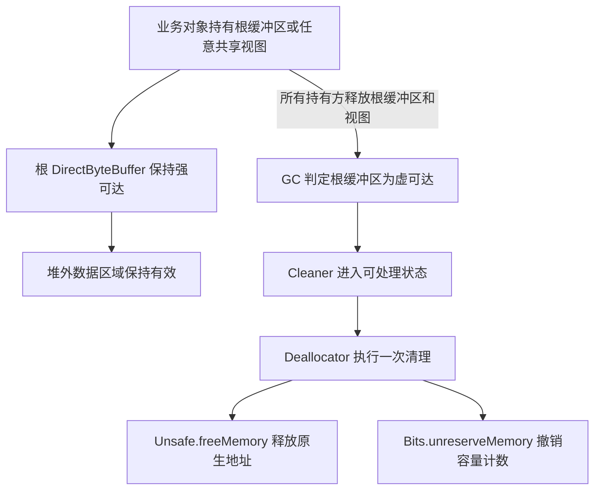

`ByteBuffer.allocateDirect` 创建的缓冲区可以让 JVM 在原生 I/O 中尽量避免堆内中间缓冲区复制。它的代价是将一次分配拆成两种生命周期：Java 堆上的 `DirectByteBuffer` 对象由 GC 管理，真正保存数据的原生内存则由 Cleaner 释放。

DirectByteBuffer 的回收由一条所有权链决定：只要根缓冲区或任意共享视图仍被业务对象持有，底层原生内存就必须保持有效；只有整条引用链断开后，GC 和 Cleaner 才能完成释放。

## DirectByteBuffer 的内存所有权

普通 `ByteBuffer.allocate(capacity)` 通常使用堆内 `byte[]` 保存数据。`ByteBuffer.allocateDirect(capacity)` 返回的对象仍位于 Java 堆中，但它访问的数据区域位于堆外：

| 组成部分 | 保存的内容 | 生命周期管理方式 |
| --- | --- | --- |
| 堆内包装对象 | position、limit、capacity、原生地址、Cleaner、附件对象 | GC 根据可达性回收 |
| 堆外数据区域 | 缓冲区实际读写的字节 | Cleaner 调用原生释放函数 |

因此，“DirectByteBuffer 分配在堆外”并不准确。堆外的是数据区域；DirectByteBuffer 本身仍占用堆空间并参与可达性分析。GC 也不会因为包装对象中保存了一个原生地址，就自动对该地址执行 `free`，释放动作必须由额外的资源管理机制完成。

本文所说的直接内存主要指 `ByteBuffer.allocateDirect` 分配的数据区域。`MappedByteBuffer` 虽然也是直接缓冲区，但它管理的是文件映射，使用独立的 mapped 缓冲池和解除映射流程。

## 分配：先预留容量，再申请原生内存

HotSpot 创建普通 DirectByteBuffer 时，核心路径可以概括为：

```text
ByteBuffer.allocateDirect(capacity)
  -> 进入 DirectByteBuffer 构造过程
  -> Bits.reserveMemory(size, capacity)
  -> Unsafe.allocateMemory(size)
  -> 数据区域清零
  -> 为根缓冲区注册 Cleaner 和 Deallocator
```

`Bits.reserveMemory` 并不分配内存，它先完成 JVM 内部记账并检查直接内存上限。记账成功后，`Unsafe.allocateMemory` 才向原生分配器申请实际空间。若后续分配或 Cleaner 注册失败，构造过程会撤销此前的容量计数，避免账面容量与真实分配不一致。

这条路径同时维护两个数值：

- `capacity` 是缓冲区对外提供的逻辑容量，也是 `-XX:MaxDirectMemorySize` 约束的累计值。
- `size` 是实际向原生分配器申请的字节数。零容量缓冲区仍需要有效地址；启用页对齐时还会预留对齐空间，因此 `size` 可能大于 `capacity`。

`-XX:MaxDirectMemorySize` 只限制 `java.nio` 直接缓冲区的总容量，不限制进程中的全部堆外内存。未显式设置时，JVM 会自动选择该上限。线程栈、元空间、代码缓存、GC 数据结构、JNI 库和文件映射等都有独立的内存来源，不能用这个参数代表容器的完整内存预算。

## 回收：根缓冲区不可达后由 Cleaner 释放

### Cleaner 是什么

Cleaner 是一种以对象可达性为触发条件的资源清理机制。它把两个对象关联起来：

- 被监视对象，也就是需要跟踪生命周期的对象。
- 清理动作，通常是一个 `Runnable`，负责释放被监视对象间接持有的原生内存、文件句柄等外部资源。

注册 Cleaner 时，Cleaner 通过虚引用跟踪被监视对象，不会像普通强引用那样阻止它被回收。当 GC 判定该对象已经进入虚可达状态后，对应清理任务才具备执行条件，随后由 Cleaner 的处理线程或其他实现路径执行。清理动作通常被设计为最多执行一次，避免同一资源被重复释放。

Cleaner 不是垃圾收集器，也不是能够保证立即执行的析构函数。GC 负责判定对象是否仍然可达，Cleaner 只在可达性变化后执行预先注册的资源释放逻辑。从业务引用消失到清理动作运行之间没有确定的时间上限，JVM 退出时也不应依赖 Cleaner 完成关键数据持久化。

清理动作不能直接或间接强引用被监视对象。例如，清理动作若捕获了对象实例的 `this`，就会形成“Cleaner 为了清理对象而让对象始终可达”的引用关系，自动清理将无法触发。因此，清理动作只应保存释放资源所需的独立状态。

Java 9 提供了公开的 `java.lang.ref.Cleaner` API，但 DirectByteBuffer 在不同 OpenJDK 版本中使用的是内部 Cleaner 或直接缓冲区专用 Cleaner。两者都采用虚引用驱动清理的基本思路，但具体类型、队列和执行线程并不相同。

根 DirectByteBuffer 创建时会按照这一机制注册 Cleaner。被监视对象是根缓冲区，清理动作则保存原生地址、实际分配大小和逻辑容量，并在执行时释放地址、撤销容量计数。

### 共享视图也属于所有权链

`slice()`、`duplicate()`、`asReadOnlyBuffer()` 以及类型化视图都共享原来的数据区域，不会分配一份新的原生内存。派生视图没有独立的原生内存 Cleaner，而是通过附件对象持有根缓冲区或其所有权链。

```java
ByteBuffer root = ByteBuffer.allocateDirect(1024 * 1024);
ByteBuffer view = root.slice();
root = null;
```

此时 1 MiB 原生内存仍不能释放，因为 `view` 继续保持底层内存所有者可达。切片的 `capacity` 只描述它能访问的窗口大小；即使窗口很小，也可能保留整个根缓冲区对应的原生分配。

完整回收流程如下：



GC 与 Cleaner 在这里承担不同职责：GC 只负责判断堆内包装对象的可达性，Cleaner 再以这个判断结果为触发条件释放原生资源。根缓冲区已经虚可达但 Cleaner 尚未执行时，原生地址和直接内存计数仍然存在。

### OpenJDK 中 Cleaner 的实现变化

Cleaner 的类名和执行线程属于 OpenJDK 实现细节，不是 `ByteBuffer` API 的稳定约定：

- OpenJDK 8 使用 `sun.misc.Cleaner`；OpenJDK 9 至 25 使用 `jdk.internal.ref.Cleaner`。两者都继承虚引用，由高优先级 `Reference Handler` 线程执行清理动作。
- OpenJDK 26 将直接缓冲区迁移到专用 `java.nio.BufferCleaner`。它通过 `PhantomReference`、`ReferenceQueue` 和专用守护线程处理清理任务，分配慢路径也可以主动执行已经入队的任务。

这些变化没有改变回收条件：自动清理必须等待 GC 发现根缓冲区进入虚可达状态，释放时刻仍不确定。

## 回收为何滞后，以及 OOME 如何发生

业务代码不再使用缓冲区，不等于 JVM 已经完成释放。最后一个强引用消失后，仍需等待一次能够发现该对象的 GC、虚引用处理以及 Cleaner 执行。堆使用率较低时，即使已经产生大量不可达的 DirectByteBuffer，JVM 也可能没有立即执行 GC 的理由。

当新的直接缓冲区无法通过容量预留时，HotSpot 会进入分配慢路径：先推动已经产生的 Cleaner 任务，再请求 `System.gc()` 以发现更多不可达缓冲区，随后在有限时间内重试。若容量仍然不足，才抛出直接内存相关的 `OutOfMemoryError`。

这条补救路径并不构成释放保证。`System.gc()` 只有尽力执行语义；启用 `-XX:+DisableExplicitGC` 后，HotSpot 会忽略该请求。应用主动调用 `System.gc()` 同样不能建立可靠的资源生命周期，还可能带来额外的全局 GC 开销。

直接内存 OOME 与 Java 堆耗尽是两种不同问题，常见原因如下：

| 原因 | 典型现象 | 排查重点 |
| --- | --- | --- |
| 根缓冲区或视图长期被引用 | direct 池的容量持续增长 | 查找对象到 GC Roots 的引用链 |
| 分配速度高于 GC 和 Cleaner 的处理速度 | 容量快速波动，伴随频繁 GC 或分配停顿 | 检查分配频率、GC 周期和缓冲区复用策略 |
| 上限低于业务峰值需求 | 固定并发或流量峰值下稳定复现 | 计算并发量、单次容量和池化容量 |
| 显式 GC 被禁用或未及时发现对象 | Java 堆仍宽松，但触及直接内存上限 | 检查 JVM 参数与 GC 日志 |
| 原生地址空间或物理内存不足 | 容量计数未到上限也可能分配失败 | 检查容器限制、进程限制和操作系统内存 |

较新的 OpenJDK 通常会在容量预留失败的异常中附带申请量、已分配量和上限；OpenJDK 8 的典型信息只有 `Direct buffer memory`。异常文本只能辅助判断，因为原生分配器失败也可能以其他 `OutOfMemoryError` 信息出现。

## 显式释放的边界

`ByteBuffer` 没有公开的 `close()` 或 `free()` 方法。通过反射或 `Unsafe.invokeCleaner` 强制执行内部 Cleaner，不是可移植的 DirectByteBuffer 生命周期协议：模块封装和内部类型可能变化，切片与重复缓冲区可能被拒绝；如果其他线程或视图仍在访问，还会形成 use-after-free 风险。

当调用方必须使用 NIO `ByteBuffer` 时，通常应使用有界缓冲池，或者缩短根缓冲区及共享视图的引用生命周期，把 Cleaner 保留为最终回收机制。缓冲池可以减少原生分配与清理频率，但最大容量、单个缓冲区大小、空闲淘汰和并发借用数都必须有上限，否则池化只是把临时占用改成长期占用。

若业务要求确定的原生内存生命周期，应选择提供公开所有权模型的 API。JDK 22 起正式提供的 Foreign Function & Memory API 可以通过 `Arena` 控制释放：

```java
try (Arena arena = Arena.ofConfined()) {
    MemorySegment segment = arena.allocate(1024 * 1024);
    ByteBuffer buffer = segment.asByteBuffer();
    // buffer 只能在 arena 的有效期内访问
}
```

关闭 `Arena` 会释放其管理的原生区域，并使关联内存段失效。它适用于能够显式传递和关闭所有权的组件，不等于为任意现有 DirectByteBuffer 增加了 `close()`。

## 按所有权层级排查直接内存

排查应从最接近 DirectByteBuffer 的指标开始，再逐步扩大到整个进程。单看 RSS 无法证明直接缓冲区泄漏。

### 第一步：确认 direct 缓冲池是否增长

`java.nio:type=BufferPool,name=direct` 对应的 `BufferPoolMXBean` 提供三个估算值：

- `Count`：纳入直接缓冲池记账的分配数量；共享数据区域的派生视图不会重复增加计数。
- `TotalCapacity`：逻辑容量合计，对应 HotSpot 用于上限检查的容量计数。
- `MemoryUsed`：JVM 为该池使用的实际字节估算值，可能因对齐和分配方式而不同于 `TotalCapacity`。

```java
ManagementFactory.getPlatformMXBeans(BufferPoolMXBean.class).stream()
        .filter(pool -> pool.getName().equals("direct"))
        .forEach(pool -> System.out.printf(
                "count=%d, capacity=%d, used=%d%n",
                pool.getCount(), pool.getTotalCapacity(), pool.getMemoryUsed()));
```

如果 `TotalCapacity` 与 `MemoryUsed` 持续上升，问题范围已经可以收敛到直接缓冲区的持有或池化策略。若 direct 指标稳定而 RSS 继续上涨，则应检查文件映射、线程或其他原生内存来源。

### 第二步：用堆转储寻找持有者

堆转储保存 DirectByteBuffer、共享视图及业务对象，不包含对应原生区域的完整数据。DirectByteBuffer 包装对象本身很小，因此不能只看 shallow size，而要检查：

- 根缓冲区数量及 `capacity` 分布；
- 视图与附件对象形成的所有权链；
- 到缓存、线程、队列、异步任务等 GC Roots 的保留路径。

如果 direct 池容量持续增长，同时堆转储中存在大量仍可达的根缓冲区或视图，原因通常是对象持有，而不是 Cleaner 执行缓慢。

### 第三步：用 NMT 和 RSS 检查外围内存

Native Memory Tracking 必须在 JVM 启动时启用：

```shell
java -XX:NativeMemoryTracking=summary ...
jcmd <pid> VM.native_memory baseline
jcmd <pid> VM.native_memory summary.diff scale=MB
```

HotSpot 中 `Unsafe.allocateMemory` 的底层分配使用 NMT 的 `mtOther` 标签，因此直接缓冲区内存可能体现在 `Other` 分类中。但 `Other` 不是 DirectByteBuffer 的专属账本，NMT 也不覆盖第三方原生代码的全部分配，不能替代 `BufferPoolMXBean` 或操作系统工具。

RSS 的统计范围更大，还包括已提交 Java 堆、线程栈、共享库、内存映射、原生分配器缓存和其他驻留页面。即使 `MemoryUsed` 已下降，`free` 后的空间也可能暂时留在原生分配器中，没有立即归还操作系统。因此，RSS 没有同步下降不能单独证明内存泄漏。

| 指标关系 | 优先判断 |
| --- | --- |
| `TotalCapacity` 与 `MemoryUsed` 同时持续上升 | 根缓冲区被持有或缓冲池无界 |
| `Count` 上升但总容量基本稳定 | 小缓冲区数量增加或池化策略变化 |
| direct 指标稳定但 RSS 上升 | 映射、线程、其他 JVM 原生区域或第三方库 |
| `MemoryUsed` 下降但 RSS 不降 | 原生分配器缓存、碎片或驻留页变化 |

## 生产环境中的控制原则

DirectByteBuffer 适合容量较大、生命周期较长且频繁参与原生 I/O 的数据。大量创建短生命周期小缓冲区会放大原生分配、清零、GC 和 Cleaner 处理成本。

生产环境需要同时控制以下边界：

1. 显式设置直接内存预算，不依赖 JVM 自动选择的默认值。
2. 为缓冲池容量、单次分配、业务并发和空闲缓存设置上限。
3. 避免让切片、重复缓冲区或异步任务意外延长根缓冲区生命周期。
4. 持续采集 direct 池的 `Count`、`TotalCapacity` 和 `MemoryUsed`。
5. 计算容器预算时，为线程栈、元空间、代码缓存、GC、映射和第三方原生库保留空间，不能只计算 `Xmx + MaxDirectMemorySize`。

DirectByteBuffer 的最终释放条件可以归结为一句话：根缓冲区及所有共享视图都不再强可达，GC 完成虚引用判定后，Cleaner 才会释放原生地址并撤销容量计数。自动回收能够兜底，但不能提供确定的释放时刻。

## 参考资料

- [ByteBuffer API：Direct 与 non-direct buffer](https://docs.oracle.com/en/java/javase/25/docs/api/java.base/java/nio/ByteBuffer.html)
- [Cleaner API：基于虚引用的资源清理](https://docs.oracle.com/en/java/javase/25/docs/api/java.base/java/lang/ref/Cleaner.html)
- [BufferPoolMXBean API](https://docs.oracle.com/en/java/javase/26/docs/api/java.management/java/lang/management/BufferPoolMXBean.html)
- [Java 命令参数：MaxDirectMemorySize 与 DisableExplicitGC](https://docs.oracle.com/en/java/javase/25/docs/specs/man/java.html)
- [OpenJDK 25：Direct-X-Buffer.java.template](https://github.com/openjdk/jdk/blob/jdk-25-ga/src/java.base/share/classes/java/nio/Direct-X-Buffer.java.template)
- [OpenJDK 25：Bits.java](https://github.com/openjdk/jdk/blob/jdk-25-ga/src/java.base/share/classes/java/nio/Bits.java)
- [OpenJDK 8 与 OpenJDK 25：内部 Cleaner 实现](https://github.com/openjdk/jdk8u/blob/master/jdk/src/share/classes/sun/misc/Cleaner.java)、[jdk.internal.ref.Cleaner](https://github.com/openjdk/jdk/blob/jdk-25-ga/src/java.base/share/classes/jdk/internal/ref/Cleaner.java)
- [OpenJDK 26：BufferCleaner.java](https://github.com/openjdk/jdk/blob/jdk-26-ga/src/java.base/share/classes/java/nio/BufferCleaner.java)
- [OpenJDK 25：Unsafe 原生内存分配与 NMT 标签](https://github.com/openjdk/jdk/blob/jdk-25-ga/src/hotspot/share/prims/unsafe.cpp)
- [Arena API：原生内存的显式生命周期](https://docs.oracle.com/en/java/javase/25/docs/api/java.base/java/lang/foreign/Arena.html)
