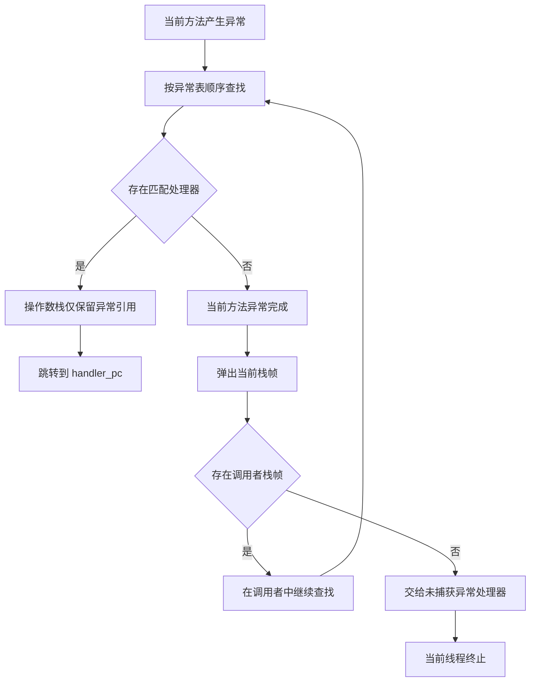

# JVM 异常处理机制：从异常表到栈展开

本文从 Java 语句、`class` 文件和 JVM 运行时三个层次解释异常处理。核心链路是：编译器把 `try-catch-finally` 转换为字节码和异常表；异常发生后，JVM 按异常表查找处理器，找不到时逐层弹出栈帧，直到异常被处理或线程终止。涉及实现优化时，本文将范围限定为 HotSpot，不把实现选择表述为 JVM 规范要求。

## 三个层次各自负责什么

Java 源码中的 `throw`、`try`、`catch`、`finally` 和 try-with-resources 属于语言层。编译器负责检查受检异常、验证 `catch` 的可达性，并把结构化语句转换为字节码。

`class` 文件不保存一棵 `try-catch` 语法树。每个包含代码的方法都有一个 `Code` 属性，其中的 `exception_table` 描述受保护的字节码区间、处理器入口和可捕获类型。方法声明中的 `throws` 列表则记录在另一个 `Exceptions` 属性中，主要服务于 Java 编译期检查，不参与 JVM 的运行时处理器匹配。

JVM 运行时负责在异常发生后定位当前指令、匹配处理器、转移控制流以及展开栈帧。JVM 规范定义的是可观察语义和处理器搜索顺序；解释器、JIT 编译代码可以使用不同的内部数据结构，只要行为一致。

## 异常从哪里产生

对程序可见的同步异常主要有两条产生路径。

第一条是执行 `athrow`。Java 源码中的显式 `throw` 通常会编译为该指令。执行前，操作数栈顶必须是 `Throwable` 或其子类对象的引用；`athrow` 弹出该引用并开始处理器查找。

```java
throw new IllegalStateException("状态不一致");
```

其关键字节码形态是：

```text
new           java/lang/IllegalStateException
dup
ldc           "状态不一致"
invokespecial java/lang/IllegalStateException.<init>
athrow
```

第二条是 JVM 在执行某条指令时检测到异常条件。例如，`idiv` 的除数为零可以产生 `ArithmeticException`，数组访问越界可以产生 `ArrayIndexOutOfBoundsException`，对空引用执行字段访问、方法调用等对象操作可以产生 `NullPointerException`。这类异常不要求当前方法的字节码中存在 `athrow`。

两条路径进入同一套处理流程。JVM 规范还要求异常具有精确性：控制转移发生时，异常点之前已执行指令的效果必须可见，异常点之后的指令不能表现为已经执行。这一约束使编译器即使重排或优化机器码，也必须保留 Java 层可观察到的异常位置和状态。

## 异常表如何描述 `catch`

`Code` 属性中的每个异常表项包含四个字段：

| 字段 | 含义 |
| --- | --- |
| `start_pc` | 受保护区间起点，包含该位置 |
| `end_pc` | 受保护区间终点，不包含该位置 |
| `handler_pc` | 处理器入口的字节码偏移量 |
| `catch_type` | 常量池中的异常类；值为 `0` 时匹配所有异常 |

处理器是否匹配同时取决于指令位置和异常类型：异常点必须位于 `[start_pc, end_pc)`，异常对象的运行时类型必须是 `catch_type` 指定的类或其子类。`catch_type = 0` 的 catch-all 表项通常用于实现 `finally`，它不是 Java 源码中的 `catch (Throwable)` 声明。

下面的示例同时包含 `catch` 和 `finally`：

```java
static int parse(String text) {
    try {
        return Integer.parseInt(text);
    } catch (NumberFormatException e) {
        return -1;
    } finally {
        audit();
    }
}
```

使用 `javac -g:none` 编译后，`javap -c -v` 输出的核心部分如下：

```text
 0: aload_0
 1: invokestatic  Integer.parseInt
 4: istore_1
 5: invokestatic  audit
 8: iload_1
 9: ireturn
10: astore_1
11: iconst_m1
12: istore_2
13: invokestatic  audit
16: iload_2
17: ireturn
18: astore_3
19: invokestatic  audit
22: aload_3
23: athrow

Exception table:
   from    to  target  type
       0     5      10  Class java/lang/NumberFormatException
       0     5      18  any
      10    13      18  any
```

第一项把 `[0, 5)` 内产生的 `NumberFormatException` 转移到偏移量 `10`。第二、三项负责异常路径上的 `finally`：先保存异常，调用 `audit()`，再通过 `athrow` 重新抛出。正常返回路径和 `catch` 返回路径则各自包含一份 `audit()` 调用。

异常表的顺序具有语义。JVM 从表头开始查找并选择第一个同时满足区间和类型条件的表项。因此，Java 编译器需要把更具体、语义上更靠内层的处理器排在更宽泛的处理器之前。JVM 本身不根据源码重建嵌套关系，也不会重新排序异常表。

## 当前栈帧如何接管异常

异常发生后，JVM 在当前方法中执行以下语义步骤：

1. 取得异常点对应的字节码位置和异常对象的运行时类型。
2. 按 `exception_table` 中的存储顺序检查表项。
3. 找到首个匹配项后，保留当前栈帧，将操作数栈调整为只包含异常对象引用。
4. 把执行位置转移到 `handler_pc`，由处理器入口处的 `astore` 等指令接收异常对象。

局部变量表仍属于同一个栈帧，但处理器不能假设异常点之前的所有局部变量都保存源码层最新的值。字节码校验和编译器生成的栈映射帧共同约束处理器入口可使用的类型状态；JIT 优化后的机器状态也必须在控制转移时还原为符合该语义的状态。

这套规则解释了为什么调用的方法抛出异常时，调用者仍能捕获：对于调用者而言，异常点是 `invokevirtual`、`invokestatic` 等调用指令所在的位置。只要该位置落在调用者异常表的受保护区间内，调用者的处理器就可以匹配。

## 找不到处理器时如何展开调用栈

如果当前方法没有匹配项，本次方法调用会异常完成。JVM 丢弃当前栈帧的局部变量表和操作数栈，弹出该帧，恢复调用者栈帧，再以调用指令的位置为异常点继续查找。这个过程称为栈展开。



展开只发生到首个匹配处理器为止。已经弹出的栈帧不会恢复，普通 Java 代码也不能在异常处理器中回到原异常点继续执行。

如果异常一直传播到线程入口，JVM 会查询该线程的 `UncaughtExceptionHandler` 并调用其 `uncaughtException` 方法；处理器执行结束后，当前线程终止。单个线程因未捕获异常终止不等于 JVM 进程必然立即退出，进程是否继续取决于是否还有存活的非守护线程等条件。

## `finally` 不是 JVM 的专用指令

JVM 没有 `finally` 指令。Java 语言只规定：无论 `try` 或 `catch` 正常完成，还是由于 `return`、`throw` 等原因异常完成，都要按规则执行 `finally`。编译器负责把这项语义展开到字节码。

现代 `javac` 通常在各条正常退出路径复制 `finally` 代码，并增加一个 catch-all 处理器覆盖异常退出路径。异常路径会暂存原异常，执行 `finally`，然后重新抛出。具体字节码布局是编译器实现选择，不能假设所有 Java 编译器都生成完全相同的偏移量或重复方式。

`finally` 自身如果异常完成，会替换此前尚未完成的控制转移。例如：

```java
static int result() {
    try {
        throw new IllegalStateException("原异常");
    } finally {
        return 1;
    }
}
```

该方法返回 `1`，原异常被丢弃。类似地，`finally` 中抛出的新异常会替换正在传播的旧异常。除非有明确的控制流需求，不应在 `finally` 中使用 `return`、`break`、`continue` 或抛出无意替换原异常的新异常。

`class` 文件版本 50.0 及以下允许编译器使用 `jsr`、`ret` 子例程编码 `finally`；版本 51.0 起禁止在字节码中出现 `jsr`、`jsr_w` 和 `ret`。现代编译器通常改为复制 `finally` 代码并配合 catch-all 处理器，分析旧字节码时需要区分这两种形式。

## try-with-resources 如何保留原异常

手写 `finally` 关闭资源时，关闭操作抛出的异常可能覆盖业务代码的原异常。try-with-resources 通过被抑制异常保存两者：

```java
try (InputStream input = openInput()) {
    consume(input);
}
```

Java 语言规范把这段代码定义为等价的嵌套 `try-catch-finally` 转换，其关键规则是：

- 资源按声明顺序初始化，按相反顺序关闭。
- 如果 `try` 主体已抛出异常，关闭失败产生的异常通过 `addSuppressed` 附加到原异常，原异常继续传播。
- 如果主体正常完成而关闭失败，关闭异常成为向外传播的异常。
- 多个资源关闭失败时，后声明、先关闭的资源所产生的第一个异常成为主异常，其余关闭异常被抑制。

因此，`Throwable.getSuppressed()` 与 `getCause()` 表达不同关系：`cause` 描述异常的因果链，被抑制异常描述在清理过程中同时发生、但没有取代主异常的失败。

## 异常处理的成本边界

不能把“存在 `try`”和“实际抛出异常”视为同一种成本。

正常路径上，异常表是 `Code` 属性中的元数据，不会因为每次进入 `try` 就创建异常对象或遍历处理器。`try-finally` 仍可能增加字节码体积，JIT 编译器也需要维护异常边和精确状态，因此不能脱离具体代码断言其成本恒为零。

实际抛出异常时，成本可能来自多个部分：

- 创建新的异常对象；
- 调用 `Throwable.fillInStackTrace()` 记录当前线程的栈帧信息；
- 匹配处理器与跨方法展开栈帧；
- 格式化、打印或记录堆栈。

这些成本不能合并成一个固定数值。`throw` 一个已有异常对象不会再次创建对象，也不会自动刷新其栈轨迹；异常层级、栈深度、是否读取或打印堆栈，以及 JVM 优化状态都会改变结果。HotSpot 还提供 `OmitStackTraceInFastThrow` 等实现级优化，可以为优化代码中的部分高频隐式异常省略回溯信息。这类行为不是 JVM 规范保证，不能依赖它维持业务语义。

工程上应先按语义使用异常：异常适合表示调用无法按契约正常完成，不适合替代高频分支。只有性能分析确认异常路径形成瓶颈时，才需要进一步区分对象创建、栈轨迹采集、栈展开和日志输出各自的占比。

## 结论

JVM 异常处理可以收敛为一条确定的控制流：异常由 `athrow` 或指令执行失败产生；JVM 按当前方法异常表的存储顺序匹配区间与类型；命中后在当前栈帧进入处理器，未命中则弹出栈帧并在调用者中继续查找。

`catch` 的结构由异常表表达，`finally` 和 try-with-resources 的语义主要由编译器生成的普通字节码、catch-all 表项及 `Throwable` API 共同完成。把语言规则、class 文件表示和 JVM 运行时职责分开，才能准确解释处理器顺序、栈展开、异常覆盖和实际成本。

## 参考资料

- [Java Virtual Machine Specification：2.10 Exceptions](https://docs.oracle.com/javase/specs/jvms/se21/html/jvms-2.html#jvms-2.10)
- [Java Virtual Machine Specification：4.7.3 The Code Attribute](https://docs.oracle.com/javase/specs/jvms/se21/html/jvms-4.html#jvms-4.7.3)
- [Java Virtual Machine Specification：athrow](https://docs.oracle.com/javase/specs/jvms/se21/html/jvms-6.html#jvms-6.5.athrow)
- [Java Language Specification：14.20 The try Statement](https://docs.oracle.com/javase/specs/jls/se21/html/jls-14.html#jls-14.20)
- [Java API：Throwable](https://docs.oracle.com/en/java/javase/21/docs/api/java.base/java/lang/Throwable.html)
- [Java API：Thread.UncaughtExceptionHandler](https://docs.oracle.com/en/java/javase/21/docs/api/java.base/java/lang/Thread.UncaughtExceptionHandler.html)
- [OpenJDK：Throwable.java](https://github.com/openjdk/jdk21u/blob/master/src/java.base/share/classes/java/lang/Throwable.java)
- [OpenJDK HotSpot：globals.hpp](https://github.com/openjdk/jdk21u/blob/master/src/hotspot/share/runtime/globals.hpp)
