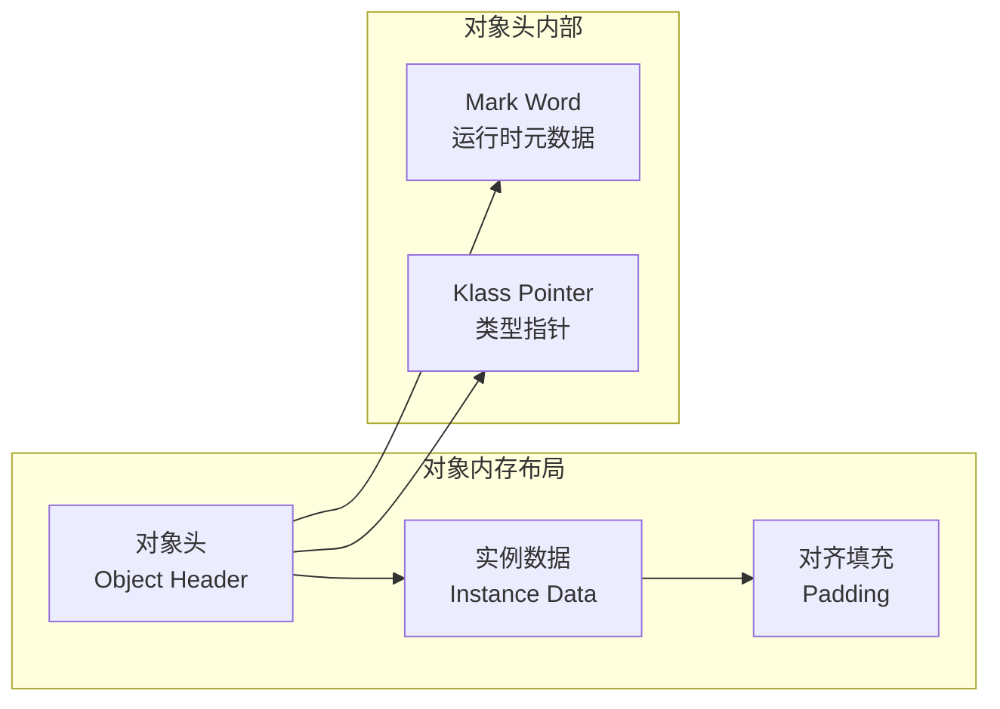
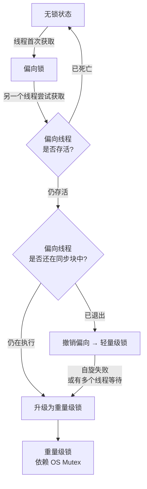
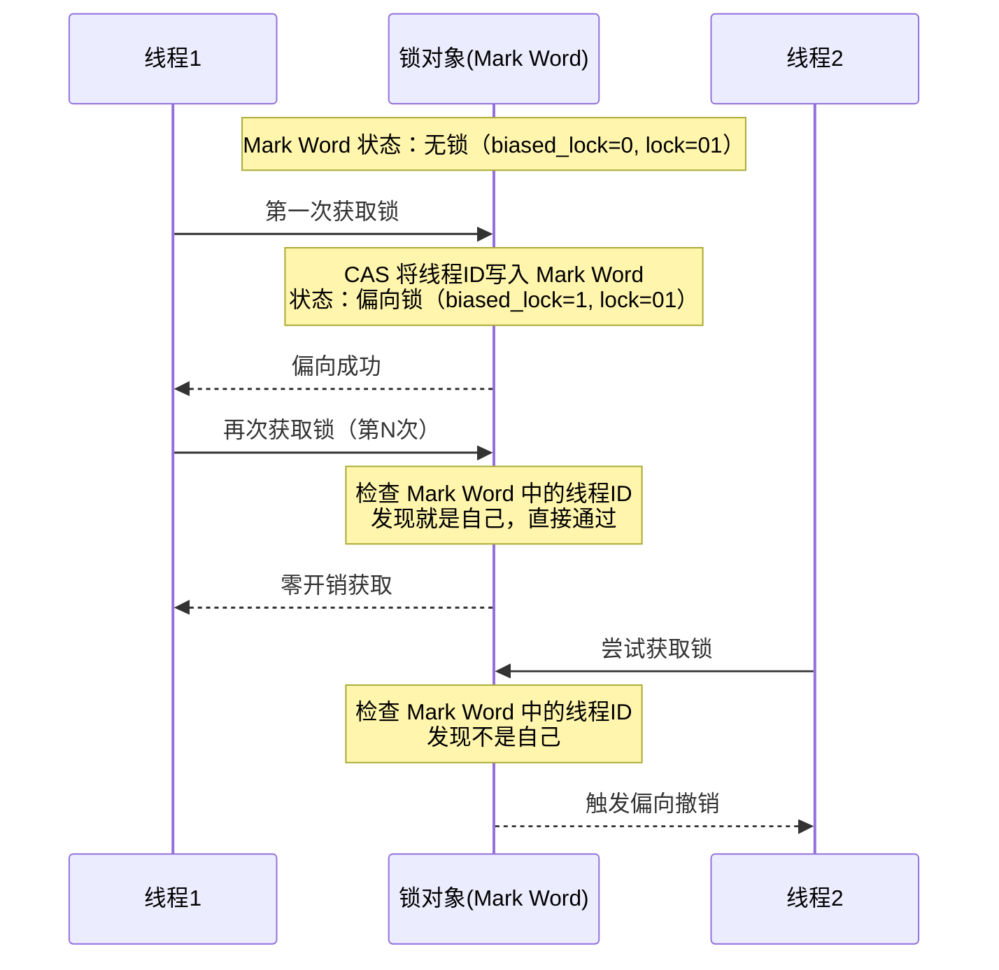
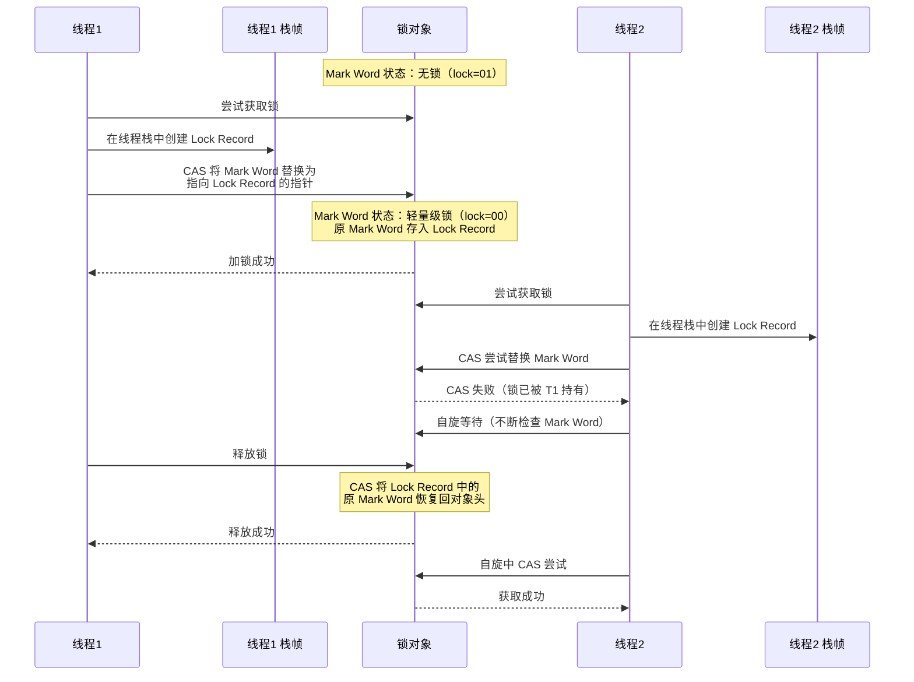
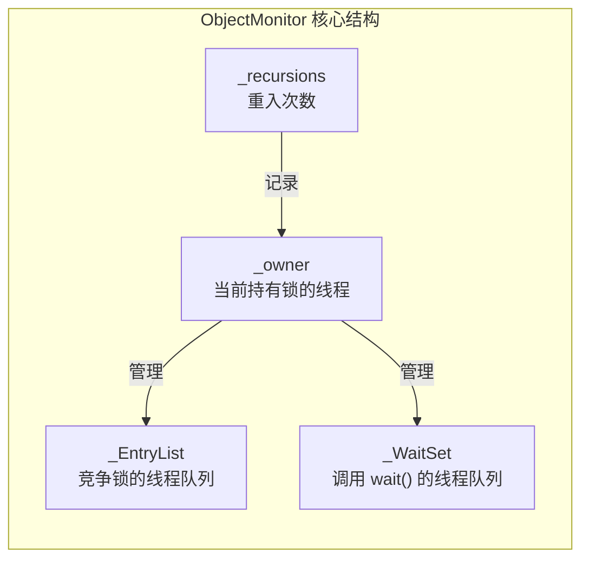
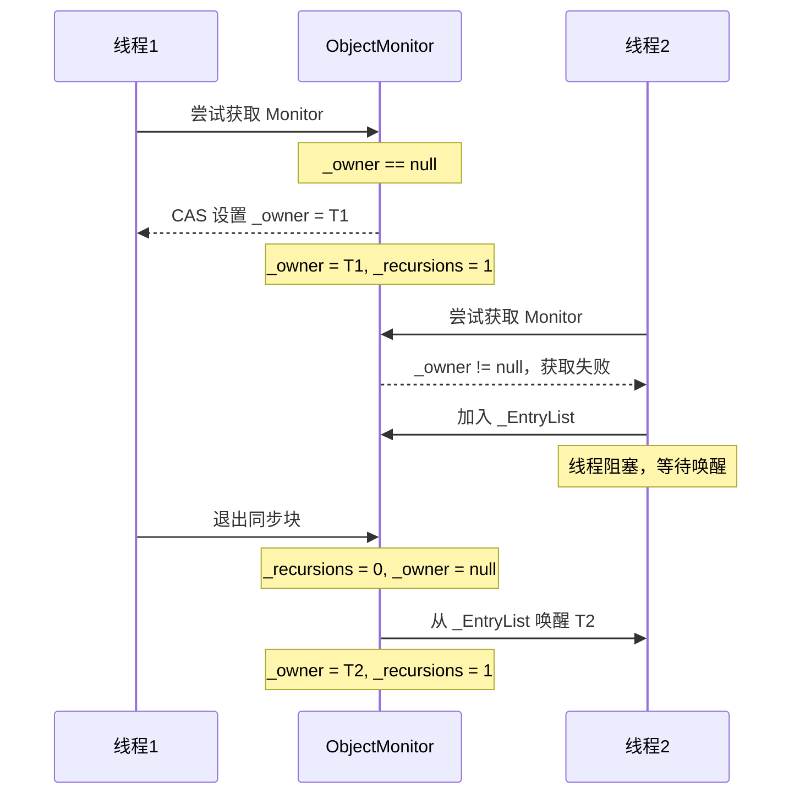
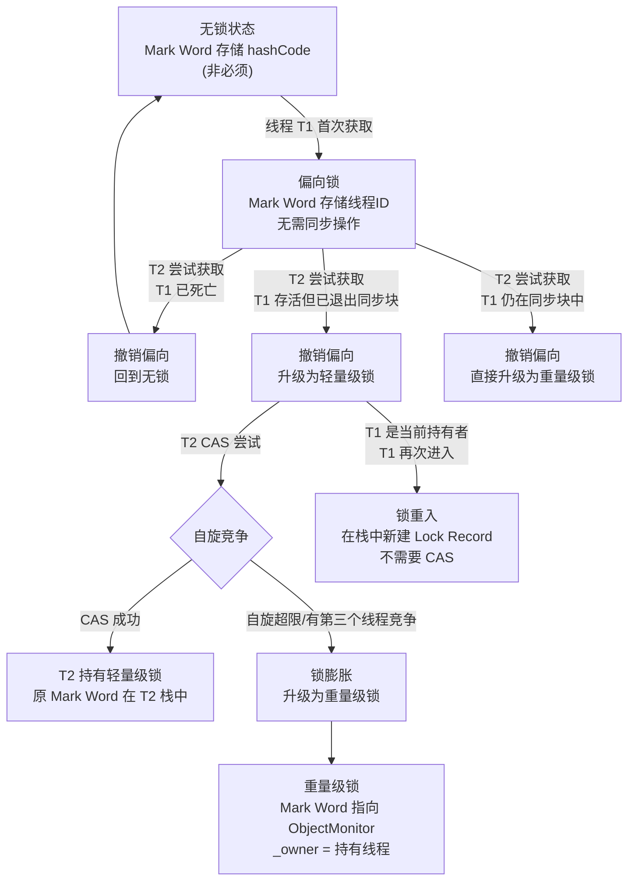
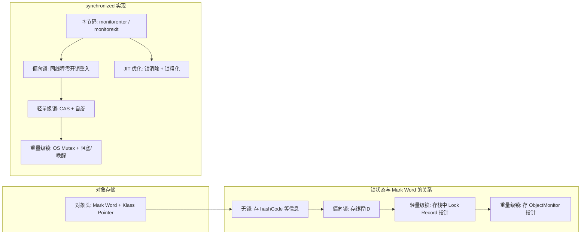

# JVM 对象模型与 synchronized 实现原理：从对象头到锁升级

> 在 Java 里写 `synchronized(obj) { ... }` 只需要几行代码。但如果你往下追问：
> - `synchronized` 在字节码层面到底对应什么指令？
> - 锁信息存在哪里？和对象本身有什么关系？
> - 为什么说 synchronized 会"锁升级"？偏向锁、轻量级锁、重量级锁分别是什么？
> - 重量级锁底层的 Monitor 又是什么东西？
>
> 这些问题，最终都会落到两条线上：**JVM 的对象内存模型**和**锁状态的流转机制**。
>
> 把这两条线串起来，你就能真正理解 synchronized 的完整图景。

## 一、先看全貌：一个对象在 JVM 里长什么样

先从一张图建立整体认知：



JVM 中的每个对象在堆内存中的布局都可以拆成三部分：

| 区域 | 说明 |
|------|------|
| 对象头（Object Header） | 包含 Mark Word 和 Klass Pointer，存储运行时元数据和类型信息 |
| 实例数据（Instance Data） | 对象中定义的成员变量，包括从父类继承的字段 |
| 对齐填充（Padding） | JVM 要求对象起始地址必须是 8 字节的整数倍，不足时用填充字节补齐 |

下面把对象头拆开讲，因为 synchronized 的秘密几乎全藏在里面。

## 二、对象头详解：Mark Word 与 Klass Pointer

### 1. Mark Word —— 一把多用途的"变形字段"

Mark Word 是对象头最核心的部分。在 64 位 JVM 上，它固定占 8 字节（64 位），但它不是固定格式——它的含义会根据对象当前的锁状态动态变化。

可以用下面这张表来理解 Mark Word 在不同锁状态下的位分布（64 位 JVM）：

| 锁状态 | 位分布（从高位到低位） | 锁标志位（最后 2 位） |
|--------|----------------------|---------------------|
| 无锁 | 25位 unused \| 31位 hashCode \| 1位 unused \| 4位 分代年龄 \| 1位 偏向锁位(0) \| **01** | 01 |
| 偏向锁 | 54位 线程ID \| 2位 epoch \| 1位 unused \| 4位 分代年龄 \| 1位 偏向锁位(1) \| **01** | 01 |
| 轻量级锁 | 62位 指向栈中锁记录的指针 \| **00** | 00 |
| 重量级锁 | 62位 指向 Monitor 的指针 \| **10** | 10 |
| GC 标记 | — \| **11** | 11 |

几个关键信息从上表中可以直接得出：

- **偏向锁位（Biased Lock Bit）**：位于倒数第 3 位。为 0 表示对象未偏向任何线程，为 1 表示对象当前处于偏向模式。
- **锁标志位（Lock Flag）**：最后 2 位。`01`、`00`、`10`、`11` 分别对应无锁/偏向、轻量级锁、重量级锁和 GC 标记。
- 状态的判断逻辑是：先看最后 2 位，如果是 `01`，再看偏向锁位区分是无锁还是偏向锁。

也正因为 Mark Word 只有 64 位，而不同锁状态需要存储不同的信息，所以它在不同状态下是"复用"这 64 位的——这就是为什么 hashCode 在偏向锁状态下会被"覆盖"的原因（后面会展开讲）。

### 2. Klass Pointer —— 对象知道自己是谁

Klass Pointer 指向方法区中的类元数据，JVM 通过它来确定对象属于哪个类。

在 64 位 JVM 上，默认开启指针压缩后，Klass Pointer 占 4 字节；关闭压缩时占 8 字节。

它的作用很直接：

- 调用 `obj.getClass()`，本质就是读取这个指针。
- `instanceof` 检查也是根据它来比对的。
- 从对象找到虚方法表（vtable），最终定位到方法代码。

### 3. 一个完整的对象头示例

假设在 64 位 JVM 上，开启指针压缩，创建一个普通对象：

```
对象头 = Mark Word(8字节) + Klass Pointer(4字节) = 12 字节
```

再加上实例数据和对齐填充，就是一个 Java 对象在堆上的真实模样。

## 三、synchronized 的字节码层面：monitorenter 与 monitorexit

在深入锁升级之前，先看看 synchronized 在字节码层面是怎么表达的。

### 1. 同步代码块

```java
public void syncBlock() {
    synchronized (this) {
        // 临界区
        doSomething();
    }
}
```

编译后的字节码（简化）：

```
aload_0           // 将 this 压入操作数栈
dup               // 复制栈顶引用（一份给 monitorenter，一份给 monitorexit）
astore_1          // 存储到局部变量表备用
monitorenter      // 获取 this 的监视器
// ... 临界区字节码 ...
aload_1           // 加载之前存储的引用
monitorexit       // 释放 this 的监视器（正常退出）
goto end
// 异常处理器
astore_2          // 存储异常对象
aload_1           // 加载引用
monitorexit       // 释放监视器（异常退出也要释放！）
aload_2
athrow            // 重新抛出异常
end:
return
```

两个关键点：

- 每个 `synchronized` 块编译后会生成一个 `monitorenter` 和**两个** `monitorexit`。第二个 `monitorexit` 在异常处理器中，保证即使临界区抛异常，锁也一定会被释放。
- `monitorenter` 的操作数栈顶必须有一个对象引用——就是被用作锁的对象。

### 2. 同步方法

```java
public synchronized void syncMethod() {
    doSomething();
}
```

同步方法不走 `monitorenter` / `monitorexit` 指令。它是在方法的访问标志（access_flags）里设置 `ACC_SYNCHRONIZED` 标志。JVM 方法调用时检查到这个标志，就会自动执行加锁和解锁。

两者的效果是等价的，区别只是实现方式不同。

## 四、锁升级宏观流程：为什么要有这四种状态

在 JDK 1.6 之前，synchronized 只有一种实现：重量级锁。每次加锁都要通过操作系统内核的 mutex，线程阻塞和唤醒都要从用户态切换到内核态，开销很大。

但从实际场景来看，大多数加锁操作并不会发生真正的竞争。比如：

- 同一把锁总是被同一个线程反复获取。
- 多个线程交替获取锁而不是同时争抢，每次持锁时间都很短。

针对这两种情况，JDK 1.6 引入了一套锁优化机制：偏向锁和轻量级锁。synchronized 的整体链路变成了：



核心思想可以用一句话概括：

> **大多数锁在实际运行中都不会产生竞争。锁升级机制就是为了在"没有竞争"和"竞争激烈"之间做平衡——偏向锁解决"总是同一个线程反复获取"的问题，轻量级锁解决"多线程交替获取但几乎不争抢"的问题，重量级锁兜底处理真正的竞争。**

下面逐一展开每种锁状态。

## 五、偏向锁：锁世界的"惯性思维"

> ⚠️ **注意**：偏向锁在 JDK 15 中被标记为废弃（JEP 374），JDK 18 起已默认关闭并移除（JEP 429）。现代 JVM 不再默认启用偏向锁。以下内容主要用于理解底层原理和阅读早期代码。

### 1. 偏向锁的设计动机

偏向锁基于一个经验假设：**大多数时候，一把锁总是被同一个线程反复获取。**

在没有竞争的情况下，如果每次都要走一遍 CAS 操作，虽然比重量级锁快很多，但依然有不小的开销。偏向锁的思路是：如果上次拿到锁的线程再次来获取，那就直接把锁"偏向"给它，连 CAS 都不需要做。

### 2. 偏向锁的工作流程



第一步：线程 T1 第一次获取锁时，通过一次 CAS 操作把自己的线程 ID 写入对象 Mark Word，并将偏向锁位设为 1。这次 CAS 是偏向锁唯一的开销。

之后 T1 每次再来获取这把锁，只需要检查 Mark Word 里存的是不是自己的线程 ID。如果是，直接进入同步块——不需要任何同步操作。

### 3. 偏向锁的撤销与批量重偏向

当另一个线程 T2 尝试获取已被 T1 偏向的锁时，就会触发偏向锁的撤销。撤销是一个比较重的操作，需要在全局安全点（SafePoint）暂停所有线程来完成。具体步骤：

1. 检查原来偏向的线程 T1 是否还存活。
2. 如果 T1 已经终止，直接把偏向锁撤销回无锁状态，然后 T2 可以尝试偏向来获取。
3. 如果 T1 还活着，遍历 T1 的栈帧，检查它是否还在持有这个锁（即是否还在对应的同步块中）。
4. 如果 T1 已经退出同步块，撤销偏向，升级为轻量级锁。
5. 如果 T1 还在同步块里，证明出现了真正竞争，直接升级为重量级锁。

JVM 对频繁撤销偏向锁的情况做了优化——**批量重偏向**和**批量撤销**机制：

- 如果某个类的对象在一定时间内发生了多次偏向撤销（默认阈值 20 次），JVM 会触发**批量重偏向**：将该类所有已偏向的对象重置为无锁状态，给它们一次重新偏向到其他线程的机会。
- 如果批量重偏向后仍然频繁撤销，达到更高阈值（默认 40 次），JVM 会触发**批量撤销**：彻底禁用该类所有对象的偏向锁，后续直接使用轻量级锁。

### 4. 偏向锁与 hashCode 的冲突

前面提到 Mark Word 的 64 位在不同锁状态下是复用的。偏向锁状态下，Mark Word 已经存了线程 ID 和 epoch，没有多余空间存放 hashCode。

这就产生一个问题：如果一个对象已经处于偏向锁状态，这时候需要获取它的 identity hash code，JVM 怎么处理？

需要区分两种情况：

- **调用 `System.identityHashCode()`**（或未重写 `hashCode()` 时调用 `Object.hashCode()`）：JVM 需要生成 identity hash code 并存入 Mark Word。由于偏向锁状态下 Mark Word 已被线程 ID 占用，JVM 会**撤销偏向锁，计算 hashCode 填入 Mark Word，对象回到无锁状态**。之后这个对象就不能再进入偏向锁状态了——因为一旦有 hashCode，Mark Word 就无法再存储线程 ID。
- **调用用户重写的 `hashCode()`**：这是普通方法调用，不涉及 Mark Word，**不会触发偏向锁撤销**。

这个细节在生产中很重要：如果你对用作锁的对象频繁调用 `System.identityHashCode()`（例如将其放入 `IdentityHashMap`），偏向锁会频繁撤销，最终导致锁性能退化。但如果只是重写了 `hashCode()` 方法，则不会影响偏向锁。

## 六、轻量级锁：多线程交替执行的"无锁化"方案

### 1. 轻量级锁的设计动机

轻量级锁基于另一个经验假设：**多线程虽然在访问同一把锁，但它们"交替"执行同步块，而不是同时争抢。每个线程持有锁的时间都很短。**

对于这种场景，与其让线程阻塞等待，不如让它自旋一会儿——因为另一个线程很快会释放锁。

### 2. 轻量级锁的工作流程



理解轻量级锁，需要先认识一个关键结构：**Lock Record**。

### 3. Lock Record 结构

Lock Record 是分配在线程栈帧中的一块空间，包含两个部分：

| 部分 | 说明 |
|------|------|
| Displaced Mark Word | 用于保存锁对象原来的 Mark Word |
| Owner 指针 | 指向锁对象本身 |

整个流程可以总结为四步：

**加锁过程：**

1. 线程在自己的栈帧中创建一个 Lock Record。
2. 将锁对象的 Mark Word 复制到 Lock Record 的 Displaced Mark Word 中——这就是"备份"。
3. 通过 CAS 尝试将锁对象的 Mark Word 替换为指向 Lock Record 的指针。
4. 如果 CAS 成功，加锁完成。如果 CAS 失败，进入自旋或膨胀。

**解锁过程：**

1. 将 Lock Record 中保存的 Displaced Mark Word 通过 CAS 写回锁对象。
2. 如果 CAS 成功，解锁完成。如果 CAS 失败（说明锁已经膨胀为重量级锁），走重量级锁的释放流程。

这里的关键细节是：CAS 替换时，如果锁对象的 Mark Word 已经变了（比如被膨胀为重量级锁），CAS 就会失败，JVM 就知道该走重量级解锁了。

### 4. 自适应自旋

轻量级锁竞争失败时，线程不是立即阻塞，而是先自旋。JDK 1.6 引入了**自适应自旋**：

- JVM 会根据上一次在同一把锁上自旋的成功率，动态决定这次自旋的次数。
- 如果上次自旋成功获取了锁，这次可以多自旋一会儿。
- 如果自旋很少成功，那这次就直接跳过自旋，进入重量级锁阻塞。

这样就避免了"固定自旋次数"不够灵活的问题。

## 七、重量级锁：当竞争不可避免时的"最后手段"

### 1. ObjectMonitor —— 重量级锁的核心数据结构

当锁膨胀为重量级锁时，JVM 会创建一个 `ObjectMonitor` 对象（在 HotSpot 源码中由 C++ 实现），并通过 CAS 将锁对象 Mark Word 中指向 Lock Record 的指针替换为指向 `ObjectMonitor` 的指针。

ObjectMonitor 的核心结构可以简化理解如下：



| 字段 | 说明 |
|------|------|
| `_owner` | 当前持有 Monitor 的线程，`null` 表示 Monitor 空闲 |
| `_EntryList` | 等待获取锁的线程链表（阻塞在 `synchronized` 入口处的线程） |
| `_WaitSet` | 调用 `obj.wait()` 后被挂起的线程集合 |
| `_recursions` | 重入计数，同一线程每次重入加 1，退出减 1，归零时释放锁 |

### 2. 重量级锁的加锁过程



加锁过程：

1. 线程尝试通过 CAS 将 `_owner` 从 `null` 改为自己。
2. 如果成功，设置 `_recursions = 1`，进入同步块。
3. 如果失败（`_owner` 已被其他线程持有），检查 `_owner` 是否是自己（重入检测）。
4. 如果是重入，`_recursions++`，继续执行。
5. 如果不是自己，线程进入 `_EntryList` 并阻塞，等待被唤醒。

解锁过程：

1. `_recursions--`。
2. 如果 `_recursions == 0`，将 `_owner` 置为 `null`。
3. 从 `_EntryList` 中唤醒一个等待线程（通常是唤醒所有等待线程让它们重新竞争，具体策略因 JVM 实现而异）。

### 3. 重量级锁的开销来源

重量级锁之所以"重"，核心原因是：

- 线程阻塞和唤醒都要通过操作系统内核的 pthread mutex / condition variable。
- 每次阻塞和唤醒都是一次**用户态 ↔ 内核态的切换**，这个切换本身的开销可能比临界区的执行时间还大。
- ObjectMonitor 本身也有内存分配和维护开销。

这也是为什么 JVM 要设计偏向锁和轻量级锁——大多数情况下，根本不需要走到这一步。

## 八、JIT 编译器的锁优化：锁消除与锁粗化

除了运行时的锁升级机制，JIT 编译器在编译期还会对 `synchronized` 做两种重要优化：

### 1. 锁消除（Lock Elimination）

JIT 编译器通过**逃逸分析**（Escape Analysis）判断一个锁对象是否会被其他线程访问。如果能证明某个对象**不会逃逸到其他线程**，那么对它加锁就是多余的，JIT 会直接删除这些同步操作。

```java
public String concatString(String s1, String s2) {
    // StringBuffer 的 append() 是 synchronized 方法
    // 但 sb 是局部变量，不会逃逸到其他线程
    StringBuffer sb = new StringBuffer();
    sb.append(s1);
    sb.append(s2);
    return sb.toString();
}
```

在这个例子中，`StringBuffer` 的 `append()` 方法内部有 `synchronized`，但 `sb` 是方法内的局部变量，不可能被其他线程访问。JIT 编译器会识别出这一点，将 `append()` 中的同步操作完全消除。

> 这也是为什么 `StringBuffer`（线程安全）和 `StringBuilder`（非线程安全）在单线程场景下性能差距不大的原因——JIT 会帮你消除多余的锁。

### 2. 锁粗化（Lock Coarsening）

当一系列相邻的同步操作都作用在**同一个锁对象**上时，JIT 会将它们合并成一个更大范围的同步块，避免反复加锁和解锁的开销。

```java
// 优化前：每次 append 都要加锁和解锁
sb.append("a");  // synchronized
sb.append("b");  // synchronized
sb.append("c");  // synchronized

// 锁粗化后：合并为一次加锁和解锁
// synchronized(sb) {
//     sb.append("a");
//     sb.append("b");
//     sb.append("c");
// }
```

锁粗化的本质是用**一次加锁的开销**替代**多次加锁的开销**，在临界区连续执行的场景下效果显著。

## 九、锁升级完整时间线：从无锁到重量级

把上面四种状态串起来，一个对象从无锁到重量级锁可能经历的完整路径如下：



## 十、与 Object.wait/notify 的关系

重量级锁的 `ObjectMonitor` 同时管理 `_EntryList` 和 `_WaitSet` 两个队列，这解释了 `wait()` / `notify()` 必须在 `synchronized` 中调用的原因：

- 调用 `wait()`，当前线程从 `_owner` 退出，进入 `_WaitSet`，同时 `_recursions` 清零（唤醒后恢复重入计数）。
- 调用 `notify()`，从 `_WaitSet` 中移出一个线程放入 `_EntryList`，让它重新参与锁竞争。
- 调用 `notifyAll()`，将 `_WaitSet` 中所有线程都移入 `_EntryList`。

如果不在 `synchronized` 块中调用，JVM 无法确定当前线程是否持有 Monitor，也就无法正确操作 `_WaitSet`。这就是 `IllegalMonitorStateException` 的来源。

## 十一、总结：一张图收束全文



核心要点回顾：

1. **每个 Java 对象在堆上都有一个对象头**，Mark Word 是对象头的核心，它的内容随着锁状态变化而动态复用。
2. **synchronized 在字节码层面对应 monitorenter / monitorexit**，同步方法则通过 `ACC_SYNCHRONIZED` 标志实现。
3. **偏向锁**让同一线程反复获取锁几乎零开销，但和 `System.identityHashCode()` 存在冲突。（注意：偏向锁已在 JDK 15 废弃，JDK 18 移除）
4. **轻量级锁**通过 CAS + 自旋实现线程交替执行下的高效加锁，Lock Record 分配在线程栈上。
5. **重量级锁**依赖操作系统 Mutex，涉及用户态与内核态切换，是竞争激烈时的最终兜底方案。
6. **锁升级是单向的**——在竞争加剧的方向上，锁只能从无锁→偏向→轻量级→重量级升级，不会反向降级。但锁释放后对象会回到无锁状态，这是正常的生命周期，不属于"降级"。
7. **JIT 编译器还会做锁消除和锁粗化**——通过逃逸分析消除不必要的同步，或将相邻的同步操作合并以减少开销。
