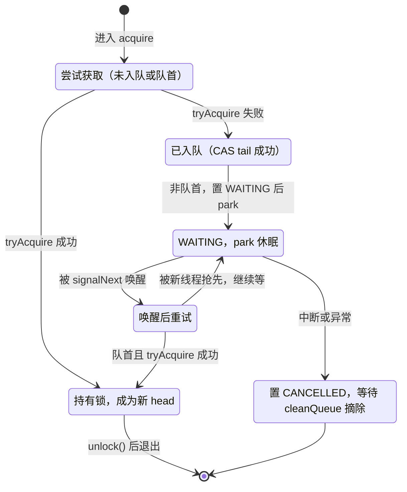
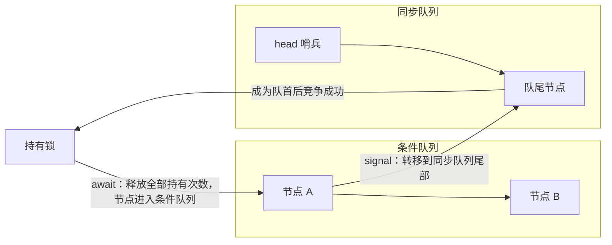

# Java ReentrantLock 实现原理

本文以 OpenJDK JDK 17 正式版（tag jdk-17+35）的源码为例，说明 ReentrantLock 的互斥、可重入、公平性和条件等待分别是怎么实现的。核心不在 ReentrantLock 本身，而在它背后的 AbstractQueuedSynchronizer（AQS）。`ReentrantLock.java` 和 `AbstractQueuedSynchronizer.java` 两个文件从 jdk-17+35 到 jdk17u 后续更新保持一致，文中的结论对 JDK 17 全系列适用。

## ReentrantLock 只负责定义锁的规则

先看 ReentrantLock 自己写了什么：它只有一个字段 `private final Sync sync;`，构造时根据公平参数在 NonfairSync 和 FairSync 之间二选一，之后所有方法都转发给 sync。排队、阻塞、唤醒这些机制全在 Sync 继承的 AQS 里，ReentrantLock 只负责两个判断：什么条件下能拿到锁（tryAcquire），什么条件下算真正释放（tryRelease）。

```java
public ReentrantLock() {        // 默认非公平
    sync = new NonfairSync();
}

public ReentrantLock(boolean fair) {
    sync = fair ? new FairSync() : new NonfairSync();
}

final void lock() {
    if (!initialTryLock())      // 先走一次快速路径
        acquire(1);             // 失败才进入 AQS 排队
}
```

第一次调用 lock() 时，AQS 还没有任何队列，锁的全部状态就是这两个字段。

## state 与等待队列：锁的两种状态载体

锁的状态承载在 AQS 的一个字段上：`private volatile int state`。在 ReentrantLock 里，state 不是"有没有人持有"这种布尔值，而是当前持有线程的重入次数：0 表示没人持有，N 表示同一个线程进来了 N 次。持有者是谁，记录在父类 AbstractOwnableSynchronizer 的 `exclusiveOwnerThread` 里。

这么设计的好处是，可重入被简化成纯计数：加锁加一、解锁减一，减到零才算真正释放。state 声明为 volatile，保证所有线程读到的值一致；compareAndSetState 把"看到 0 再改成 1"合并成一次原子操作，无竞争时加锁的全部成本也就这么多。

抢不到锁的线程不会原地空转，而是进等待队列。这个队列是 CLH 锁的变体：一个双向链表，节点 Node 里有 prev、next、waiter（线程）和 status 四个字段。队列本身只维护 head、tail 两个指针，入队只需 CAS 更新 tail，并发入队因此是安全的。和标准 CLH 的一个区别是，head 是虚拟哨兵节点，第一次发生竞争时才创建，真正的等待者挂在 head 的 next 上——这个位置就是下文反复提到的"队首"。出队也不复杂：把自己变成新的 head。

节点的 status 用位表示，正文只用到三个值：

| 值 | 含义 |
| --- | --- |
| WAITING (1) | 节点在等待唤醒，唤醒者据此找到它 |
| COND (2) | 节点在条件队列里 |
| CANCELLED（负值） | 节点已取消，等待被清理 |

## 加锁：抢、重入、排队

非公平锁的加锁分两步：先试一次不走队列的快速路径，抢不到再进 AQS。

```java
// NonfairSync
final boolean initialTryLock() {
    Thread current = Thread.currentThread();
    if (compareAndSetState(0, 1)) {      // 不检查队列，直接 CAS
        setExclusiveOwnerThread(current);
        return true;
    } else if (getExclusiveOwnerThread() == current) {
        int c = getState() + 1;          // 自己持有：重入计数加一
        if (c < 0)                       // 溢出保护
            throw new Error("Maximum lock count exceeded");
        setState(c);
        return true;
    }
    return false;
}
```

这段代码里，第一次 CAS 不看等待队列，这正是"非公平"三个字的来源：刚到的线程和已经排了半天的线程站在同一起跑线，甚至能抢先。如果 CAS 失败，但持有者恰好是当前线程，说明是重入，state 加一即可。两种都不成立，才轮到 AQS 接手。

acquire(1) 还会再给一次机会：先调 tryAcquire 试试（非公平锁这次依然不看队列），还不行就进入统一的排队循环。下面这段按源码结构简化，省略了取消清理和超时分支：

```java
final int acquire(Node node, int arg, boolean shared,
                  boolean interruptible, boolean timed, long time) {
    Thread current = Thread.currentThread();
    boolean first = false;
    Node pred = null;
    for (;;) {
        pred = (node == null) ? null : node.prev;
        first = (head == pred);          // 自己是队首才有竞争资格
        if (first || pred == null) {     // 队首，或还没入队
            if (tryAcquire(arg)) {
                if (first) {
                    node.prev = null;    // 出队：让自己成为新的 head
                    head = node;
                    pred.next = null;
                    node.waiter = null;
                }
                return 1;
            }
        }
        if (node == null)                // 第一次进入：分配节点
            node = new ExclusiveNode();
        else if (pred == null) {         // 还没入队：CAS 到队尾
            node.waiter = current;
            Node t = tail;
            node.setPrevRelaxed(t);
            if (t == null) tryInitializeHead();
            else if (!casTail(t, node)) node.setPrevRelaxed(null);
            else t.next = node;
        } else if (node.status == 0)
            node.status = WAITING;       // 声明自己在等，唤醒者据此找到它
        else
            LockSupport.park(this);      // 让出 CPU
    }
}
```

这个循环有几个值得停下来想一想的地方。

第一，排队中的节点不是每轮都去抢锁，只有队首才有资格。这一条同时带来两个效果：队列顺序不乱，等待线程也能在 park 里长时间休眠，不用反复被唤醒。

第二，入队的关键操作只有一次 CAS tail，原子性由它保证；队列第一次为空时，tryInitializeHead 负责创建哨兵节点。

第三，被唤醒不代表一定抢到。唤醒后线程先原地重试几次（次数按 2 的幂增长，源码注释说上限约 256 次），用来抵消"刚醒就被新线程抢先"这种偶发失败，实在不行再 park 回去。

一个节点在队列中的完整生命周期：



中断的处理方式跟着 API 走。lock() 不响应中断：线程被中断后照常排队，等真正拿到锁，再补一次 interrupt() 把中断标志还给线程。lockInterruptibly() 则相反，排队期间一旦发现中断，就取消排队并抛 InterruptedException。被取消的节点标记成 CANCELLED，由 cleanQueue 在遍历时顺手摘掉。

## 公平锁：把先来后到写进获取条件

FairSync 和 NonfairSync 的差别，全部浓缩在获取条件里多出来的那次队列检查：

```java
// FairSync
final boolean initialTryLock() {
    Thread current = Thread.currentThread();
    int c = getState();
    if (c == 0) {
        if (!hasQueuedThreads() && compareAndSetState(0, 1)) {
            setExclusiveOwnerThread(current);
            return true;
        }
    } else if (getExclusiveOwnerThread() == current) {
        if (++c < 0)                     // 重入，溢出保护
            throw new Error("Maximum lock count exceeded");
        setState(c);
        return true;
    }
    return false;
}

protected final boolean tryAcquire(int acquires) {
    if (getState() == 0 && !hasQueuedPredecessors() &&
        compareAndSetState(0, acquires)) {
        setExclusiveOwnerThread(Thread.currentThread());
        return true;
    }
    return false;
}
```

hasQueuedPredecessors() 只判断一件事：队列里有没有排在我前面的人。队列为空，或者最前面那个等待者就是自己，它返回 false。有了这道闸门，公平锁就没有插队窗口：刚到的线程只在队列为空时能直接拿走锁，否则必须排队，入队之后严格按 FIFO 轮到。重入例外——自己持有锁时加计数不涉及竞争，自然不用排队。

公平不是免费的。官方 javadoc 明确指出，公平锁在竞争激烈时整体吞吐可能明显更低，换来的是获取时间更稳定、不会饿死。吞吐损失也有机制上的原因：每次获取都多一次队列检查，hasQueuedPredecessors 要读 head、next、waiter 这几个字段，很可能踩到别的线程刚写过的缓存行。

还有个容易被忽略的细节：无参 tryLock() 不遵守公平设置（源码注释写明），它只做一次立即尝试；想遵守公平设置，用 tryLock(0, TimeUnit.SECONDS)。

## 解锁：计数归零才算释放

解锁的入口是 AQS 的 release(1)：先跑 tryRelease，返回 true 才说明锁真的空了，这时才轮到唤醒动作。

```java
// ReentrantLock.Sync
protected final boolean tryRelease(int releases) {
    int c = getState() - releases;
    if (getExclusiveOwnerThread() != Thread.currentThread())
        throw new IllegalMonitorStateException();   // 没持锁却解锁
    boolean free = (c == 0);
    if (free)
        setExclusiveOwnerThread(null);
    setState(c);
    return free;
}

// AQS
public final boolean release(int arg) {
    if (tryRelease(arg)) {
        signalNext(head);
        return true;
    }
    return false;
}

private static void signalNext(Node h) {
    Node s;
    if (h != null && (s = h.next) != null && s.status != 0) {
        s.getAndUnsetStatus(WAITING);
        LockSupport.unpark(s.waiter);
    }
}
```

tryRelease 的开头是一道资格检查：当前线程不是持有者就直接抛 IllegalMonitorStateException，对应"没锁也敢 unlock"。随后 state 减一，只有减到 0 才清空持有者、返回 true，表示锁真正释放。所以重入 N 次就必须 unlock N 次，前 N-1 次只减计数，不惊动任何人。

释放后的唤醒很克制：只针对 head 的直接后继，清掉它的 WAITING 位再 unpark。被唤醒的线程回到 acquire 循环，重新走队首竞争分支。万一 head 的后继已经取消，cleanQueue 会把它摘掉，并在新的队首前驱就位时补一次 signalNext，保证没人被漏掉。JDK 17 的唤醒不再像旧版本那样从队尾往前找可唤醒节点，取消节点的善后全部交给 cleanQueue。

## 条件变量：第二条队列与重入计数的恢复

newCondition() 返回的是 AQS 内部的 ConditionObject。每个 Condition 实例都有一条自己的条件队列，由 firstWaiter 和 lastWaiter 两个指针维护；队列里的节点类型是 ConditionNode，比普通节点多一个 nextWaiter 字段，专门用来把条件队列串起来。await 把节点放进这条队列，signal 再把节点搬回同步队列，两条队列之间的转移就是条件变量的核心。

```java
private int enableWait(ConditionNode node) {
    if (isHeldExclusively()) {
        node.waiter = Thread.currentThread();
        node.setStatusRelaxed(COND | WAITING);   // 标记在条件队列
        ConditionNode last = lastWaiter;
        if (last == null) firstWaiter = node;
        else last.nextWaiter = node;
        lastWaiter = node;
        int savedState = getState();             // 记住重入次数
        if (release(savedState))                 // 一次性释放全部持有
            return savedState;
    }
    node.status = CANCELLED;
    throw new IllegalMonitorStateException();    // 没持锁就 await
}
```

await() 要做的事，是把"持有锁"和"等待条件"彻底拆开。enableWait 先把节点挂进条件队列，再 release(savedState) 把 state 一次减到 0——重入了几次就一次释放几次，而不是像普通 unlock 那样一次只减一。减掉的次数记在 savedState 里，唤醒后作为 acquire 的参数传回去，重入次数原样恢复。

signal() 的约束与 await 对称：调用者必须是当前持有者，否则抛 IllegalMonitorStateException。动作本身很短——摘下条件队列头节点、清掉 COND 位、enqueue 到同步队列尾部。注意 signal 不做锁的直接移交：被唤醒的节点只是重新排队，还得按 FIFO 等待轮到。

```java
private void doSignal(ConditionNode first, boolean all) {
    while (first != null) {
        ConditionNode next = first.nextWaiter;
        if ((first.getAndUnsetStatus(COND) & COND) != 0)
            enqueue(first);                      // 转移到同步队列尾部
        first = next;
    }
}
```

节点在两个队列之间的完整路径：



和 wait/notify 对照着看，语义一一对应：await 释放锁并阻塞，signal 唤醒一个，signalAll 唤醒全部。但 ReentrantLock 能同时持有多个 Condition，每个 newCondition() 都是独立的一条队列，等待线程可以按条件分组，这是 synchronized 单个监视器做不到的。await 还支持中断（唤醒前收到中断抛 InterruptedException）和超时（awaitNanos 等）。

## 小结

把加锁、解锁、条件等待三条路径合起来看，ReentrantLock 其实只依赖五块彼此独立的机制：

- 互斥：state 从 0 到 1 的 CAS 只有一个线程能赢，赢家写进 exclusiveOwnerThread。
- 可重入：state 计数，加一减一，归零才释放，持有者是自己才能重入。
- 排队与唤醒：CLH 变体队列加 park/unpark，只有队首有竞争资格，释放时只唤醒 head 的直接后继。
- 公平性：获取条件里多一个 hasQueuedPredecessors 检查，堵住入队前的插队窗口。
- 条件等待：独立的条件队列加 savedState 恢复，把"等待条件"和"持有锁"解耦。

和 synchronized 比，两者语义上都能做到互斥、可重入、等待通知。ReentrantLock 把同步逻辑全部搬到 Java 代码里，换来的是可中断、可超时、公平性可选和多个条件队列，代价也很直白：lock 和 unlock 都要自己写，还得保证成对出现。
