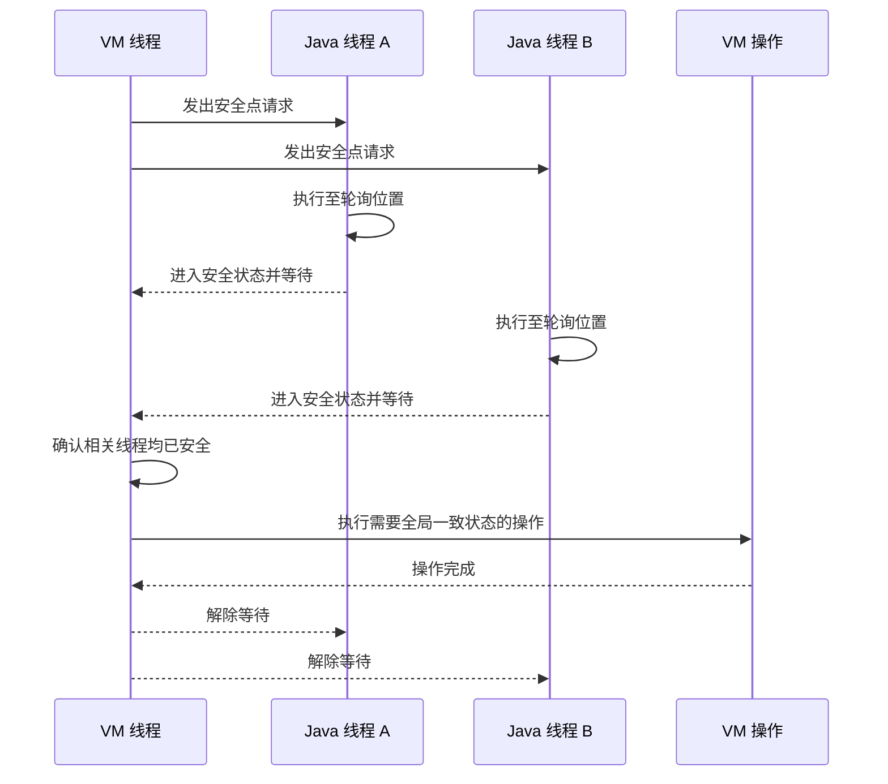

本文以 JDK 21 的 HotSpot JVM 为基线，沿着一次 VM 操作的执行过程说明安全点：JVM 先发出请求，各线程再进入可识别的安全状态；全部线程就绪后，JVM 执行需要全局一致性的操作，最后恢复线程。线程局部握手则是在不需要全局一致性时对这条流程缩小同步范围。安全点是 HotSpot 实现机制，不是 Java 虚拟机规范规定的统一实现。

## 从一次需要全局一致性的 VM 操作开始

垃圾回收的部分阶段、反优化、类重定义和部分运行时维护不能与 Java 线程任意交错。执行这些操作之前，HotSpot 必须先得到一个稳定窗口：相关 Java 线程不再修改需要检查的数据，线程栈保持稳定，JVM 也能确定栈和寄存器中的对象引用。

安全点（Safepoint）就是 HotSpot 为这种操作建立的协调状态。全局安全点形成后，所有相关 Java 线程都已停止执行 Java 代码，或者处于 HotSpot 能确认安全的状态，VM 操作才可以开始。

这里需要区分两个经常混用的概念：

- **全局安全点**是 JVM 最终达成的全局协调状态。
- **安全点轮询位置**是运行线程检查请求并转入安全状态的入口。

全局安全点不要求所有线程停在同一方法或同一条机器指令。每个线程可以停在不同位置，只要这些位置的执行状态都能被 HotSpot 准确解释。

## 第一步：让线程停在可解释的位置

JVM 收到全局操作请求后不能立即冻结任意机器指令。JIT 编译后的代码会把对象引用放在寄存器或线程栈中，执行中间状态也未必满足栈遍历、对象移动或代码替换的要求。若任意指令都允许暂停，JIT 就需要为几乎每条指令保存完整状态描述，同时让运行时处理更多临时状态。

HotSpot 的做法是在选定位置生成对象引用映射和恢复执行所需的元数据，并在部分位置加入安全点轮询。轮询过少会延长线程响应请求的时间，轮询过多则会增加正常路径上的指令、元数据和优化约束。

下面的代码展示几种常见代码形态。Java 源码中没有 `safepoint` 语句，注释只标出 HotSpot 可能建立安全点元数据、插入轮询或判定线程已经安全的位置。

```java
public class SafepointExamples {

    // 防止示例中的计算结果被当作无用结果直接删除
    private static volatile long result;

    public static void main(String[] args) throws InterruptedException {
        methodCallAndReturn();
        loopBackedge();
        blockedState();
    }

    private static void methodCallAndReturn() {
        // 方法调用点可以保留 GC 和反优化所需的状态信息
        result = calculate(42);

        // 编译后的方法返回路径可能包含安全点轮询
    }

    private static long calculate(long value) {
        return value * 2;
    }

    private static void loopBackedge() {
        long sum = 0;
        for (long i = 0; i < 100_000_000L; i++) {
            sum += i;

            // JIT 可能在循环回边插入安全点轮询
        }
        result = sum;
    }

    private static void blockedState() throws InterruptedException {
        // 阻塞线程可以被 HotSpot 判定为已经安全
        // 这不是业务代码主动执行了安全点轮询
        Thread.sleep(100);
    }
}
```

`calculate` 可能被 JIT 内联，循环也可能被展开或进行其他优化，因此源码不能直接决定最终轮询位置。解释执行时，HotSpot 可以在收到请求后切换到包含安全点检查的字节码分发表；Java、VM 与本地代码之间的部分状态转换也会检查请求。`Thread.sleep` 展示的是线程已经处于安全状态，而不是执行了一条安全点指令。

## 第二步：等待所有线程汇合到安全状态

确定可停位置后，HotSpot 发出安全点请求并等待所有相关线程响应。一次全局安全点的主流程如下：



运行 Java 代码的线程会在后续轮询中发现请求并等待；已经阻塞的线程可能本来就满足安全条件。正在执行本地代码的线程不一定立即停止，但在全局安全点结束前不能返回 Java 代码或进入会破坏安全条件的 JVM 路径。

VM 线程必须等到所有相关线程都已安全，才能进入下一步。这个过程是轮询和状态转换共同完成的协作式同步，不是操作系统在任意指令处强制冻结所有线程。

## 第三步：在稳定窗口内执行 VM 操作

全部线程汇合后，安全点提供了一个受控的全局观察与修改窗口。它主要承担三类工作：

1. **处理对象引用**：垃圾回收的部分阶段需要准确枚举线程栈和寄存器中的对象引用，并在 Java 代码不再任意修改它们时扫描或更新引用。
2. **检查或转换线程栈**：HotSpot 可以稳定遍历 Java 栈，执行部分诊断、反优化，以及安装类重定义产生的全局变更。
3. **维护共享运行时状态**：类元数据、编译代码和内联缓存等结构的部分修改需要避开 Java 线程的并发使用。

由此可以区分安全点、Stop-The-World 和 GC：安全点是 HotSpot 建立一致性窗口的机制；Stop-The-World 是 Java 代码整体暂停的现象；GC 是使用这个窗口的任务之一。全局安全点通常形成 Stop-The-World 窗口，但发生安全点不等于一定在执行 GC。G1、ZGC 等收集器也包含并发阶段，GC 并非全程停在安全点内。

安全点也不是普通 Java 锁。Java 锁保护应用数据，安全点协调的是 JVM 对线程执行状态和内部数据的全局操作。

## 第四步：结束操作并恢复线程

VM 操作完成后，HotSpot 撤销安全点请求并唤醒等待线程。每个线程从各自停止的位置继续执行。至此，一次全局安全点的主流程结束。

应用感知到的停顿不只包含第三步的 VM 操作，还包括：

1. 发出请求并等待线程进入安全状态。
2. 执行进入安全点时的清理工作。
3. 执行目标 VM 操作。
4. 解除安全点并恢复线程。

从发出请求到所有线程就绪的阶段通常称为到达安全点时间（Time to Safepoint，TTSP）。全局同步必须等待最慢的线程，因此线程调度、轮询位置和线程所处的 Java、VM 或本地代码状态都可能延长 TTSP。VM 操作耗时长与线程到达安全点慢是两类不同问题，不能把整段停顿统一归因于 GC。

JDK 21 可以使用 `-Xlog:safepoint=debug` 查看安全点日志，使用 `-Xlog:safepoint*=debug` 获取更多相关标签。日志中的同步时间、清理时间和 VM 操作时间可以帮助定位停顿发生在哪一步；具体字段可能随 JDK 版本变化。

## 不需要全局一致性时：线程局部握手

沿着上述主线可以看到，“等待所有线程就绪”是全局安全点的协调成本之一。如果一个操作只需要处理单个线程或彼此独立的线程局部状态，继续建立全局屏障会让无关线程参与等待。JDK 10 引入的线程局部握手（Thread-Local Handshake）用于缩小这个同步范围。

线程局部握手是 HotSpot 针对一个或一组内部 `JavaThread` 安排回调的机制。回调仍然只在线程处于安全点安全状态时执行，但 JVM 不需要先进入全局安全点。它是 JVM 内部能力，不是 Java 层可直接调用的线程 API。

局部握手与全局安全点复用相同的“请求—轮询—进入安全状态—执行—恢复”主线，但完成条件不同：

1. JVM 只为目标线程登记回调并设置局部轮询状态。
2. 目标线程到达轮询或相关状态转换时发现请求。
3. 回调由目标线程执行；若目标线程已经阻塞且状态允许，JVM 也可以在保持它阻塞的条件下代为执行。
4. 单个线程完成回调后即可恢复，不必等待其他目标线程。

因此，局部握手适合栈检查、安全栈采样、部分服务性诊断和按线程维护任务。即使一次握手选择全部线程，各线程也可以在不同时间完成回调并分别恢复。

| 对比项 | 全局安全点 | 线程局部握手 |
| --- | --- | --- |
| 同步范围 | 所有相关 Java 线程 | 一个、部分或全部目标线程 |
| 操作开始条件 | 所有相关线程均已安全 | 每个目标线程分别达到安全条件 |
| 恢复条件 | 全局操作完成后统一恢复 | 单个线程完成自己的回调后即可恢复 |
| 一致性 | 可以建立全局一致窗口 | 默认不提供同一时刻的全局原子快照 |

局部握手缩小了停顿范围，但没有消除成本：

- 线程需要维护局部请求状态，相关轮询也会产生正常执行开销。JEP 312 将标准基准额外开销不超过 1% 设为设计目标，这不是所有程序和硬件上的固定上限。
- 回调执行期间，目标线程仍然暂停；目标线程未被调度或迟迟未到达安全状态时，握手仍会等待。
- 面向全部线程的握手仍需执行与线程数量相关的回调，只是不再要求所有目标线程同时汇合并统一恢复。
- 各线程在不同时间执行回调，因此不能用它替代需要同时固定堆、全部线程栈或全局元数据的安全点操作。
- 回调越长、锁依赖越复杂，越可能抵消局部握手的延迟收益。

选择全局安全点还是局部握手，取决于目标操作是否需要全局一致性。能拆成独立线程步骤的操作可以使用局部握手；必须建立统一观察与修改窗口的操作仍需全局安全点。

## 总结

安全点贯穿的是一条完整的 VM 操作路径：JVM 发出请求，线程在可解释的位置响应，VM 线程等待全部线程安全，随后执行需要全局一致性的操作，最后解除请求并恢复线程。安全点的作用不是单纯“让线程停下”，而是让 JVM 在已知线程状态和对象引用位置的前提下安全地观察或修改全局状态。

全局安全点的停顿由线程汇合、清理、VM 操作和恢复共同组成。若任务不需要全局一致性，线程局部握手可以沿用同一套安全状态基础设施，只协调目标线程；它减少全局等待，但不提供全局原子快照，也不消除逐线程处理成本。

## 参考资料

- [OpenJDK：HotSpot Runtime Overview](https://openjdk.org/groups/hotspot/docs/RuntimeOverview.html)
- [OpenJDK：HotSpot Glossary of Terms](https://openjdk.org/groups/hotspot/docs/HotSpotGlossary.html)
- [OpenJDK JEP 312：Thread-Local Handshakes](https://openjdk.org/jeps/312)
- [OpenJDK 21：SafepointSynchronize 实现](https://github.com/openjdk/jdk21u/blob/master/src/hotspot/share/runtime/safepoint.cpp)
- [OpenJDK 21：Handshake 实现](https://github.com/openjdk/jdk21u/blob/master/src/hotspot/share/runtime/handshake.cpp)
- [OpenJDK 21：C2 SafePointNode 与 CallNode](https://github.com/openjdk/jdk21u/blob/master/src/hotspot/share/opto/callnode.hpp)
- [Oracle JDK 21：java 命令与统一日志](https://docs.oracle.com/en/java/javase/21/docs/specs/man/java.html)
