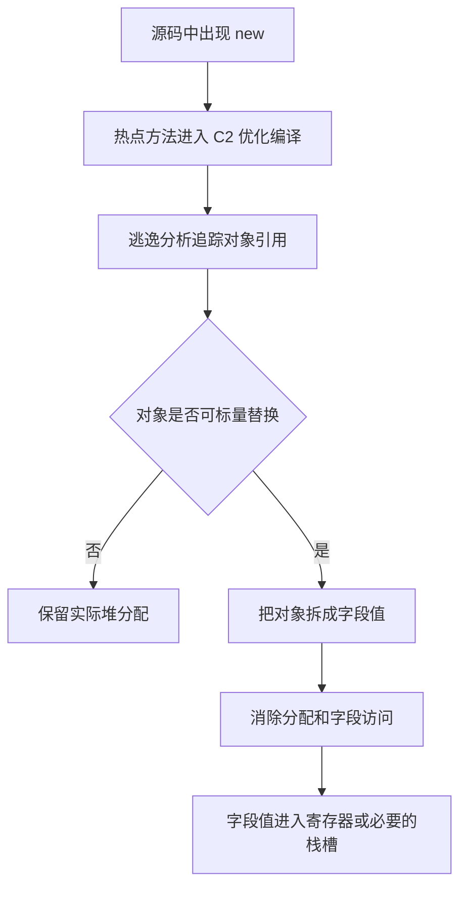

本文以 JDK 17 和 JDK 21 的 HotSpot Server VM 为前提，解释通常所说的“栈上分配”。这个名称容易让人以为 JVM 会把完整对象从堆搬到线程栈，但 HotSpot C2 的真实做法是逃逸分析、标量替换与分配消除的组合。

## 先给出结论

在 HotSpot C2 中，“栈上分配”通常不是一种真实的对象分配方式，而是对以下优化过程的概括：

1. 逃逸分析判断对象引用能否逃出当前方法或线程。
2. 对象未逃逸且满足其他条件时，标量替换把对象拆成若干字段值。
3. 分配消除删除对象分配以及相关字段访问。
4. 拆出的字段值最终可能位于 CPU 寄存器或原生栈槽中。

优化之后，通常不再存在对象头、连续字段布局和可供其他代码持有的对象地址。对象并不是从堆“搬”到栈上，而是根本没有作为一个独立的内存实体被创建。

这项优化可以减少堆分配和垃圾回收压力，但优化是否发生由运行时编译结果决定，无法通过源码中的对象作用域直接保证。

## `new` 为什么不一定产生堆对象

Java 源码中的 `new` 定义的是程序语义：创建一个具有指定类型和状态的对象。只要保持程序的可观察行为不变，JIT 编译器就可以用其他机器码实现相同的语义。

如果一个对象只在当前方法内使用，外部代码拿不到它的引用，也无法观察它的身份，那么程序可能只依赖对象的字段值。此时，JIT 编译器可以直接保存和计算这些值，不必为对象分配堆内存。

逃逸分析负责判断引用可能传播到哪些作用域。HotSpot C2 使用的主要逃逸状态包括：

| 状态 | 含义 | 典型情况 |
| --- | --- | --- |
| `NoEscape` | 引用没有逃出当前分析范围，对象可能被标量替换 | 仅在当前方法中创建、读写和使用 |
| `ArgEscape` | 引用被传给调用，但分析认为它不会全局逃逸 | 作为参数传入编译器能够分析的方法 |
| `GlobalEscape` | 引用可能被当前方法或线程之外的代码持有 | 被返回、写入静态字段或写入已逃逸对象 |

`NoEscape` 表示对象具备进一步优化的可能性，不表示分配一定会被消除。

## 分配消除是怎样发生的

逃逸分析发生在 JIT 编译阶段，而不是 `javac` 编译阶段。程序启动后，HotSpot 会根据运行时信息选择热点方法进行优化编译，C2 再根据编译时可见的调用关系和对象用法决定是否消除分配。



### 逃逸分析

编译器在中间表示上追踪对象引用的创建、传递和使用。引用被返回、写入静态字段，或者写入一个已经逃逸的对象时，编译器通常必须认为该对象可能被外部代码访问。

HotSpot C2 的逃逸分析是流不敏感的。即使对象只在某条低概率分支上逃逸，分析也可能保守地认为对象在整个方法中都逃逸。这种保守判断保证了正确性，代价是放弃部分理论上可行的优化。

### 标量替换

标量替换把聚合对象拆成若干独立值。例如，一个对象只包含 `x` 和 `y` 两个整数时，编译器可以用两个整数值替代对象，并把字段读写转换成对这两个值的操作。

方法内联通常是标量替换的重要前提。如果构造器、访问器或接收对象的方法没有内联，调用边界可能阻止编译器看清对象的完整用途。

### 分配消除与重新物化

对象操作全部被替换后，分配节点和相关字段访问可以从生成代码中删除。后续寄存器分配会决定各字段值位于寄存器还是原生栈槽。

如果编译时的假设在运行时失效，HotSpot 可能把优化代码切换回解释执行或较低层级的代码，这个过程称为去优化（deoptimization）。对于去优化时仍应存在的标量替换对象，运行时可以根据保存的字段状态重新物化出对象，以保持 Java 语义。

## 一个最小示例

```java
final class Point {
    private final int x;
    private final int y;

    Point(int x, int y) {
        this.x = x;
        this.y = y;
    }

    int sum() {
        return x + y;
    }
}

static int calculate(int x, int y) {
    Point point = new Point(x, y);
    return point.sum();
}
```

当构造器和 `sum()` 被内联，且 `point` 能够被标量替换时，优化结果可能等价于：

```java
static int calculate(int x, int y) {
    return x + y;
}
```

源码中的 `new Point(...)` 仍然定义对象创建语义，但优化后的机器代码可以不执行实际分配。这个示例只表示一种可能结果，不能证明任意一次调用都会消除对象。

## 为什么减少一次分配仍有价值

### TLAB 让普通堆分配已经很快

TLAB（Thread-Local Allocation Buffer，线程本地分配缓冲区）是 HotSpot 从 Java 堆中划给当前线程的一小段分配区域。它不是线程栈，也不是独立于堆的内存区域；在常见的分代收集器中，它通常位于年轻代的 Eden 区。

线程在自己的 TLAB 中分配对象时，通常只需移动分配指针并检查是否越界，不必和其他线程争用同一个堆分配指针。当前 TLAB 无法容纳对象时，线程可能申请新的 TLAB 或进入较慢的分配路径；部分较大对象也可能直接在 TLAB 外分配。

无论对象位于 TLAB 内还是 TLAB 外，它都是普通堆对象，仍由垃圾收集器管理。TLAB 优化的是并发分配过程，不改变对象属于堆的事实。

### 分配消除减少后续工作

小对象的 TLAB 分配本身通常并不昂贵，因此分配消除的收益不能简单概括为“避免了一次昂贵的 `new`”。它还会减少：

- 对象头和字段的内存初始化；
- TLAB 和年轻代空间的消耗；
- 垃圾收集器需要扫描、复制或回收的对象；
- 可以被标量值替代的字段内存访问。

当短生命周期临时对象的数量很大时，分配率下降还可能减少因分配压力触发的年轻代回收；反过来，如果对象数量较少，或者应用瓶颈不在分配和 GC 上，吞吐量与延迟未必出现可测变化。

逃逸分析还可以服务于锁消除：如果对象不可能被其他线程访问，编译器可能删除不会发生竞争的同步操作。需要说明的是，锁消除和分配消除是两种相互独立的后续优化，对象未逃逸不代表两者一定同时发生。

## 哪些情况会阻止优化

以下情况可能使对象不能被标量替换：

- **引用向外传播**：对象被返回、写入静态字段、写入外部对象字段或交给其他线程。
- **调用关系不可分析**：对象被传入未内联的方法、复杂虚调用或编译器无法充分分析的代码。
- **控制流存在逃逸路径**：流不敏感分析可能因为任一分支存在逃逸而放弃整个对象的优化。
- **需要保留对象身份**：身份哈希、对象监视器或其他需要物化对象身份的操作可能限制标量替换。
- **对象结构或访问方式复杂**：对象或数组过大，或者中间表示不能证明各字段可以独立替换。
- **没有进入 C2 优化编译**：冷代码、预热不足、编译被排除或只执行较低层级代码时，不会得到相同结果。

优化结果还会受 JDK 版本、JVM 实现、启动参数、方法内联决策和运行时类型画像影响。逃逸分析不是 Java 语言层面的保证，也不能用于控制对象生命周期。

## 是否存在问题或风险

### 不应改变程序语义

在实现正确的 JVM 中，逃逸分析、标量替换和锁消除必须保持 Java 程序的可观察行为。对象状态丢失、同步语义被破坏或数据竞争被引入，都不是这项优化可以接受的副作用。

真正的风险主要来自应用对优化结果形成了不可靠的性能依赖。

| 风险 | 可能后果 | 应对方式 |
| --- | --- | --- |
| 依赖特定 JDK、内联或类型画像下的分配消除 | 升级 JDK、修改代码或流量变化后，分配率和 GC 压力回升 | 在目标 JDK 和真实负载上持续测量 |
| 去优化时需要转换栈帧并重新物化存活对象 | 特定路径产生额外分配和执行开销，可能影响尾延迟 | 延迟异常时同时检查去优化、编译和分配数据 |
| 按“对象一定被消除”进行容量规划 | 冷启动或优化失效时，实际分配量超过估算 | 使用保守场景确定堆和 GC 余量 |
| 为避免逃逸而手工拆对象或复制逻辑 | 可读性和维护成本上升，后续修改仍可能使优化失效 | 先保持清晰语义，只优化已确认的热点 |

### 会不会耗尽 JVM 栈空间

对于本文讨论的 HotSpot C2，标量替换不会按原对象大小在 JVM 栈中分配完整对象，因此不会因为大量非逃逸对象被优化，就直接引入 JVM 栈空间不足。

拆出的字段值可能因寄存器不足等原因进入原生栈槽，但这和保存其他编译临时值相同，不等于为每个对象保留对象头和完整字段布局。

还需要区分两类异常：

- 线程计算需要的栈空间超过允许上限时，JVM 通常抛出 `StackOverflowError`。
- JVM 采用可动态扩展的栈，但扩展时无法获得内存，或者创建新线程时无法建立初始栈，JVM 规范允许抛出 `OutOfMemoryError`。

例如，大量线程配合较大的 `-Xss` 可能耗尽进程可用内存并导致新线程创建失败，但这属于线程栈和原生内存容量问题，与逃逸分析和分配消除无关。

其他 JVM 如果实现了真正的完整对象栈上分配，则需要按该实现的文档重新评估栈空间边界，不能直接套用 HotSpot 的结论。

## 如何观察和验证

验证分配消除需要分别回答三个问题：方法是否进入 C2 优化编译、实际堆分配是否下降、目标分配是否从中间表示或机器代码中消失。

JFR、JDK Mission Control 或分配分析器可以观察分配热点和分配速率，但采样事件可能漏掉单次分配。“没有采样到”不能单独证明对象已经被消除。GC 日志只反映总体分配和回收结果，也不能把变化直接归因于某个 `new`。

诊断时可以对比启用和禁用逃逸分析的运行结果，但 JVM 选项属于具体实现，而且关闭逃逸分析会同时影响多项编译优化。这种对比只能作为证据之一，不能单独证明某个对象发生了标量替换。

需要确认编译器决策时，可以检查 C2 中间表示、理想图或生成的机器代码。部分打印逃逸分析和分配消除细节的选项只存在于特定 HotSpot 构建中，不能假定普通发行版均可使用。

微基准需要充分预热，并使用 JMH 等工具控制死代码消除、常量折叠和重复执行误差。手写循环中的耗时差异可能来自内联或常量传播，不能直接解释为栈上分配收益。

## 结论

HotSpot C2 中所谓的“栈上分配”，本质上通常是逃逸分析支持的标量替换和分配消除，而不是真实的完整对象栈分配。它可以降低堆分配率和垃圾回收压力，并为字段访问优化和锁消除创造条件。

这项优化由运行时编译器决定，不能通过源码形态保证，也不应成为容量规划的必要前提。它不会因为被优化对象数量增加而按对象大小消耗 JVM 栈空间；栈空间不足导致的 `StackOverflowError` 或线程创建失败导致的 `OutOfMemoryError` 属于另一类资源问题。

业务代码应优先保证语义清晰与可维护性，再通过基准测试、分配分析和编译器诊断确认具体的优化结果。

## 参考资料

- [Java Virtual Machine Guide：Escape Analysis](https://docs.oracle.com/en/java/javase/21/vm/java-virtual-machine-guide.pdf)
- [Java Virtual Machine Specification：Java Virtual Machine Stacks](https://docs.oracle.com/javase/specs/jvms/se21/html/jvms-2.html#jvms-2.5.2)
- [OpenJDK：HotSpot Escape Analysis and Scalar Replacement Status](https://cr.openjdk.org/~cslucas/escape-analysis/EscapeAnalysis.html)
- [OpenJDK HotSpot Compiler：C2 Partial Escape Analysis RFC](https://mail.openjdk.org/pipermail/hotspot-compiler-dev/2021-May/047536.html)
- [OpenJDK：标量替换对象的重新物化](https://bugs.openjdk.org/browse/JDK-8287061)
- [OpenJDK HotSpot：Deoptimization](https://wiki.openjdk.org/display/HotSpot/PerformanceTechniques)
- [OpenJDK HotSpot 术语表：TLAB](https://openjdk.org/groups/hotspot/docs/HotSpotGlossary.html)
- [OpenJDK：ObjectAllocationSample JFR Event](https://bugs.openjdk.org/browse/JDK-8262902)
