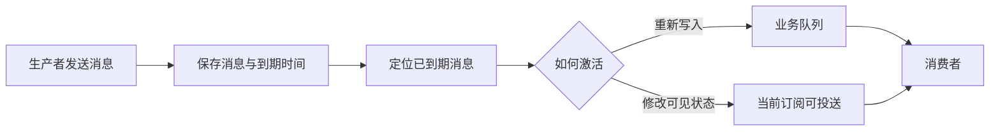
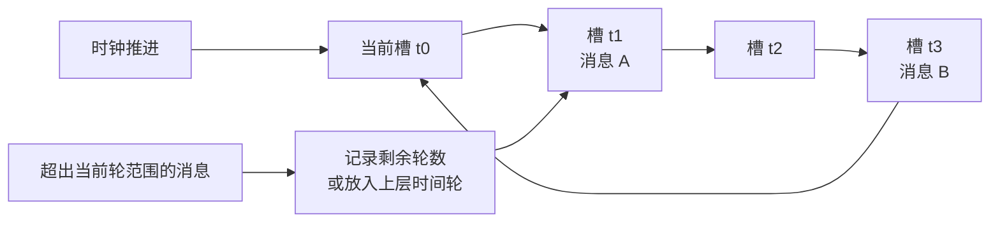

生产者发送延迟消息时，会同时指定延迟时长或到达时间。消息先被保存，等到期后再进入普通投送路径。本文沿着这条路径，说明固定延迟等级、TTL 与死信、有序时间索引、时间轮和外部调度器如何让消息等待，并比较它们对精度、存储、顺序和故障恢复的影响。

文中的产品行为以 2026 年 8 月仍可核验的版本为准：RabbitMQ 4.3.5、RocketMQ 5.5.0、Pulsar 4.2.4，以及 Amazon SQS 当时公开的服务文档。RocketMQ 4.x 只用于说明固定延迟等级这一历史实现。云服务未公开内部数据结构时，本文只讨论其对外行为。

## 一条延迟消息如何到达消费者

生产者发出消息后，系统会同时保存消息和到期时间，并在到期前对普通消费者隐藏它。接下来，系统按固定节拍推进调度，或者直接查找最早到期的记录。消息到期后，系统可能把它重新写入业务队列，也可能只把它改成可投送状态。此后，消费者就可以像处理普通消息一样处理它。



这五类机制解决的并不是同一个问题。固定等级和 TTL 决定消息等待时走哪条队列；有序索引和时间轮负责找到已经到期的消息；外部调度器则把整个等待过程移到消息队列之外。它们可以组合使用，例如先用时间索引保存到期顺序，再用时间轮触发检查，最后把消息重新写入业务队列。

这里的“到期”只表示消息可以开始投送，不表示消费者会在这一刻准时收到。调度周期、同一时刻到期的消息数量、Broker 负载、网络延迟和消费积压，都会让实际到达时间继续向后偏移。下面几种方案的差别，很大一部分就来自这些等待发生在哪里。

## 固定延迟等级：把时间分档

最直接的做法是预先定义一组延迟时长，例如 1 秒、10 秒、1 分钟和 10 分钟。生产者不能指定任意时间，只能选择其中一个等级。Broker 为每个等级维护独立的等待队列或逻辑分区。同一等级的延迟相同，因此消息按写入顺序排列时，到期时间也自然保持递增。

调度器顺序扫描每个等级，到期后恢复消息原来的 Topic 或队列，再写入普通存储。这种方式不需要维护全局时间排序，但只能表达已经配置好的等级。等级越多，需要维护的队列、扫描进度和调度任务也越多。

RocketMQ 4.x 是这一方案的代表。官方文档定义了 18 个等级，范围从 1 秒到 2 小时。源码把这些等级映射为系统调度 Topic 中的不同队列，并分别保存扫描进度。消息到期后，Broker 恢复它原来的 Topic 和队列，再将其写回普通消息存储。

重新写回业务队列会带来一个一致性问题：消息已经写入，但扫描进度尚未持久化，故障恢复后可能再次写入；反过来，如果先推进进度，进程又可能在真正写入前崩溃。实现通常会在写入成功后才推进进度，但下游仍应通过幂等处理重复消息。

固定等级适合延迟值少且稳定的场景，例如按固定间隔重试。若业务需要任意到达时间，继续增加等级只是在用更多配置逼近连续时间，调度状态也会随之膨胀。

## TTL 与死信：把过期变成投送

另一种常见做法是复用消息过期机制。消息先进入等待队列，TTL 到期后再由死信交换机发布到业务队列。TTL 本身只表示消息可以在队列中保留多久，只有配合死信路由，才形成完整的延迟投送链路。

```text
生产者 -> 等待队列（TTL） -> 死信交换机 -> 业务队列 -> 消费者
```

固定延迟通常为每种时长建立一条等待队列，并在队列级配置统一 TTL。由于同一队列中的消息具有相同 TTL，写入顺序也就是到期顺序，Broker 只需从队头处理。问题出现在一条队列混用不同 TTL 时：短 TTL 消息可能排在尚未到期的长 TTL 消息之后。RabbitMQ 的经典队列和仲裁队列都要等过期消息到达队头后才执行死信处理，所以后面的消息即使已经过期，也不会立即转发。

消息 TTL 和队列 TTL 也不是一回事。消息 TTL 到期可以触发死信；整条队列自身过期时，队列里的消息不会因此被死信转发。

死信处理本质上仍是一次重新发布。RabbitMQ 默认不会为这次内部发布启用 publisher confirms。原消息从源队列移除后，如果目标队列无法接收，消息可能丢失。仲裁队列可以配置至少一次死信，但需要满足相应的队列和策略条件。因此，TTL 加死信并不天然等于可靠定时器，它的可靠性仍取决于源队列类型、死信策略和目标队列状态。

RabbitMQ 曾提供 `x-delayed-message` 延迟交换插件，但项目已于 2026 年 4 月归档并停止维护。插件只在当前节点保存一个磁盘副本，也不适合大量或长期延迟消息；RabbitMQ 4.3 移除 Mnesia 后，它原有的存储设计也不再适用。因此，当前开源 RabbitMQ 不应再把该插件作为默认选择。

## 有序时间索引：直接找到下一条到期消息

固定档位无法表达任意到达时间。要支持任意时间点，系统可以把 `到期时间 -> 消息位置` 组织成有序结构。最小堆、有序树或持久化有序键都可以承担这个角色：消息写入时登记到期时间，调度器每次取出最早的记录；尚未到期就继续等待，已经到期就移除记录并激活消息。

消息体和时间索引不必放在一起。常见做法是把消息体写入顺序日志，索引只保存消息 ID 或物理位置。这样可以减小索引体积，却把压力转移到了故障恢复：索引是否持久化、能否从消息日志重建，以及索引记录能否与消息删除进度保持一致，都需要单独处理。

Pulsar 4.2.4 就采用了这种分层。消息保存在 BookKeeper 中，订阅侧的 `DelayedDeliveryTracker` 维护 `到期时间 -> messageId` 索引。这项能力只适用于 Shared 和 Key_Shared 订阅，其他订阅类型会立即分发延迟消息。长时间未到期的消息还可能阻止 Topic 前部 Ledger 被删除，并触发 backlog quota；如果 backlog TTL 先到期，消息会被视为已经确认，不再等待原定投送时间。

索引放在内存中，读写路径较短，但 Broker 重启后需要重建；索引持久化后，恢复时不必扫描全部消息，却会增加写放大和索引维护成本。如果业务还要取消消息或修改到达时间，系统必须能根据消息 ID 找到旧记录。只有时间排序而没有反向索引时，这类修改并不便宜。

Amazon SQS 对外提供的是“先隐藏、后可见”的行为：单条标准队列消息最多可以隐藏 15 分钟，FIFO 队列不支持单条消息计时器。AWS 没有公开内部使用时间索引还是时间轮，因此不能仅凭接口行为推断其数据结构。

## 时间轮：按时间槽推进

有序索引始终维护完整的时间顺序。当待调度消息很多时，还可以换一种思路：把时间轴切成固定宽度的槽位，让消息按照到期时间落入对应槽中。指针每经过一个时钟刻度就前进一格，只处理当前槽里的消息。槽位宽度决定基础精度，槽内消息数量则决定这一刻的处理压力。



单层时间轮能覆盖的范围是 `槽位数 × 槽位宽度`。超出这一范围的消息，可以记录还需等待多少轮，也可以进入上层时间轮。多级时间轮的上层槽位更粗，等到到期时间接近，再把消息下沉到更细的层级。经典时间轮论文给出了哈希轮和层级轮的设计，并说明在轮覆盖范围内，启动、停止和维护定时器可以采用常数级操作；放到消息系统中，还要额外考虑槽内遍历、持久化和恢复成本。

RocketMQ 5.x 已从固定等级扩展到任意投送时间。以 5.5.0 的文件型实现为例，Broker 先用系统定时 Topic 保存待处理消息，再由 `TimerWheel` 定位时间槽、`TimerLog` 保存槽内记录、`TimerCheckpoint` 保存恢复进度。消息到期后会被写入普通存储，随后才对消费者可见。

RocketMQ 使用毫秒时间戳表示到达时间，但默认调度粒度是 1000 毫秒，默认允许的未来时间范围为 24 小时。如果大量消息集中在同一时刻到期，Broker 仍要逐条激活它们，因此官方也建议避免设置相同的到达时间。时间轮降低了定位到期消息的成本，却无法消除到期峰值。

时间索引和时间轮并不冲突。Pulsar 的 `DelayedDeliveryTracker` 用时间索引记录待投送消息，默认内存实现则用 HashedWheelTimer 定时唤醒检查，tick 默认为 1 秒。非严格模式允许消息最多提前一个 tick；严格模式不会提前，但可能晚于目标时间。这正好说明，记录“哪些消息即将到期”和决定“调度器何时醒来”是两个不同的问题。

## 外部调度器：到期后再次投送

有些需求已经超出消息队列内置延迟能力的范围，例如等待数月、取消或修改任务，以及支持日历和周期规则。这时可以把调度状态放到外部存储中。生产者写入包含 `due_at`、状态和稳定业务 ID 的任务，调度 Worker 领取已经到期的任务，再向普通消息队列发送业务消息。

```text
业务写入 -> 调度存储 -> Worker 领取到期任务 -> 普通消息队列 -> 消费者
```

外部调度器的关键问题不是查找时间，而是“发送消息”和“完成任务”通常不在同一个本地事务中：

- 先把任务标记为完成，再发送消息，进程在两步之间崩溃会丢失投送。
- 先发送消息，再把任务标记为完成，进程在两步之间崩溃会重复投送。

工程上通常选择第二种，并把系统设计成至少一次投送：Worker 通过租约领取任务，发送成功后再完成任务；租约超时的任务可以被重新领取；每次发送都携带稳定业务 ID，由下游按这个 ID 做幂等。业务数据和调度任务需要同时创建时，可以放进同一个数据库事务，或者使用 Outbox 记录创建动作。不过，从调度存储发布到消息队列的步骤依然需要重试和幂等。

外部调度器仍然可以使用有序索引或时间轮。常见组合是“长期存储 + 近期时间轮”：远期任务留在持久化索引中，进入近期窗口后再装入内存时间轮。这样可以同时控制恢复成本和内存占用，代价是还要维护任务从远期索引迁移到近期时间轮的进度。

SQS 的队列延迟和单条消息计时器最长都只有 15 分钟。对于更灵活的调度，AWS 明确建议使用 EventBridge Scheduler。它采用的正是这种模式：定时状态交给外部调度服务，到期后再调用 SQS。

## 为什么不让消费者自己等待

让消费者取得消息后直接休眠，看起来可以省掉调度器，但等待状态也随之离开了 Broker。先确认消息再等待，进程崩溃会丢失任务；等休眠结束再确认，期间一旦连接中断、确认超时或消费者重启，Broker 又会重新投送消息。

如果队列还有顺序要求，一条尚未到期的消息还可能挡住后面本可立即处理的消息。把消息暂存在消费者内存中，也无法应对进程迁移或重启。另一种做法是不断拒绝并重新入队，但这会增加网络和存储操作，实际到达时间也会被重投间隔左右。

因此，只有在消息量较小、等待时间很短、允许阻塞后续消息，并且能够接受故障后重试时，才适合让消费者自己等待。它不能替代持久化的长期调度状态。

## 五类机制如何比较

下表比较的是不同层级的构件，而不是五套互斥的完整方案。它们是否需要二次写入，取决于消息到期后是直接变为可见，还是要重新发布到业务队列。

| 机制 | 解决的问题 | 时间表达能力 | 到期定位成本 | 常见额外成本 | 主要限制 |
| --- | --- | --- | --- | --- | --- |
| 固定延迟等级 | 等待消息如何分组 | 预定义离散时长 | 按等级顺序扫描 | 到期后二次写入 | 等级数量有限 |
| TTL 与死信 | 如何借助过期触发路由 | 队列统一 TTL 或单消息 TTL | 通常受队头推进影响 | 死信重新发布 | 混合 TTL 可能延后转发，需处理死信可靠性 |
| 有序时间索引 | 如何找到最早到期消息 | 任意时间点 | 维护时间排序并读取最小值 | 索引持久化或重建 | 大规模索引、取消和恢复成本 |
| 时间轮 | 如何批量推进大量定时器 | 由槽位和层级覆盖 | 每个 tick 处理当前槽 | 槽内遍历、日志与检查点 | 精度受 tick 约束，到期峰值仍会积压 |
| 外部调度器 | 谁持有等待状态 | 由调度系统决定 | 可组合索引和时间轮 | 额外服务与二次投递 | 跨系统一致性和运维复杂度 |

落实到具体产品时，这些构件通常会组合出现：

| 产品与版本 | 对外投送方式 | 已公开的关键实现或限制 |
| --- | --- | --- |
| RocketMQ 4.x | 固定延迟等级，到期后二次写入 | 18 个默认等级，调度 Topic 按等级分队列 |
| RocketMQ 5.5.0 | 指定到达时间，到期后进入普通存储 | 文件型实现包含 TimerWheel、TimerLog 和检查点；官方默认粒度 1 秒、范围 24 小时 |
| RabbitMQ 4.3.5 | TTL 到期后通过 DLX 重新发布 | 不同单消息 TTL 可能受队头阻塞；开源延迟交换插件已停止维护 |
| Pulsar 4.2.4 | 消息保留在 BookKeeper，到期后对订阅可投送 | DelayedDeliveryTracker 保存时间索引，默认内存实现使用 HashedWheelTimer；仅支持 Shared、Key_Shared |
| Amazon SQS | 延迟期间消息不可见，到期后可接收 | 单条消息计时器最长 15 分钟且不支持 FIFO；内部调度结构未公开 |

## 如何选择

如果延迟时长只有少量固定档位，分层队列就能直接表达业务规则，调度状态也容易观察。在 RabbitMQ 中使用 TTL 加死信时，最好让同一等待队列中的消息具有相同 TTL，并单独评估死信重新发布的可靠性。

需要任意到达时间，而且待调度消息很多时，可以优先使用 Broker 已经提供并持久化的时间索引或时间轮。同时要核对三个限制：最长延迟时间、默认调度粒度，以及大量消息集中到期时的处理能力。接口使用毫秒时间戳，并不代表消费者能获得毫秒级的准时到达。

如果任务需要等待数周或数月，还要支持取消、修改、周期规则或跨系统统一调度，外部调度器更符合这种数据模型。它会增加组件数量，也要求系统围绕至少一次投送设计租约、重试和幂等。

业务同时要求严格顺序和任意延迟时，还要先明确顺序以什么时间为准。按生产顺序投送，先发送的长延迟消息会挡住后续消息；按到期时间投送，又会主动改变生产顺序。把时间轮做得更精细，也无法同时满足这两个目标。

无论采用哪种实现，延迟消息都会经过保存、等待、定位到期记录和激活投送。固定等级与 TTL 决定等待消息如何排队，有序索引与时间轮决定如何找到到期消息，外部调度器决定由谁保存这部分状态。选择方案时，应关注延迟范围、允许误差、消息规模、顺序要求和故障恢复，而不是只看产品是否提供了一个延迟消息 API。

## 参考资料

- [RocketMQ 4.x 延迟消息](https://rocketmq.apache.org/docs/4.x/producer/04message3/)
- [RocketMQ 5.x 延迟消息](https://rocketmq.apache.org/docs/featureBehavior/02delaymessage/)
- [RabbitMQ TTL 与消息过期](https://www.rabbitmq.com/docs/ttl)
- [RabbitMQ 死信交换机](https://www.rabbitmq.com/docs/dlx)
- [RabbitMQ 延迟交换插件状态](https://github.com/rabbitmq/rabbitmq-delayed-message-exchange/blob/main/README.md)
- [Pulsar 4.2 延迟投送](https://pulsar.apache.org/docs/4.2.x/concepts-messaging/#delayed-message-delivery)
- [Amazon SQS 延迟队列与消息计时器](https://docs.aws.amazon.com/AWSSimpleQueueService/latest/SQSDeveloperGuide/sqs-delay-queues.html)
- [Hashed and Hierarchical Timing Wheels](https://www.cs.columbia.edu/~nahum/w6998/papers/sosp87-timing-wheels.pdf)
