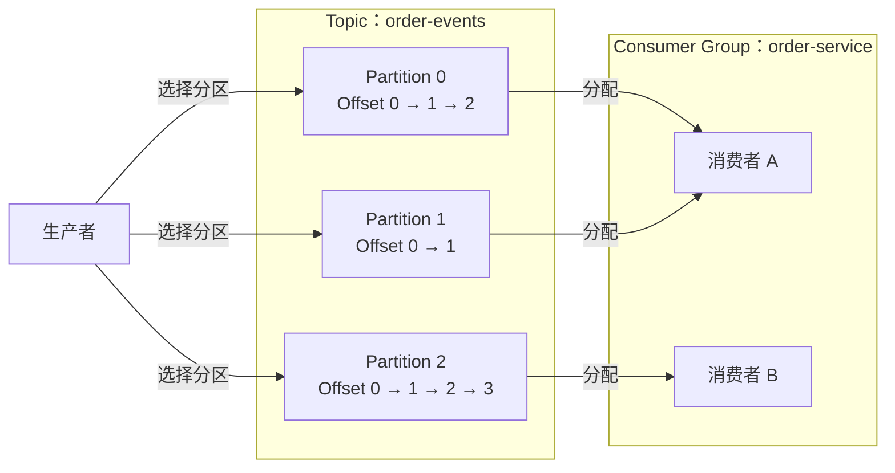

Kafka 使用 Topic 对消息进行逻辑分类，再把每个 Topic 拆成一个或多个 Partition。Topic 决定生产者和消费者在处理哪一类数据，Partition 则是数据存储、复制和并行处理的基本单位。本文以 Apache Kafka 4.3 为版本前提，说明二者的定义、作用以及它们对消息顺序和消费并行度的影响。

## Topic 是消息的逻辑分类

Topic 是一组相关消息的逻辑名称。例如，订单系统可以把订单状态变化写入 `order-events`，把支付结果写入 `payment-events`。生产者向指定 Topic 发送消息，消费者订阅 Topic 并读取其中的数据。

Topic 主要承担三个作用：

1. **划分业务数据**：不同类型的事件使用不同 Topic，生产者和消费者通过 Topic 名称建立数据契约。
2. **隔离消费关系**：一个 Topic 可以由多个 Consumer Group 独立消费，各组维护自己的消费进度，互不推进对方的进度。
3. **承载管理策略**：保留时间、日志压缩、分区数和副本因子等配置以 Topic 为管理入口。

Topic 不是一条“消息被取走后就消失”的内存队列。消息是否保留由 Topic 的保留或压缩策略决定，而不是由某个消费者是否已经读取决定。因此，同一批数据可以被不同 Consumer Group 读取，也可以在仍处于保留范围时重新读取。

## Partition 是 Topic 的有序分片

每个 Topic 至少包含一个 Partition。Partition 可以理解为一段持续追加的日志：新消息写到末尾，并获得一个 Offset。Offset 是消息在所属 Topic-Partition 内的位置标识，不是跨 Partition 或跨 Topic 的全局编号。

例如，`order-events` 有三个 Partition：

- `order-events-0`
- `order-events-1`
- `order-events-2`

三个 Partition 都属于同一个 Topic，但分别维护自己的数据和 Offset。Partition 0 中的 Offset 10 与 Partition 1 中的 Offset 10 没有先后关系，也不是同一条消息。

Offset 通常递增，但不能假定一定连续。日志压缩和事务消息等机制都可能让消费者观察到 Offset 间隙。消费进度同样以 Topic-Partition 为维度保存；准确描述一条消息的位置需要同时给出 Topic、Partition 和 Offset。

## Topic、Partition 与消费者的关系

下面的 Topic `order-events` 有三个 Partition。生产者先为消息选择一个 Partition；在使用动态订阅的 Consumer Group 中，每个 Partition 同一时刻只会分配给组内一个消费者。

图中的分配不是永久绑定。当消费者加入、退出或失效，或者 Topic 增加 Partition 时，Consumer Group 会重新分配 Partition。重新分配后，一个 Partition 可以转交给另一个消费者继续处理。

Topic 提供统一的业务入口，Partition 把这个入口背后的数据和负载拆开。两者不能互相替代：只有 Topic 而没有分区无法形成 Kafka 的分布式日志；应用也不能只使用 Partition 编号定位数据，因为 Partition 编号只在所属 Topic 内有意义。

## Partition 的核心作用

### 拆分存储与读写负载

一个 Partition 的副本分布在 Broker 上，一个 Topic 的不同 Partition 可以分布到不同 Broker。生产者和消费者因而能够同时访问多个 Partition，使 Topic 的存储容量和读写负载不必集中在单个 Broker 上。

分区数只是并行能力的上限之一，并不等于吞吐量一定按分区数线性增长。实际吞吐量还受消息大小、批处理、磁盘和网络能力、Broker 数量、复制开销以及消费者处理速度影响。如果多个 Partition 的 Leader 集中在同一 Broker，增加 Partition 也不会自动获得相同倍数的硬件资源。

### 提供可控的局部顺序

Kafka 保证的是 **Topic-Partition 内的日志顺序**，不是整个 Topic 的全局顺序。写入同一 Partition 的消息按日志位置排列，消费者从该 Partition 读取时也按该顺序取得消息。不同 Partition 各自推进，无法仅凭 Offset 比较全局先后。

如果业务要求同一订单的事件保持顺序，可以使用订单 ID 作为 Key，使同一订单的消息在分区数和分区策略不变时进入同一 Partition。这个设计保留了订单内部的顺序，同时允许不同订单分布到多个 Partition 并行处理。

分区内有序也不自动等于业务处理结果有序。消费者如果把同一 Partition 的消息交给多个工作线程并发处理，后收到的消息仍可能先完成。此时需要在应用层按 Partition 串行处理，或建立能够保持相同 Key 顺序的调度机制。

### 构成消费并行度的分配单位

使用 `subscribe` 进行动态订阅时，Kafka 会在 Consumer Group 成员之间分配 Partition，并保证组内一个 Partition 同一时刻只分配给一个消费者。由此可以得到：

- 3 个 Partition、1 个消费者：该消费者处理全部 3 个 Partition。
- 3 个 Partition、2 个消费者：通常一个消费者处理 2 个，另一个处理 1 个。
- 3 个 Partition、4 个消费者：最多 3 个消费者获得 Partition，至少 1 个消费者空闲。

因此，对一个只订阅该 Topic 的 Consumer Group 来说，消费者实例数超过 Partition 数后，不会继续提高基于分区分配的消费并行度。一个消费者可以负责多个 Partition，但一个 Partition 不能在同一组内同时分给多个消费者。

上述结论针对 Consumer Group 的动态分区分配。手动调用 `assign` 时，应用直接指定消费者读取哪些 Partition，不使用组协调和自动重平衡，必须自行避免重复分配和 Offset 提交冲突。

### 作为复制和故障切换的单位

Kafka 的复制发生在 Partition 层级。每个 Partition 可以有多个副本，其中一个副本担任 Leader，其他副本跟随并复制日志。Leader 所在 Broker 失效后，Kafka 可以从符合条件的副本中选出新的 Leader。

副本数与分区数解决的问题不同：

| 配置 | 主要作用 | 直接代价 |
| --- | --- | --- |
| Partition 数 | 拆分数据和负载，提高可用的生产、消费并行度 | 更多日志、文件、元数据和调度开销 |
| Replication Factor | 为每个 Partition 保存副本，提高故障容忍能力 | 更多磁盘占用和复制网络流量 |

增加副本不会增加 Consumer Group 可分配的 Partition 数，也不能用来替代分区扩展。

## 生产者如何选择 Partition

一条消息最终只能追加到一个 Partition。以 Kafka 4.3 自带 Java Producer 的默认分区逻辑为例，选择过程可以分为三种情况：

| 输入方式 | 分区选择 | 适用场景与限制 |
| --- | --- | --- |
| 显式指定 Partition | 直接写入指定编号 | 控制最明确，但应用需要感知 Topic 的分区布局 |
| 未指定 Partition，提供 Key | 默认根据序列化后的 Key 计算分区 | 适合把同一业务实体的数据聚集到同一 Partition |
| Partition 和 Key 都未指定 | 默认选择一个黏性 Partition，在满足批次条件后切换 | 有利于形成批次，但不能依赖某条消息固定进入哪个 Partition |

“相同 Key 一定在同一 Partition”需要同时满足几个条件：Topic 的 Partition 数不变、生产者使用兼容的序列化与分区策略、没有显式指定其他 Partition，并且没有配置忽略 Key。Key 本身也不是全局顺序标识；它只是生产者选择 Partition 的输入之一。

Key 分布不均还会形成热点。例如，大部分消息都使用同一个 Key 时，它们会集中写入同一 Partition，其他 Partition 无法分担这部分负载。分区策略应同时考虑业务顺序范围和 Key 的分布情况。

## Partition 数变化会带来什么

Kafka 支持增加普通 Topic 的 Partition 数，但目前不支持直接减少。增加 Partition 不会自动把已有消息重新分布到新 Partition，已有消息仍保留在原来的 Partition 中。

如果分区策略依赖 `hash(key)` 与分区总数，增加分区会改变 Key 到 Partition 的映射。扩容前后的同一个 Key 可能进入不同 Partition，从而使跨越扩容时间点的事件不再处于同一条分区日志中。依赖 Key 顺序的系统不能把增加 Partition 当作无影响的容量操作。

分区数过少时，可能出现以下限制：

- Topic 的负载只能分布到较少的 Partition Leader 上。
- Consumer Group 可获得的分区级并行度较低。
- 单个热点 Partition 更容易成为瓶颈。

分区数过多也有成本：

- Broker、Controller 和客户端需要维护更多元数据。
- 日志目录、文件和副本复制任务增加。
- Consumer Group 的分区分配与重平衡范围扩大。
- 生产者会为活跃 Partition 维护批次缓冲，内存占用与活跃分区数量相关。

因此，不存在脱离负载条件的通用分区数。设计时至少需要评估目标生产吞吐量、消费处理能力、Broker 数量、Key 分布、顺序范围、副本因子和未来扩容方式。上线后还应根据各 Partition 的字节速率、消息速率、消费延迟和 Leader 分布验证是否存在热点，而不是只看 Topic 的总吞吐量。

## 常见误区

### Topic 等于一条传统队列

不准确。Topic 是可被多个 Consumer Group 独立读取的分区日志集合，消息也不会因为某个消费者读取就立即删除。只有在同一个 Consumer Group 内，Partition 的分配才表现出由成员分担处理任务的效果。

### 一个 Topic 内的消息全局有序

不成立。Kafka 的顺序边界是 Topic-Partition。要求 Topic 全局有序通常意味着只使用一个 Partition，同时也会把该 Consumer Group 的分区级消费并行度限制为 1。

### Consumer 数量越多，消费速度越快

不成立。动态订阅时，组内能同时获得任务的消费者数量受可分配 Partition 数限制。即使消费者数没有超过 Partition 数，瓶颈也可能位于 Broker、网络、下游存储或业务处理逻辑。

### 增加 Partition 只会提高吞吐量

不成立。它可能提高可用并行度，也会增加资源和管理成本，并可能改变 Key 的分区映射。是否扩容应由瓶颈位置和顺序要求决定。

### 增加副本可以提高消费并行度

不成立。副本主要用于容错和可用性；Consumer Group 的分配单位仍是逻辑 Partition，而不是 Partition 的每个副本。

## 总结

Topic 负责对消息进行逻辑分类，并承载保留、压缩、分区和复制等管理策略。Partition 是 Topic 的有序分片，也是数据分布、复制和 Consumer Group 分配工作的基本单位。Offset 只在 Topic-Partition 内定位消息，Key 可以在条件稳定时把相关消息路由到同一 Partition，Consumer Group 则以 Partition 为单位分担消费任务。

理解 Kafka 的并行与顺序，需要始终明确边界：并行能力来自多个 Partition，顺序保证止于单个 Topic-Partition。分区数一旦参与生产路由和消费规模设计，就不再只是一个存储参数，而是数据模型与运行容量共同的一部分。

## 参考资料

- [Apache Kafka 4.3：Introduction](https://kafka.apache.org/43/getting-started/introduction/)
- [Apache Kafka 4.3：Basic Kafka Operations](https://kafka.apache.org/43/operations/basic-kafka-operations/)
- [Apache Kafka 4.3：Producer Configs](https://kafka.apache.org/43/configuration/producer-configs/)
- [Apache Kafka 4.3.1：KafkaConsumer API](https://kafka.apache.org/43/javadoc/org/apache/kafka/clients/consumer/KafkaConsumer.html)
- [Apache Kafka 4.3.1：KafkaProducer API](https://kafka.apache.org/43/javadoc/org/apache/kafka/clients/producer/KafkaProducer.html)
