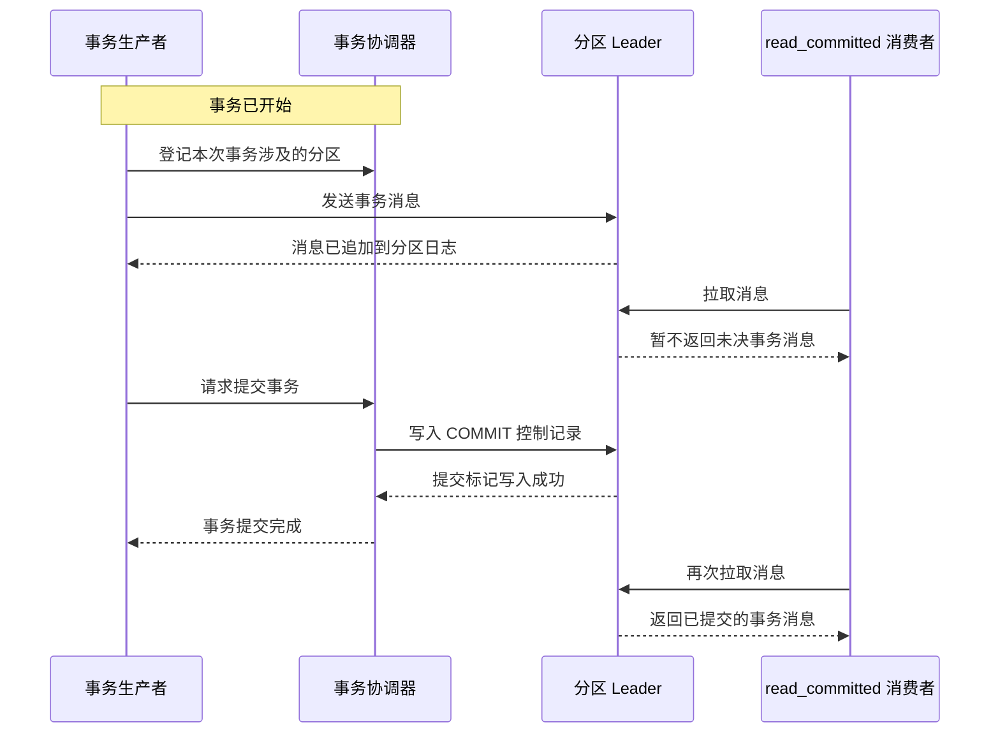

Kafka 事务消息并不是一种独立的业务消息格式，而是生产者在同一个事务边界内写入的记录。本文以 Apache Kafka 4.3.1 为版本前提，只沿着消息从发送到消费的主流程，说明消息已经进入分区日志后，为何仍可能不会被消费者读取，以及事务提交如何改变它的可见性。

## 完整流程

一次成功事务涉及事务生产者、事务协调器、分区 Leader 和消费者。主流程如下：

图中的“登记分区”表示 Kafka 需要知道这次事务写入了哪些 Topic-Partition。具体请求会随事务协议版本变化，但不改变主流程：消息先进入相关分区，事务协调器再统一决定提交或中止，并让这些分区记录同一个事务结果。

## 1. 生产者发送事务消息

生产者开始事务后，直到事务提交或中止之前发送的记录都属于这次事务。每条记录仍然按照普通 Kafka 消息的写入路径发送到目标分区的 Leader，并追加到分区日志。

因此，事务消息不是等到提交时才写入日志。生产者收到某次发送成功的响应，只能说明该记录的写入请求已经完成；它不代表整笔事务已经提交。如果事务涉及多个分区，Kafka 还要跟踪所有相关分区，确保它们最终得到相同的事务结果。

## 2. 消息已写入，但事务仍未确定

消息进入分区日志后，事务可能仍处于进行中。Kafka 需要等待生产者提交或中止事务，才能确定这些记录是否应交给只读已提交数据的消费者。

`read_committed` 消费者不会在客户端缓存这批消息等待结果。Broker 会使用最后稳定偏移量（Last Stable Offset，LSO）限制可读取范围。LSO 与分区中最早的未完成事务有关；只要前方还有未完成事务，消费者就不能越过这个边界读取后面的记录。

这也意味着“事务消息在提交前不可见”必须限定为 `read_committed` 消费者。默认的 `read_uncommitted` 隔离级别可以返回尚未提交甚至最终被中止的事务消息，不提供这层可见性隔离。

## 3. 生产者提交事务

生产者提交事务时，会先完成尚未发送完的记录，确保本次事务内的发送都已得到结果，再向 Kafka 请求结束并提交事务。事务协调器确认提交决定后，要求本次事务涉及的各个分区写入 `COMMIT` 控制记录。

控制记录与业务消息一样占用分区日志中的 Offset，但不会返回给应用。它的作用是标记此前属于该事务的记录已经提交。多个分区写入控制记录的时刻可以不同，但它们记录的是同一个事务结果；这里的原子性指最终不会出现一部分记录提交、另一部分记录中止，并不表示所有分区在同一物理时刻对消费者可见。

## 4. 消费者读取已提交消息

事务完成后，相关分区不再把它视为未决事务。若没有更早的未完成事务继续限制读取边界，LSO 可以向后推进。`read_committed` 消费者再次拉取时，会取得已提交的事务消息，同时过滤事务控制记录。

因此，从消费者视角看，完整链路是：消息先写入日志，但在事务结果确定前不返回；提交标记写入后，消息才进入可读取范围。消费者可能观察到 Offset 不连续，因为提交标记本身拥有 Offset，却不会作为业务消息交给应用。

## 5. 事务中止时的结果

如果生产者中止事务，协调器会让相关分区写入 `ABORT` 控制记录。已经追加的业务消息不会立即从日志中删除，但 `read_committed` 消费者会跳过它们。因此，中止事务控制的是消息可见性，而不是通过物理删除回滚日志。

`read_uncommitted` 消费者仍可能读取这些记录，所以 Kafka 的端到端事务可见性同时依赖生产端建立事务边界，以及消费端只读取已提交数据。

## 总结

Kafka 事务消息从发送到消费经历三个关键状态：先作为事务记录写入分区日志，再由事务协调器驱动分区写入提交或中止标记，最后由消费者根据隔离级别决定是否返回。写入成功不等于事务提交；对 `read_committed` 消费者而言，只有事务完成且读取边界推进后，已提交消息才会被消费，中止消息则会被过滤。

## 参考资料

- [Apache Kafka 4.3.1：KafkaProducer API](https://kafka.apache.org/43/javadoc/org/apache/kafka/clients/producer/KafkaProducer.html)
- [Apache Kafka 4.3.1：KafkaConsumer API](https://kafka.apache.org/43/javadoc/org/apache/kafka/clients/consumer/KafkaConsumer.html)
- [Apache Kafka 4.3：Consumer Configs](https://kafka.apache.org/43/configuration/consumer-configs/)
- [Apache Kafka 4.3：Protocol](https://kafka.apache.org/43/design/protocol/)
