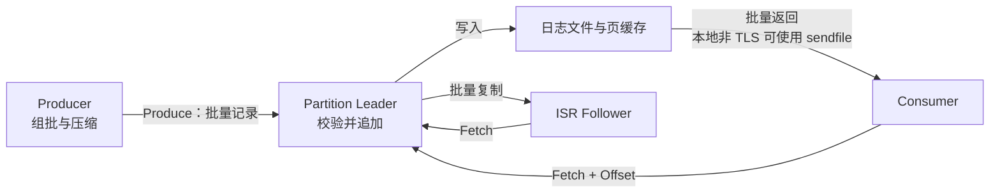

Kafka 的主要性能优势是持续处理大量数据，而不是让每条消息都获得最低延迟。本文以 Apache Kafka 4.3.1 为版本前提，沿 Producer、Broker、Follower 和 Consumer 的完整数据路径，分析批处理、追加日志、页缓存、零拷贝与分区并行如何共同降低每条消息的平均处理成本。

批量等待、复制确认、刷盘、压缩和消费拉取都会影响延迟，最终性能还取决于消息大小、可靠性配置、分区分布、硬件和网络条件。因此，脱离负载和配置比较每秒消息数，很难得到可复用的结论。

## 一条消息经过的路径

Kafka 不会让每条消息独立经过整条处理链路。Producer 按 Partition 聚合记录，Broker 把批次追加到对应日志，Follower 和 Consumer 再通过 Fetch 请求读取连续数据。

这条路径有两个关键特征：数据从 Producer 到 Consumer 始终尽量保持批量、连续的表示，避免反复拆分和重组；文件缓存、异步写回以及文件到网络的传输尽量交给操作系统，Broker 无需在 JVM 堆内维护另一份完整消息缓存。

## 批处理摊薄固定成本

一次请求需要经过序列化、协议封装、网络传输、Broker 请求调度和日志追加。逐条发送会重复支付这些固定成本；合并为批次后，同一组操作可以处理更多记录，单条记录分摊的成本随之下降。

Producer 以 Partition 为单位组批。`batch.size` 控制批次的默认目标大小，`linger.ms` 控制批次未满时的最长等待时间。Kafka 4.3 中二者默认分别为 16 KiB 和 5 ms；批次达到目标大小后无需等满 `linger.ms`。一个 Produce 请求还可以携带多个 Partition 的批次，因此按 Partition 组批不代表每个批次都要单独进行一次网络往返。[Producer 配置文档](https://kafka.apache.org/43/configuration/producer-configs/)同时指出，批次过小会降低组批概率，过大则可能浪费客户端缓冲区。

Consumer 的拉取模型延续了批处理。Consumer 携带 Offset 发起 Fetch 请求，Broker 返回从该位置开始的一段数据。`fetch.min.bytes` 可以让 Broker 等待更多数据后再响应，`fetch.max.wait.ms` 则限制最长等待时间。提高前者有利于形成更大的返回批次，但也可能增加低流量场景的延迟。

压缩同样以批次为单位。多条结构相似的记录一起压缩，更容易利用记录之间的重复内容，并减少网络和磁盘字节数。默认 Topic 配置 `compression.type=producer` 时，Broker 保留 Producer 选择的压缩格式；Broker 会为校验而解压批次，随后仍以压缩形式写入日志并发送给 Consumer。若 Topic 强制使用另一种压缩格式，Broker 可能需要重新压缩，CPU 开销也会进入写入路径。

批处理减少的是每条记录的平均固定成本，不保证降低每条记录的等待时间。低流量 Partition 难以形成大批次，较大的 `linger.ms` 还会直接增加未满批次的等待上限。

## 追加日志降低随机 I/O

每个 Partition 都是一条按 Offset 排列的日志。新批次追加到当前活动日志段的末尾，不需要像通用数据库那样为每条记录维护支持任意字段查询的树形索引。连续追加更容易形成大块连续 I/O，也为操作系统合并写入和异步写回留下空间。

“追加写”描述的是 Kafka 的逻辑访问模式，并不表示每条消息都会立即形成一次物理磁盘顺序写。Broker 先把数据写入文件系统，数据通常进入页缓存，之后由操作系统批量写回；强制 `fsync`、脏页回写压力和其他磁盘负载仍可能让写入阻塞。

追加日志仍然需要支持按 Offset 定位。Partition 日志被拆成多个 Segment，文件名以该段的基准 Offset 命名；Offset 索引保存 Offset 到文件位置的稀疏映射。读取时先确定目标 Segment，再从索引找到接近目标 Offset 的位置，最后在附近顺序扫描。Kafka 4.3 的 `index.interval.bytes` 默认约每 4096 字节增加一项索引。索引越密，扫描距离越短，但索引文件和内存映射开销越大。[Topic 配置文档](https://kafka.apache.org/43/configuration/topic-configs/)将该参数定义为定位精度与索引成本之间的权衡。

这种结构适合按 Offset 连续读取，不适合任意字段查询。Kafka 的高吞吐来自收窄存储接口，而不是让追加日志同时承担数据库的全部查询能力。

## 页缓存承担主要缓存工作

Kafka 把日志写入普通文件，并依赖操作系统页缓存保存近期读写的数据。写入调用返回时，数据可能只进入内核页缓存，尚未由 `fsync` 确认到达持久化介质。操作系统可以继续合并相邻的小写入，再根据自身策略异步回写。

这条路径对读取同样有利。流式 Consumer 通常读取日志尾部，所需数据很可能仍在页缓存中；此时读取可以直接命中内存，不产生物理磁盘读。多个 Consumer 读取同一批数据时，也可以复用同一份页缓存。

把主要消息缓存交给操作系统还有两个结果：Broker 不必在 JVM 堆中保存等量消息对象，减少了对象开销和大堆带来的垃圾回收压力；文件页可以使用 JVM 堆外的可用内存，只重启 Broker 进程也不会必然清空操作系统中的热文件页。[Kafka 的设计文档](https://kafka.apache.org/43/design/design/)将其称为以页缓存为中心的设计。

页缓存不是无限的。Consumer 大幅落后、回读历史数据、Broker 同时承载其他 I/O，或者脏页产生速度超过存储写回速度时，缓存命中率会下降，写线程也可能阻塞。此时磁盘吞吐和延迟会重新成为主要约束。

## 零拷贝缩短文件到网络的路径

常规文件发送需要先把数据从内核空间复制到应用缓冲区，再从应用缓冲区写回内核的 Socket 缓冲区。在适用的本地读取路径上，Kafka 使用 `sendfile`，由操作系统把页缓存中的文件数据直接送入网络路径，省去数据往返 JVM 用户空间的中间复制和相应系统调用。

“零拷贝”并非没有任何硬件复制，而是省去应用层参与的中间复制。Kafka 能采用这条路径，还依赖 Producer、Broker 和 Consumer 共享版本化的批次格式：Broker 可以把日志中的连续批次作为 Fetch 响应传输，而不必先把每条记录转换成另一种表示。

该优化有明确边界。Kafka 4.3 的 SSL/TLS 处理位于用户空间，启用 SSL 时不使用 `sendfile`；远程分层存储或需要转换数据的路径，也不能直接套用本地日志文件的结论。即使使用 `sendfile`，吞吐量仍受网络带宽、Socket 缓冲区和 Consumer 处理速度限制。

## Partition 提供并行能力

批处理、页缓存和零拷贝降低了单条数据路径的平均成本，Partition 则提供横向扩展的基本单位。不同 Partition 可以由不同 Broker 担任 Leader，Producer 根据元数据直接向目标 Leader 发送数据，不需要经过统一的中转节点。各 Partition 因而能够并行追加、复制和读取。

在传统 Consumer Group 中，同一 Partition 同一时刻只分配给组内一个 Consumer，多个 Partition 则可以由不同 Consumer 并行处理。因此，Partition 数量决定了组内消费并行度的上限；Topic 只有一个 Partition 时，增加同组 Consumer 不能提高消费并行度。组内只需用每个 Partition 的 Offset 表示消费进度，Broker 无需为每条已投递记录维护独立确认状态。

Partition 数量也不是越多越好。每个 Partition 会产生日志段、索引、文件描述符、内存映射、复制状态和元数据开销。Kafka 的[硬件与操作系统文档](https://kafka.apache.org/43/operations/hardware-and-os/)指出，每个日志段的 Offset 索引和时间索引都会消耗内存映射区域。Partition 过多会增加这些固定成本，而 Key 分布不均又可能使少数 Partition 成为热点，使其他 Partition 的余量无法分担其负载。

## 可靠性配置决定关键路径长度

Producer 的 `acks` 决定请求何时被视为成功：

- `acks=0` 不等待 Broker 确认，客户端观察到的发送延迟较低，但无法确认 Broker 是否收到记录。
- `acks=1` 等待 Leader 写入本地日志，不等待全部同步副本确认；Leader 在副本复制前故障时可能丢失已确认记录。
- `acks=all` 等待当前 ISR 中的全部副本确认，是 Kafka 4.3 Producer 的默认值。它与 `min.insync.replicas` 配合，ISR 数量不足时拒绝写入。

Kafka 4.1 起，新集群默认启用 Eligible Leader Replicas（ELR），它会改变 `min.insync.replicas` 相关的副本选举与恢复语义。本文只分析正常写入路径；故障选举场景以 [ELR 文档](https://kafka.apache.org/43/operations/eligible-leader-replicas/)为准。

副本确认和物理刷盘是两个维度。`acks=all` 表示同步副本已经把记录追加到各自日志，不表示每个副本都为该批次执行了一次 `fsync`。Kafka 默认主要依赖副本提供故障恢复能力，并让操作系统执行后台刷盘。`flush.messages` 或 `flush.ms` 可以强制更频繁地 `fsync`，但会压缩批量写回空间并增加阻塞延迟。[Kafka 4.3 的磁盘与刷盘说明](https://kafka.apache.org/43/operations/hardware-and-os/)建议通常保留默认刷盘策略并依赖复制。

降低确认级别或减少副本可能提高某些性能指标，但这不是无成本优化，而是改变故障语义。性能测试必须同时记录 `acks`、副本因子、最小同步副本数和刷盘策略，否则结果无法比较。

## 高吞吐机制及其边界

| 机制 | 主要作用 | 收益下降或代价上升的条件 |
| --- | --- | --- |
| Producer 与 Consumer 批处理 | 摊薄网络往返、请求调度和系统调用成本 | 低流量、小批次、严格的低等待延迟目标 |
| 批次压缩 | 减少网络和磁盘字节数 | 数据不可压缩、CPU 紧张、Broker 需要重新压缩 |
| 追加日志与稀疏索引 | 减少随机写和通用索引维护 | 强制频繁刷盘、随机业务查询、存储拥塞 |
| 操作系统页缓存 | 减少物理磁盘读和 JVM 堆缓存 | 冷读、大量积压回放、内存或脏页压力 |
| `sendfile` 零拷贝 | 减少用户空间中间复制与系统调用 | SSL/TLS、远程存储或需要转换数据 |
| Partition 并行 | 扩展 Broker 和 Consumer 的并行度 | Key 倾斜、Partition 过多、下游处理不足 |
| 副本复制 | 提供故障恢复能力 | 增加网络与存储开销；`acks=all` 时扩大确认链路 |

这些机制分别作用于不同层面：批处理减少操作次数，追加日志改善访问模式，页缓存减少物理 I/O，零拷贝缩短传输路径，Partition 扩展并行度。它们共同依赖一个前提：数据主要以批次形式按 Offset 连续流动。大量小批次、冷数据随机读取、热点 Partition 或强制逐条刷盘，都会削弱这条路径的优势。

## 结论

Kafka 的高吞吐不是来自“磁盘比内存快”，也不能归因于零拷贝这一项技术。它先把消息组织成适合批量追加和连续读取的日志，再利用页缓存与文件传输能力降低 I/O 和复制成本，最后以 Partition 把工作分散到多个 Broker 和 Consumer。

因此，Kafka 性能不能脱离工作负载和可靠性要求讨论。消息大小、批次形成速度、压缩率、缓存命中率、Partition 分布、复制确认、刷盘策略、TLS 和网络条件共同决定最终的吞吐量与延迟。

## 参考资料

- [Apache Kafka 4.3：Design](https://kafka.apache.org/43/design/design/)
- [Apache Kafka 4.3：Log Implementation](https://kafka.apache.org/43/implementation/log/)
- [Apache Kafka 4.3：Producer Configs](https://kafka.apache.org/43/configuration/producer-configs/)
- [Apache Kafka 4.3：Consumer Configs](https://kafka.apache.org/43/configuration/consumer-configs/)
- [Apache Kafka 4.3：Topic Configs](https://kafka.apache.org/43/configuration/topic-configs/)
- [Apache Kafka 4.3：Hardware and OS](https://kafka.apache.org/43/operations/hardware-and-os/)
- [Apache Kafka 4.3：Eligible Leader Replicas](https://kafka.apache.org/43/operations/eligible-leader-replicas/)
