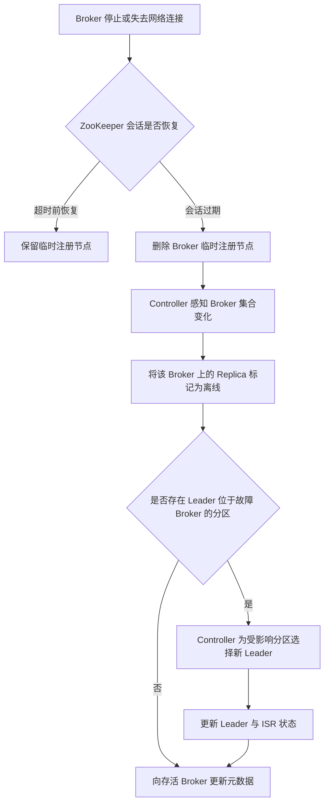

在传统 ZooKeeper 模式中，Kafka 使用 ZooKeeper 保存集群元数据、识别在线 Broker，并完成 Controller 选举。ZooKeeper 提供的是控制面所需的一致性存储和会话机制，具体的分区状态管理与故障恢复仍由 Kafka Controller 执行。本文以 Kafka 3.9 的 ZooKeeper 模式为实现边界，并说明 Kafka 4.0 起由 KRaft 完全接管这些职责后的变化。

> 名词说明：
>
> - **Kafka**：分布式事件流平台，将事件持久化到分区日志，并支持事件的发布、订阅和处理。
> - **ZooKeeper**：分布式协调服务，提供一致的层级命名空间、会话、临时节点和变更通知机制。
> - **Broker**：Kafka 服务端节点，负责保存分区日志、处理客户端请求和复制数据；每个 Broker 由唯一的 Broker ID（Identifier，标识符）标识。
> - **Controller**：Kafka 控制面角色，负责管理集群元数据以及节点、分区和副本的状态变化。
> - **KRaft**：Kafka Raft 的简称，即 Kafka 使用自身的 Raft 仲裁组管理集群元数据的运行模式；Raft 是一种通过主节点选举和日志复制，使多个节点对状态变化顺序达成一致的共识算法。

## ZooKeeper 在 Kafka 架构中的位置

传统 Kafka 集群由两套分布式系统组成：Broker 负责处理客户端请求、保存分区日志和复制消息，ZooKeeper 集群负责维护控制面状态。每个 Broker 都连接 ZooKeeper，其中一个 Broker 同时成为 Kafka Controller。

Controller 是集群元数据变更的主要协调者。它从 ZooKeeper 加载 Broker、Topic、Partition、Replica、Leader 和 ISR 等状态，在 Broker 上下线或管理操作发生时计算新的集群状态，再通过控制请求通知其他 Broker。ZooKeeper 在这一结构中是元数据的持久化依据和集群成员变化的通知来源，但不会代替 Controller 执行 Kafka 的分区状态机。

> 名词说明：
>
> - **Topic**：消息的逻辑分类，一个 Topic 可以拆分为多个 Partition。
> - **Partition**：Topic 的有序分片，也是 Kafka 存储、复制和并行处理数据的基本单位。
> - **Replica**：同一 Partition 在不同 Broker 上保存的数据副本。
> - **Leader**：Partition 中对外处理读写请求的主 Replica。
> - **ISR**：In-Sync Replicas，已与 Leader 保持同步、具备正常参与 Leader 选举资格的 Replica 集合。

## ZooKeeper 的核心职责

### Broker 注册与存活检测

Broker 启动后，会在 `/brokers/ids/<brokerId>` 创建临时节点。节点内容包含 Broker 的监听地址、机架等注册信息，节点生命周期与 Broker 的 ZooKeeper 会话绑定。

Broker 与 ZooKeeper 短暂断开连接时，会话不一定立即失效，临时节点也不会立刻删除。只有会话超过超时时间仍未恢复，ZooKeeper 才会使会话过期并删除对应节点。Controller 监听 Broker 注册集合的变化，据此更新它所维护的在线 Broker 列表。

这种机制把“Broker 是否在线”转换为 ZooKeeper 会话状态。它不要求 Controller 分别维护所有 Broker 的应用层心跳，但故障发现速度受 ZooKeeper 会话超时配置影响：超时时间过短可能把网络抖动误判为 Broker 故障，过长则会延迟故障恢复。

### Controller 选举

ZooKeeper 模式没有独立的 Controller 节点，Broker 都可以竞争成为 Controller。竞选者尝试创建临时节点 `/controller`，只有一个 Broker 能创建成功并成为当前 Controller；其他 Broker 监听该节点。

如果 Controller 进程退出或其 ZooKeeper 会话过期，`/controller` 会被删除，其余 Broker 随后发起新一轮竞争。Kafka 还维护 `/controller_epoch`，每次 Controller 更替都会增加 epoch。Broker 可以据此拒绝旧 Controller 发出的过期控制请求，降低双 Controller 或延迟请求破坏新状态的风险。

> 名词说明：**epoch** 表示单调递增的任期或版本编号。Controller Epoch 用于区分新旧 Controller 任期，Leader Epoch 用于区分同一 Partition 的不同 Leader 任期。

ZooKeeper 在此处提供互斥创建、临时节点和变更通知，真正接管控制职责的是竞选成功的 Kafka Broker。

### Topic、Partition 与 Replica 元数据

Kafka 3.9 的 ZooKeeper 数据结构中，`/brokers/topics/<topic>` 保存 Topic ID、分区与 Replica 分配关系；`/brokers/topics/<topic>/partitions/<partition>/state` 保存分区 Leader、Leader Epoch、Controller Epoch 和 ISR。Controller 启动时读取这些数据建立内存状态，并在 Topic 创建、Replica 重分配、Leader 变化等操作中维护相应元数据。

| ZooKeeper 路径 | 主要内容 | 节点类型或生命周期 |
| --- | --- | --- |
| `/brokers/ids/<brokerId>` | Broker 地址、机架和版本能力等注册信息 | 临时节点，跟随 Broker 会话 |
| `/controller` | 当前 Controller 的 Broker ID | 临时节点，跟随 Controller 会话 |
| `/controller_epoch` | Controller 任期编号 | 持久节点 |
| `/brokers/topics/<topic>` | 分区与 Replica 分配关系 | 持久节点 |
| `/brokers/topics/<topic>/partitions/<partition>/state` | Leader、Leader Epoch 和 ISR | 持久节点 |

这些路径是 Kafka 3.9 ZooKeeper 模式的实现细节，不应作为跨版本稳定的管理接口。管理工具直接修改 znode 会绕过 Kafka 的校验与状态转换，日常管理应使用 Admin API 或 Kafka 提供的命令行工具。

> 名词说明：
>
> - **znode**：ZooKeeper 层级命名空间中的数据节点，可以保存少量数据并拥有子节点。
> - **Admin API**：Administrative Application Programming Interface，Kafka 提供的集群管理接口，用于创建 Topic、修改配置、调整 Replica 等管理操作。

### 配置与访问控制信息

ZooKeeper 模式还使用 `/config` 下的节点保存动态配置，例如 Topic 配置、Broker 动态配置以及客户端配额。采用 ZooKeeper 版 `AclAuthorizer` 时，ACL 及其变更通知也存放在 ZooKeeper 中。部分版本还会保存 Delegation Token、集群 ID 和特性版本等控制面信息。

> 名词说明：
>
> - **AclAuthorizer**：ZooKeeper 模式下可使用的 Kafka 授权器实现，根据 ACL 判断访问是否被允许。
> - **ACL**：Access Control List，访问控制列表，用于描述哪个主体可以对哪些 Kafka 资源执行哪些操作。
> - **Delegation Token**：委托令牌，客户端可使用它进行身份认证，而不必在每次连接时直接提供长期凭据。

因此，ZooKeeper 故障不仅影响 Broker 上下线判断和 Controller 选举，也会影响需要写入集群元数据的管理操作。具体影响取决于 Kafka 版本和功能所使用的元数据路径，不能把所有配置都视为 ZooKeeper 中的动态数据；`server.properties` 等节点本地静态配置仍由 Broker 自己读取。

## Broker 故障后的协调过程

以下流程描述非受控故障且 ZooKeeper 会话最终过期时的主要控制链路：

ZooKeeper 只负责确认会话过期、删除临时节点并触发变更通知。Controller 收到变化后，将故障 Broker 上的 Replica 标记为离线；对于 Leader 已离线的分区，Controller 再按照 Kafka 的选举规则选择新 Leader，更新 Leader 与 ISR 状态，并向存活 Broker 发送 `LeaderAndIsr`、`UpdateMetadata` 等控制请求。

> 名词说明：
>
> - **LeaderAndIsr**：Controller 发给 Broker 的控制请求，用于通知 Partition 的 Leader、ISR 和相关任期发生变化。
> - **UpdateMetadata**：Controller 发给 Broker 的元数据更新请求，用于同步 Broker、Topic 和 Partition 等集群状态。

正常情况下，新 Leader 从 ISR 中选择。如果 ISR 中没有可用 Replica，分区可能暂时不可用；是否允许从非 ISR Replica 中进行不干净 Leader 选举由 Kafka 配置和触发方式决定。这属于 Kafka 的可用性与数据一致性策略，不是 ZooKeeper 的选举规则。

如果故障节点本身就是 Controller，它的 ZooKeeper 会话过期还会删除 `/controller`，其他 Broker 需要先选出新 Controller。新 Controller 随后从 ZooKeeper 重新加载集群状态，再处理尚未完成的 Broker 和分区状态变化，因此 Controller 切换时间会随元数据规模与初始化工作量增加。

## ZooKeeper 模式的限制

ZooKeeper 模式的首要成本是运维两套分布式系统。Kafka 与 ZooKeeper 各自具有配置、监控、安全、容量规划、升级和故障处理方式。只为 Kafka 配置认证与加密并不能自动保护 Broker 到 ZooKeeper 的连接，还必须独立配置 ZooKeeper 的安全机制。

元数据模型也存在结构性限制。ZooKeeper 保存的是分散在多个 znode 中的当前状态，Controller 依靠读取和一次性 Watch 感知变化；Broker 则主要接收 Controller 主动推送的控制请求。这些变化没有统一的、可按顺序重放的 Kafka 元数据日志。Controller 内存状态、ZooKeeper 状态与各 Broker 已接收状态之间因延迟或失败而短暂不一致时，恢复和诊断会更加复杂。

> 名词说明：**Watch** 是 ZooKeeper 的变更监听机制。客户端注册 Watch 后，可在目标节点发生指定变化时收到一次通知，之后通常需要重新注册。

Controller 故障切换还需要新 Controller 从 ZooKeeper 读取并重建完整状态。分区数量增长时，加载元数据、初始化状态机和向 Broker 传播状态都会增加控制面的恢复开销。这并不表示 ZooKeeper 本身不具备一致性，而是 Kafka 与外部元数据系统之间的交互模型限制了控制面的扩展和故障切换效率。

## KRaft 如何接管 ZooKeeper 的职责

KRaft 将集群元数据管理集成进 Kafka。若干 Controller 进程组成 Raft 仲裁组，其中一个是 Active Controller，其余 Controller 复制同一条元数据日志并作为热备。Topic、Partition、Replica、ISR、配置和 ACL 等变更被编码为有顺序的元数据记录，不再写入 ZooKeeper znode。

> 名词说明：
>
> - **Active Controller**：当前负责处理控制面请求并向元数据日志写入记录的 Controller。
> - **Follower Controller**：复制元数据日志但不处理写入的 Controller，可在 Active Controller 故障后参与新一轮选举。

原有职责的对应关系如下：

- Broker 向 KRaft Controller 注册，并通过心跳维持成员身份，不再创建 ZooKeeper 临时节点。
- Controller 仲裁组使用 Raft 选出 Active Controller，不再竞争 `/controller`。
- 集群元数据写入复制的元数据日志，并通过快照控制恢复成本，不再分散存储于多个 znode。
- Broker 按元数据偏移量获取并应用增量记录，Controller 切换时，Follower Controller 已经持有接近最新的状态。
- 配置、ACL 和其他管理操作经 Kafka API 进入 Active Controller，由 Controller 写入元数据日志。

KRaft 并没有取消 Controller，而是把“Controller 选举、元数据复制和成员管理”从外部 ZooKeeper 收回 Kafka 控制面。它仍依赖多数派维持元数据仲裁：三个 Controller 可容忍一个 Controller 同时失效，五个可容忍两个。

Kafka 3.9 是最后一个支持 ZooKeeper 模式的 3.x 版本，也是升级到 KRaft 的最后一个桥接版本。Kafka 4.0 起已经移除 ZooKeeper 模式；仍在 ZooKeeper 模式运行的集群必须先使用受支持的 3.x 版本完成 KRaft 迁移，再升级到 Kafka 4.x。

## ZooKeeper 模式与 KRaft 模式对照

| 对比项 | ZooKeeper 模式 | KRaft 模式 |
| --- | --- | --- |
| 元数据存储 | ZooKeeper znode 中的当前状态 | Kafka Controller 仲裁组中的复制元数据日志与快照 |
| Controller 选举 | Broker 竞争创建 `/controller` 临时节点 | Controller 仲裁组通过 Raft 选出 Active Controller |
| Broker 存活检测 | ZooKeeper 会话和临时注册节点 | Broker 向 Active Controller 注册并发送心跳 |
| 元数据传播 | Controller 向 Broker 推送控制请求 | Broker 按偏移量获取和应用元数据记录 |
| Controller 故障切换 | 新 Controller 从 ZooKeeper 加载并重建状态 | Follower Controller 已复制元数据，可接替 Active Controller |
| 运维对象 | Kafka 集群与独立 ZooKeeper 集群 | Kafka Broker 与 Kafka Controller |
| Kafka 版本 | 最高支持到 3.9，且已弃用 | 3.3 起达到生产可用；4.0 起是唯一模式 |

## 结论

ZooKeeper 在传统 Kafka 中承担四类核心职责：用临时节点表示 Broker 存活状态，为 Kafka Controller 选举提供互斥机制，保存 Topic、Partition、Replica、Leader 和 ISR 等集群元数据，以及保存部分动态配置与访问控制信息。Kafka Controller 才是读取这些状态、运行分区状态机并向 Broker 下发控制请求的执行者。

KRaft 用 Kafka 自身的 Raft Controller 仲裁组和有序元数据日志替代了这些能力。理解这条边界既能解释 ZooKeeper 模式下的故障恢复过程，也能说明 KRaft 的价值不只是少部署一个组件，而是统一了 Kafka 控制面的状态存储、复制、选举与传播模型。

## 参考资料

- [Apache Kafka 3.9：ZooKeeper 元数据结构源码](https://github.com/apache/kafka/blob/3.9/core/src/main/scala/kafka/zk/ZkData.scala)
- [Apache Kafka 3.9：ZooKeeper 注册与 Controller 选举源码](https://github.com/apache/kafka/blob/3.9/core/src/main/scala/kafka/zk/KafkaZkClient.scala)
- [Apache Kafka 3.9：Controller 故障处理源码](https://github.com/apache/kafka/blob/3.9/core/src/main/scala/kafka/controller/KafkaController.scala)
- [KIP-500：使用自管理元数据仲裁组替代 ZooKeeper](https://cwiki.apache.org/confluence/spaces/KAFKA/pages/123898922/KIP-500%2BReplace%2BZooKeeper%2Bwith%2Ba%2BSelf-Managed%2BMetadata%2BQuorum)
- [Apache Kafka 3.9 发布说明](https://kafka.apache.org/blog/2024/11/06/apache-kafka-3.9.0-release-announcement/)
- [Apache Kafka 4.0 升级说明](https://kafka.apache.org/40/getting-started/upgrade/)
