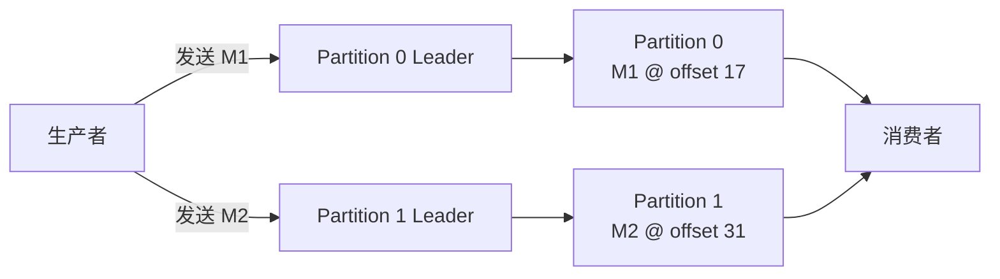

Kafka 经常被描述为“只能保证分区内有序”，RocketMQ 则常被认为支持“全局有序”。这种对比省略了顺序保证的范围和前提。本文以 Apache Kafka 4.3 和 Apache RocketMQ 5.0 为版本前提，从生产、存储、投递和业务处理四个层次说明：顺序来自唯一的排序单元；Kafka 多分区与 RocketMQ 多消息组都不提供跨排序单元的总顺序。

## 先确定“有序”发生在哪一层

一条消息从业务代码产生到处理完成，会经过多个阶段：

1. 生产者按照某个业务顺序调用发送接口。
2. Broker 接收消息并将其写入日志或队列。
3. 消费者按照 Broker 的投递结果取得消息。
4. 业务代码完成处理并产生外部结果。

这四种顺序不能直接等同。生产者并发发送时，调用顺序本身可能没有唯一答案；两个 Broker 独立接收消息时，到达顺序可能与业务产生顺序不同；消费者按序取得消息后，如果转交给线程池并发处理，后取得的消息仍可能先完成。

因此，讨论“全局有序”必须先定义消息集合和观察点。本文所说的总顺序，是指在一个明确的消息集合中，任意两条消息都能根据消息系统给出的位置判断先后。只有同一订单的事件可比较，属于局部有序；一个 Topic 中的任意两条消息都可比较，才是 Topic 范围的全局有序。消息系统中的存储总顺序也不自动等于业务结果按相同顺序完成。

## Kafka 的顺序由 Partition 产生

Kafka Topic 由一个或多个 Partition 组成。一条消息实际只会追加到其中一个 Partition，并取得该 Partition 内的 offset。消费者也以 Topic-Partition 为维度读取数据和维护消费位置。

Partition 是 Kafka 的有序日志单位。写入同一个 Partition 的消息会形成确定的 offset 顺序，例如：

```text
orders-0: M1(offset=17) -> M2(offset=18) -> M3(offset=19)
```

在这条日志中，`M1 < M2 < M3` 有明确含义。Kafka 4.3 官方文档也把读取顺序的保证限定为给定的 Topic-Partition：消费者按照记录被写入该分区的顺序读取。

同一 Topic 的不同 Partition 则各自维护日志和 offset：

```text
orders-0: M1(offset=17) -> M3(offset=18)
orders-1: M2(offset=31) -> M4(offset=32)
```

`orders-0` 的 offset 17 与 `orders-1` 的 offset 31 只表示各自在所属日志中的位置。它们不能比较大小，也不能据此判断 `M1` 和 `M2` 谁先进入整个 Topic。

## 多个 Partition 为什么没有全局顺序

不同 Partition 的 Leader 可以位于不同 Broker。生产者向它们独立发送请求，各 Leader 独立追加日志，没有一个 Topic 级计数器为所有写入分配统一序号。



图中两条写入链路之间不存在负责排序的连接。即使生产者先调用 `send(M1)` 再调用 `send(M2)`，网络传输、请求批次和 Broker 调度仍可能使 `M2` 先写入自己的 Partition。消费者从两个 Partition 拉取数据时，还会受到各分区可用数据量和拉取时机影响。

消息时间戳也不能补上这个缺口。生产者时间可能存在时钟偏差或重复值，Broker 追加时间仍由不同节点生成。时间戳适合描述事件时间或近似发生时间，不是 Kafka 为跨 Partition 建立的唯一顺序号。

若 Kafka 为 Topic 中每条消息分配全局序号，就必须让所有写入经过同一个排序节点，或者让多个节点在写入路径上协调出唯一顺序。前者形成单点吞吐上限，后者增加协调轮次和延迟。Kafka 选择让 Partition 独立推进，使多个 Broker 能并行承担读写负载；不提供跨 Partition 总顺序是这个并行模型的直接结果。

## 分区内有序也有使用前提

分区日志形成之后，offset 顺序是确定的；但“业务先发送的消息一定取得较小 offset”还依赖生产方式。

Kafka 4.3 的生产者在没有冲突配置时默认启用幂等性。启用幂等性要求 `acks=all`、重试次数大于 0，并且 `max.in.flight.requests.per.connection` 不超过 5；满足这些约束时，可在允许的在途请求数量内保持顺序。若关闭幂等性，同时启用重试并允许多个请求在途，较早失败的批次可能在较晚成功的批次之后重试，从而改变写入顺序。

这一保证仍以单个生产者向同一 Partition 发送记录为边界。多个生产者并发写入同一 Partition 时，日志最终仍有唯一 offset 顺序，但 Kafka 无法从两个应用进程中推导一个此前并不存在的业务先后关系。

消费端也要区分“按序读取”和“按序完成”。消费者从一个 Partition 取得 `M1`、`M2` 后，如果同时交给两个工作线程，`M2` 可能先完成。要维持业务处理顺序，需要按 Partition 或业务键串行执行，或者在结果写入时使用版本号、幂等校验等机制拒绝旧状态覆盖新状态。

## RocketMQ 5.0 保证的是 MessageGroup 内 FIFO

RocketMQ 5.0 使用 `MessageGroup` 判定 FIFO 消息的顺序范围。同一消息组的消息按照发送顺序存储在同一个 `MessageQueue`，并按照该顺序投递；不同消息组之间不定义顺序。两个消息组即使被存入同一个 MessageQueue，RocketMQ 也只分别保证各组内部的先后关系。

例如，订单 ID 可作为消息组：

```text
MessageGroup=order-1001: 创建 -> 支付 -> 发货
MessageGroup=order-1002: 创建 -> 取消
```

RocketMQ 保证每个订单内部的 FIFO，但不保证 `order-1001` 的“支付”和 `order-1002` 的“取消”之间存在业务可解释的先后。这种按业务实体划分顺序范围的做法，使多个消息组能够并行处理。

生产顺序也有明确前提。RocketMQ 5.0 官方文档要求同一消息组的生产顺序来自单一生产者串行发送；不同生产者即使使用相同 MessageGroup，系统也无法判定它们原本的先后。消费端则必须遵循“接收、处理、应答”的顺序，不能在实际处理尚未完成时提前应答或把消息无约束地异步分发。

## RocketMQ 的“全局有序”没有绕过分片限制

在 RocketMQ 5.0 的 MessageGroup 模型中，要把顺序范围扩大到整个 Topic，需要让目标消息属于同一个消息组，并继续满足单生产者串行发送和顺序消费。这样任意两条目标消息才处于同一个 FIFO 序列中。

这是一种退化为单排序单元的配置，不是多个 MessageQueue 或多个 MessageGroup 之间自动产生了全局顺序。RocketMQ 官方也建议避免在一个消息组中放入大量消息，因为同组消息会进入同一队列并串行处理，可能造成负载集中并限制扩展。

Kafka 与 RocketMQ 的对应关系如下：

| 对比项 | Kafka 4.3 | RocketMQ 5.0 |
| --- | --- | --- |
| 顺序保证的范围 | Topic-Partition | FIFO 消息的 MessageGroup |
| 存储分片 | Partition | MessageQueue |
| 局部有序的常用路由 | 相同业务键进入同一 Partition | 相同业务标识使用同一 MessageGroup |
| Topic 范围总顺序 | 只使用一个 Partition | 全部目标消息使用同一 MessageGroup，并串行生产和消费 |
| 多排序单元之间的顺序 | 不保证 | 不保证 |
| 主要代价 | 单分区限制分区级读写和消费并行度 | 单消息组形成热点并限制处理并行度 |

两者的抽象并不完全相同：Kafka 直接把 Partition 作为日志与消费分配单位，RocketMQ 5.0 则在 MessageQueue 之上使用 MessageGroup 表达更细粒度的 FIFO 范围。但从全局排序的必要条件看，两者没有本质冲突：要得到一个总顺序，就要把目标消息约束到一个可串行化的顺序域。

Kafka 使用单 Partition 时，同样可以获得 Topic 范围的日志总顺序。此时同一 Consumer Group 中，分区级消费并行度最多为 1。Kafka 所谓“只能保证分区内有序”，准确含义不是 Kafka 不能提供 Topic 全局顺序，而是它不会为多个 Partition 额外建立全局顺序；单分区 Topic 恰好让“分区范围”等于“Topic 范围”。

## 全局有序与水平并行之间的约束

总顺序要求集合内任意两条消息可比较。多个写入节点要满足这一条件，必须共享同一个排序决策：使用单一队列或单一分区，把请求送到中央序列服务，或者通过一致性协议共同决定提交位置。无论采用哪种实现，都不能让各分片完全独立地写入后，再免费得到一个事先没有建立的总顺序。

消息系统通常选择缩小顺序范围，而不是为全部消息排序：

- 以订单 ID、账户 ID 或设备 ID 作为顺序键，在分区数量和路由策略稳定的前提下，只保证同一业务实体内部有序。
- 不同业务实体进入不同 Partition 或 MessageGroup，并行完成生产和消费。
- 下游使用幂等键、状态版本或业务序列号处理重复、迟到和异常重试。

如果业务确实要求整个 Topic 严格有序，可以选择 Kafka 单分区，或在 RocketMQ 中使用单一消息组及顺序生产、顺序消费。这个选择需要接受单个排序单元的容量上限，并验证故障重试、消费者处理和外部存储是否继续保持相同顺序。

如果要求多分片吞吐，又要求下游恢复业务顺序，可以在消息中携带由业务系统生成的序列号。消费者按业务键检测序列缺口并缓存重排。此时消息组件仍只提供局部日志顺序，全局或业务顺序由应用协议定义，不能把两者混为一项 Broker 保证。

## 总结

Kafka 只能保证分区内有序，是因为 Partition 是它产生、保存和消费顺序的基本单位。多个 Partition 各自拥有日志和 offset，没有 Topic 级排序器，因而不能直接比较跨分区消息。

RocketMQ 5.0 的顺序消息也遵循相同约束。它保证同一 MessageGroup 内 FIFO，不保证不同消息组之间有序；所谓全局有序，需要将全部目标消息收敛到同一个消息组，并满足串行生产和顺序消费。全局有序不是某个消息组件可以无条件开启的能力，而是以唯一排序点及其吞吐、延迟和扩展代价换来的结果。

## 参考资料

- [Apache Kafka 4.3：Introduction](https://kafka.apache.org/43/getting-started/introduction/)
- [Apache Kafka 4.3：Producer Configs](https://kafka.apache.org/43/configuration/producer-configs/)
- [Apache Kafka 4.3.1：KafkaProducer API](https://kafka.apache.org/43/javadoc/org/apache/kafka/clients/producer/KafkaProducer.html)
- [Apache RocketMQ 5.0：顺序消息](https://rocketmq.apache.org/zh/docs/featureBehavior/03fifomessage/)
- [Apache RocketMQ 5.0：Message Queue](https://rocketmq.apache.org/docs/domainModel/04messagequeue/)
- [Apache RocketMQ 5.0：Consumer Load Balancing](https://rocketmq.apache.org/docs/featureBehavior/08consumerloadbalance/)
