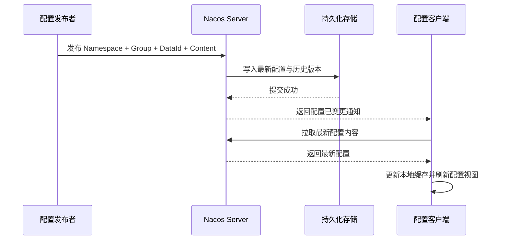
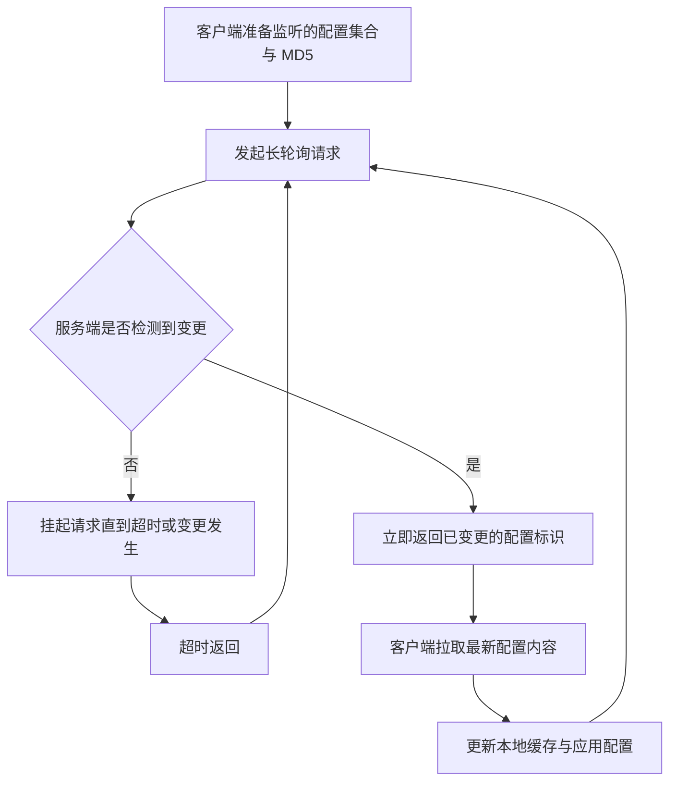
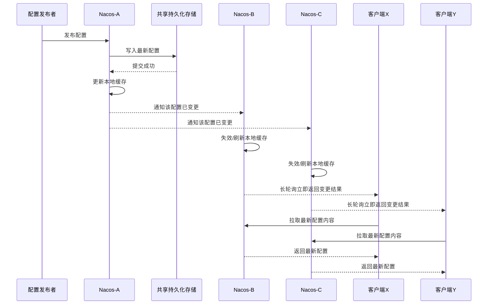

# Nacos 作为服务配置中心的原理与实现

在微服务体系里，配置往往比代码更容易变化。

一个服务上线以后，真正经常调整的通常不是业务逻辑本身，而是下面这些内容：

- 数据库连接地址。
- 线程池参数。
- 限流阈值。
- 开关配置。
- 下游服务调用超时时间。
- 灰度发布相关标记。

如果这些配置散落在各个应用本地文件中，很快就会出现几个典型问题：

- 同一份配置在不同机器上不一致。
- 改一个参数要重新打包或重启服务。
- 环境越多，维护成本越高。
- 历史变更缺少审计与回滚能力。
- 配置变更无法快速传播到所有实例。

所以，配置中心要解决的并不只是“把配置放到远端保存”这么简单，而是要提供一套完整的动态配置管理机制。

如果先只记住一条主线，可以把 Nacos 作为配置中心理解成下面这个闭环：

- 配置发布者把配置写入 Nacos。
- Nacos 持久化配置并维护配置元数据。
- 客户端启动时从 Nacos 拉取配置并缓存到本地。
- 客户端持续通过长轮询监听配置变化。
- 一旦配置变更，Nacos 立即通知客户端。
- 客户端再主动拉取最新配置并刷新应用中的配置视图。

这意味着 Nacos 的核心价值不只是集中存储，而是“集中管理 + 动态通知 + 本地容灾 + 版本追踪”的组合能力。

## 一、为什么微服务需要配置中心

没有配置中心时，常见做法通常只有两种：

- 把配置写在应用本地配置文件里。
- 通过脚本或人工分发配置到多台机器。

这两种方式在系统规模很小时还能工作，但服务一多，问题就会迅速暴露：

- 发布一个小参数改动，也可能需要整批重启。
- 配置和代码一起部署，导致变更耦合。
- 一套配置在开发、测试、预发、生产环境之间容易漂移。
- 不同实例的配置版本难以核对。
- 服务故障时，很难快速判断是不是配置变更导致的。

因此，一个成熟的配置中心至少需要提供下面几种能力：

- 统一存储：把分散配置集中管理。
- 环境隔离：不同环境或租户之间互不干扰。
- 动态生效：配置变更后尽快让客户端感知。
- 历史审计：知道是谁在什么时间改了什么。
- 回滚恢复：发现问题时可以快速退回旧版本。
- 本地容灾：配置中心短时不可用时，应用仍能继续运行。

Nacos 作为配置中心，本质上就是围绕这些能力设计出来的。

## 二、先理解 Nacos 配置中心里的几个核心角色

### 1. 配置发布者

配置发布者通常是开发、运维、平台系统，或者 CI/CD 流程。它们负责把配置内容提交到 Nacos。

发布入口一般有两类：

- 控制台页面。
- OpenAPI 或 SDK。

发布者关注的是“我要把什么配置发布到哪个环境、哪个服务下”。

### 2. 配置使用方

配置使用方就是具体的业务应用。它的职责不是保存配置，而是：

- 启动时拉取配置。
- 运行中监听配置变化。
- 在变更发生时刷新本地配置。
- 在远端不可用时读取本地快照。

换句话说，客户端并不是每次读取配置都实时请求 Nacos，而是把远端配置同步到本地可用状态后再使用。

### 3. Nacos Server

Nacos Server 是配置中心本体。它主要负责：

- 接收配置发布请求。
- 校验并持久化配置内容。
- 保存配置元数据与版本历史。
- 维护客户端监听关系。
- 在配置变更时通知客户端。

### 4. 持久化存储

配置中心和服务注册中心有一个明显差别：

- 服务注册中心更强调实例的动态性。
- 配置中心更强调配置内容的可靠存储与版本管理。

因此，Nacos 作为配置中心时，核心真值来源不是客户端内存，而是持久化存储。

在生产环境中，通常会使用数据库保存配置数据与历史记录，而 Nacos 节点本地则维护缓存和监听连接。

## 三、Nacos 配置中心的核心数据模型

理解配置中心，最重要的是先把“配置是怎么被唯一标识的”弄清楚。

### 1. Namespace

Namespace 用于隔离环境或租户。常见场景包括：

- 开发环境。
- 测试环境。
- 预发环境。
- 生产环境。
- 不同租户或不同业务线。

同样名字的配置，如果处在不同 Namespace 中，应当被看作完全不同的配置。

### 2. Group

Group 是配置分组维度，用来在同一 Namespace 内做逻辑归类。

例如：

- DEFAULT_GROUP。
- ORDER_GROUP。
- PAYMENT_GROUP。

它的隔离能力弱于 Namespace，但很适合做业务域划分。

### 3. DataId

DataId 是一条配置的核心标识，通常会体现服务名和配置格式，例如：

- order-service.yaml
- gateway.json
- common-cache.properties

很多团队会约定“一份应用主配置对应一个 DataId”，这样更容易管理。

### 4. 配置内容与配置类型

配置内容就是最终要被客户端读取的文本，常见格式有：

- properties
- yaml
- json
- text

Nacos 本身并不强依赖某一种业务格式，它更像是“配置文本的统一托管平台”。

### 5. MD5 指纹

客户端监听配置变化时，并不是每次都把完整配置内容来回传输。为了高效判断配置是否变化，Nacos 会基于配置内容计算摘要值，常见做法是使用 MD5。

因此在监听流程里，客户端真正频繁交换的通常不是整份配置，而是：

- 我当前监听哪些配置。
- 这些配置的当前摘要值是什么。

这使得“发现变更”这一步可以很轻量。

从抽象上看，一条配置大致可以被理解为：

- Namespace + Group + DataId -> Content + Metadata + Version

其中，前半部分用于唯一定位，后半部分用于描述配置内容及其状态。

## 四、配置发布到底发生了什么

配置中心最核心的链路之一，就是“发布配置”这件事本身。

### 1. 发布者提交配置内容

发布者通过控制台或接口，把配置提交到指定维度下：

- 发布到哪个 Namespace。
- 属于哪个 Group。
- DataId 是什么。
- 内容具体是什么。

如果是修改已有配置，本质上就是在原有标识下写入新的配置版本。

### 2. Nacos 校验并持久化配置

Nacos 收到发布请求后，会先做基本校验，例如：

- 标识信息是否完整。
- 内容是否合法。
- 发布权限是否满足。

校验通过后，配置会被写入持久化存储。到这一步，新的配置才真正成为系统中的有效数据。

这一步非常关键，因为它意味着：

- 真正的一致性基线来自存储提交。
- 后续通知客户端只是“传播变更”，不是“替代持久化”。

### 3. 记录历史版本

一个成熟的配置中心不会只保留最新值，还会保留配置变更历史，以支持：

- 审计。
- 问题追踪。
- 版本对比。
- 快速回滚。

所以 Nacos 的配置管理不仅是“当前态”，也是“可追踪的历史态”。

### 4. 触发变更事件

当配置成功写入后，Nacos 会认为这条配置已经发生了版本变化。接下来服务端要做两件事：

- 更新本节点对该配置的缓存视图。
- 让监听这条配置的客户端尽快感知变更。

注意，这里通常不是把完整新配置主动推给所有客户端，而是先发出“有变更了”的信号。

### 5. 客户端收到通知后再拉取最新值

这也是很多人第一次接触 Nacos 配置中心时最容易忽略的一点：

- Nacos 的常见机制不是“服务器直接推送完整配置内容”。
- 更常见的模型是“服务端通知变化，客户端再主动拉取最新配置”。

这样做的好处是：

- 服务端通知报文更轻。
- 客户端始终以一次显式读取拿到最新真值。
- 协议实现更稳定，也更容易和本地缓存机制配合。

## 五、客户端启动时如何拿到配置

配置发布只是服务端的一半工作，另一半是客户端怎样可靠地把配置用起来。

### 1. 应用启动时读取接入信息

客户端通常先加载 Nacos 接入参数，例如：

- Nacos Server 地址。
- Namespace。
- Group。
- DataId。
- 超时时间。
- 鉴权信息。

这一步解决的是“去哪里拿配置”。

### 2. 首次拉取远端配置

客户端随后会主动向 Nacos 请求配置内容。拿到结果后，才会把这些配置交给应用框架使用。

因此很多场景里，应用启动过程和配置拉取过程是强相关的：

- 如果关键配置拿不到，应用可能直接启动失败。
- 如果允许降级，则可能读取本地快照继续启动。

### 3. 写入客户端缓存与本地快照

客户端一般不会只把配置保存在内存里，还会写入本地快照文件。这样做主要是为了容灾：

- 下次启动时如果 Nacos 短时不可用，可以先读取本地快照。
- 运行中如果网络闪断，也不至于马上失去已有配置。

这说明配置中心并不是“只依赖远端在线”的脆弱模型，而是“远端为主，本地为辅”的双层保障。

## 六、为什么 Nacos 选择长轮询来做配置监听

动态配置的难点不在“存”，而在“变更如何高效传播”。

如果只用普通短轮询，客户端可能每隔几秒就请求一次服务端：

- 轮询间隔短，服务端压力很大。
- 轮询间隔长，配置生效就不够及时。

如果要求服务端主动维护复杂的长连接推送所有数据，系统实现和运维复杂度又会上升。

因此，Nacos 在配置监听上采用的是一个非常经典的折中方案：长轮询。

### 1. 长轮询的基本思想

客户端发起一个监听请求时，会把自己当前关注的配置集合和摘要值一并带上。

服务端收到后会做判断：

- 如果其中某条配置已经变化，立即返回结果。
- 如果没有变化，就把这个请求暂时挂起。

挂起并不等于一直不返回。通常在等待一段时间后，如果仍然没有变更，服务端会超时返回，客户端再立刻发起下一次监听请求。

于是整个过程就形成了一个循环：

- 有变化时立即感知。
- 没变化时减少无效请求。

### 2. 为什么它比短轮询更合适

长轮询相对短轮询的优势主要体现在两点：

- 时效性更好：配置一变更，挂起的请求可以立刻返回。
- 压力更低：没有必要每秒都发大量无意义查询。

这正好满足配置中心的典型特征：

- 配置变化频率通常没有服务调用频率高。
- 但一旦变化，又希望尽快传播。

### 3. 监听流程到底怎么走

可以把客户端监听理解成下面几个步骤：

1. 客户端整理出自己监听的 GroupKey 集合。
2. 每个 GroupKey 都带上本地当前内容摘要。
3. 客户端向服务端发起长轮询请求。
4. 服务端比对客户端摘要和服务端最新摘要。
5. 如果有变化，立即返回变更的配置标识。
6. 客户端再根据这些标识主动拉取最新内容。
7. 客户端更新本地缓存，并继续发起下一轮监听。

这里最关键的设计点是：

- 监听接口负责“发现哪些配置变了”。
- 拉取接口负责“拿到变更后的完整内容”。

这两个动作是分开的。

## 七、配置变更是如何真正作用到应用的

很多人会把“客户端拿到新配置”和“应用已经按新配置运行”混为一谈，但这两者并不完全等价。

### 1. 客户端先更新自己的配置缓存

当客户端拉取到最新配置后，第一步通常是更新本地缓存与快照文件。到这里，客户端已经知道最新配置值是什么。

### 2. 应用框架再决定如何刷新运行态

接下来能不能真正影响业务行为，要看应用框架如何接入这些配置。

常见情况包括：

- 某些配置会立即反映到读取配置中心的组件中。
- 某些配置需要触发刷新事件后才能生效。
- 某些初始化型配置可能必须重建对象甚至重启应用才会生效。

所以，配置中心并不意味着“任何配置都能无损热更新”。

更准确的理解应该是：

- Nacos 负责把新配置可靠、及时地送达到客户端。
- 客户端框架负责把新配置映射到应用运行态。
- 具体能否热更新，取决于应用自身的刷新设计。

### 3. 为什么这点很重要

如果把所有配置都当成可热更新项，实际运行时可能会产生两个问题：

- 业务线程读取到配置切换中的中间状态。
- 某些组件在初始化后根本不支持动态替换。

因此在使用 Nacos 时，通常要把配置分成两类：

- 适合动态刷新的一类，例如开关、阈值、限流参数。
- 不适合动态刷新的另一类，例如某些底层连接池初始化参数。

## 八、Nacos 配置中心的集群一致性怎么理解

服务注册中心和配置中心在一致性设计上侧重点不同。

对于配置中心来说，最重要的问题不是“哪台机器暂时在线”，而是：

- 配置内容有没有被可靠保存。
- 不同 Nacos 节点看到的是不是同一份最新配置。
- 连接到不同节点的客户端能否及时收到变更通知。

### 1. 持久化存储是真值源

在生产集群中，Nacos 配置中心通常把持久化存储作为唯一真值来源。

这意味着：

- 配置是否成功，以持久化提交结果为准。
- 任意一个 Nacos 节点都应当基于同一份持久化数据对外提供读取能力。

所以配置中心的一致性，本质上首先依赖底层存储提交的一致性。

### 2. Nacos 节点维护各自的缓存和监听连接

虽然持久化数据是共享真值源，但每个 Nacos 节点仍会维护自己的：

- 本地配置缓存。
- 当前连接在本节点上的长轮询监听请求。

这意味着一个配置变更后，不仅要让数据变正确，还要让各节点尽快唤醒挂在自己身上的客户端监听请求。

### 3. 一次变更通常分成两层传播

从原理上看，一次配置修改通常可以拆成两层：

- 第一层是数据层：把最新配置可靠写入持久化存储。
- 第二层是通知层：让各节点上的客户端监听关系尽快感知变化。

因此，配置中心的关键不是“把配置内容直接广播到一切地方”，而是：

- 数据统一落到真值源。
- 节点围绕真值源更新自己的缓存与通知状态。

### 4. 多个 Nacos 节点之间到底在协调什么

很多人一提到“分布式部署”，直觉上会以为多个 Nacos 节点之间需要像数据库主从那样彼此复制整份配置内容。

但对配置中心这条链路来说，更准确的理解是：

- 配置内容的真值主要由共享持久化存储承担。
- Nacos 节点之间协调的重点，不是重新发明一套配置主副本系统。
- 它们主要协调的是缓存状态、变更事件和客户端监听关系。

也就是说，在配置中心场景里，多个 Nacos 节点更像是一组共同对外提供读写与监听能力的接入层，而不是每个节点都独立保存一份最终真值。

把它拆开看，节点之间主要需要协调四件事：

- 哪个配置刚刚发生了变更。
- 本节点缓存的该配置是否需要失效或刷新。
- 挂在本节点上的长轮询客户端是否需要立即唤醒。
- 某个节点不可用时，集群其余节点是否仍能继续对外服务。

### 5. 一次配置发布在集群里是怎么扩散的

假设现在有三个 Nacos 节点：A、B、C。

- 发布请求打到了 A。
- 客户端 X 的长轮询连接挂在 B。
- 客户端 Y 的长轮询连接挂在 C。

这时一条配置从发布到全网感知，大致会经历下面的过程：

1. 发布者把配置提交到 Nacos-A。
2. Nacos-A 完成参数校验，并把最新配置写入共享持久化存储。
3. 写入成功后，A 立即更新自己对这条配置的本地缓存视图。
4. A 再把“某个 GroupKey 已变更”这件事传播给集群中的其他节点。
5. B 和 C 收到变更信号后，会失效或刷新本地缓存中的对应条目。
6. B 和 C 同时检查挂在自己身上的长轮询请求，发现相关配置已变更，就立即返回变更结果给各自客户端。
7. 客户端再向所连接的 Nacos 节点拉取最新配置内容，并更新本地缓存。

这里最关键的点是：

- 发布只需要成功写入一次共享真值源。
- 其余节点不需要把整份配置重新“复制提交”一遍。
- 它们更重要的工作，是尽快让自己本地的监听者知道“这条配置已经变了”。

因此，Nacos 配置中心集群内部的协调，本质上是一种“共享存储 + 节点级缓存/通知协同”的模型。

### 6. 客户端在集群部署下是如何获取数据的

客户端和集群交互时，也不是同时连所有 Nacos 节点把结果拼起来，而是每次请求只会落到某一个具体节点上。

通常有两种常见接入方式：

- 配置一个负载均衡域名，由前面的 SLB、Nginx 或网关转发到某个健康节点。
- 直接在客户端配置多个 Nacos 地址，由客户端自己做重试和切换。

从客户端视角看，获取配置通常分成三条路径。

#### 1. 首次启动拉取

应用启动时，客户端会先挑选一个当前可访问的 Nacos 节点，然后发起配置读取请求。

因为所有健康节点都应当基于同一份持久化真值源提供服务，所以：

- 理论上读到 A、B、C 中任意一个节点，返回的最新配置都应该一致。

这也是集群部署下可以横向扩容读流量的基础。

#### 2. 运行中的长轮询监听

客户端进入监听状态后，会把一次长轮询请求挂到某一个具体节点上，例如 B。

这一轮监听期间：

- B 负责维护这条连接。
- 如果配置变化，B 负责把“有变更”这件事返回给客户端。
- 如果没有变化，B 会在超时后返回，客户端再发起下一轮监听。

注意这里有一个很容易忽略的点：

- 一次长轮询请求通常只依附于一个节点。
- 不是同一条监听请求同时挂在 A、B、C 三台机器上。

这也是为什么前面说集群节点之间必须协调变更通知。因为配置可能是从 A 发布的，但监听连接却挂在 B 或 C。

#### 3. 节点故障时的切换与兜底

如果客户端当前连接的节点不可用，例如 B 宕机或网络不可达，客户端通常会：

- 终止当前失败请求。
- 切换到下一个可用 Nacos 节点重新发起读取或监听。
- 如果短时间内所有节点都不可用，则回退到本地快照继续工作。

所以客户端的高可用并不是“永远连着一台固定机器”，而是：

- 优先连任一可用节点获取远端真值。
- 节点故障时自动重试和切换。
- 极端情况下依赖本地快照兜底。

### 7. 为什么客户端最终还能收敛到一致

即使某个节点的通知比另一个节点稍慢一点，客户端最终仍会收敛到一致状态，原因在于：

- 客户端拿到最新配置时，会以服务端最新内容为准。
- 长轮询是持续循环的，不是一次性动作。
- 本地缓存会被后续最新值覆盖。

所以对 Nacos 配置中心来说，更合适的理解是：

- 配置内容以持久化结果保证正确性。
- 配置传播以监听通知和重新拉取保证最终收敛。

## 九、为什么本地快照和容灾能力很重要

一个只在中心节点在线时才能工作的配置系统，在生产上是不可靠的。

Nacos 客户端之所以会维护本地快照，就是为了在下面这些情况下保住系统可用性：

- Nacos 短时不可达。
- 网络抖动导致拉取失败。
- 服务重启时远端依赖暂时没有恢复。

### 1. 本地快照解决的是“继续可用”

当远端暂时不可用时，客户端至少还能用最近一次成功同步的配置继续工作，而不是直接失去全部配置来源。

### 2. 容灾并不等于配置一定最新

本地快照的本质是兜底，不是真值源。所以它能保证的是：

- 服务尽量不停。

但它不能保证的是：

- 服务读到的一定是刚刚发布的最新配置。

因此快照模式是一种典型的工程折中：

- 优先保证可用性。
- 再在连接恢复后重新和中心状态对齐。

### 3. 配置历史与回滚同样属于容灾体系

除了客户端快照，服务端的历史版本管理也很重要。因为生产故障里很常见的一类问题，就是配置发布错误。

这时最有效的止损动作通常不是排查半天，而是：

- 迅速回滚到上一个稳定版本。

所以从工程视角看，配置中心的可靠性并不只来自高可用集群，也来自版本历史和回滚能力。

## 十、Nacos 配置中心适合怎样做灰度和分层管理

只会“存配置”还不够，真正落地时还要解决配置治理问题。

### 1. 用 Namespace 做环境隔离

最基础也最重要的一条原则是：

- 开发、测试、预发、生产必须隔离。

不要让不同环境共用一套关键配置标识，否则很容易造成误发布。

### 2. 用 Group 做业务域分层

在同一环境内，可以用 Group 把配置按业务域拆开，例如：

- 订单域。
- 支付域。
- 网关域。

这样可以让配置结构更清晰，也方便权限划分。

### 3. 用 DataId 做应用级配置颗粒度控制

很多团队会采用下面这种思路：

- 每个应用一个主配置 DataId。
- 再补充若干公共配置或扩展配置。

这样既能控制复杂度，又能避免把完全无关的配置堆在同一个文件里。

### 4. 灰度发布不是简单复制一份配置

当需要灰度时，常见目标通常是：

- 不是所有实例同时吃到新配置。
- 先让小部分节点验证风险。

这时可以结合环境隔离、分组策略、标签能力或分批发布机制来实现。它背后的核心思想是：

- 配置传播应该是可控的，而不是一键全量扩散。

## 十一、理解 Nacos 配置中心时最容易混淆的几个点

### 1. 配置变更通知不等于直接推送完整配置

Nacos 更常见的工作方式是：

- 先通知“有变化”。
- 再由客户端主动拉取最新配置。

### 2. 客户端拿到新值不等于业务立刻完全热更新

能不能立即生效，取决于应用框架是否支持对应配置项的动态刷新。

### 3. 本地快照不等于真值源

本地快照只是容灾兜底，真正的配置真值仍然应以服务端持久化内容为准。

### 4. 配置中心和注册中心不是同一套一致性模型

注册中心更关注实例上下线和健康状态；配置中心更关注配置文本的持久化、监听和版本管理。

## 十二、总结

Nacos 作为服务配置中心，核心不是“远端放一份配置文件”，而是建立了一条完整的动态配置链路：

- 用 Namespace、Group、DataId 唯一标识配置。
- 用持久化存储保证配置内容可靠落盘。
- 用长轮询机制高效感知配置变化。
- 用客户端主动拉取完成最新值同步。
- 用本地快照与历史版本提高可用性和可回滚性。
- 用分层治理能力支撑多环境、多应用、多阶段发布。

如果把整套机制压缩成一句话，Nacos 配置中心解决的是这个问题：

- 如何在分布式系统里，把会不断变化的配置可靠地存起来、及时地通知出去，并尽可能平滑地作用到正在运行的服务上。

这也是它能成为微服务体系中基础设施组件的根本原因。