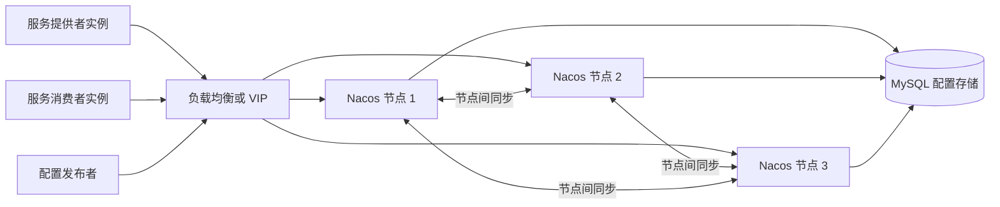
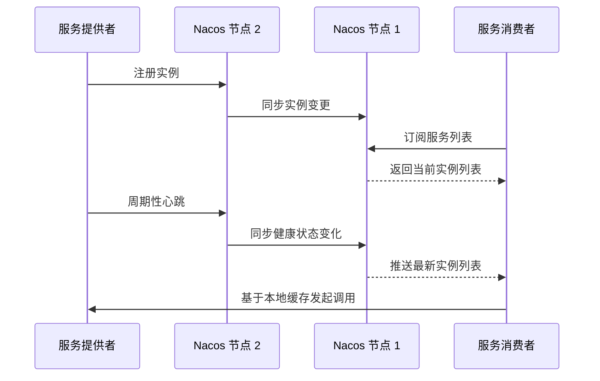

# Nacos 在分布式部署下不同实例之间是如何协作的

很多人第一次接触 Nacos 集群时，最容易把一个问题说得过于笼统：

- Nacos 做成多实例部署以后，实例之间到底是怎么协作的？

这个问题如果不先拆开，很容易把几件不同层面的事情混在一起：

- Nacos Server 节点之间如何同步数据。
- 服务提供者和 Nacos 节点如何协作完成注册与心跳。
- 服务消费者和 Nacos 节点如何协作完成订阅、推送与本地缓存。
- 配置发布后，不同 Nacos 节点和不同客户端又是如何一起完成变更传播的。

所以更准确的说法应该是：

- 在分布式部署下，Nacos 通过“客户端协作 + 节点间同步 + 本地缓存兜底 + 不同一致性策略”共同完成服务发现和配置管理。

本文就沿着这条主线，把 Nacos 在集群场景中的协作机制分层讲清楚。

## 一、先明确这里的“不同实例”到底指谁

在 Nacos 场景里，“实例”至少有三类。

### 1. Nacos Server 实例

也就是 Nacos 集群里的多个节点，例如：

- nacos-1
- nacos-2
- nacos-3

这些节点共同对外提供注册中心和配置中心能力。

### 2. 业务服务实例

例如订单服务有三个副本：

- order-service-1
- order-service-2
- order-service-3

它们会向 Nacos 注册自己，并持续上报自身状态。

### 3. 服务消费者实例

例如网关、商品服务、支付服务等调用方实例。它们会从 Nacos 订阅服务列表，并在本地完成负载均衡选择。

因此，所谓“不同实例之间协作”，实际包含两层：

- 业务实例和 Nacos 节点协作。
- Nacos 节点和 Nacos 节点协作。

真正把系统串起来的，是这两层协作同时成立。

## 二、从整体上看，Nacos 集群的协作拓扑是什么样的

在生产环境中，Nacos 一般不会单机部署，而是至少三节点集群，对外通过负载均衡暴露统一入口。

这个拓扑里有两个关键点。

### 1. 客户端通常只连其中一个 Nacos 节点

无论是注册、订阅还是配置监听，客户端在某个时刻通常只是在和一个具体的 Nacos 节点交互，而不是同时直接操作整个集群。

也就是说：

- 客户端看到的是一个集群入口。
- 实际处理请求的是某个具体节点。
- 集群正确性的关键，在于这个节点能否把变化传播到其他节点。

### 2. Nacos 的不同能力，底层协作方式并不完全一样

这点非常重要。

Nacos 不是只靠一套机制处理所有数据，而是根据数据类型选择不同策略：

- 临时实例注册信息，偏向高可用，主要使用 Distro 协议。
- 持久实例和部分服务元数据，偏向强一致，主要使用 Raft 协议。
- 配置中心数据，通常以共享存储为准，再结合集群内通知和客户端监听完成传播。

这也是为什么很多人学习 Nacos 时会同时看到 AP、CP、Distro、Raft、长轮询、gRPC 这些概念。

它们并不是互相冲突，而是在不同环节各司其职。

## 三、注册中心场景下，业务实例之间是如何通过 Nacos 协作的

先看最典型的服务发现流程，因为这也是 Nacos 最常用的场景。

### 1. 服务提供者启动后先向某个 Nacos 节点注册

当一个服务实例启动后，它会携带自己的元信息向 Nacos 注册，例如：

- 服务名。
- IP 和端口。
- 集群名。
- 权重。
- 元数据。
- 实例类型是否为临时实例。

注意，这个注册请求通常只会先到达某一个 Nacos 节点，而不是同时写入每个节点。

例如：

- order-service-1 把注册请求发给了 nacos-2。

此时 nacos-2 会先接住这个写请求，并把这条实例信息纳入本地服务目录。

### 2. Nacos 节点再把这次变更传播到集群内其他节点

接下来才进入“节点间协作”阶段。

如果这个实例是临时实例，Nacos 通常会走 Distro 这一套偏 AP 的同步逻辑。它的核心特点是：

- 允许请求先由某个接入节点处理。
- 集群内部再异步扩散这份实例数据。
- 某个短暂窗口内，各节点视图可能不是完全同步。
- 但系统可用性高，适合频繁心跳、频繁上下线的服务实例。

这正适合注册中心场景，因为服务实例变化本来就很频繁。

### 3. 服务消费者从某个节点订阅服务列表

服务消费者并不是每发起一次 RPC 就去 Nacos 查询一次完整服务列表，而是通常会先订阅服务。

订阅后会形成这样一条链路：

- consumer-1 连接到 nacos-1。
- nacos-1 返回当前 order-service 的实例列表。
- consumer-1 在本地缓存这份列表。
- 之后如果实例列表有变化，nacos-1 会尽快把变化推给 consumer-1。

因此，消费者和提供者并不是直接“彼此感知”的，它们是通过 Nacos 这一层目录协作的。

### 4. 消费者在本地完成负载均衡，而不是让 Nacos 代替调用

这一点经常被忽略。

Nacos 负责的是：

- 维护可用实例列表。
- 通知调用方实例变更。

而真正的请求选择通常发生在消费者本地，例如轮询、随机、权重或同集群优先。

也就是说，Nacos 的角色更接近“动态地址簿”，而不是远程代理转发器。

## 四、Nacos 节点之间如何协作处理临时实例

如果只记一句话，可以这样理解：

- 临时实例的协作重点是“高可用和快速传播”，允许短暂最终一致。

这背后的典型机制就是 Distro。

### 1. 为什么临时实例不适合用重型强一致流程

临时实例有两个特征：

- 数量可能很多。
- 上下线和心跳都很频繁。

如果每次心跳、每次注册、每次摘除都要求严格多数派确认，再返回成功，那么注册中心本身会成为高频写入瓶颈。

所以 Nacos 对临时实例的思路是：

- 优先保证服务注册与心跳处理足够轻。
- 集群内部尽快扩散数据。
- 接受短时间内不同节点状态略有滞后。

### 2. Distro 协作的本质是什么

可以把它理解为：

- 每条服务数据会有一个相对明确的负责节点或同步源。
- 某个节点接收到临时实例变化后，会把这份变化同步给其他节点。
- 其他节点保留一份副本，用于本地查询和故障恢复。

这套机制不追求“每次写入必须所有节点立刻一致”，而是追求：

- 大部分时间各节点都能快速收敛到一致视图。
- 即使某个节点短时异常，系统仍然能继续提供注册与发现能力。

### 3. 节点故障时会发生什么

假设 order-service-1 最初是通过 nacos-2 注册的，但 nacos-2 突然宕机。

只要客户端配置的不是单个固定地址，而是整个 Nacos 集群地址列表，那么通常会出现下面的行为：

- 服务实例重连到其他 Nacos 节点。
- 心跳连接迁移到新的可用节点。
- 其他节点根据已有副本和后续心跳继续维护实例状态。

这就是为什么 Nacos 集群部署时，客户端一定要配置多个 server 地址，而不是只写一个节点。

## 五、Nacos 节点之间如何协作处理持久实例和强一致数据

和临时实例不同，有些数据更强调一致性而不是写入吞吐，例如：

- 持久实例。
- 某些服务元数据。
- 需要明确全局提交结果的数据项。

这种情况下，Nacos 更倾向于使用 Raft 这类 CP 风格的协作方式。

### 1. Raft 协作的核心流程

可以概括成五步：

1. 集群中先选出一个 Leader。
2. 写请求最终由 Leader 负责接收和排序。
3. Leader 把日志复制给多个 Follower。
4. 超过半数节点确认后，这条日志被提交。
5. 提交成功后，结果再对外可见。

这样做的重点不是“快”，而是“所有人对最终结果有一致结论”。

### 2. 这种协作方式解决了什么问题

它解决的是下面这类风险：

- 两个节点都认为自己写成功了，但结果互相冲突。
- 网络抖动后，集群各自保留不同版本。
- 客户端读到的数据在全局上无法判定哪个才是权威版本。

因此：

- Distro 更适合高频变化、允许短暂不一致的临时注册数据。
- Raft 更适合必须有明确提交语义的数据。

这也是 Nacos 同时具备 AP 与 CP 特征的根本原因。

## 六、心跳机制是服务实例协作里的关键纽带

如果说“注册”解决的是服务上线时如何进入目录，那么“心跳”解决的就是服务运行过程中如何证明自己还活着。

### 1. 服务提供者为什么要持续发心跳

因为注册中心不能只相信一次注册结果。

实例注册成功之后，仍然可能随时出现：

- 进程崩溃。
- 容器被杀掉。
- 节点断网。
- 应用卡死但端口还在。

所以临时实例需要持续告诉 Nacos：

- 我还活着。
- 我的网络还通。
- 我仍然应该留在可用实例列表里。

### 2. 心跳超时后，Nacos 节点之间如何联动

当某个实例在规定时间内没有继续上报心跳时，Nacos 会逐步做两类处理：

- 先把它标记为不健康。
- 再在超时更长后把它从实例列表中摘除。

一旦状态变化发生，相关节点会继续把这次变化同步到集群内其他节点，随后再通知订阅该服务的客户端。

也就是说，一次心跳丢失最终会串起一整条协作链：

- Nacos 节点发现异常。
- Nacos 集群内部同步状态。
- 消费端本地缓存更新。
- 后续请求不再打到故障实例。

### 3. 为什么调用方不会一直命中已经宕机的实例

根本原因就在于：

- 消费者拿到的是动态实例列表，而不是静态地址配置。
- 实例状态变化会被持续传播。
- 消费者本地缓存会被刷新。

因此，故障实例即使不会在第一毫秒消失，也会在一个可控窗口内被逐步移出调用路径。

## 七、配置中心场景下，不同实例之间又是如何协作的

除了注册中心，Nacos 还承担配置中心角色。这个场景下的协作方式和服务发现不完全相同。

因为配置数据的特点是：

- 写入频率通常远低于心跳和实例变更。
- 但一旦发布，往往要求各客户端尽快看到同一个新版本。

### 1. 配置发布时的协作链路

一条典型链路通常如下：

1. 运维或业务系统把新配置发布到某个 Nacos 节点。
2. 该节点把配置写入共享存储。
3. 集群内其他节点感知到配置发生变化。
4. 正在这些节点上监听配置的客户端被通知配置已更新。
5. 客户端拉取新配置并刷新本地内容。

这里和注册中心最大的差别在于：

- 配置数据通常以共享存储中的结果为准。
- 客户端更关心的是“我什么时候感知到变更”。

### 2. 为什么客户端不必固定连到同一个 Nacos 节点

因为在集群模式下，配置的权威数据并不只存在于某个单点内存里。

只要：

- 各 Nacos 节点都接入同一份配置存储。
- 节点之间能正确感知变更。
- 客户端在连接断开后能切换到其他节点继续监听。

那么即使某个 Nacos 节点下线，客户端通常也能恢复配置监听能力。

### 3. 监听机制为什么重要

如果没有监听，客户端只能靠定时轮询去比对配置是否变化，这样会带来两个问题：

- 变更传播慢。
- 节点和客户端之间会有很多无效查询。

因此 Nacos 会结合长轮询或 gRPC 连接，让配置变化尽可能快地触达到监听方。

## 八、客户端本地缓存，是整个协作体系里非常重要的缓冲层

很多人理解 Nacos 时只关注“服务端怎么同步”，但真正让系统更稳的，往往是客户端本地缓存。

### 1. 服务发现为什么必须有本地缓存

如果每次业务调用都临时访问 Nacos，再拿实例列表，那么只要注册中心有短暂抖动，整个调用链就会被拖垮。

所以消费者通常会：

- 拿到服务列表后先缓存在本地。
- 正常情况下根据推送结果增量更新。
- 推送失败时，临时依赖本地缓存继续工作。

这等于给整个系统增加了一层缓冲。

### 2. 配置管理为什么也需要本地缓存

原因一样。

如果应用每次读取配置都必须实时向 Nacos 请求，那么 Nacos 一旦波动，应用自身也会被放大影响。

因此很多客户端都会把最近一次成功拉取到的配置保存在本地，作为异常情况下的兜底数据。

### 3. 本地缓存解决的不是一致性，而是可用性

这一点要分清楚。

本地缓存不能让多个节点天然一致，它解决的是：

- 注册中心短时不可达时，应用还能不能先继续跑。
- 配置中心短时抖动时，应用还能不能先使用上一版配置。

所以它是协作链条中的“弹性层”，不是“权威层”。

## 九、当某个 Nacos 节点宕机时，整个协作是如何继续的

这是最能体现集群价值的一类问题。

### 1. 对服务提供者的影响

如果提供者原本连的是 nacos-2，而 nacos-2 宕机了，客户端会尝试切换到其他 Nacos 节点重新建立连接并继续发送注册、心跳或续约请求。

只要其他节点可用，服务并不会因为单个 Nacos 节点故障就整体从注册中心消失。

### 2. 对服务消费者的影响

如果消费者原本从 nacos-2 订阅服务列表，那么它通常也会重连到其他节点，重新建立订阅关系。

在重连这段时间里，本地缓存会起到关键兜底作用。

### 3. 对配置监听的影响

如果应用监听配置时挂在某个失效节点上，连接断开后也会尝试切换到其他节点继续监听。

这就是为什么生产部署里：

- Nacos 必须多节点部署。
- 客户端必须配置节点列表或负载均衡地址。
- 不能把可用性建立在单节点直连上。

## 十、网络分区时，Nacos 为什么会表现出不同的数据语义

这其实就是 AP 和 CP 的经典权衡。

### 1. 对临时实例数据来说

Nacos 更强调可用性。

所以在短时网络异常下，某些节点上的实例视图可能会存在短暂滞后，但系统整体仍尽量维持注册与发现能力。

### 2. 对强一致数据来说

Nacos 更强调提交正确性。

如果当前节点所在分区拿不到多数派，那么它就不应该继续接受这类写请求，因为继续写下去会破坏全局一致性。

### 3. 为什么这不是“前后矛盾”

因为不同数据的业务价值不同：

- 临时实例数据追求的是快速、轻量、可恢复。
- 强一致数据追求的是确定、无冲突、可判定。

Nacos 不是在所有地方都用一种策略，而是在不同数据面上选择不同协作方式。

## 十一、把整条协作链压缩成一句话

如果要把全文浓缩成一句可记忆的话，可以这样理解：

- 服务实例先和某个 Nacos 节点协作完成注册或订阅，Nacos 节点再通过 Distro、Raft 或共享存储通知等机制把变化传播到整个集群，最后客户端依靠推送和本地缓存把这些变化转成真正可用的服务调用与配置生效结果。

这句话里其实刚好对应四个关键层次：

- 客户端接入某个节点。
- 节点间同步数据。
- 客户端感知变更。
- 客户端本地执行调用或刷新配置。

## 十二、总结

Nacos 在分布式部署下之所以能工作，不是因为“所有实例同时做同一件事”，而是因为不同角色分工明确：

- 服务提供者负责注册自己并持续发送心跳。
- 服务消费者负责订阅服务和维护本地缓存。
- Nacos 节点负责接收请求、同步数据、推送变更。
- 对临时实例，系统偏向 AP，用更轻量的方式快速扩散状态。
- 对需要强一致的数据，系统偏向 CP，用更严格的提交机制保证结果可靠。

所以，Nacos 的协作本质并不是“多机部署后自动互通”，而是通过一整套面向不同数据类型的同步策略，让：

- 集群内节点能交换状态。
- 客户端能快速感知变化。
- 单点故障不会直接放大成全局不可用。

理解了这一点，再去看 Nacos 的 Distro、Raft、心跳、推送、长轮询、本地缓存这些机制，就会发现它们并不是零散知识点，而是在共同回答同一个问题：

- 在分布式环境里，怎样让大量动态变化的实例仍然能被稳定地注册、发现、同步和使用。
