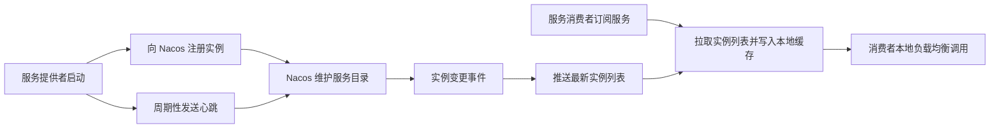
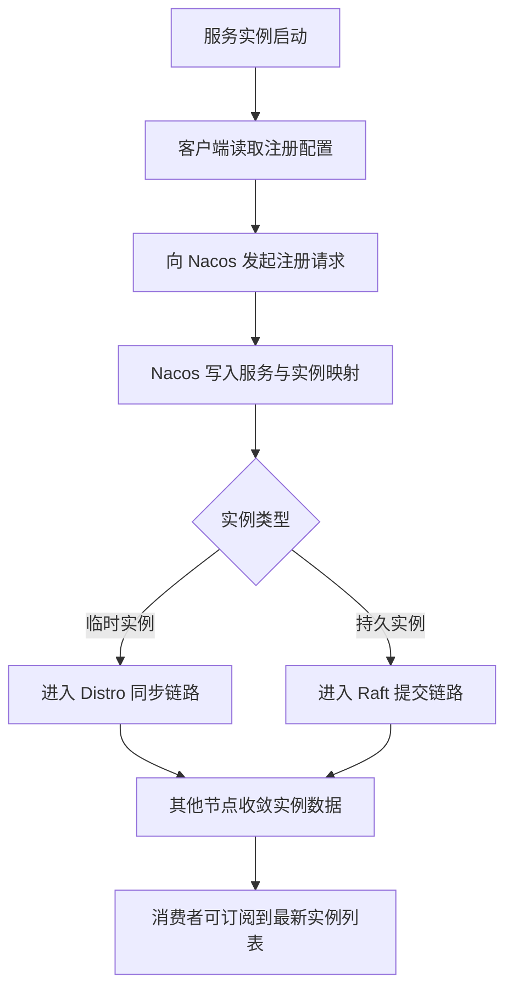
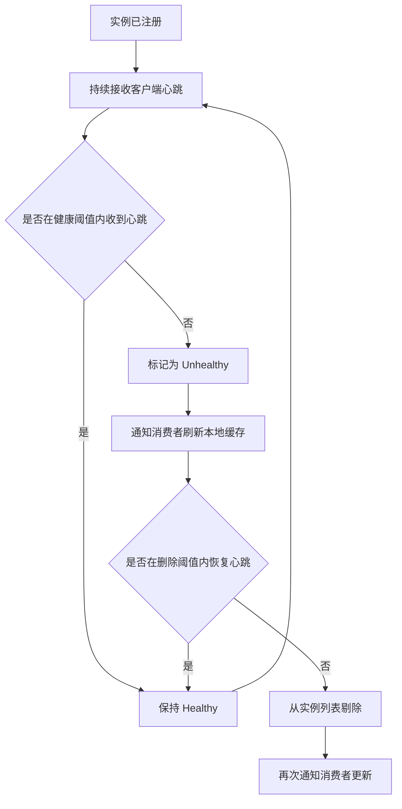
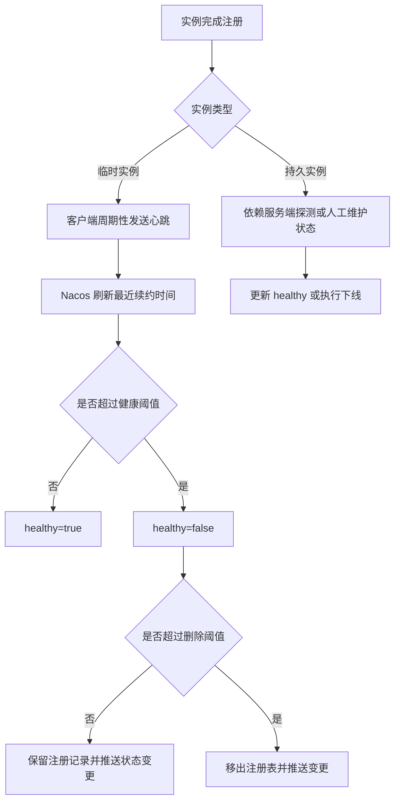

# Nacos 作为服务注册中心的原理与实现

在微服务体系里，服务实例通常是动态变化的：

- 服务会扩容和缩容。
- 实例会因为发布、故障、重启而频繁上下线。
- 调用方不能把服务地址硬编码在配置里长期不变。

这就决定了一个基础问题必须先被解决：

- 服务启动后，如何把自己的地址告诉整个系统。
- 调用方如何找到当前可用的实例列表。
- 某个实例失效后，系统如何尽快把它从调用路径上移除。

Nacos 作为服务注册中心，本质上就是在解决这三件事。

如果先只记一条主线，可以把 Nacos 理解成下面这个闭环：

- 服务提供者启动后向 Nacos 注册自己。
- Nacos 保存服务与实例的映射关系，并持续判断实例是否健康。
- 服务消费者向 Nacos 订阅服务列表。
- 当实例有变更时，Nacos 把最新结果推送给消费者，消费者再基于本地缓存做负载均衡调用。

所以，Nacos 的核心价值不是“存一份地址簿”这么简单，而是提供一套动态的服务目录维护机制。

## 一、为什么微服务一定需要注册中心

如果没有注册中心，调用方通常只有两种选择：

- 把服务地址写死在配置中。
- 依赖人工或脚本维护一份地址列表。

这两种方式在单体系统或规模很小的时候还能勉强工作，但到了微服务场景，很快会出现问题：

- 实例数量变化频繁，配置很快过期。
- 发布时实例地址变化，调用方感知不及时。
- 某个实例已经宕机，但调用方还在继续请求它。
- 多环境、多集群、多租户场景下，服务寻址规则会越来越复杂。

因此注册中心需要提供的不只是“查询地址”，而是下面四种能力：

- 注册：让服务提供者把自己暴露出来。
- 发现：让消费者能拿到实例列表。
- 健康管理：让不可用实例及时摘除。
- 变更通知：让实例变化尽快传播到消费端。

Nacos 的设计就是围绕这四件事展开的。

## 二、先看 Nacos 在注册中心场景里的几个核心角色

理解原理之前，先把参与者分清楚。

### 1. 服务提供者

服务提供者就是具体对外提供能力的应用实例。它启动后会向 Nacos 注册自己的元信息，例如：

- 服务名。
- IP 和端口。
- 所属集群。
- 权重。
- 是否健康。
- 是否临时实例。

这些信息共同描述了“我是谁、我在哪、我该怎么被调用”。

### 2. 服务消费者

服务消费者会向 Nacos 查询或订阅某个服务的实例列表。拿到结果后，消费者通常不会每次请求都实时访问 Nacos，而是：

- 在本地维护一份实例缓存。
- 收到变更通知时更新缓存。
- 调用时直接从本地缓存中做负载均衡选择。

这样做可以显著减少注册中心压力，也能避免把服务调用链路建立在“每次远程查表”上。

### 3. Nacos Server

Nacos Server 是注册中心本体。它负责：

- 接收实例注册请求。
- 保存服务元数据与实例列表。
- 接收心跳并判断健康状态。
- 对订阅者推送实例变化。
- 在集群模式下同步数据并维持一致性。

### 4. SDK 或客户端组件

业务应用一般不会直接手写 HTTP 请求去操作 Nacos，而是通过 Spring Cloud Alibaba、Nacos Java Client 或其他语言 SDK 接入。

客户端组件通常负责：

- 启动时自动注册。
- 定时发送心跳。
- 订阅服务变更。
- 维护本地缓存。
- 在多个 Nacos 节点之间做容错访问。

## 三、Nacos 的核心数据模型

Nacos 作为注册中心并不是简单用一个 serviceName 映射一组 IP。它有一套分层模型，用来支撑更复杂的服务治理场景。

### 1. Namespace

Namespace 用于环境或租户隔离。常见用法包括：

- 开发、测试、生产环境隔离。
- 不同业务租户隔离。
- 不同团队之间的资源隔离。

同名服务如果位于不同 Namespace，可以被视为彼此独立。

### 2. Group

Group 是服务分组维度，常用于在同一 Namespace 下再做逻辑归类。

例如：

- 默认分组 DEFAULT_GROUP。
- 按业务域划分订单组、支付组。

Group 的作用没有 Namespace 那么强隔离，但它能帮助系统在服务命名层面维持秩序。

### 3. Service

Service 是逻辑服务名，例如：

- user-service
- order-service
- inventory-service

调用方通常面向的是逻辑服务，而不是某个具体实例。

### 4. Cluster

Cluster 用于在同一服务下对实例进一步分组。它常被用来表达：

- 机房维度。
- 区域维度。
- 部署单元维度。

调用方可以优先选择同集群实例，从而降低跨机房调用成本。

### 5. Instance

Instance 是最小运行单元，也就是真正可被调用的那个进程节点。每个实例通常包含：

- IP
- Port
- Cluster
- Weight
- Metadata
- Healthy
- Ephemeral

这套模型决定了 Nacos 不只是保存“服务名 -> 地址列表”，而是在保存一份有治理语义的实例目录。

## 四、服务注册的完整流程

理解 Nacos 作为注册中心，最重要的是把一条注册链路走清楚。

### 1. 服务启动并加载注册配置

服务实例启动后，客户端会读取 Nacos 地址以及注册元信息，例如：

- 要注册到哪个 Namespace。
- 服务名是什么。
- 实例 IP 和端口是什么。
- 当前实例是临时实例还是持久实例。
- 权重和元数据是什么。

### 2. 客户端向 Nacos 发送注册请求

客户端随后向 Nacos Server 发起注册请求。对于注册中心场景，最常见的是临时实例，也就是 ephemeral instance。

注册成功后，Nacos 会把该实例加入对应服务的实例列表。

这一步的结果可以概括成：

- 逻辑服务名已经建立。
- 这个服务下新增了一个具体可用实例。

### 3. Nacos 在内存中构建服务目录

Nacos 服务注册相关数据优先存放在内存结构里，以支持高频读写与快速变更通知。

从抽象上看，它维护的是类似下面的关系：

- Namespace -> Group -> Service -> Cluster -> Instance List

当一个实例完成注册后，这条链路上对应的节点状态就会被更新。

### 4. 集群场景下同步到其他节点

如果 Nacos 是单机模式，到这里注册就结束了。但生产一般使用集群模式，因此还需要把这次变更传播到其他 Nacos 节点。

这里会牵涉到 Nacos 的一致性机制：

- 临时实例主要依赖 Distro 协议。
- 持久实例主要依赖 Raft 协议。

后面会专门展开解释这两套机制的差异。

## 五、临时实例为什么依赖心跳机制

Nacos 注册中心里有一个非常重要的区分：

- 临时实例。
- 持久实例。

默认场景下，大多数微服务注册的是临时实例。

### 1. 什么是临时实例

临时实例的含义不是“只存在几分钟”，而是：

- 它的生命周期由客户端心跳维持。
- 如果长时间收不到心跳，Nacos 可以认为它已经失效。
- 失效后，Nacos 会自动把它剔除。

这很适合微服务场景，因为应用实例本身就是动态的。

### 2. 心跳的作用是什么

心跳的本质不是重复注册，而是在持续回答一个问题：

- 这个实例现在还活着吗。

客户端会周期性向 Nacos 发送心跳包，Nacos 则根据心跳时间戳判断实例状态。

如果把逻辑简化，可以理解成下面三个阶段：

- 在可接受时间内收到心跳，实例保持健康。
- 超过健康阈值仍未收到心跳，实例先被标记为不健康。
- 超过删除阈值仍未收到心跳，实例会被剔除。

这里的价值在于：

- 短时网络抖动不会立刻删除实例。
- 持续失联的实例又能被自动清退。

### 3. 为什么先标记不健康，再删除

这是一个典型的可用性和稳定性平衡。

如果一旦心跳稍微延迟就直接删除：

- 系统会对瞬时抖动过度敏感。
- 实例列表会频繁震荡。

如果始终不删除：

- 故障实例又会长期停留在列表里。

所以 Nacos 通常采用两段式处理：

- 先摘流量。
- 再删实例。

这能让调用方尽快避开故障节点，同时给短暂异常留一点恢复空间。

## 六、服务发现是如何完成的

注册完成后，还要解决另一个问题：消费者如何拿到实例列表。

### 1. 查询不是每次调用都打到 Nacos

如果服务消费者每发起一次业务请求，都先远程调用注册中心查询实例列表，那么注册中心很快会成为瓶颈。

因此 Nacos 的正确使用方式通常是：

- 第一次获取服务列表时从 Nacos 拉取。
- 本地缓存实例列表。
- 后续通过订阅机制接收变更。
- 业务调用直接使用本地缓存。

这意味着 Nacos 主要承载的是“目录维护”流量，而不是“每次调用前实时寻址”流量。

### 2. 拉模型和推模型会结合使用

Nacos 的服务发现不是纯推，也不是纯拉，而是两者结合：

- 拉：客户端主动获取服务实例列表。
- 推：服务列表变化时，Nacos 通知订阅者更新。

这样设计有两个原因：

- 纯拉会让变更传播不够及时。
- 纯推又要求连接关系和通知链路始终稳定。

两者结合后：

- 推负责尽快传播变化。
- 拉负责在推送丢失或客户端重连后兜底校正。

### 3. 消费者为什么必须维护本地缓存

本地缓存不是权宜之计，而是注册中心架构里的关键设计。

它至少解决了三个问题：

- 降低对注册中心实时可达性的依赖。
- 降低查询延迟。
- 在注册中心短时波动时维持调用连续性。

因此从调用链角度看，消费者真正依赖的通常不是 Nacos 实时返回，而是 Nacos 持续更新的本地服务视图。

## 七、Nacos 如何判断实例是否可用

注册中心的难点从来不在“保存地址”，而在“判断地址现在还能不能用”。

在 Nacos 里，“可用”并不是一个单纯的布尔判断。一个实例最终会不会进入消费者的可调用列表，通常至少要同时经过下面几层判断：

- 这个实例是否仍然存在于注册表中。
- 这个实例是否被标记为 healthy。
- 这个实例是否被标记为 enabled。
- 这个实例是否满足调用方的集群、权重、元数据筛选条件。
- 在极端情况下，服务是否触发了保护阈值等兜底策略。

因此，判断实例是否“可用”，不能简单理解成“它有没有注册成功”，而要理解成“它是否仍然适合被放进当前消费者的路由结果里”。

### 1. 可用不等于已经注册

很多人第一次看 Nacos 时，容易把下面几个状态混为一谈：

- 已注册：实例记录存在于 Nacos 注册表中。
- 健康：实例当前被判定为可以正常接收流量。
- 启用：实例没有被人为关闭流量入口。
- 有流量资格：实例满足权重、集群、元数据等筛选条件。

这几个状态并不总是等价。

例如：

- 一个实例可以还在注册表里，但因为心跳超时已经被标记为不健康。
- 一个实例可以是健康的，但因为 enabled=false 而不参与流量分发。
- 一个实例可以注册且健康，但由于权重为 0 或不属于目标集群，而不会被当前消费者选中。

所以从原理上说，Nacos 对“可用性”的判断是分层的：

- 第一层看实例是否存在。
- 第二层看实例是否健康。
- 第三层看实例是否允许接流量。
- 第四层看消费者侧筛选后是否还会保留它。

### 2. 临时实例如何被判定为健康或不健康

临时实例是 Nacos 注册中心里最常见的模式，也是“健康判断”最核心的场景。

它的基本链路是：

1. 实例注册时声明自己是临时实例。
2. 客户端定时向 Nacos 发送心跳。
3. Nacos 收到心跳后，刷新该实例的最近续约时间。
4. 服务端定时扫描实例列表，比较“当前时间”和“最近心跳时间”的差值。
5. 如果差值超过健康阈值，实例会先被标记为 unhealthy。
6. 如果差值继续扩大并超过删除阈值，实例才会被真正移出注册表。

这意味着，Nacos 并不是“收不到一次心跳就判死刑”，而是通过两个不同阶段处理异常：

- 第一阶段先判断这台机器现在不适合继续接流量。
- 第二阶段再判断这条注册记录是否已经可以彻底删除。

这样做有两个明显好处：

- 对短时抖动更宽容，不会因为一次网络毛刺就把实例删掉。
- 对持续失效更敏感，能够在超时后自动完成摘除。

需要注意的是，这些超时阈值不是固定写死的概念值，而是实现层面可配置的策略。理解时更重要的是把握它的机制，而不是死记某个默认秒数。

### 3. 持久实例为什么不能按临时实例的方式理解

持久实例和临时实例最大的区别，不只是“一个持久、一个临时”，而是健康状态的来源不同。

对持久实例来说：

- 它通常不依赖客户端持续心跳来维持存在。
- 即使客户端不再发送临时实例那套续约信号，也不意味着它应当被自动删除。
- 它的健康状态更可能依赖服务端主动探测、运维操作或显式下线流程。

因此，持久实例的“可用性判断”更像是：

- 注册记录是否仍然存在。
- 探测结果是否健康。
- 管理端是否显式把它摘流量或下线。

这也是为什么临时实例适合高频伸缩的微服务节点，而持久实例更适合生命周期相对稳定、需要更强注册语义的数据节点或基础设施节点。

### 4. 服务端具体是如何完成健康判定的

从实现思路看，Nacos 服务端并不是在收到某个请求的瞬间，才临时计算一次实例是否健康。它更像是在持续维护一份实例状态表。

这张状态表至少会包含下面几类信息：

- 实例基础元数据，例如 IP、端口、集群、权重。
- 最近一次心跳时间或最近一次探测结果。
- 当前的 healthy 状态。
- 当前实例是否还应保留在注册表中。

随后，Nacos 通过后台任务不断做两类工作：

- 接收心跳或探测结果，刷新实例状态。
- 周期性扫描实例数据，判断哪些实例应该变成 unhealthy，哪些实例应该被删除。

因此健康判断本质上不是一次性动作，而是一个持续运行的状态收敛过程。

### 5. 健康变化后，消费者会看到什么

一旦实例状态发生变化，Nacos 通常会继续完成后续链路，而不是只在服务端内部改一个标志位。

典型流程是：

1. 服务端把实例状态从 healthy 改成 unhealthy，或者把实例直接移除。
2. 对应服务的注册表版本发生变化。
3. Nacos 把变化同步到集群中的其他节点。
4. 订阅该服务的消费者收到推送或在下一次拉取时得到新结果。
5. 消费者刷新本地缓存。
6. 后续负载均衡时，新的实例列表就不再优先选择这个异常节点。

这里要特别注意一点：

- 不健康并不一定意味着实例记录立刻消失。
- 但对多数正常消费者来说，不健康实例通常已经不应该再承接新流量。

也就是说，Nacos 区分了“还保留这条记录”与“还允许继续路由”这两件事。

### 6. 为什么有时实例已经异常，却没有立刻“彻底消失”

这是理解 Nacos 健康判断时最容易困惑的地方。

常见原因有四类：

- 它只是先被标记为 unhealthy，还没有走到删除阈值。
- 集群内部还在通过 Distro 或 Raft 传播这次状态变化，其他节点可能存在极短暂延迟。
- 某些消费者仍然持有旧的本地缓存，尚未完成刷新。
- 服务可能配置了保护阈值，健康实例比例过低时，Nacos 可能优先选择“不要把所有实例都摘光”。

最后这一点尤其值得单独理解。

Nacos 的目标不是机械地把所有异常都立刻清空，而是在“避免把故障实例继续放量”和“避免因为误判导致服务列表瞬间归零”之间做平衡。

所以在极端网络抖动、机房隔离或大规模波动场景下，Nacos 的可用性判断并不是绝对教条的，而是带有保护性策略的工程折中。

## 八、Nacos 的变更通知为什么比定时轮询更高效

如果只有定时轮询机制，消费者可能每隔几秒才发现服务列表变化。这会带来两个问题：

- 变更传播慢，故障摘除不及时。
- 轮询频率一高，注册中心压力又会增大。

Nacos 的改进点在于支持订阅与推送。

### 1. 服务列表变化后，Nacos 会主动通知订阅者

变更事件通常包括：

- 新实例注册。
- 实例下线。
- 实例健康状态变化。
- 权重、元数据等信息变化。

当这些信息变化后，Nacos 会把新的服务视图推送给订阅方。

### 2. 消费者更新本地缓存后再参与负载均衡

收到推送后，客户端会更新本地缓存。后续负载均衡选择实例时，使用的就是新列表。

也就是说，注册中心负责的是“目录收敛”，真正的调用决策通常还是在客户端本地完成。

这也是 Nacos 与很多客户端负载均衡框架能够自然配合的原因。

## 九、Nacos 集群为什么需要两套一致性机制

这是 Nacos 原理里最容易混淆，但也最重要的部分之一。

Nacos 在注册中心场景中，并不是所有数据都用同一种一致性协议处理。它区分了两类数据：

- 临时实例数据。
- 持久实例数据。

两者之所以分开处理，是因为它们对一致性和可用性的侧重点不同。

### 1. 临时实例使用 Distro 协议

临时实例依赖心跳，变化频繁，天然更强调可用性与写入吞吐。

因此 Nacos 对这类数据采用 Distro 协议。可以把它理解成一种面向 AP 的分布式同步方案，核心思路是：

- 每个实例数据会由某个节点负责。
- 客户端请求打到任意节点后，可被转发到负责节点处理。
- 负责节点处理完成后，再把数据异步同步到其他节点。

这样做的优点是：

- 注册和心跳处理效率较高。
- 节点短时异常时，整体服务发现能力仍能维持。
- 更适合高频变更的临时实例目录。

它的代价也很明确：

- 节点之间在短时间内可能不是绝对强一致。
- 不同节点看到的实例状态可能存在极短暂延迟。

但对于临时实例来说，这种取舍通常是合理的，因为：

- 实例数据本来就在快速变化。
- 调用方本身也依赖本地缓存和重试机制。
- 注册中心更需要先保证高可用。

### 2. 持久实例使用 Raft 协议

持久实例的语义不同。它通常不完全依赖客户端心跳驱动，也更强调数据持久性与一致性。

因此 Nacos 对这类数据采用 Raft 协议。

Raft 的核心特征是：

- 集群中有 Leader。
- 写操作先由 Leader 处理。
- 复制到多数节点后再提交。

这样做的结果是：

- 一致性更强。
- 数据状态更稳定。
- 但写入路径相对更重。

### 3. 为什么不能所有数据都统一用 Raft

理论上可以，但成本未必合适。

如果把高频心跳、频繁上下线的临时实例也全部放到强一致复制路径里：

- 写放大会非常明显。
- 集群处理压力会更高。
- 注册与续约时延也更容易上升。

所以 Nacos 的设计不是追求“所有地方都最强一致”，而是根据数据特征做分层取舍。

## 十、Distro 机制可以怎么理解

如果不展开源码，只从原理角度理解 Distro，可以抓住下面几个点。

### 1. 数据会有责任节点

某个服务或实例数据，会由集群中的某个节点负责处理。这个节点可以理解为该数据分片的 owner。

### 2. 非责任节点接收到请求时会转发

如果客户端把注册或心跳请求发到了非责任节点，该节点不会直接无规则地本地写入，而是把请求转发给责任节点处理。

这样做的目的是避免多点并发写入同一份服务数据时的混乱。

### 3. 责任节点再把结果同步出去

责任节点完成本地更新后，会把新的实例状态异步复制到其他节点，让整个集群逐渐收敛。

因此 Distro 的整体思路不是“所有节点同步投票后再写”，而是：

- 先确定谁负责。
- 由负责者接收主写入。
- 再把结果传播出去。

这种模式很适合服务注册中心里的高频临时数据。

## 十一、服务下线和故障摘除的过程

除了正常注册，注册中心还必须正确处理下线。

### 1. 正常下线

如果实例是正常停机，客户端通常会主动发送注销请求。Nacos 收到后会：

- 从服务实例列表中移除该实例。
- 同步或广播这次变化。
- 通知订阅者更新本地缓存。

这是一种最理想的下线方式，因为信息传播明确而且及时。

### 2. 异常下线

如果实例是宕机、进程崩溃或网络中断，它往往来不及主动注销。

这时 Nacos 主要依赖心跳超时机制：

- 先将实例标记为不健康。
- 随后在超时更长时彻底剔除。

因此，Nacos 的故障摘除并不依赖“服务自己承认失败”，而是依赖“服务无法继续证明自己还活着”。

## 十二、消费者在本地是如何使用实例列表的

Nacos 只解决“有哪些实例可用”，但“不从哪一个实例发请求”通常由客户端负载均衡决定。

常见选择策略包括：

- 随机。
- 轮询。
- 按权重。
- 优先同集群。

因此一次完整调用通常是这样发生的：

1. 消费者从本地缓存拿到某个服务的实例列表。
2. 过滤掉不健康实例。
3. 按负载均衡规则选择一个目标实例。
4. 发起真正的 RPC 或 HTTP 请求。

这意味着 Nacos 位于调用链之前，但不位于每次业务请求的同步主路径中。

## 十三、Nacos 作为注册中心的优势与边界

讨论原理时，最好把它的适用性也一起说清楚。

### 1. 优势

Nacos 作为注册中心的主要优势包括：

- 同时提供注册、发现、健康检查、变更推送能力。
- 对 Spring Cloud Alibaba 生态集成度高。
- 服务模型包含 Namespace、Group、Cluster 等治理维度。
- 支持临时实例和持久实例两种模式。
- 通过本地缓存和推送机制，能够兼顾性能与实时性。

### 2. 边界

它也有明确边界：

- Nacos 不直接替代网关、服务网格或全链路流量治理系统。
- 它解决的是“服务目录和实例状态管理”，不是全部调用治理问题。
- 如果消费者本地缓存策略、超时重试、熔断限流配置不合理，单靠注册中心也无法保证最终调用质量。

## 十四、把 Nacos 注册中心原理串成一条主线

如果把上面的内容压缩成一条完整链路，可以这样理解：

1. 服务提供者启动后，把自己的实例信息注册到 Nacos。
2. 对于临时实例，客户端继续通过心跳维持存活状态。
3. Nacos 在内存中维护服务到实例的映射，并在集群中通过 Distro 或 Raft 传播数据。
4. 服务消费者向 Nacos 订阅服务列表，并在本地保存缓存。
5. 当实例上下线或健康状态变化时，Nacos 把变更推送给订阅者。
6. 消费者基于最新缓存做负载均衡，避开故障实例，完成服务调用。

所以，Nacos 作为服务注册中心的本质，不是“提供一个远程查询地址的接口”，而是持续维护一份动态、可传播、可收敛的服务实例视图。

## 十五、结语

真正理解 Nacos 注册中心，关键不是记住几个接口名，而是把它背后的设计取舍看清楚：

- 为什么需要本地缓存，而不是每次远程查询。
- 为什么临时实例依赖心跳，而不是完全依赖服务端主动探测。
- 为什么集群里对临时实例和持久实例要采用不同一致性机制。
- 为什么注册中心关注的是“服务实例目录的动态维护”，而不是替代所有治理组件。

只要这几条主线是清楚的，Nacos 作为注册中心的工作方式就不会再显得零散。