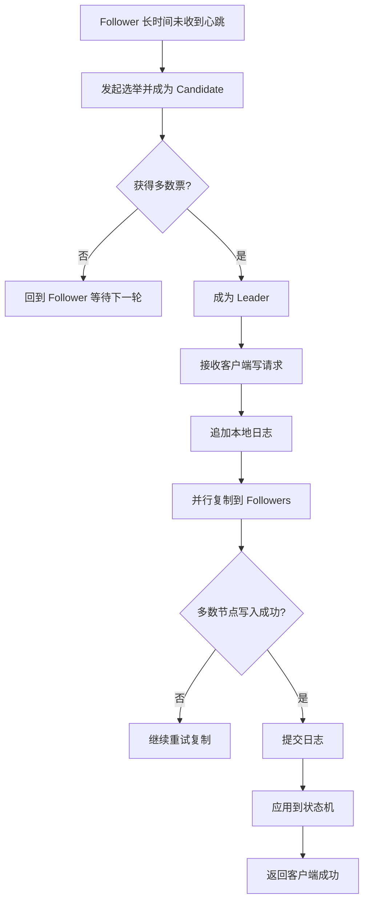

# Raft 协议是什么：原理、角色与工作流程

在分布式系统里，只要同一份数据被放在多个节点上，就会立刻出现一个核心问题：

- 某次写操作到底算不算成功。
- 多个节点的数据顺序如何保持一致。
- 某个节点宕机后，集群还能不能继续工作。
- 网络抖动或分区时，系统如何避免“各说各话”。

Raft 协议就是为了解决这类问题而设计的一种分布式一致性协议。

如果先用一句话概括它的本质，可以这样理解：

- Raft 通过“选出一个领导者，再由领导者统一接收写请求并复制日志”的方式，让多个节点最终对同一组状态达成一致。

它的目标不是让所有节点每时每刻都完全同步，而是让系统在故障、延迟、重试、节点切换这些现实条件下，依然能得到一个正确且可恢复的一致结果。

## 一、为什么需要 Raft

假设现在有三个节点共同维护一份配置数据或元数据：

- Node A
- Node B
- Node C

如果客户端直接随便向任意节点写入，很快就会出现问题：

- A 先收到了更新 1，B 先收到了更新 2。
- A 写成功后宕机，B 和 C 根本不知道这次更新。
- 网络分区后，两边都认为自己是“正确的一方”。

这说明分布式系统并不只是“多存几份数据”那么简单。真正困难的地方在于：

- 谁来决定写入顺序。
- 什么条件下写入才算提交成功。
- 发生故障后，如何保证恢复出来的数据仍然正确。

Raft 的设计就是围绕这三件事展开的。

## 二、Raft 到底解决了什么问题

Raft 主要解决的是复制状态机问题，也就是 Replicated State Machine。

可以把它理解成下面这个模型：

- 每个节点都维护一份相同的操作日志。
- 这些日志按完全相同的顺序依次执行。
- 只要执行顺序相同，最终状态就相同。

所以 Raft 的关键并不是“直接同步结果”，而是：

- 先保证所有节点拿到同一批日志。
- 再保证日志顺序一致。
- 最后在各节点上按顺序应用日志。

例如，一组状态变更可能是：

- 设置 key1 = value1
- 删除 key2
- 把 userA 的状态更新为 enabled

只要所有节点都按同样的顺序执行这几条操作，最终状态就会收敛一致。

## 三、Raft 的三个核心角色

Raft 集群中的节点在同一时刻通常处于三种角色之一：

- Leader
- Follower
- Candidate

### 1. Follower

Follower 是默认角色。大多数节点平时都处于这个状态。

它的特点是：

- 不主动发起写决策。
- 接收 Leader 的心跳和日志复制请求。
- 在超时后如果长时间收不到 Leader 消息，就会尝试发起选举。

Follower 更像“被动同步者”。

### 2. Leader

Leader 是整个集群在某一个任期内的唯一写入入口。

它负责：

- 接收客户端写请求。
- 为每个请求生成新的日志条目。
- 把日志复制给其他 Follower。
- 在多数节点确认后提交日志。
- 通过心跳维持自己的领导地位。

这意味着 Raft 把“谁来决定写入顺序”这个问题收敛成一个答案：

- 当前任期内只有 Leader 负责排序和推进提交。

### 3. Candidate

Candidate 是选举期间的过渡角色。

当某个 Follower 在选举超时时间内没有收到 Leader 心跳时，它会：

- 先把自己的任期加一。
- 将自己状态切换为 Candidate。
- 给自己投票。
- 向其他节点请求投票。

如果获得多数票，它就会成为新的 Leader；如果失败，则退回 Follower，等待下一轮。

## 四、Raft 的两个关键概念：Term 和 Log

如果想真正看懂 Raft，必须先理解两个基础概念。

### 1. Term：任期

Term 可以理解为“领导周期编号”。

每次发生新一轮选举，任期都会递增。比如：

- 第 1 次选举属于 term 1
- 下一次选举属于 term 2
- 再下一次属于 term 3

任期的作用非常关键：

- 它帮助节点识别新旧 Leader。
- 它帮助系统拒绝过期消息。
- 它让日志和投票都能绑定到明确的时间段。

只要一个节点看到比自己更大的 term，它就必须承认自己已经落后，并退回 Follower。

### 2. Log：日志

Raft 里的日志不是文本日志，而是操作记录序列。

每条日志通常包含：

- index：日志索引
- term：产生该日志时的任期
- command：具体状态变更命令

例如：

| index | term | command |
| --- | --- | --- |
| 1 | 3 | set x = 10 |
| 2 | 3 | set y = 20 |
| 3 | 4 | delete x |

日志是 Raft 的事实来源。节点最终是否一致，取决于它们的日志是否一致。

## 五、Raft 的整体工作流程

Raft 的核心流程可以概括成三段：

- 先选主。
- 再写日志。
- 最后提交并应用到状态机。

下面把它拆开看。

## 六、Leader 选举是怎么完成的

Raft 通过超时加投票机制完成选主。

### 1. 为什么要有选举超时

如果所有节点都在同一时刻发起选举，就容易出现平票。

因此 Raft 会给每个 Follower 设置一个随机选举超时，例如：

- 150ms 到 300ms 之间随机取值

这样一来，更早超时的节点更可能先发起选举，从而减少冲突。

### 2. 发起选举时会做什么

Candidate 会向其他节点发送 RequestVote 请求，请求里通常包含：

- 自己当前的 term
- 自己最后一条日志的 index
- 自己最后一条日志的 term

这些信息的目的，是让其他节点判断：

- 这个候选人的日志是不是足够新。
- 它有没有资格成为新的 Leader。

### 3. 什么情况下会投票

一个节点通常只会在满足条件时投票给 Candidate：

- 对方 term 不小于自己。
- 当前任期内自己还没有投给别人。
- 对方日志至少和自己一样新。

这里“日志至少一样新”非常关键，因为它避免了一个落后节点当选 Leader，进而把正确日志覆盖掉。

### 4. 为什么一定是多数票

Raft 用多数派来决定领导权，例如 3 个节点里要至少拿到 2 票，5 个节点里要至少拿到 3 票。

这样设计的意义在于：

- 任意两个多数派必然有交集。
- 有交集就意味着新旧两次决策之间不会完全断裂。
- 这为日志连续性和已提交数据不丢失提供了基础。

## 七、日志复制是怎么工作的

选出 Leader 后，真正的数据一致性主要靠日志复制完成。

### 1. 客户端写请求先到 Leader

客户端不能随便向某个 Follower 写入。标准做法是：

- 客户端把写请求发给 Leader。
- 如果发错节点，Follower 会重定向或拒绝。

这样做是为了保证所有写请求都进入同一条排序通道。

### 2. Leader 先写本地日志

Leader 收到请求后，并不会立刻把数据当成“全局成功”。它首先会：

- 生成一条新的日志记录。
- 把这条日志追加到自己的日志末尾。

注意，这时候通常只是 appended，还不是 committed。

### 3. Leader 把日志复制给 Followers

Leader 通过 AppendEntries 请求把新日志发给其他节点。这个请求既能承载日志复制，也能承载心跳。

请求里通常包含：

- Leader 当前 term
- 前一条日志的 index
- 前一条日志的 term
- 新日志条目
- Leader 的 commitIndex

之所以要带“前一条日志的位置和任期”，是为了做一致性校验。

### 4. Follower 如何校验日志一致性

Follower 收到 AppendEntries 后，不会无脑追加，而是先检查：

- 自己是否在 prevLogIndex 位置上有日志。
- 该位置日志的 term 是否和 Leader 提供的一致。

如果不一致，说明两边日志已经分叉，Follower 会拒绝本次追加。随后 Leader 会回退并重试，直到找到双方共同的最后一致位置，再把后续日志重新覆盖过去。

这一步是 Raft 收敛日志的关键。

### 5. 什么叫日志提交

一条日志并不是写到 Leader 本地就算完成，而是要满足：

- 该日志已经被 Leader 写入。
- 并且已经复制到多数节点。

只有这时，Leader 才会把它标记为 committed。

一旦 committed，Leader 就可以：

- 应用到本地状态机。
- 告诉 Follower 推进提交位置。
- 向客户端返回成功。

这意味着客户端感知到的“写成功”，本质上是“多数派已经接受了这条日志”。

## 八、为什么 Raft 能保证一致性

Raft 的可理解性很强，但它并不是靠“流程看起来整齐”来保证正确性，而是依靠一组严格的安全约束。

### 1. 选主安全性

同一任期内，最多只能有一个 Leader。

原因在于：

- 一个节点在同一任期通常只投一票。
- Leader 必须拿到多数票。
- 两个不同节点不可能同时拿到两个互不相交的多数派。

### 2. 日志匹配性质

如果两个节点在相同 index 上拥有相同 term 的日志，那么这条日志之前的所有日志也必然相同。

这是因为日志复制总是基于“前一条日志必须匹配”的前提向后推进。

### 3. 已提交日志不会被回滚

一条已经被多数派接受并提交的日志，不会在后续被新 Leader 推翻。

核心原因是：

- 新 Leader 必须从多数派中选出。
- 多数派之间一定有交集。
- 至少会有一个拥有已提交日志的节点参与新一轮选举。
- 候选人如果日志不够新，就拿不到票。

### 4. 状态机安全性

如果某个节点已经在状态机里执行了某条日志，其他节点在同一位置最终也只能执行相同日志，而不会执行另一条不同命令。

这保证了状态结果不会分叉。

## 九、Raft 如何处理故障场景

分布式协议的价值，恰恰体现在故障时仍然可预测。

### 1. Leader 宕机

如果 Leader 崩溃：

- Followers 在一段时间内收不到心跳。
- 超时后会发起新一轮选举。
- 选出新的 Leader 后继续提供服务。

只要仍然有多数节点存活，集群就能继续写入。

### 2. Follower 宕机

如果某个 Follower 挂掉：

- Leader 仍可继续处理请求。
- 后续日志会先在多数节点内复制。
- 待该 Follower 恢复后，再补齐缺失日志。

这说明少数节点故障不会影响整体可用性。

### 3. 网络分区

网络分区是最棘手的问题。

例如 5 个节点被切成 3 和 2 两部分：

- 3 节点那一侧因为拥有多数派，可以选出 Leader 并继续服务。
- 2 节点那一侧拿不到多数票，无法形成合法 Leader。

这正是多数派机制的价值：

- 宁可少数分区暂停写入，也不能允许两个分区各自独立写数据。

### 4. 节点重启和数据追赶

落后节点重启后，不需要自己猜状态，而是通过 Leader 的日志复制逐步追赶。

如果落后很多，还可能通过快照机制加速恢复，而不是从第一条日志开始重放。

## 十、快照机制为什么重要

如果日志永远只追加不裁剪，时间久了会有两个问题：

- 日志文件越来越大。
- 新节点或落后节点恢复太慢。

因此 Raft 通常配套快照机制。

快照可以理解为：

- 在某个提交点，把当前完整状态直接保存下来。
- 该快照之前的旧日志可以裁剪或压缩。

这样做有两个直接好处：

- 降低存储压力。
- 加快节点恢复和同步速度。

在工程实现里，Raft 往往不是“只有日志复制”，而是“日志复制 + 快照 + 故障恢复”一起构成完整方案。

## 十一、Raft 和 Paxos 的区别是什么

讨论一致性协议时，经常会把 Raft 和 Paxos 放在一起。

两者都能解决分布式一致性问题，但 Raft 更强调可理解性与工程可落地性。

可以从几个角度理解：

- Paxos 在理论上非常经典，但原始描述更抽象，工程团队理解和实现成本较高。
- Raft 把问题显式拆成领导者选举、日志复制、安全性约束几个部分，结构更清晰。
- Raft 强调强 Leader 模式，大部分写路径都围绕 Leader 展开，工程行为更直观。

所以很多系统在需要一个成熟、可实现、易运维的一致性协议时，会优先采用 Raft。

## 十二、Raft 在实际系统中的典型用途

Raft 适合那些需要“少量节点共同维护关键元数据”的场景，例如：

- 注册中心中的持久化元数据一致性。
- 配置中心中的配置变更复制。
- 分布式 KV 存储。
- 元数据管理系统。
- 需要主从切换且不能丢关键写入记录的控制面服务。

以 Nacos 为例，在其一致性设计中：

- 临时实例相关数据更偏向高频、短生命周期，常用 Distro 机制处理。
- 持久实例或一些核心元数据则更强调一致性，通常会借助 Raft 能力保证正确复制与提交。

这也是为什么在学习 Nacos 原理时，理解 Raft 会很有帮助。

## 十三、如何用一句更工程化的话理解 Raft

如果不想背定义，可以把 Raft 记成下面这条主线：

- 通过多数派选出唯一 Leader。
- 所有写请求先进入 Leader。
- Leader 先写日志，再复制给多数节点。
- 达到多数确认后提交。
- 所有节点按相同顺序应用日志，最终状态保持一致。

这条主线就是 Raft 最核心的工程思想。

## 十四、总结

Raft 协议本质上是一种面向工程实现的分布式一致性协议。它通过明确的角色划分、严格的任期机制、多数派选举和日志复制流程，把“多个节点如何对同一份状态达成一致”这个复杂问题，收敛成一套相对容易理解和实现的机制。

如果把全文压缩成几个最关键的结论，可以记住：

- Raft 解决的是复制状态机一致性问题。
- 它采用强 Leader 模式统一排序写请求。
- 一条日志只有复制到多数节点后才算真正提交。
- 多数派和日志新旧校验共同保证了安全性。
- 故障恢复、节点追赶和快照机制共同保证了它在真实系统中的可用性。

因此，Raft 不是单纯的“选主算法”，而是一整套围绕选主、复制、提交和恢复展开的一致性机制。