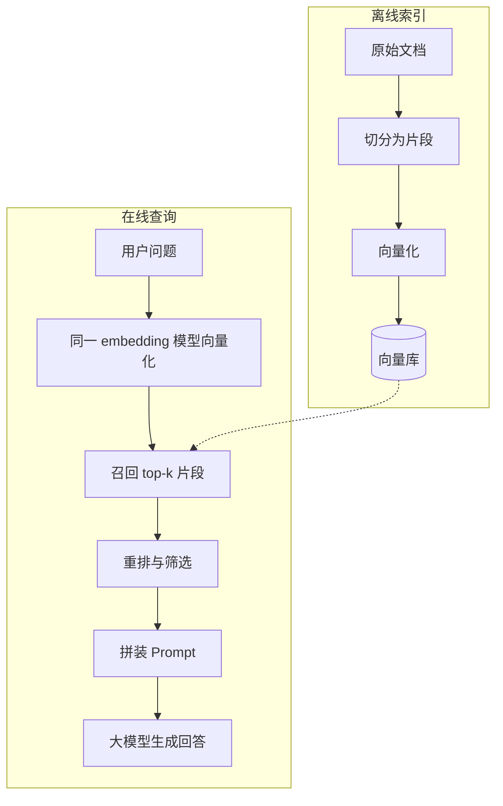

# RAG 是什么，解决了什么问题，以及它自身的问题

这篇文章介绍 RAG（Retrieval-Augmented Generation，检索增强生成）：它是什么，替纯参数化大模型补上了哪些短板，以及这套链路在真实工程里会怎么悄悄出问题。讨论对象是通用的“索引 — 检索 — 生成”流程，不绑定具体框架、embedding 模型或向量数据库，也不涉及向量索引的内部实现。

## 一句话定义

RAG 指的是：模型回答问题之前，先从外部知识库里检索几段相关内容，再把这些片段连同问题一起交给模型生成答案。

这个名字来自 Lewis 等人 2020 年的论文《Retrieval-Augmented Generation for Knowledge-Intensive NLP Tasks》（NeurIPS 2020，arXiv:2005.11401）。论文把知识分成两类：一类是参数化记忆，也就是预训练时压进权重的事实；另一类是非参数化记忆，也就是外部的文本索引。RAG 同时用上两者。区别在于，回答所依据的知识有一部分是请求时临时取出来的，而不是全部长在权重里。

## 基本链路

一次 RAG 问答分两步走：离线先把知识备好，在线再查再用。

离线阶段把文档切成片段（chunk）、转成向量，连同原文和元数据一起写进向量库；在线阶段用同一个 embedding 模型把问题也转成向量，在库里按相似度召回若干片段，可选地做一次重排（rerank），最后把筛过的片段和问题一起拼进 prompt。

这个结构带来两个直接的好处：知识库可以独立于模型替换和更新；而模型本身的推理与表达能力，仍然由权重决定。

## 它解决了什么问题

论文提出的三项开放问题，正好对应工程上最实在的三点收益。

先说时效。参数化记忆冻结在训练那一刻，之后的版本更新、价格调整、政策变化都不在其中。靠重训补知识成本高、周期长，而更新文档索引通常只是分钟级的事。

再说私有知识。内部流程、接口约定、历史工单、客户合同，这些内容公开语料里本来就不会有，放进外部索引是让通用模型回答这类问题最通行的做法。

然后是出处。模型凭记忆作答时说不清依据是什么，出了错也难定位；有了检索，答案可以附上引用片段供人核验。论文的原话是，RAG 生成的内容“更具体、更多样、更贴近事实”。

还有个工程上的好处：上下文长度有限，把整个知识库塞进 prompt 通常不现实，检索相当于每次只为当前问题挑一小部分相关内容进来。

不过有条边界要说清楚：RAG 注入的是事实，不是能力。模型的推理水平、指令遵循、输出格式和语言风格，不会因为接了检索就变好。

## 它可能存在什么问题

检索环节的失败有个讨厌的特点：不报错。链路某处断了，最后照样输出一份看起来挺合理的答案。常见的失效方式有这么几种。

**切分会破坏语义边界。** 一段完整的论证被从中间切断，单看片段可能读不通，也可能丢掉关键限定条件。粒度还不好拿捏：切得太短缺上下文，切得太长又稀释语义、挤占窗口。

**向量相似不等于语义相关。** 相似度高的片段可能只是措辞接近。反问句、否定句尤其危险，召回来的内容意思可能正好相反。型号、错误码、日期这类要精确命中的词，还得靠 BM25 这类关键词检索来配合。

**召回不到，模型照样作答。** 这是整条链路里最隐蔽的一环：没有召回正确的材料时，没有任何机制会喊停，模型会给出一段通顺但毫无依据的答案。这类错误也最难被发现。

**模型对上下文的位置敏感。** Liu 等人的《Lost in the Middle》（TACL，arXiv:2307.03172）在多文档问答里观察到一条 U 形曲线：相关信息放在开头或结尾时表现最好，放在中间则明显下滑；答案片段被摆到中间时，GPT-3.5-Turbo 的表现甚至低于完全不提供文档的基线（56.1%）。所以片段不是越多越好。

**模型自己的偏好仍在起作用。** 即便材料是对的，模型也可能视而不见、断章取义，或者当材料和权重记忆冲突时倒向后者。引用和结论对不上号也是常事。

**知识库的治理问题会被原样继承。** 过期文档、相互冲突的多版本内容，都会一字不差地进到答案里；文档级权限如果没有跟着片段走，还会造成越权可见。

**聚合和多跳问题天生不适配。** 需要跨文档组合推断的问题，或者需要计数、求和、取极值的提问（“一共有多少单”“哪个最贵”），单轮 top-k 召回在结构上就满足不了。

**评估也不好归因。** 检索指标（比如 Recall@k）和生成指标（比如忠实度）是两码事，手里没有一套分层评测集，出了问题就很难判断该改检索还是改生成。

## 什么时候不该用它

判断标准很直接：看你要解决的问题落在哪一层。

| 需求 | 更合适的做法 |
| --- | --- |
| 改变模型的行为方式：语气、格式、任务范式、领域推理习惯 | 微调或调整 prompt 示例，检索补不了这一层 |
| 知识体量小且长期稳定 | 直接写进 prompt 或 system 段，不必引入索引与检索的运维成本 |
| 精确结构化查询：订单数、库存、金额、最新状态 | 走数据库、SQL 或业务 API，向量检索是近似匹配 |
| 需要跨全库统计或聚合 | 同样交给查询层，模型的角色是组织答案而非计算 |

## 小结

RAG 的本质，是把“模型知道什么”和“模型能做什么”拆开来维护：知识放在外部，随时可更新、可标注来源；能力留在权重里。换来的是时效性、私有数据接入和可核验性，代价是一条可能安静失效的检索链路。所以答案出问题的时候，先怀疑切分和召回。
