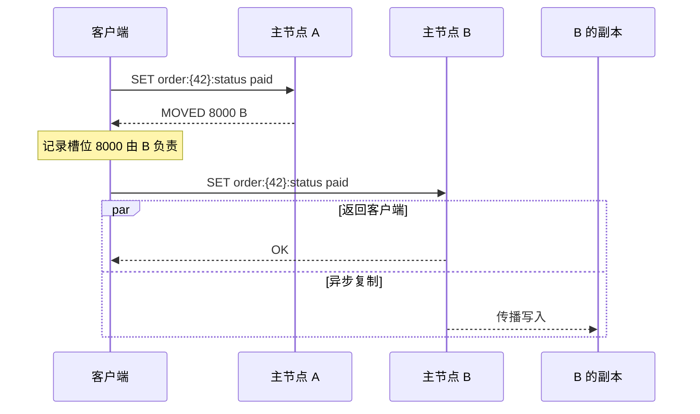
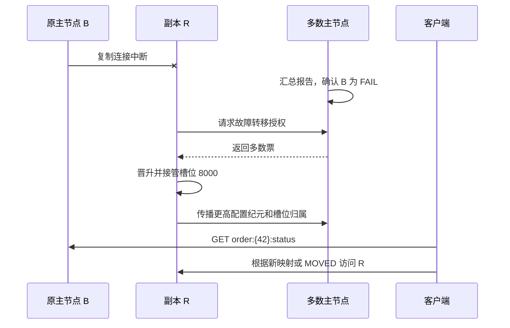

假设业务需要写入订单 42 的状态：

```text
SET order:{42}:status paid
```

这个 Key 第一次进入 Redis Cluster 时，客户端需要确定请求应该发给哪个节点。负责它的主节点失效后，集群需要找到新的节点继续提供服务。集群扩容时，这个 Key 还可能被迁移到另一个节点。

本文持续追踪 `order:{42}:status`，观察它在正常请求、主节点故障、槽位迁移和网络分区中的位置变化。讨论范围是 Redis Open Source 7.x 的核心集群模型，不涉及集群部署命令、源码调用链和参数调优。

## 第一次写入应该发给谁

先假设集群有三个主节点：

```text
主节点 A：负责槽位 0～5460
主节点 B：负责槽位 5461～10922
主节点 C：负责槽位 10923～16383
```

Redis Cluster 没有直接规定某个 Key 属于哪个节点，而是在 Key 和主节点之间加入了 16,384 个哈希槽：

```text
Key -> 哈希槽 -> 主节点
```

普通 Key 的槽位计算规则是：

```text
slot = CRC16(key) mod 16384
```

`order:{42}:status` 包含 Hash Tag。Redis 只对第一组非空花括号中的 `42` 计算 CRC16，因此它属于槽位 8000：

```text
order:{42}:status -> 槽位 8000 -> 主节点 B
```

这个结果也可以直接查询：

```redis
CLUSTER KEYSLOT order:{42}:status
```

```text
(integer) 8000
```

客户端不需要记录每个 Key 的节点地址，只需要保存槽位到主节点的映射。只要槽位 8000 仍归 B 所有，`order:{42}:status` 就由 B 负责。

固定槽位还隔离了节点数量变化。以后加入新节点时，`order:{42}:status` 的计算结果仍是 8000；集群只需改变槽位 8000 的归属，不需要改变这个 Key 的计算规则。

## 客户端第一次找错了节点

客户端可能尚未取得完整的槽位映射，也可能保存了过期映射。假设它把写入请求发给了 A，实际负责槽位 8000 的却是 B：



A 收到请求后会计算目标槽位。发现槽位 8000 不属于自己时，A 不会替客户端把命令转发给 B，而是返回 `MOVED`，其中包含槽位号和 B 的地址。客户端重新向 B 发送命令，并修正本地映射。

在集群稳定期间，后续访问通常不再经过 A：客户端计算出槽位 8000，直接向 B 发送请求。服务端不设置统一代理层，客户端承担正常请求的路由工作。

客户端的槽位表不需要与集群时刻同步。路由错误时，`MOVED` 可以把请求引向当前负责人。客户端可以只更新槽位 8000，也可以通过 `CLUSTER SHARDS` 重新获取完整拓扑。`CLUSTER SLOTS` 在 Redis 7.0 起已被标记为弃用，新客户端应优先使用 `CLUSTER SHARDS`。

## B 返回 OK 之后发生了什么

B 可以有一个或多个副本。图中的副本 R 会异步接收 B 的写入，保存 `order:{42}:status` 的副本，但槽位 8000 仍归 B 所有。R 此时不是第二个写入节点，也不会与 B 同时处理这个槽位的普通写请求。

“异步”意味着 B 向客户端返回 `OK` 时，不能假定 R 已经保存这次写入。B 可能刚确认请求就失效，而写入尚未到达 R。如果 R 随后晋升为主节点，`order:{42}:status` 可能不存在或仍是旧值。

`WAIT` 可以让客户端等待指定数量的副本确认已接收此前的写入，从而缩小这个窗口，但它不会使 Redis Cluster 获得强一致性。故障发生的时机、副本持久化状态和网络分区仍会影响最终结果。

客户端可以显式启用只读模式，从副本读取槽位 8000 的数据，但可能读到旧值。副本提供只读能力不等于取得槽位所有权；故障转移成功前，B 仍是这个槽位的主节点。

## 如果 B 突然失联

现在假设 B 无法与其他集群节点通信。集群不能只凭某个节点的一次连接失败就立即让 R 接管，否则局部网络抖动可能造成错误晋升。

Redis Cluster 的节点通过独立的 Cluster Bus 交换心跳、Gossip 信息和配置。故障判断分为两个阶段：

1. 某个节点持续超过 `cluster-node-timeout` 没有收到 B 对有效探测的响应，会在自己的视图中把 B 标记为 `PFAIL`。这只是本地的可能故障判断。
2. 节点通过 Gossip 收集其他主节点对 B 的判断。在有效时间窗口内，多数主节点都报告 B 处于 `PFAIL` 或 `FAIL` 后，B 才会被标记为 `FAIL`，并向其他可达节点传播这一状态。

副本也能探测并报告节点不可达，但 `FAIL` 的形成依赖主节点多数派的故障报告。多数派按集群中的主节点数量计算，不按副本数量计算。

此时，`order:{42}:status` 是否能继续访问，取决于 B 的副本能否接管槽位 8000。

## R 如何接替 B

R 看到自己的主节点 B 已进入 `FAIL` 后，可以参与故障转移。它需要满足复制数据足够新等候选条件，然后向集群中的主节点请求投票。



R 获得主节点多数票后晋升为新主节点，并使用一个更高的配置纪元声明自己负责 B 原来的槽位，其中包括槽位 8000。其他节点比较配置纪元后接受新配置，客户端也会通过重新获取拓扑或处理 `MOVED` 找到 R。

槽位所有权改变了，但 Key 的槽位没有改变：

```text
故障前：order:{42}:status -> 槽位 8000 -> B
故障后：order:{42}:status -> 槽位 8000 -> R
```

如果写入 `paid` 已经复制到 R，晋升后仍能读到它；如果写入尚未到达 R，它就可能丢失。这正是异步复制的故障窗口。

B 恢复连接后不能继续以原身份处理槽位 8000。它会收到更高配置纪元对应的新槽位配置，放弃已经被 R 接管的槽位。在典型故障转移中，B 随后成为 R 的副本。

如果 B 没有符合条件的副本，槽位 8000 将无人服务。默认配置要求全部槽位都有负责人，此时集群会进入失败状态并拒绝键命令。只有显式关闭完整槽位覆盖要求时，仍有负责节点的其他槽位才可能继续服务。即使存在可用副本，如果可达主节点不足多数，也无法完成自动选举。

## 扩容时这个 Key 如何移动

故障恢复后，假设集群加入主节点 D，并计划把槽位 8000 从 R 迁移到 D。D 加入集群本身不会自动获得已有数据，管理工具需要明确选择槽位并迁移其中的 Key。

迁移开始时，R 将槽位 8000 标记为 `MIGRATING`，D 将其标记为 `IMPORTING`。槽位里的 Key 随后逐批从 R 移到 D，因此迁移期间不能简单地认为槽位 8000 已经完全属于某一侧。

当客户端仍按旧映射访问 R 时，会出现两种情况：

- `order:{42}:status` 尚未迁移，仍存在于 R，R 直接处理请求。
- 这个 Key 已迁移到 D，R 找不到它，于是返回 `ASK`，要求客户端仅把本次请求发送给 D。

客户端收到 `ASK` 后，先向 D 发送一次 `ASKING`，再执行原命令。它不会立刻把槽位 8000 的稳定负责人改成 D，因为同一槽位中可能还有其他 Key 留在 R。

所有 Key 迁移完成后，槽位 8000 正式归 D 所有。此后客户端若继续访问 R，会收到 `MOVED`，然后把本地槽位映射更新为 D：

```text
迁移前：order:{42}:status -> 槽位 8000 -> R
迁移中：Key 可能在 R 或 D，使用 ASK 完成单次路由
迁移后：order:{42}:status -> 槽位 8000 -> D
```

因此，`ASK` 表示迁移期间的临时路线，只影响下一次请求；`MOVED` 表示槽位的稳定归属已经改变，可以更新客户端的槽位表。

Hash Tag 还会影响相关订单数据。`order:{42}:status` 和 `order:{42}:items` 都按 `42` 计算，因此属于槽位 8000，稳定状态下可以参与同槽多键操作。但在迁移期间，如果相关 Key 暂时分散在 R 和 D，多键操作可能收到 `TRYAGAIN`，需要等待迁移完成后重试。

## 网络分区时 paid 是否一定保留

现在回到最初的写入：客户端已经收到 `SET order:{42}:status paid` 的 `OK`。这个结果不能证明 `paid` 在所有故障下都会保留。

Redis Cluster 的自动故障转移依赖主节点多数派。发生网络分区后，多数派一侧只有在以下条件同时满足时才能恢复完整服务：可达主节点构成多数，并且每个失效主节点都有符合条件、可达的副本。少数派一侧不能独立完成合法的副本晋升。

与多数主节点失联超过 `cluster-node-timeout` 后，少数派中的主节点会停止接受写入。这能限制两个分区继续产生不同数据，但在停止之前仍存在写入窗口：

- 主节点确认 `paid` 后，在写入传播到副本前失效，晋升后的副本可能没有这个值。
- 客户端位于少数派一侧，在该侧停止写入前把 `paid` 写给旧主节点；多数派一侧随后晋升了另一副本，这次写入可能被丢弃。

Redis Cluster 的配置纪元能够决定哪个节点最终拥有槽位 8000，却不能合并两个分区中同一个 Key 的不同值。集群采用异步复制和“最后一次故障转移获胜”的配置收敛方式，目标是使槽位归属最终一致，而不是保证每个已确认写入在任意故障下都不丢失。

## 这个 Key 的完整路径

`order:{42}:status` 的槽位始终是 8000，变化的是负责该槽位的主节点：

| 阶段 | 槽位 8000 的状态 | 客户端如何找到数据 |
| --- | --- | --- |
| 正常运行 | B 负责，R 异步复制 | 根据槽位表直接访问 B |
| B 故障 | R 经多数派选举后接管 | 更新拓扑或处理 `MOVED` |
| 扩容迁移 | Key 暂时位于 R 或 D | 迁移期间处理 `ASK` |
| 迁移完成 | D 正式负责 | 根据新的槽位表访问 D |

沿着这个 Key 可以看到 Redis Cluster 各部分的职责：哈希槽决定数据归属，客户端负责正常路由，副本保存可接管的数据，主节点多数派确认故障和选举，配置纪元解决冲突的槽位声明，`ASK` 与 `MOVED` 则让客户端适应迁移和稳定配置的变化。

## 参考资料

- [Redis Cluster specification](https://redis.io/docs/latest/operate/oss_and_stack/reference/cluster-spec/)
- [Scale with Redis Cluster](https://redis.io/docs/latest/operate/oss_and_stack/management/scaling/)
- [CLUSTER SHARDS](https://redis.io/docs/latest/commands/cluster-shards/)
- [ASKING](https://redis.io/docs/latest/commands/asking/)
