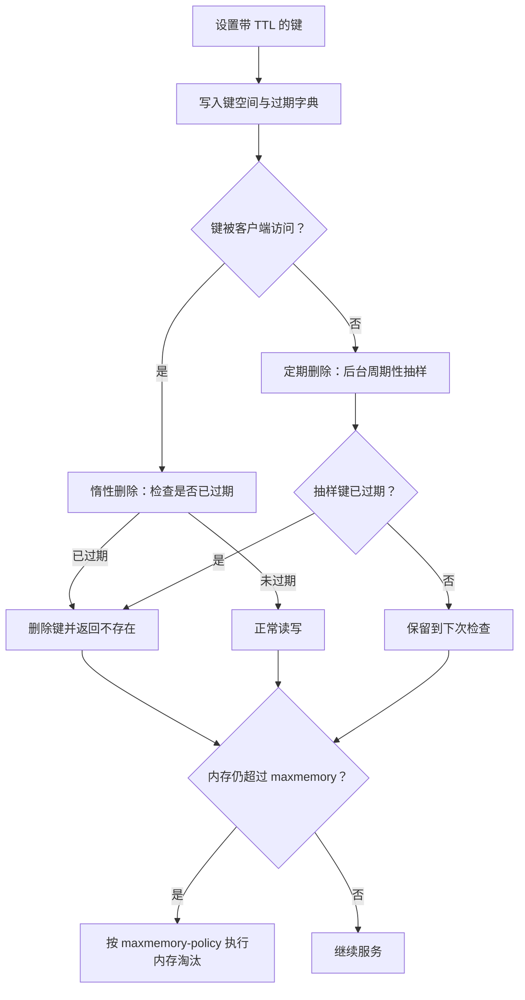

# Redis 数据过期策略有哪些：惰性删除、定期删除与内存淘汰如何实现

缓存不是永久存储。登录态、验证码、热点查询结果等数据都有明确的有效期；如果过期数据始终留在内存中，Redis 的内存会不断增长，最终影响正常服务。

Redis 对这个问题的处理并不是“到点立即删除”。它组合使用了**惰性删除**和**定期删除**来清理已过期的键；当已使用内存仍超过 `maxmemory` 时，再根据配置执行**内存淘汰**。三者解决的问题相关，但触发条件和取舍不同。

一句话概括：**过期删除处理“带 TTL 的键何时失效并释放空间”，内存淘汰处理“内存达到上限时保留哪些数据”。**

## 先理解：Redis 怎样记录过期时间

Redis 的每个数据库都维护两类核心映射：

- 键空间：保存键和值；
- 过期字典：保存“带过期时间的键”与其绝对过期时间。

过期时间使用毫秒精度的 Unix 时间戳表示。设置 `EXPIRE key 60` 时，Redis 会把相对的 60 秒换算成绝对时间；`EXPIREAT`、`PEXPIRE`、`PEXPIREAT` 本质上也是在更新同一份过期元数据。

```text
键空间
  session:1001  ->  "...用户会话数据..."

过期字典
  session:1001  ->  1760000060000（绝对过期时间，毫秒）
```

值并不直接嵌入过期时间。通过独立的过期字典，Redis 既能快速判断某个键是否超时，又不必为每个普通键附加 TTL 信息。

当客户端执行 `TTL` 或 `PTTL`，Redis 返回的是剩余时间；返回 `-1` 表示键存在但没有过期时间，返回 `-2` 表示键不存在或已经过期。

## 为什么不在过期瞬间创建一个删除任务

最直观的方案是：为每个设置了 TTL 的键注册定时器，时间一到立刻删除。Redis 没有采用这种设计。

原因在于，Redis 可能拥有大量带 TTL 的键。为每个键维护独立定时器会产生可观的内存和调度开销；如果大量键在同一时刻到期，集中触发的删除工作还可能阻塞事件循环，放大请求延迟。

Redis 选择“访问时检查 + 后台抽样清理”的组合：



## 策略一：惰性删除

惰性删除（lazy expiration）指的是：**只有当客户端访问一个带过期时间的键时，Redis 才检查它是否已经过期。**

一次读取大致会经历以下过程：

1. 客户端请求访问某个键；
2. Redis 发现该键带有过期时间；
3. 比较当前时间与记录的绝对过期时间；
4. 若已过期，删除键空间和过期字典中的记录，随后把该键当作不存在处理；
5. 若未过期，继续执行原命令。

例如，一个键的 TTL 是 10 秒。第 11 秒没有任何请求访问它，它仍可能暂时占用内存；当第 30 秒第一次有人执行 `GET` 时，Redis 会先删除它，再返回空结果。

惰性删除的优点是把无用工作降到最低：不被访问的键不会反复检查，也不会为每个键维护定时任务。缺点同样明显：如果大量过期键永远不再被访问，它们会长期留在内存中。因此 Redis 还需要定期删除作为兜底。

需要注意，惰性删除并不意味着“过期键仍能被读到”。在 Redis 的正常命令路径中，发现键过期后会先使其失效；从客户端语义看，过期键等同于不存在的键。

## 策略二：定期删除

定期删除（active expiration）是 Redis 在后台周期性执行的过期键清理工作。它不是遍历整个过期字典，而是从各个数据库的过期字典中**抽样**检查一批键：发现过期就删除，未过期则保留。

抽样而不是全量扫描，是为了避免键数量很大时一次清理占用过多 CPU，导致主线程无法及时处理网络请求。定期删除追求的是在内存回收及时性与请求延迟之间取得平衡，而不是承诺每个键到点立即释放。

### 慢速周期与快速周期

Redis 的过期清理包含两类执行机会：

- **慢速周期**：由服务器周期性任务触发，按 `hz` 的频率运行。默认 `hz` 为 10，可理解为每秒有大约 10 次常规维护机会。
- **快速周期**：当上一轮清理发现仍有较多过期键时，会在事件循环的空闲间隙追加更积极的清理，帮助更快消化过期键积压。

每轮清理都会受到时间预算约束。Redis 会检查已抽样键中的过期比例：如果比例较高，说明可能还有许多过期键，当前轮会继续抽样；如果比例已经较低，或时间预算耗尽，就停止并等待下一轮。这样能够避免清理任务无限占用 CPU。

`active-expire-effort` 用于调节主动过期的力度，取值范围是 1 到 10，默认值为 1。提高它会让 Redis 更积极地回收过期键，但也会增加 CPU 消耗和延迟压力。生产环境通常应先观察 `expired_keys`、内存使用率与延迟，再谨慎调整，而不是一开始就设为最大值。

### 为什么定期删除仍可能留下过期键

抽样算法并不保证立刻抽到每一个过期键。特别是以下场景中，已过期键可能短暂残留：

- 过期键分散在很大的键空间中，抽样命中率低；
- 短时间内有大量键同时到期；
- Redis 正忙于处理命令、持久化或其他耗时任务，过期任务可用的时间预算有限；
- 为了控制 CPU 占用，配置了较低的主动过期力度。

这不是数据一致性问题，而是内存回收时机的取舍。只要键被访问，惰性删除会立即补上；未被访问的过期键则由后续定期删除逐步回收。

## 策略三：内存淘汰

内存淘汰（eviction）并不等于过期删除。它只在配置了 `maxmemory`，并且 Redis 判断内存使用量超过该上限、又需要继续分配内存时才会介入。

淘汰对象取决于 `maxmemory-policy`。有的策略只从设置了 TTL 的键中选择，有的策略可以从全部键中选择；它选择的是“适合让出空间的键”，该键不一定已经过期。

常用策略如下：

| 策略 | 候选范围 | 选择方式 | 适用含义 |
| --- | --- | --- | --- |
| `noeviction` | 无 | 不淘汰 | 默认策略；写入类命令通常返回 OOM 错误 |
| `allkeys-lru` | 所有键 | 优先淘汰最近最少使用的键 | 通用缓存场景 |
| `volatile-lru` | 仅带 TTL 的键 | 优先淘汰最近最少使用的键 | 只有带 TTL 键可淘汰 |
| `allkeys-lfu` | 所有键 | 优先淘汰访问频率较低的键 | 热点稳定、希望保留高频数据 |
| `volatile-lfu` | 仅带 TTL 的键 | 优先淘汰访问频率较低的键 | 受 TTL 范围限制的 LFU |
| `allkeys-random` | 所有键 | 随机淘汰 | 对访问模式不敏感的简单场景 |
| `volatile-random` | 仅带 TTL 的键 | 随机淘汰 | 仅从带 TTL 键随机选择 |
| `volatile-ttl` | 仅带 TTL 的键 | 优先淘汰剩余 TTL 更短的键 | 让即将过期的数据先让出空间 |

`volatile-*` 策略有一个常见陷阱：如果当前没有带 TTL 的键可淘汰，Redis 无法从候选范围中释放内存，写入仍可能失败。把 Redis 作为纯缓存时，通常更常见的是 `allkeys-lru` 或 `allkeys-lfu`；把 Redis 同时作为缓存和重要数据存储时，则必须更谨慎地设计键空间和写入失败的处理方式。

Redis 的 LRU 与 LFU 也不是维护全量精确排序。为了控制成本，它会从候选范围中抽样，再从样本中选择更合适的淘汰对象。可通过 `maxmemory-samples` 调整抽样数量：样本越大，结果通常越接近理想策略，但 CPU 开销也更高。

## 不同淘汰策略是如何实现的

一次写入需要分配内存时，Redis 会先检查是否超过 `maxmemory`。如果超限，它会优先尝试清理已经过期的键；空间仍不足时，才进入由 `maxmemory-policy` 决定的淘汰流程。`noeviction` 没有候选筛选过程，而是让会增加内存的写入命令失败并返回 OOM 错误。

其余策略首先确定候选字典：`allkeys-*` 从当前数据库的全部键空间中抽样，`volatile-*` 从过期字典中抽样，因此只能选择带 TTL 的键。Redis 不会为所有键维护一条全局排序链表；每次从候选字典随机取得最多 `maxmemory-samples` 个键，评估后把较优的候选者放入一个固定大小的淘汰候选池，再从池中取出本轮最合适的键删除。这个候选池让多次抽样的结果可以累积，近似效果优于只在单次样本中挑一个键，同时避免全量排序的内存与 CPU 成本。

当一次删除释放的内存还不够时，Redis 会重复“抽样、筛选、删除”的过程，直到回收到足够空间、没有可淘汰键，或达到本轮淘汰工作允许的时间上限。`maxmemory-eviction-tenacity` 会影响 Redis 为这项工作愿意投入的时间；数值越高，越倾向于在当前事件循环中持续淘汰以完成写入，也越可能增加其他请求的延迟。

### LRU：用最近访问时间估算冷数据

`allkeys-lru` 和 `volatile-lru` 比较的是键的空闲时间。Redis 在对象元数据中记录最近访问所对应的逻辑时钟值；淘汰时计算“当前 LRU 时钟减去该键记录值”，差值越大，表示越久没有被访问，优先被放入候选池。

这里的 LRU 是近似算法，而非严格 LRU：Redis 不会在每次读写时把键移动到一个全局双向链表的头部，也不会扫描所有键找最久未访问者。它只比较抽样和候选池中的键，因此 `maxmemory-samples` 越大，结果通常越接近“真正最久未使用”，但也不保证完全相同。

### LFU：用衰减后的访问频率估算热度

`allkeys-lfu` 和 `volatile-lfu` 使用对象元数据中的 LFU 信息。该信息同时保存访问计数器和上次衰减时间：键每次被访问时，Redis 先按时间衰减旧计数，再以概率方式增加计数。

计数增长采用对数近似：计数越大，下一次增长所需命中的概率越低。这样既能区分冷键与热点键，又不会让极热键的计数无限快速膨胀。长时间没有访问的键会随着 `lfu-decay-time` 指定的周期逐步降低计数，因此 LFU 关注的是“近期仍然活跃的频率”，而不只是历史总访问次数。淘汰时，计数更小的键优先被选择。

`lfu-log-factor` 控制计数增长速度：值越大，计数增长越慢、热点分层越平缓；`lfu-decay-time` 控制衰减周期。二者都应配合真实访问曲线调节，不能把计数器直接理解为精确的请求次数。

### TTL 与随机：更简单的候选排序

`volatile-ttl` 只从过期字典取样，再比较各键的剩余 TTL，剩余时间更短的键优先淘汰。它并不检查键的访问热度，适合“即将失效的数据更值得先丢弃”的场景。

`allkeys-random` 与 `volatile-random` 不维护冷热指标，也不需要候选排序：前者从全部键空间随机选取，后者从过期字典随机选取。它们开销低、行为可预测性较弱，通常只适合访问分布相对均匀或不关心命中质量的场景。

## 淘汰所依赖的数据如何统计与查看

Redis 为 LRU、LFU 和 TTL 策略维护的数据粒度并不相同：

| 策略 | 键级元数据 | 更新时机 | 淘汰比较方式 |
| --- | --- | --- | --- |
| LRU | 最近访问的逻辑时钟 | 读取或写入键时 | 空闲时间越长越优先淘汰 |
| LFU | 近似频率计数与最近衰减时间 | 读取或写入键时 | 衰减后计数越小越优先淘汰 |
| volatile-ttl | 过期字典中的绝对过期时间 | 设置、更新或移除 TTL 时 | 剩余 TTL 越短越优先淘汰 |
| random | 无冷热统计 | 不适用 | 直接随机选择 |

可以使用下列命令检查单个键和实例级指标：

```redis
OBJECT IDLETIME cache:product:42
OBJECT FREQ cache:product:42
TTL cache:product:42
MEMORY USAGE cache:product:42

INFO stats
INFO memory
INFO keyspace
CONFIG GET maxmemory maxmemory-policy maxmemory-samples
CONFIG GET lfu-log-factor lfu-decay-time maxmemory-eviction-tenacity
```

`OBJECT IDLETIME` 显示键自上次访问以来的大致秒数，适合观察 LRU 元数据；`OBJECT FREQ` 显示 LFU 的近似频率计数，适合观察 LFU 元数据。两者会随当前淘汰策略而受限：启用 LFU 策略时不能用 `OBJECT IDLETIME`，启用 LRU 策略时不能用 `OBJECT FREQ`。`TTL` 和 `MEMORY USAGE` 分别帮助确认候选范围与单键内存成本。

实例层面，`INFO stats` 的 `keyspace_hits`、`keyspace_misses` 可计算缓存命中率，`evicted_keys` 是启动以来因内存淘汰删除的键总数，`expired_keys` 是过期删除的键总数；`INFO memory` 中的 `used_memory`、`maxmemory` 和内存碎片相关字段用于判断内存压力；`INFO keyspace` 会按数据库给出键数量、带 TTL 键数量和平均 TTL。它们都是累计或瞬时观测值：要判断某一时间段是否发生异常淘汰，应结合监控系统中的增量、命中率和请求延迟一起分析。

## 三种机制如何配合

可以把三种机制放到不同问题中理解：

| 机制 | 触发条件 | 删除对象 | 主要目标 |
| --- | --- | --- | --- |
| 惰性删除 | 访问带 TTL 的键 | 已过期键 | 保证访问语义正确，避免无谓扫描 |
| 定期删除 | 后台周期任务 | 抽样到的已过期键 | 回收长期未访问的过期数据 |
| 内存淘汰 | 超过 `maxmemory` 且需要内存 | 由淘汰策略选出的键 | 控制内存上限并决定写入行为 |

一个键设置 TTL 后，通常先由惰性删除或定期删除处理；但如果内存上限已经触发，它也可能在尚未过期时被内存淘汰。反过来，一个已经过期却未被删除的键会暂时占用内存，主动过期会尽力回收它；内存紧张时，淘汰过程也会促使 Redis 释放空间。

## 过期键删除后发生什么

删除过期键不只是从字典中移除记录。Redis 还需要释放值对象占用的内存、更新统计信息，并在必要时传播删除动作。

对于复制和持久化，主节点会把过期键的删除作为 `DEL` 操作传播给副本和 AOF，从而让副本保持一致。副本通常不会自行在后台主动删除过期键，而是等待主节点发送删除命令；当副本接到客户端读取请求时，也会把已经逻辑过期的键视为不存在，避免把过期数据直接暴露给客户端。

RDB 持久化时，Redis 不会把已过期的键写入新生成的 RDB 文件；加载 RDB 时，主节点会跳过已过期键。这样可以避免“重启后过期键复活”。

## 常用命令与配置示例

为键设置过期时间：

```redis
SET verification:13800138000 9527 EX 300
EXPIRE verification:13800138000 300
PEXPIRE verification:13800138000 300000
TTL verification:13800138000
PERSIST verification:13800138000
```

其中，`SET ... EX 300` 会在写入时同时设置 300 秒 TTL；`PERSIST` 会移除过期时间，但不会删除键。

限制内存并选择淘汰策略：

```conf
maxmemory 2gb
maxmemory-policy allkeys-lfu
maxmemory-samples 10
active-expire-effort 1
```

可以通过以下命令查看运行状态：

```redis
INFO stats
INFO memory
CONFIG GET maxmemory-policy
```

`INFO stats` 中的 `expired_keys` 用于观察已过期键的删除数量，`evicted_keys` 用于观察内存淘汰数量。两者都在持续增长并不一定代表故障：前者可能是业务 TTL 正常到期，后者则说明内存压力已经实际触发，应结合命中率、延迟和写入错误进一步判断。

## 总结

Redis 没有为每个 TTL 键建立独立定时器，而是用惰性删除保证访问时的正确性，用定期删除回收长期未访问的过期键，并在内存真正达到上限时用淘汰策略保护实例容量。

实际设计时，先用 TTL 定义数据的业务生命周期，再用 `maxmemory` 和 `maxmemory-policy` 定义内存紧张时的行为，最后通过 `expired_keys`、`evicted_keys`、命中率和延迟持续验证配置是否符合预期。把这三层边界分清，才能既避免内存失控，也避免把缓存淘汰误解成业务数据过期。

## 参考资料

- [Redis 键过期官方文档](https://redis.io/docs/latest/commands/expire/)
- [Redis 内存优化与淘汰策略](https://redis.io/docs/latest/develop/reference/eviction/)
- [Redis 复制官方文档](https://redis.io/docs/latest/operate/oss_and_stack/management/replication/)
