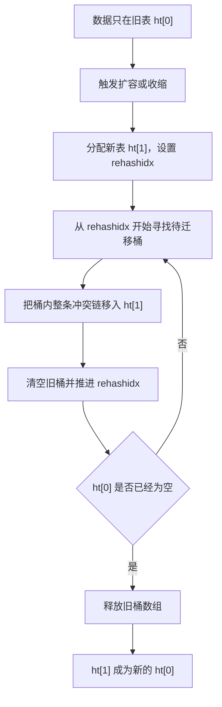
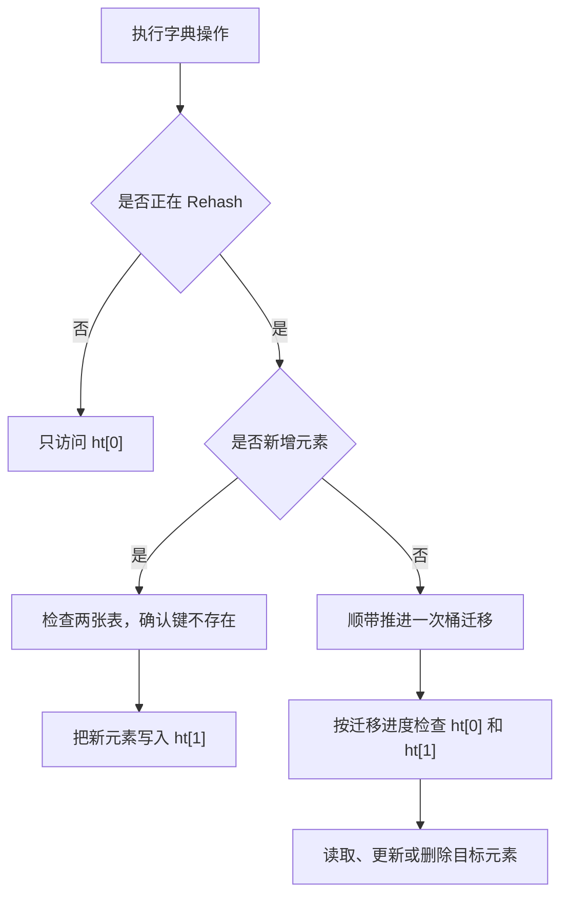
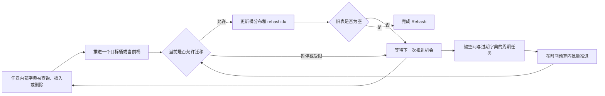

本文以 Redis 7.4 为基础，说明内部 Hash Table 为什么采用渐进式 Rehash，以及双表迁移、迁移期间的读写、迁移推进时机和阶段性开销。数据库键空间和采用哈希表编码的 Hash 对象都会使用这种底层字典。

Redis 选择渐进式 Rehash，核心原因是避免一次迁移长时间占用命令执行的主线程。迁移的总工作量没有减少，只是从一个连续的大任务变成了多个可以暂停的小任务。

## 一次性 Rehash 为什么不合适

哈希表通过桶数组保存元素。容量变化后，键对应的桶位置也可能变化，因此扩容或收缩不能只替换数组，还要重新安排已有元素。

如果旧表包含数百万个元素，一次性 Rehash 需要连续扫描旧表，并把元素迁移到新表。在这段时间内，命令执行的主线程无法继续处理后续请求。结果是：触发扩容的操作本身可能很轻，却承担了整张表的迁移时间。

渐进式 Rehash 改变的是成本的时间分布。一次性方案把迁移成本集中到一个请求，渐进式方案则让后续字典操作和周期任务分担这部分工作。对于关注请求延迟的 Redis，这比尽快完成迁移更重要。

## 渐进式 Rehash 如何工作

Redis 的字典可以同时持有两张哈希表。正常状态下，数据位于旧表 `ht[0]`；需要调整容量时，Redis 分配目标容量的新表 `ht[1]`，并用 `rehashidx` 记录下一段迁移从哪里开始。

一次迁移步骤按桶执行：找到旧表中尚未处理的非空桶，把桶内整条冲突链移动到新表，再清空旧桶并推进迁移位置。旧表没有元素后，Redis 释放它的桶数组，让新表成为 `ht[0]`，Rehash 结束。

这里的迁移单位是“桶”，不是固定数量的元素。一个桶可能只有一个元素，也可能连接多个冲突元素，所以单步耗时并非严格恒定。旧表还可能存在连续的空桶，Redis 会限制一次步骤检查空桶的数量，避免在稀疏表中扫描过远。

## Rehash 期间如何读写

双表共存时，Redis 依靠三个规则保持字典可用：尚未迁移的数据仍在 `ht[0]`，完成迁移的数据位于 `ht[1]`，新增元素只写入 `ht[1]`。因此旧表会逐渐缩小，不会被新数据再次填满。

查询会在可能保存目标键的表中查找；更新先定位已有元素，再修改其值；删除同样需要检查相关位置。Redis 7.4 还会利用当前访问的键推进迁移：如果它在旧表中对应的桶尚未迁移，可以优先迁移该桶，否则从 `rehashidx` 指向的位置继续处理。

这个过程不需要复制键值内容后再删除原对象。Redis 重新计算目标桶，将已有字典条目接到新表的桶链上，并更新两张表的元素计数。迁移过程中，每个元素只属于其中一张表。

### Hash 对象只完成了部分 Rehash，之后没有访问会怎样

如果之后没有任何操作访问该 Hash 对象的内部字典，Rehash 通常会停在当前进度。已经迁移的 field 留在 `ht[1]`，尚未迁移的 field 留在 `ht[0]`，两张表继续共存。数据不会丢失，也不会出现某个 field 只迁移了一半，因为单次步骤会完整迁移一个桶及其冲突链。

数据库周期任务的主动 Rehash 针对键空间和过期字典，不会遍历所有 value，再替每个 Hash 对象推进其内部字典。因此，即使 `activerehashing` 保持默认开启，也不能依靠它主动完成一个长期不再访问的 Hash 对象。

后续 `HGET`、`HSET`、`HDEL` 等操作再次访问该 Hash 时，普通查找或更新路径会继续推进迁移，直到旧表清空。如果 Hash field 设置了过期时间，字段主动过期也可能通过内部删除操作顺带推进迁移。如果顶层 key 在此之前被删除、过期或覆盖，Redis 会直接释放整个 Hash 对象，不需要先完成 Rehash。

## Redis 在什么时候推进迁移

Rehash 有两种主要推进来源，但它们适用的字典范围不同。

第一种是字典访问，适用于普通内部字典。常见的查询、插入定位和删除操作发现字典正在 Rehash 时，会顺带处理一个桶。字典越活跃，迁移通常完成得越快。

第二种是数据库周期任务，但它针对键空间和过期字典，不会覆盖每个 value 内部的字典。如果只依赖访问操作，空闲的键空间字典可能长时间保留两张表。Redis 7.4 默认启用 `activerehashing`，周期任务会在受限的时间预算内推进这些数据库级字典，默认配置给出的预算约为每 100 毫秒使用 1 毫秒。

迁移并非始终推进。某些内部安全迭代器工作时，移动桶可能导致遍历遗漏或重复，Redis 会暂时暂停该字典的 Rehash。存在 RDB 保存或 AOF 重写等子进程时，Redis 也会限制调整和迁移，避免父进程修改大量内存页，放大写时复制的内存开销。

## 渐进式解决了什么，又付出了什么

渐进式 Rehash 主要控制单次连续迁移的时间，从而降低某个请求独自承担全部迁移工作的概率。它并没有让 Rehash 变成后台线程任务，也没有消除迁移成本。

| 维度 | 一次性 Rehash | 渐进式 Rehash |
| --- | --- | --- |
| 总迁移工作量 | 集中完成 | 分多次完成，总量仍然存在 |
| 单次延迟 | 可能随数据规模显著增长 | 通常只承担少量桶的迁移 |
| 迁移期间内存 | 新旧表短暂共存 | 新旧表在整个迁移阶段共存 |
| 查询路径 | 迁移完成后只查一张表 | 迁移期间可能检查两张表 |
| 完成时间 | 单次操作结束前完成 | 取决于访问频率、周期任务和暂停条件 |

还需要注意两个边界。首先，一个桶可能包含整条冲突链，因此“每次迁移一个桶”不等于每次只处理一个元素。其次，新桶数组的分配和初始化本身仍是一次操作，并没有被渐进拆分。渐进式降低的是迁移主体的延迟峰值，不代表扩容过程完全无阻塞。

## 结论

Redis Hash Table 的 Rehash 是渐进式的，因为完整迁移的工作量会随表中数据增长，而集中迁移会长时间占用命令执行的主线程。双表让 Redis 在继续读写的同时按桶搬迁数据，普通字典操作和周期任务负责逐步推进，直到新表接管全部数据。

这项设计做的是延迟与阶段性开销之间的取舍：用更长的迁移周期、双表内存和临时的双表查询，换取更可控的单次执行时间。

## 参考资料

- [Redis 7.4 `dict.c`](https://github.com/redis/redis/blob/7.4/src/dict.c)
- [Redis 7.4 `server.c`](https://github.com/redis/redis/blob/7.4/src/server.c)
- [Redis 7.4 配置示例](https://github.com/redis/redis/blob/7.4/redis.conf)
