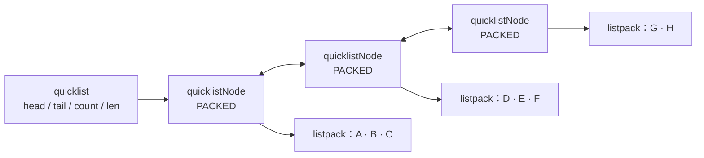
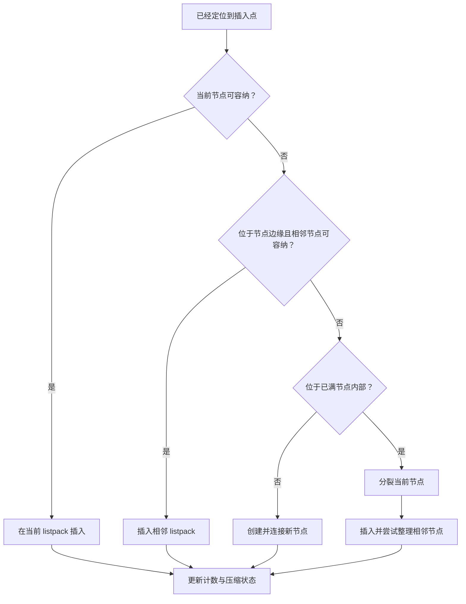

本文以 **Redis 8.4** 的实现为基准。讨论对象是 Redis List 的内存结构，不展开命令用法、阻塞唤醒、持久化、复制或队列方案。

## 整体结构：链表节点里装的不是一个元素

Redis List 的对象编码是 `quicklist`。它是一条双向链，但链上的每个 `quicklistNode` 通常不是一个列表元素，而是一段包含多个元素的紧凑内存，即 `listpack`。



`quicklist` 保存两组容易混淆的数量：

- `count` 是整个 List 的元素总数；
- `len` 是外层 quicklist 节点数。

每个节点又保存 `prev`、`next`、节点内元素数 `count`、节点数据大小 `sz`，以及数据是否压缩、采用何种容器等状态。于是 Redis 可以先沿外层链移动，再在选中的节点内部移动。

这里的关键不是“链表加数组”这样笼统的类比，而是**分段**：链表负责连接数据段，listpack 负责把一段元素连续放置。

## Quicklist 节点如何连接

外层是普通的双向关系：每个节点都知道前驱和后继，quicklist 直接保存头、尾指针。头尾插入若需要新节点，只需修改邻接指针和元数据，不必移动其他节点中的内容。

但“双向链表”不等于“每个操作都是常数时间”。只有已经拿到目标节点时，连接或断开节点才是局部修改。按索引寻找中间元素仍要跨越若干节点，并在目标 listpack 中继续定位。

节点有两种容器形态：

- `PACKED`：节点的 `entry` 指向一个 listpack，其中可保存多个元素；
- `PLAIN`：节点直接保存一个元素，主要用于不适合塞入普通 listpack 节点的超大值。

PLAIN 节点仍处在同一条 quicklist 链上。它不是另一种 List 编码，而是 quicklist 对异常大元素设置的边界，避免一个大值把常规紧凑节点的组织方式完全打乱。

## Listpack 如何连续保存多个元素

Listpack 是一块连续内存，整体可概括为：

```text
总字节数 | 元素数量 | entry 1 | entry 2 | ... | entry N | 结束标记
```

头部记录整块内存的总字节数和可缓存的元素数量，末尾有结束标记。中间的每个 entry 可以分成两部分：

```text
当前值的编码与内容 | 当前 entry 长度的反向编码
```

开头的编码同时说明值的类型和长度。较短字符串使用较短的长度编码；能够无损表示为整数的字符串，可以直接按不同宽度的整数编码。这样，小值不需要独立对象和固定大小的元数据。

entry 尾部保存的不是“前一个 entry 的长度”，而是**当前 entry 自身编码部分的长度**。从后向前遍历时，读取当前位置之前的反向长度字段，便可计算前一个 entry 的起点。这个长度本身也是变长编码，因此短 entry 只付出很少的额外字节。

连续内存带来紧凑性，也决定了修改成本：在 listpack 中间插入或删除后，后续字节通常需要通过内存移动让出空间或填补空洞；整块内存还可能重新分配。Quicklist 的分段正是把这种移动限制在一个节点内，而不是扩散到整个 List。

## 为什么元素要分成多个节点

假设所有元素都放在一个巨大 listpack 中，外层指针开销最低，但中间修改的搬移范围可能很大，内存重新分配也会涉及更大的连续区域。反过来，若一个链表节点只放一个元素，中间调整很局部，却会为每个元素重复支付节点、指针和内存分配器的成本。

Quicklist 把折中点变成“节点容量”：

- 节点较大，listpack 更密集，节点与指针更少，但单次局部搬移可能更重；
- 节点较小，修改影响的连续区域更小，但外层节点更多，遍历与元数据开销上升。

因此，Quicklist 不是在两种结构之间二选一，而是让二者各自只负责合适的粒度。

## 节点大小如何受到控制

Redis 8.4 使用 `list-max-listpack-size` 控制 PACKED 节点的填充上限。负值表示按近似字节容量限制：`-1` 到 `-5` 分别对应 4、8、16、32、64 KiB；正值表示每个节点允许的最大元素数。默认值是 `-2`，即 8 KiB 这一档。

这个配置描述的是**是否继续把元素放入某个 PACKED 节点的判定边界**，不能理解为所有节点最后都会恰好达到该大小。以下情况都会留下未填满节点：

- List 本身元素不多；
- 插入发生在中间，结构需要分裂；
- 元素大小不均匀；
- 删除使节点内容减少；
- 单个元素过大，转而使用 PLAIN 节点。

实现还会把即将插入元素的编码开销计算在内，并设置安全上限。因此，按元素数配置也不意味着节点字节数可以无限增长。

## 从两端插入时发生什么

以尾部插入为例，Redis 先看尾节点：

1. 如果尾节点是 PACKED，并且加入新值后仍符合填充限制，就把值追加到该 listpack；
2. 如果值应由 PLAIN 节点承载，就创建只保存这个值的新节点；
3. 如果尾部 PACKED 节点不能再接纳该值，就新建 PACKED 节点并连接到尾部；
4. 更新节点元素数、节点大小、quicklist 的总元素数和节点数；
5. 根据压缩深度重新维护节点压缩状态。

头部插入完全对称。常见的两端操作之所以快，是因为它们直接从 `head` 或 `tail` 开始，通常只修改一个 listpack；若需扩展，也只连接一个新节点。这里仍然存在 listpack 的扩容和字节搬移，只是范围受节点容量约束。

## 中间插入为何需要分裂

中间插入先得到一个由“节点 + 节点内偏移”组成的位置。之后并非无条件分裂当前节点，源码会依次利用局部空间：

- 当前节点还有容量时，直接在当前 listpack 中插入；
- 插入点恰在节点边缘，而相邻节点有容量时，可放入相邻节点；
- 当前节点与相邻节点都不合适时，才创建新节点；
- 插入点位于已满节点内部时，会先分裂节点，再把新值放入合适的一侧或独立节点。



分裂不是简单地“从中点对半切”。实现会结合插入方向和节点内位置移动一部分 entry，使插入后的逻辑顺序保持不变。分裂完成后，还会检查附近节点是否可以合并，以免一次中间插入永久留下过多小节点。

这也说明一个重要区别：**节点合并主要是插入分裂后的结构整理手段，并不是每次删除后的必经步骤。**

## 删除如何改变结构

删除一个 PACKED 节点内的元素时，listpack 移走对应 entry，后续字节向前填补，节点的元素数、字节数和 quicklist 总元素数随之减少。

如果节点因此变空，Redis 会把整个节点从双向链中摘除，并更新 `head`、`tail` 和 `len`。如果节点仍有元素，它可以保持未填满状态；普通删除路径不会不断扫描并合并相邻节点来追求最密集布局。

这种选择让删除的结构维护保持局部。代价是操作历史会影响节点填充率：两个相邻节点都不满，并不自动意味着它们马上合并。Quicklist 追求的是有界的局部工作量，而不是每次操作后都得到全局最紧凑的排列。

## 按索引查找是两层定位

Redis List 支持正索引和负索引。Quicklist 会让非负索引从头部开始，让负索引从尾部开始。随后使用各节点缓存的 `count` 跳过整个节点，直到索引落入某个节点的范围，再调用 listpack 的定位逻辑寻找节点内 entry。

设目标之前需要跨过的 quicklist 节点数为 $q$，在目标 listpack 内需要经过的 entry 数为 $p$，则一次定位的结构成本可以写成：

$$
T = O(q + p)
$$

其中 $q$ 和 $p$ 都取决于索引方向、节点填充情况和元素分布。Listpack 可以从更接近目标的一端开始遍历，但它没有为每个 entry 建立随机访问索引。因此，`LINDEX` 不是数组式的 $O(1)$ 访问；外层节点的 `count` 只能让 Redis 成段跳过元素，不能直接计算任意 entry 的内存地址。

## 压缩的是内部节点，不是整个 List

Quicklist 还允许用 LZF 压缩内部节点。`list-compress-depth` 表示从头、尾两侧各保留多少层节点不压缩：

- `0` 关闭 List 节点压缩，也是 Redis 8.4 的默认值；
- `1` 保留头节点和尾节点；
- `2` 从两端各保留两个节点；
- 更深处且满足条件的 PACKED 节点才可能压缩。

两端保持原始状态，是因为 push、pop 最常触碰头尾。访问一个压缩节点时，Redis 需要先解压；若这只是临时访问，操作结束后再依据状态将它压缩回去。节点太小或压缩收益不足时，也可能维持原始编码。

所以压缩深度交换的是常驻内存与访问成本：深度较小意味着更多内部节点具备压缩机会，但触碰这些节点可能增加解压、重压缩和临时内存开销。它与 RDB 文件压缩不是同一个机制。

## 不同元素分布会放大不同成本

大量短元素通常能让一个 listpack 容纳较多 entry，节点和指针的摊销较低；代价是节点内部插入、删除要移动连续字节。

少量超大元素更可能形成 PLAIN 节点。此时 listpack 的紧凑编码优势变弱，结构更接近“一节点一大值”，但大值不会迫使普通 PACKED 节点无限膨胀。

高频两端操作通常只接触边缘节点，能直接利用 quicklist 的头尾指针。高频中间修改则同时支付定位和 listpack 搬移成本，节点满时还可能分裂。高频随机索引访问需要反复进行两层遍历，不能因为 quicklist 缓存了元素数量就把它当作数组。

这些表现不是彼此孤立的复杂度条目，而是同一结构设计的结果：**外层移动的单位是节点，内层移动的单位是字节编码的 entry。**

## 总结

Redis List 的底层不是逐元素链表，而是一条由数据段组成的双向链：

- quicklist 用头尾指针、节点链接和计数组织多个数据段；
- PACKED 节点使用 listpack 连续保存多个字符串或整数；
- PLAIN 节点隔离不适合进入常规紧凑节点的超大元素；
- 填充限制约束单段大小，从而限制连续内存修改的影响范围；
- 中间插入通过复用邻近空间、创建节点、分裂与局部合并维持结构；
- 删除优先保持局部，不承诺每次都合并成最紧凑布局；
- 索引访问先跨节点，再在 listpack 内扫描；
- 可选的内部节点压缩进一步用计算时间交换内存。

理解 List 的关键，是把“链表”换成“受控分段”这一视角。它既解释了两端操作为什么通常高效，也解释了中间修改、随机索引和内部压缩的成本为何不会凭空消失。

## 参考资料

- [Redis 8.4：quicklist.h](https://github.com/redis/redis/blob/8.4/src/quicklist.h)
- [Redis 8.4：quicklist.c](https://github.com/redis/redis/blob/8.4/src/quicklist.c)
- [Redis 8.4：listpack.c](https://github.com/redis/redis/blob/8.4/src/listpack.c)
- [Redis 8.4：redis.conf](https://github.com/redis/redis/blob/8.4/redis.conf)
