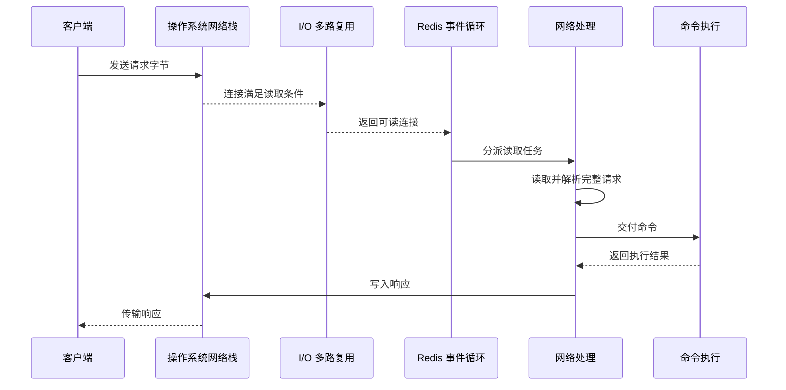
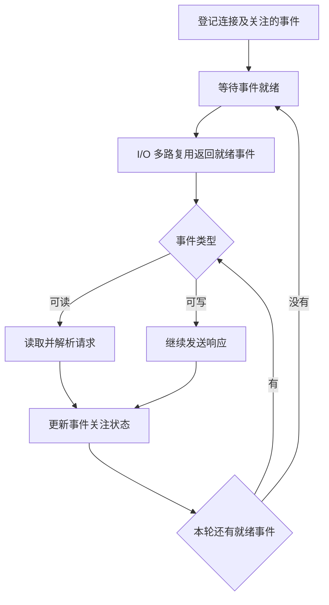

Redis 需要同时管理大量客户端连接，其中多数连接并非持续传输数据。网络模型的核心问题是：如何避免空闲或缓慢的连接占用执行线程，并将已就绪连接上的请求交给命令执行路径。Redis 将这个过程分为就绪检测、事件分派、网络读写和命令执行几个阶段。

## 一条命令的完整处理路径

客户端建立连接并发送命令后，请求经过以下阶段：

1. 操作系统接收客户端发送的字节；
2. 连接满足读取条件，I/O 多路复用机制报告可读事件；
3. 事件循环取得就绪事件，并分派读取任务；
4. Redis 读取数据，识别并解析完整请求；
5. 命令进入核心执行路径，访问或修改数据；
6. Redis 生成响应，并将暂时无法发送的数据保存在输出缓冲区；
7. 连接满足写入条件后，Redis 继续发送响应。

这条路径包含三个不同层次：I/O 多路复用发现哪些连接可以继续处理，事件循环组织处理顺序，网络处理与命令执行完成实际工作。下面按这条路径分别说明。

## 等待连接：非阻塞 I/O 与 I/O 多路复用

如果线程对一个连接执行阻塞读取，而该连接尚未发送数据，线程会停在读取操作上。此时，即使其他连接已经有请求到达，该线程也无法处理。为每个连接分配独立线程可以隔离等待，但连接数量会直接增加线程数量及其内存和调度成本。

Redis 采用非阻塞 I/O。一次读取或写入暂时无法继续时，操作会返回，执行线程可以处理其他连接。非阻塞 I/O 解决了“不能停在单个连接上等待”的问题，但它本身不负责指出哪些连接已经可以处理。

I/O 多路复用负责就绪检测。Redis 将多个连接交给操作系统统一监视；当其中一部分连接满足读取或写入条件时，操作系统返回这些连接。这样，执行线程不需要逐个尝试，也不需要为每个连接维持一个等待线程。

“可读”表示对该连接执行读取时可以取得数据，“可写”表示可以继续向连接写入数据。就绪状态不表示请求已经读取、命令已经执行或响应已经发送。I/O 多路复用只回答“哪些连接可以继续处理”。

因此，非阻塞 I/O 与 I/O 多路复用解决的问题不同：前者避免一次操作阻塞线程，后者避免程序反复检查大量暂未就绪的连接。

## 分派事件：事件循环

事件循环是一种持续运行的控制流程。它把程序关心的事件与对应的处理逻辑关联起来，并反复执行“等待事件、取得事件、调用处理器”这组步骤。这里的“循环”不是反复遍历所有连接，而是在没有可处理工作时借助 I/O 多路复用等待；只有连接就绪后，才处理返回的事件。

Redis 会为连接登记所关心的事件及其处理器。例如，新连接通常需要关注可读事件；响应暂时没有发送完时，还需要关注可写事件。I/O 多路复用只负责报告“哪些连接已经就绪”，事件循环再根据事件类型找到并调用相应处理器：可读事件进入请求读取与解析流程，可写事件继续发送输出缓冲区中的数据。

事件循环的一轮通常包含以下过程：

1. 根据已经登记的事件，等待连接进入可读或可写状态；
2. I/O 多路复用返回本轮已经就绪的连接和事件类型；
3. 事件循环依次取出这些事件，调用对应的处理器；
4. 处理器读取请求、执行后续逻辑或发送响应，并按需要增加、修改或取消事件关注；
5. 本轮就绪事件处理完毕后，事件循环重新进入等待，开始下一轮。

因此，I/O 多路复用与事件循环不是同一概念。前者是操作系统提供的就绪通知机制，回答“哪些连接现在可以读写”；后者是 Redis 组织工作的控制流程，回答“取得就绪事件后调用什么处理逻辑，以及处理完后做什么”。事件循环也不是一个额外的线程，它描述的是线程持续执行的工作方式。

事件循环可以管理大量并发连接，是因为没有事件的连接只保留连接状态，不会让执行线程阻塞在该连接上。多个连接可以同时处于已连接或已就绪状态，但事件循环仍需要逐个分派和处理本轮事件，这不表示这些连接上的命令会同时进入核心数据执行阶段。

事件处理器必须及时返回，事件循环才能继续处理其他连接。如果某条命令长时间占用核心执行路径，循环就无法及时回到后续事件，其他已就绪连接也会等待。因此，事件循环消除了对空闲连接的阻塞等待，但不能消除慢命令造成的阻塞。多个连接同时就绪时，跨连接的处理顺序还会受到操作系统返回顺序等因素影响，不应视为可预测的全局到达顺序。

## 读取请求：从字节流到完整命令

Redis 客户端通常通过 TCP 连接发送 RESP 请求。TCP 提供连续字节流，不保留应用层消息边界。因此，客户端一次发送的命令不一定由 Redis 一次完整读到：一次读取可能只得到部分命令，也可能同时得到多条命令。

Redis 读取数据后，需要根据 RESP 描述的类型和长度判断请求是否完整。数据不足时，已读取内容需要保留，等待连接再次可读；数据包含多条完整命令时，这些命令可以依次进入后续处理。

这一阶段说明了可读事件与完整命令之间的区别：

- 可读事件表示连接中存在可读取的数据；
- 读取操作把字节从网络层移入 Redis；
- 协议解析确定字节是否组成完整请求；
- 请求完整后才能交给命令执行路径。

因此，一个可读事件不等于一条命令，一次读取也不等于一次完整请求处理。

## 执行命令：网络并发与串行执行

请求解析完成后，普通命令进入核心执行路径。多个连接可以并发等待和传输数据，但核心数据命令依次执行。网络层的并发管理与命令层的串行执行并不冲突。

串行执行减少了多个线程同时访问共享数据时需要的锁竞争和执行协调，也使一条普通命令在执行过程中不会与另一条普通命令交错修改数据。该模型依赖单次命令在有限时间内完成。

如果一条命令需要处理大量元素，它会持续占用核心执行路径。已经完成网络读取的后续命令仍需等待，形成队头阻塞。I/O 多路复用只能继续发现网络事件，不能缩短正在执行的命令。

命令执行完成只表示结果已经产生，不表示客户端已经收到响应。结果还需要经过缓冲和网络发送阶段。

## 返回响应：输出缓冲区与可写事件

Redis 生成响应后会尝试写入连接。非阻塞写入可能一次完成，也可能只发送部分数据。例如，客户端读取速度较慢或网络发送缓冲区暂时没有足够空间时，剩余数据不能继续写入。

未发送的数据会保存在客户端输出缓冲区中。Redis 关注该连接的可写状态，连接再次满足写入条件后继续发送。这样，单个慢客户端不会使线程阻塞在发送操作上。

非阻塞发送避免了线程等待，但不能消除数据积压。如果 Redis 生成响应的速度持续高于客户端接收速度，输出缓冲区会增长并占用内存。大响应会增加结果生成、缓冲和传输成本；慢客户端则会延长数据在缓冲区中的停留时间。Redis 提供输出缓冲区限制和客户端内存限制，以约束这类连接的内存占用。

## I/O 线程改变了哪些阶段

在早期模型中，网络读写和命令执行主要由同一事件循环线程推进。即使命令执行时间较短，套接字读写和请求解析也会消耗 CPU。Redis 6 开始支持 I/O 线程，将部分客户端网络处理工作分配给其他线程。

I/O 线程作用于请求路径中的网络阶段，包括套接字读写和相关解析工作；具体职责取决于版本和配置。普通命令对核心数据的访问并不会因为启用 I/O 线程而自动改为并行执行。

Redis 6 和 Redis 7 使用第一代线程化 I/O 模型。Redis 8 重新设计了异步 I/O 线程，客户端可以由特定 I/O 线程处理套接字读写和命令解析。该变化扩大了网络处理利用多核 CPU 的范围，但没有把“网络处理并行”改写为“所有命令并行执行”。

因此，I/O 线程主要缓解网络阶段的 CPU 压力：

- 网络读写成为瓶颈时，可以由多个线程分担；
- 慢命令仍会占用核心命令执行路径；
- 大响应仍受内存和网络带宽限制；
- 慢客户端仍可能造成输出缓冲区增长。

支持 I/O 线程也不等于实例已经启用多个 I/O 线程。实际行为需要结合 Redis 版本和配置判断。

## 总结

一条 Redis 命令从连接到响应的处理关系如下：

1. 非阻塞 I/O 避免线程停在暂时无法读写的连接上；
2. I/O 多路复用从大量连接中返回已经就绪的连接；
3. 事件循环分派读取和写入任务；
4. 网络处理读取字节并识别完整请求；
5. 核心执行路径依次执行普通命令；
6. 未能立即发送的响应进入输出缓冲区；
7. I/O 线程在相应版本和配置下分担网络处理。

连接并发、网络 I/O 和命令执行属于不同阶段。区分这些阶段，可以判断延迟来自连接等待、协议读取、命令执行、响应缓冲还是网络发送。

## 参考资料

1. [Redis client handling](https://redis.io/docs/latest/develop/reference/clients/)
2. [Redis serialization protocol specification](https://redis.io/docs/latest/develop/reference/protocol-spec/)
3. [Diagnosing latency issues](https://redis.io/docs/latest/operate/oss_and_stack/management/optimization/latency/)
4. [Diving into Redis 6: Fast, Secure, and Powerful](https://redis.io/blog/diving-into-redis-6/)
5. [Redis 8 GA: Fast, scalable, and feature-rich](https://redis.io/blog/redis-8-ga/)
