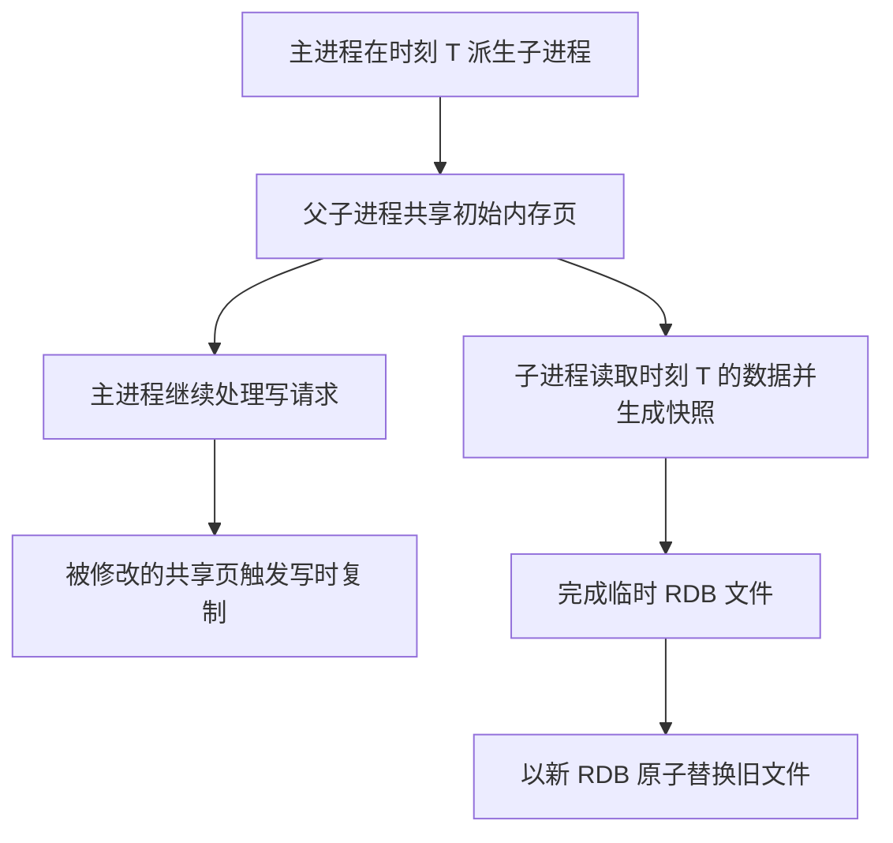
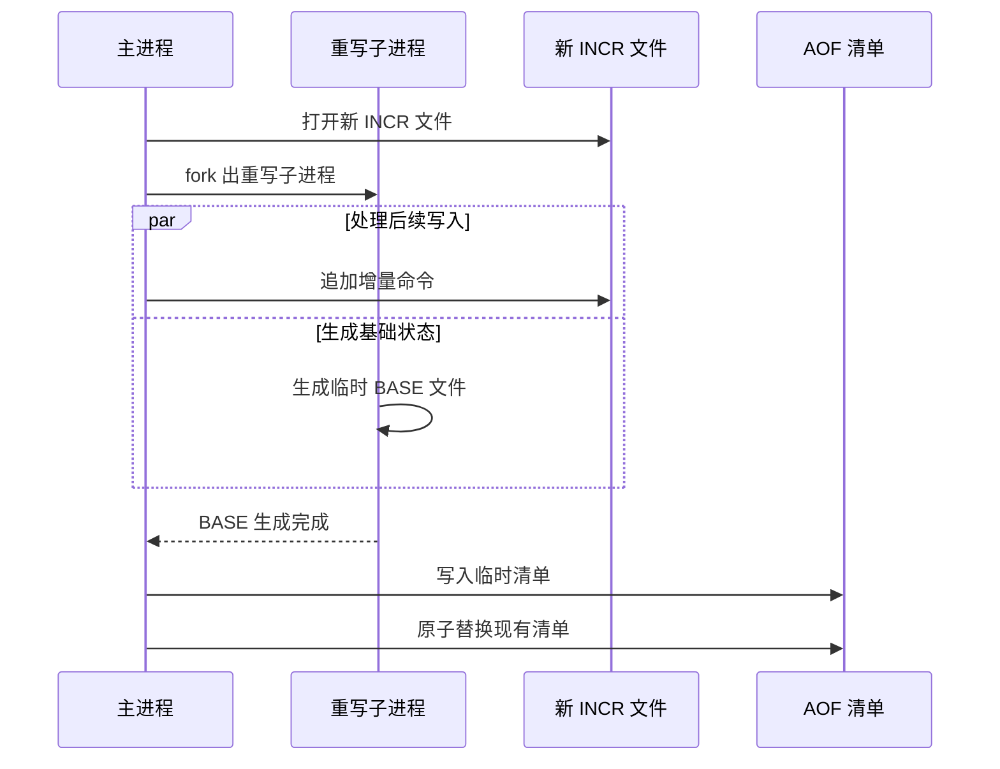

# Redis 持久化原理：RDB、AOF 与混合持久化

Redis 的主要数据集位于内存。持久化要解决的问题，是在进程退出或机器重启后，从磁盘上的有限信息重建内存状态。

RDB 与 AOF 采用两种不同的记录模型：RDB 保存某个时间点的数据状态，AOF 保存改变状态的写操作。混合持久化没有引入第三种模型，而是把快照与增量日志放进同一套 AOF 文件结构，以缩短恢复时间并保留较小的数据丢失窗口。

本文以 Redis 7.x 为版本边界，主要说明后台持久化、AOF 多文件结构与启动恢复原理，不展开配置和运维操作。

## 持久化保证取决于数据到达哪里

一次写命令执行成功，只表示 Redis 已经改变内存中的数据。要成为可恢复数据，它还需要跨过几个边界：

写入进程缓冲区的数据会随进程崩溃而丢失；已经通过 `write` 进入操作系统页缓存的数据仍可能随操作系统崩溃或断电而丢失；只有完成相应同步操作后，Redis 才能把数据视为已经提交给持久化存储。RDB 不逐条推进这条路径，而是周期性生成完整快照，因此其数据边界由最近一次成功快照决定。

持久化也不等于复制或备份。持久化描述本机如何保存可恢复状态；复制把状态传播到其他 Redis 实例；备份则保留独立的历史副本。错误删除可以同时进入 AOF、RDB 和副本，所以持久化本身不能提供历史回退能力。

## RDB：保存一个时间点的数据状态

RDB 是 Redis 数据集的二进制快照。它记录键、值、过期时间等恢复内存状态所需的信息，而不是记录产生这些状态的每一步操作。

例如，一个计数器连续增加 100 次，RDB 只需要保存最终值；它不关心这个值来自一次赋值还是 100 次递增。因此，RDB 文件大小主要取决于快照时的数据集，而不是自上次快照以来发生过多少次写入。

### 后台快照如何获得一致视图

生成后台快照时，Redis 主进程派生子进程。子进程遍历自己看到的数据集并写入临时 RDB 文件，主进程继续处理请求。子进程完成写入后，新文件再替换旧 RDB 文件。

父子进程能够并行访问同一份初始数据，依赖操作系统的写时复制机制。`fork` 之后，父子进程最初共享相同的物理内存页；当主进程修改某个共享页时，操作系统复制该页，让父进程写入副本，而子进程继续读取原来的页。

写时复制维持的是子进程在 `fork` 时看到的逻辑视图。快照生成期间到达的新写入不会混入该快照，也不会阻塞到整个文件写完。

### 快照成本来自三个阶段

RDB 不会让主进程持续执行磁盘写入，但不代表后台快照没有前台成本。

首先，主进程需要执行 `fork`。数据集越大，建立和复制页表等进程元数据所需的时间通常越长；在此期间，事件处理可能出现停顿。

其次，快照期间发生的写入会触发内存页复制。额外内存取决于被修改的页面数量，而不是简单等于数据集大小。写入越密集、修改覆盖的页面越分散，额外内存越多。

最后，子进程需要读取整个数据集并写出文件。这会消耗 CPU、内存带宽和磁盘 I/O，并可能间接影响主进程延迟。

### RDB 的数据丢失窗口

每个成功生成的 RDB 都是一个离散恢复点。若最近一次快照完成于 T1，实例在下一次快照完成前的 T2 崩溃，那么 T1 之后的写入不在可恢复文件中。

因此，RDB 的数据丢失窗口由相邻成功快照之间的实际间隔决定。缩短间隔会减少潜在丢失量，却会增加 `fork`、写时复制和全量写盘发生的频率。这一矛盾来自全量快照模型本身。

## AOF：记录从旧状态到新状态的写操作

AOF 不定期复制整个数据集，而是把改变数据的命令序列化为 Redis 协议格式并追加到日志。Redis 重启时按顺序重放这些命令，即可重新得到内存状态。

同一个最终状态可能对应很长的操作历史。一个键被反复覆盖，旧命令在逻辑上已经失效，却仍然占据 AOF 空间。因此，AOF 的持续追加解决了增量持久化问题，同时产生了日志无限增长的问题。

### 写入与落盘是两个动作

Redis 执行写命令后，会把需要传播到 AOF 的内容追加到进程内缓冲区。事件循环把缓冲区内容写入 AOF 文件后，数据通常先进入操作系统页缓存；`fsync` 再要求操作系统把相关数据同步到持久化存储。

三个常见同步时机的本质差异如下：

| 同步时机 | 已确认写入的持久化边界 | 崩溃时的主要风险 |
| --- | --- | --- |
| 每批写入后同步 | 回复客户端前完成相应同步 | 单次同步进入请求关键路径，延迟受存储影响 |
| 周期性同步 | 最近一次周期同步的位置 | 丢失最近一个同步周期内的写入 |
| 交给操作系统同步 | 最近一次由操作系统完成的回写位置 | 数据丢失窗口由内核回写策略和运行状态决定 |

这里需要区分“追加到文件”和“已经持久化”。`write` 成功不能单独证明数据已到达非易失介质。AOF 能提供怎样的数据安全边界，最终取决于同步发生在何时。

### AOF 恢复为什么通常慢于 RDB

RDB 恢复主要是解析紧凑的对象状态并重建内存结构。AOF 恢复则要按顺序解析并执行日志中的写命令；同一个键的多次历史修改也要依次处理，直到得到最终状态。

因此，在表示同一数据集时，纯命令格式 AOF 通常比 RDB 包含更多数据和更多恢复步骤。这个差异来自“重放过程”与“加载结果”两种恢复模型，而不是文件扩展名本身。

## AOF 重写：用当前状态压缩操作历史

AOF 重写不是压缩原文件，也不是逐条分析哪些旧命令可以删除。Redis 直接读取当前内存数据集，为每个键生成能够重建其当前状态的最短等价命令序列。

例如，同一个计数器执行 100 次递增后，重写结果不需要保留 100 条递增命令，只需生成一条能够恢复最终值的命令。重写关注的是状态等价，而不是历史等价，所以重写后的 AOF 不能继续表示完整操作历史。

### Redis 7.x 的多文件 AOF

从 Redis 7.0 开始，AOF 由一个清单文件管理多类文件：

- **BASE 文件**：最多一个，表示最近一次重写时的数据集基础状态，可以使用 RDB 或 AOF 格式。
- **INCR 文件**：一个或多个，保存 BASE 之后的增量写命令。
- **HISTORY 文件**：成功重写后被替代的旧 BASE 和 INCR 文件，随后可以清理。

清单记录哪些文件共同构成当前有效 AOF。恢复时不能只找到名字最新的文件，而要按照清单确定基础文件和增量文件的顺序。

### 重写期间的新写入不会消失

Redis 7.x 开始重写时，父进程打开新的 INCR 文件并继续追加后续写入，子进程根据 `fork` 时的数据视图生成新的 BASE 文件。两个路径分别记录“重写起点的状态”和“起点之后的变化”。

如果子进程重写失败，旧 BASE、已有 INCR 与新打开的 INCR 仍能覆盖完整的状态变化；成功后，Redis 用新 BASE 和对应 INCR 生成临时清单，再原子替换生效中的清单。原子切换的对象是当前有效文件集合的索引，而不是在原文件上就地修改。

Redis 7.0 以前主要依靠重写缓冲区保存重写期间的新写入，最后再把缓冲区内容追加到新文件。多文件 AOF 把这部分增量直接写入独立文件，减少了重写末尾集中合并带来的内存与延迟压力。

## 混合持久化：RDB 基础状态加 AOF 增量

混合持久化发生在 AOF 重写过程中：BASE 文件使用 RDB 格式保存重写时的数据集，后续 INCR 文件仍以 AOF 命令格式记录增量写入。启动恢复时，Redis 先按 RDB 格式加载 BASE，再按顺序重放其后的 INCR。

这种结构利用了两种模型各自适合的部分：大量既有数据用紧凑的状态快照表示，重写完成后的少量变化用增量日志表示。相较纯命令格式 AOF，它通常减少基础文件体积和启动时需要重放的命令数量；相较单独 RDB，它又能继续保留快照之后的写入。

混合持久化容易与“同时启用 RDB 和 AOF”混淆，二者并不相同：

| 机制 | 文件关系 | 启动恢复 |
| --- | --- | --- |
| 同时启用 RDB 与 AOF | 独立生成 RDB 快照和 AOF 文件集合 | AOF 启用且可用时，Redis 优先用 AOF 恢复，因为它通常更完整 |
| AOF 混合持久化 | AOF 的 BASE 使用 RDB 格式，INCR 使用命令格式 | 先加载同一套 AOF 中的 RDB BASE，再重放 INCR |

所以，混合持久化仍属于 AOF 体系。RDB 格式在这里承担 AOF 基础段的编码方式，并不意味着 Redis 同时选择两份独立文件进行合并恢复。

## 启动恢复如何选择和加载数据

启动时，Redis 根据已启用的持久化方式决定恢复来源。

只有 RDB 时，Redis 读取 RDB 文件并直接重建键空间。AOF 启用时，Redis 读取 AOF 清单，先加载 BASE，再按序加载全部有效 INCR；BASE 若为 RDB 格式，则交给 RDB 加载逻辑，若为 AOF 格式，则按命令日志处理。当 RDB 与 AOF 同时启用时，Redis 使用 AOF 恢复，因为 AOF 覆盖的写入通常晚于最近一次 RDB 快照。

不同损坏位置的含义也不同。RDB 是完整快照，意外截断通常意味着无法得到完整数据集。AOF 的末尾若只包含一条未写完的命令，Redis 在允许加载截断日志时可以丢弃这个不完整尾部，恢复到之前的完整命令；但日志中部损坏会破坏后续命令的解析边界，不能等同于安全丢弃末尾。

原子替换降低的是“旧文件被半成品覆盖”的风险，不能防止存储介质损坏、静默数据错误或所有文件同时丢失。持久化机制只能在文件仍满足其格式和一致性条件时完成恢复。

## 三种机制的本质差异

| 对比维度 | RDB | 纯命令格式 AOF | 混合 AOF |
| --- | --- | --- | --- |
| 记录模型 | 时间点状态 | 写操作序列 | RDB 基础状态加 AOF 增量 |
| 数据丢失边界 | 最近一次成功快照之后 | 最近一次完成同步之后 | 由 AOF 增量段的同步边界决定 |
| 文件增长方式 | 每次生成新的全量快照 | 随写命令持续追加，重写后收缩 | BASE 在重写时更新，INCR 持续追加 |
| 恢复方式 | 直接加载对象状态 | 顺序重放命令 | 先加载状态，再重放增量命令 |
| 后台生成成本 | `fork`、写时复制、全量扫描与写盘 | 日常追加；重写时同样需要后台生成基础状态 | 与 AOF 重写相同，BASE 使用 RDB 编码 |
| 可读性 | 二进制格式 | 命令段可解析 | BASE 不可直接按命令阅读，INCR 可解析 |

RDB 用较大的时间间隔换取紧凑文件和较短恢复路径；AOF 用持续记录换取更小的数据丢失窗口，但需要同步策略和周期性重写；混合 AOF 改变的是 AOF 基础段的表示方式，没有改变增量写入何时真正落盘这一耐久性边界。

## 结语

Redis 持久化可以归结为两个基本模型。

快照模型直接保存结果。它不保留操作历史，恢复路径短，但两个快照之间天然存在数据空档。日志模型保存状态变化。它可以持续逼近内存中的最新状态，但日志会增长，恢复也需要重放，因此必须通过重写把冗余历史折叠为当前状态。

Redis 7.x 的混合持久化把二者组合进多文件 AOF：RDB 格式的 BASE 提供紧凑起点，AOF 格式的 INCR 保留后续变化，清单通过原子替换决定哪组文件有效。理解这三部分的关系，比单独记忆 RDB 与 AOF 的功能列表更能说明 Redis 如何在恢复速度、运行成本和数据丢失窗口之间建立边界。

## 参考资料

- [Redis 官方文档：Redis persistence](https://redis.io/docs/latest/operate/oss_and_stack/management/persistence/)
- [Redis 7.4 `aof.c`：多文件 AOF、同步与重写实现](https://github.com/redis/redis/blob/7.4/src/aof.c)
- [Redis 7.4 `rdb.c`：RDB 保存与加载实现](https://github.com/redis/redis/blob/7.4/src/rdb.c)
