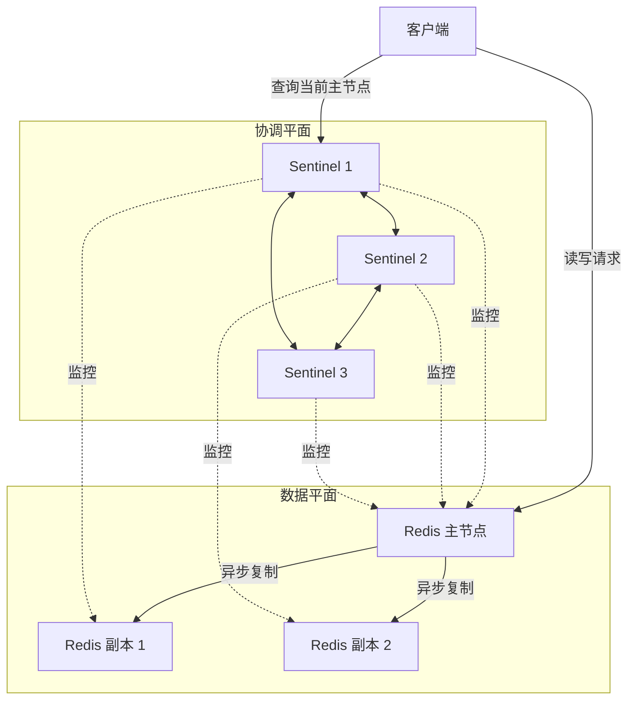
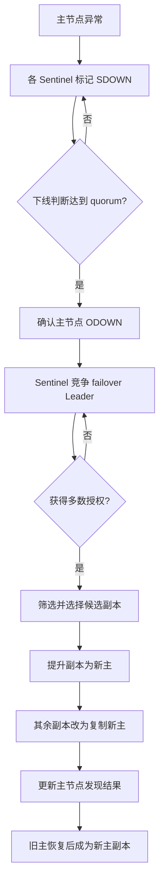

# Redis Sentinel 是什么：原理与自动故障转移流程

假设一个 Redis 主节点突然宕机：谁来确认它真的不可用？谁选择一个副本接替它？其他副本如何改为复制新主？客户端又怎样找到新主？

主从复制本身不能回答这些问题。它能持续产生数据副本，却不会自动完成故障判断、角色切换和地址发现。Redis Sentinel（哨兵）就是为普通 Redis 主从架构补上这套高可用协调能力的组件。

一句话概括：**Sentinel 不存储业务数据，而是在多个 Redis 数据节点之外，负责监控、判断故障、组织主从切换，并告诉客户端当前主节点在哪里。**

## 为什么有主从复制还不够

主从复制解决的是“数据有没有副本”。主节点接收写入，副本异步复制主节点的数据；主节点失效后，副本中的数据仍可能存在。

但如果没有额外的协调机制，运维人员仍要手工完成一连串操作：确认故障不是短暂抖动，从多个副本中选择新主，提升它的角色，让其他副本改为复制新主，修改应用连接地址，并在旧主恢复后避免出现两个可写主节点。

因此，**复制解决副本问题，Sentinel 解决发现与协调问题**。两者相互配合，但不是同一种能力。

## Sentinel 的四项职责

Redis 官方文档把 Sentinel 的职责归纳为四类：

1. **监控**：持续检查主节点、副本和其他 Sentinel 是否按预期工作。
2. **通知**：通过事件通知机制向管理员或其他程序报告异常。
3. **自动故障转移**：主节点故障时，选出一个副本提升为新主，调整其余节点的复制关系，并处理恢复后的旧主。
4. **配置提供者**：客户端向 Sentinel 查询某个服务当前的主节点地址。故障转移后，客户端再次查询即可发现新主。

这里的“配置”不是业务配置中心，而是针对 Redis 主节点位置的服务发现。Sentinel 自身不承载键值数据，也不替代 Redis 数据节点。

## 整体架构：数据平面与协调平面

图中可以把系统理解为两个平面：

- 主节点和副本组成数据平面，处理业务读写与数据复制；
- 多个 Sentinel 组成协调平面，分别监控节点，并在需要时交换故障判断、请求授权和更新主节点信息。

客户端不应只写死一个主节点地址。它通常保存多个 Sentinel 地址以及一个服务名：先联系任一可用 Sentinel，查询当前主节点，再连接真正的数据节点。多个 Sentinel 的价值不只是“多放几个探针”，还在于降低单个 Sentinel 误判或失效对自动切换的影响。

## Sentinel 如何发现异常

Sentinel 会周期性向监控对象发送命令并收集状态。例如，PING 用于检查响应是否及时，INFO 可提供 Redis 节点的角色和复制状态，Sentinel 之间也会交换各自掌握的信息。

如果某个实例在配置的时间窗口内没有返回可接受的 PING 响应，单个 Sentinel 会认为它不可用。除超时路径外，还有一种容易忽略的情况：如果逻辑上的主节点在 INFO 中把自己报告为副本，Sentinel 也可以把它判断为下线。

但网络世界里，“我访问不到它”不等于“所有人都访问不到它”。某个 Sentinel 与主节点之间可能只是局部网络故障。因此 Sentinel 把故障判断分为两个层次。

## SDOWN 与 ODOWN 有什么区别

| 对比项 | SDOWN（主观下线） | ODOWN（客观下线） |
| --- | --- | --- |
| 判断者 | 单个 Sentinel | 汇总多个 Sentinel 的判断 |
| 含义 | “从我的视角看，它不可用” | “已有足够多 Sentinel 认为主节点不可用” |
| 适用对象 | 主节点、副本和 Sentinel | 仅主节点 |
| 是否需要 quorum | 不需要 | 需要达到该主节点配置的 quorum |
| 是否直接等于可执行切换 | 否 | 否，还需 Leader 获得足够授权 |

SDOWN（Subjectively Down）是本地判断。每个 Sentinel 都可以独立进入或撤销这个状态。

ODOWN（Objectively Down）只用于主节点。当某个 Sentinel 认为主节点 SDOWN 后，它会询问其他 Sentinel 的看法；认为主节点下线的 Sentinel 数量达到 quorum，才会形成 ODOWN。这里是对多方观察结果的汇总，不应把它理解成严格意义上的分布式强共识。

## quorum 为什么不等于 majority

这是理解 Sentinel 时最关键的区别之一。

**quorum（法定人数）用于确认 ODOWN**。例如 quorum 为 2，至少两个 Sentinel 认为主节点下线，才能进入客观下线状态。

**majority（多数授权）用于决定哪个 Sentinel 可以组织本轮故障转移**。设监控该主节点且参与授权的已知 Sentinel 数为 N，在稳定拓扑中可近似理解为部署数量，那么多数门槛是 `floor(N / 2) + 1`。真正执行自动故障转移时，发起者既要满足 quorum 相关条件，也要获得足够授权；入门层面可把最低可用规模概括为：

`max(quorum, floor(N / 2) + 1)`

这个公式描述两类门槛的共同约束，**不表示所有 Sentinel 在同一轮投票里同时决定“主节点下线”和“由谁切换”**。ODOWN 判断与 Leader 授权是前后不同的阶段。即使 quorum 很小，也不能绕过多数授权要求。

## 自动故障转移的完整流程

一次典型的自动故障转移可以拆成七步：

1. **发现异常**：各 Sentinel 独立监控主节点，部分 Sentinel 先后将它标记为 SDOWN。
2. **确认 ODOWN**：Sentinel 询问同伴；认为主节点下线的数量达到 quorum 后，确认主节点 ODOWN。
3. **竞争组织权**：希望发起切换的 Sentinel 请求其他 Sentinel 授权。获得所需多数授权的 Sentinel 成为本轮 failover Leader。
4. **挑选候选副本**：Leader 从可用副本中筛选并排序，确定最适合提升的节点。
5. **提升新主**：Leader 命令选中的副本停止复制旧主并转为主节点，然后等待角色变化生效。
6. **重配其余副本**：其他副本被逐步改为复制新主，复制拓扑重新收敛。
7. **处理旧主并更新发现结果**：旧主恢复后会被配置为新主的副本；Sentinel 对外提供的新主地址也随之更新，客户端可重新发现。

这些步骤强调“组织切换”而不是瞬间改名。网络通信、节点状态变化与复制重建都需要时间，所以故障转移期间可能出现短暂不可用。

## 两类“选举”不要混为一谈

Sentinel 语境里常有两个容易混淆的选择过程。

第一类是**选 failover Leader**：多个 Sentinel 中，哪一个获得本轮所需授权，负责下发切换命令。这个 Leader 是协调者，不是新的 Redis 主节点。它达到规定的授权门槛即可，不是简单比较谁拿到“相对最多票”。

第二类是**选新主副本**：Leader 在 Redis 副本中选择谁被提升。这一步比较的是副本资格与优先级，不是在 Sentinel 中选协调者。

把参与者分清就容易理解：前者在 Sentinel 之间发生，结果是“谁来组织”；后者在 Redis 副本之间筛选，结果是“谁成为新主”。

## Sentinel 怎样选择新主

Sentinel 不会只看“哪个副本延迟最低”或“哪个数据最新”这一个指标。它先排除明显不合格的副本，例如已经 SDOWN、`replica-priority` 为 0，或与主节点断开时间过长的副本。

对剩余候选者，再按规则排序：优先选择较小的 `replica-priority`；优先级相同时，选择复制 offset 较大的副本，通常意味着复制进度更靠前；仍相同时，以较小的 run ID 作为稳定的最终排序依据。

因此更准确的入门表述是：**先按健康和资格过滤，再按人工优先级、复制进度和稳定标识依次比较**。这也说明为什么不能把新主选择简化成单一指标。

## 客户端如何发现新主

支持 Sentinel 的客户端通常配置三类信息：多个 Sentinel 地址、被监控主节点的服务名，以及连接 Redis 所需的认证等参数。

启动时，客户端依次尝试可用 Sentinel，并通过 `SENTINEL get-master-addr-by-name` 查询服务对应的主节点地址。为避免连到状态尚未收敛的错误节点，客户端实现还可以使用 `ROLE` 检查目标确实是主节点。

当 Redis 连接断开时，客户端应重新走发现流程，向 Sentinel 查询新地址并重连。Sentinel 具备事件通知能力，但这不等于它会无条件把新主连接“推送”给所有客户端；可靠的客户端必须具备查询、校验和重新发现能力。

## Sentinel 能解决什么，不能解决什么

Sentinel 能减少主节点故障后的人工介入，避免应用长期依赖已失效的固定地址，并让复制拓扑自动恢复。它适合需要主从高可用、但不需要数据分片的场景。

它不能消除所有风险：

- **不能保证零数据丢失**：Redis 主从复制默认是异步的。主节点确认写入后、数据尚未到达副本时发生故障，或者网络分区使旧主仍被部分客户端访问，都可能丢失已确认写入。`min-replicas` 和 `WAIT` 等机制只能降低风险，不能把异步复制变成绝对不丢数据。
- **不能做数据分片**：Sentinel 不把键分散到多个主节点，也不是 Redis Cluster 的控制器。需要水平分片时应评估 Redis Cluster 等方案。
- **不能替代备份**：高可用关注服务尽快恢复；备份用于应对误删除、逻辑错误、数据损坏和长期留存。副本同步了错误操作，Sentinel 也无法把历史数据变回来。

## 常见误区

**误区一：有副本就能自动切换。** 副本只提供数据副本；故障检测、协调提升与客户端发现需要 Sentinel 或其他方案。

**误区二：一个 Sentinel 也能实现可靠高可用。** 单 Sentinel 自身会成为判断与协调的单点，也无法利用多方观察和多数授权。

**误区三：达到 quorum 就一定能切换。** quorum 只解决 ODOWN 判断，Leader 还必须获得相应多数授权。

**误区四：failover Leader 就是新主。** Leader 是组织本轮切换的 Sentinel；新主是被提升的 Redis 副本。

**误区五：Sentinel 会主动替所有客户端换连接。** 客户端需要支持 Sentinel 协议，并在断线后重新查询、验证和连接。

**误区六：自动故障转移意味着零丢失、零中断。** 异步复制存在数据窗口，检测与拓扑收敛也需要时间。高可用的目标是自动恢复和缩短中断，不是突破这些系统边界。

## 总结

理解 Sentinel，可以抓住一条主线：它先让每个 Sentinel 形成 SDOWN 本地判断，再以 quorum 汇总为主节点 ODOWN；随后由 Sentinel 之间进行独立的 Leader 授权，由获授权的协调者筛选并提升副本、重配复制拓扑，最后由客户端通过服务名重新发现当前主节点。

主从复制回答“数据副本在哪里”，Sentinel 回答“故障时由谁判断、由谁协调、客户端去哪里找新主”。分清数据节点与协调节点、ODOWN 与 Leader 授权、协调者选举与新主选择，Sentinel 的整体原理就不再神秘。

## 参考资料

- [Redis Sentinel 官方文档](https://redis.io/docs/latest/operate/oss_and_stack/management/sentinel/)
- [Redis Sentinel 客户端规范](https://redis.io/docs/latest/develop/reference/sentinel-clients/)
- [Redis 复制官方文档](https://redis.io/docs/latest/operate/oss_and_stack/management/replication/)
