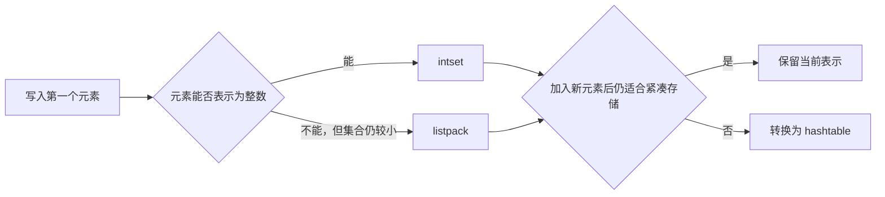

Redis Set 对外只有一种语义：元素无序且不重复。但在 Redis 内部，同一个 Set 可能使用 `intset`、`listpack` 或 `hashtable` 保存。

这并不是实现上的偶然差异，而是一条清晰的设计路线：**先用更紧凑的结构降低小集合的内存成本，当数据不再适合紧凑存储时，再转换为查找效率更稳定的哈希表。**

本文以 Redis 8.0 为版本前提，只讨论这条路线是如何实现的。

## 从 Set 的语义推导底层需求

实现 Set，首先要解决两个问题：

1. 插入一个元素时，必须判断它是否已经存在，以保证唯一性；
2. 查询一个元素时，应尽快回答“存在”或“不存在”。

最直接的选择是哈希表。把 Set 的成员作为哈希表的键，不需要有意义的值：插入键时自然完成判重，查询键时自然完成成员判断。

但哈希表为了换取快速定位，需要桶、指针、节点以及预留空间。集合很小时，这些辅助信息可能比元素本身占用更多内存。因此，Redis 没有让所有 Set 从一开始就承担哈希表的固定成本，而是先观察元素的类型、长度和数量，再选择表示方式。

## intset：用有序整数数组实现集合

当成员都能表示为十进制的 64 位有符号整数，并且数量没有超过配置阈值时，Redis 可以使用 `intset`。

它的核心是一段连续、按数值升序排列的整数数组。由于数组有序，成员查询可以使用二分查找；如果找到相同整数，说明元素已经存在，插入应被拒绝。如果没有找到，查找过程同时得到新元素应处的位置。

这种设计把“查询”和“判重”统一成了同一个过程：

- 查询通过二分查找完成，时间复杂度为 $O(\log N)$；
- 插入先用二分查找定位，再移动插入点之后的元素，整体最坏为 $O(N)$；
- 删除同样需要移动后续元素，最坏为 $O(N)$。

这里的 $N$ 是集合当前的成员数。`intset` 牺牲了插入、删除的最坏时间，换来连续内存和很少的结构性开销，因此只适合规模受限的集合。

### 整数宽度如何变化

`intset` 不会一开始就为每个成员分配 64 位，而是根据当前最大取值范围，统一采用 16、32 或 64 位宽度。

例如，集合原本使用 16 位整数，后来加入一个无法用 16 位表示的值，Redis 会扩展整段数组，并把已有元素重新写成更宽的格式。所有元素使用同一宽度，使任意位置都可以通过“起始地址 + 下标 × 宽度”直接定位，结构仍然简单紧凑。

宽度升级需要搬迁已有元素，所以它是一次 $O(N)$ 操作；升级完成后不会因为删除大整数而自动降级。否则，频繁跨越边界的数据会反复改写整个数组，得不偿失。

## listpack：用紧凑序列容纳短字符串

只用 `intset` 仍然会遇到一个问题：一个很小的 Set 只要出现普通字符串，就必须立刻使用哈希表。为了让小型字符串集合也能享受紧凑存储，Redis 7.2 起可以用 `listpack` 编码 Set。

`listpack` 把多个元素紧密排列在一段连续内存中。每个元素携带自身编码和长度信息，不需要像普通哈希节点那样为每个成员保存独立节点和指针，因此空间利用率较高。

代价是它没有按成员建立索引。判断成员是否存在时，需要从头依次比较，复杂度为 $O(N)$；插入前也必须先扫描判重，插入或删除还可能引起内存扩展及数据移动。

这再次体现了同一个取舍：当 $N$ 很小时，线性扫描的绝对成本有限，节省下来的结构开销更有价值；当 $N$ 增大后，继续扫描整个序列就不再合算。

## hashtable：用额外空间换取快速定位

当紧凑表示不再适用时，Redis 将 Set 转换为 `hashtable`。其中每个成员只作为键存在，值为空；哈希表自身保证键不能重复，因此天然符合 Set 的唯一性。

一次成员查询大致经历三个步骤：

1. 根据成员内容计算哈希值；
2. 用哈希值定位桶；
3. 在桶对应的位置中比较实际成员，处理哈希冲突。

理想分布下，添加、删除和成员判断的平均时间复杂度都是 $O(1)$。它不是“永远只访问一次内存”，而是通过额外的桶、节点和空闲容量，把查找范围控制在很小的局部区域。

哈希表增长时需要扩容并重新安排成员。Redis 的字典使用渐进式 rehash：新旧两张表可以在一段时间内并存，后续操作逐步搬迁桶，而不是在一次普通操作中迁移全部成员。这样减少了单次扩容造成的长时间停顿，但迁移期间会暂时使用更多内存，查询也必须兼顾两张表。

## 表示转换：把偶发成本留在边界上

Redis 8.0 默认允许最多 512 个整数成员使用 `intset`；小型非整数 Set 使用 `listpack` 时，默认限制为最多 128 个成员且单个成员不超过 64 字节。这些值分别由 `set-max-intset-entries`、`set-max-listpack-entries` 和 `set-max-listpack-value` 控制。

转换并不只是修改一个类型标记。Redis 必须遍历旧结构，把每个成员写入新结构，然后释放旧结构。因此，从紧凑表示转换到哈希表本身是一次 $O(N)$ 操作，触发转换的那次写入可能比平时更慢。

具体转换路线取决于新元素：

- `intset` 加入普通字符串时，如果整个集合仍满足 `listpack` 的限制，可以转为 `listpack`；否则直接转为 `hashtable`；
- `intset` 的成员数超过整数集合阈值时，转为 `hashtable`；
- `listpack` 的成员数量或成员长度超过阈值时，转为 `hashtable`。

普通删除不会把 `hashtable` 自动缩回 `listpack` 或 `intset`。这种单向策略避免了数据在阈值附近变化时反复全量转换。也就是说，阈值决定的是“紧凑表示还能保留多久”，而不是让对象在每次操作后都重新选择理论上最省空间的结构。

## 集合运算：归结为遍历、判断与写入

三种表示不同，但 Redis 在它们上面抽象出了共同能力：取得成员数、遍历成员、判断成员是否存在，以及向结果集合写入成员。交集、并集和差集都可以由这些基础动作组合出来。

### 交集

交集的基本思路是先按成员数从小到大排列输入集合，然后遍历最小集合。对其中每个成员，依次到其他集合中判断是否存在；只要有一个集合不包含它，就立即停止检查该成员。

选择最小集合不是改变数学结果，而是减少候选成员数量。若最小集合有 $N$ 个成员，共有 $M$ 个集合，官方给出的最坏复杂度为 $O(N \times M)$。

### 并集

并集依次遍历所有输入集合，把成员写入一个临时结果 Set。重复成员会被结果 Set 的判重机制自动忽略。因此，并集本质上是“遍历所有输入 + 利用 Set 去重”，工作量主要由所有输入成员的总数决定。

### 差集

差集有两条可行路线：

1. 遍历第一个集合，只把不存在于其他集合的成员写入结果；
2. 先复制第一个集合，再遍历后续集合并从结果中删除成员。

第一种路线适合第一个集合较小的情况，第二种路线适合后续集合总规模较小的情况。Redis 会估算两条路线的工作量后再选择，而不是把差集永久绑定到一种固定算法。这说明数据结构只是基础，输入规模也会参与算法决策。

## 总结

Redis Set 的实现可以沿着一条思路线理解：

1. Set 需要判重和成员判断，因此底层结构必须支持查找；
2. 小集合中，结构性内存开销比渐近复杂度更值得关注，所以 Redis 使用 `intset` 或 `listpack`；
3. 集合增长后，线性移动或扫描的代价上升，于是 Redis 转向 `hashtable`；
4. 交集、并集和差集再建立在“遍历、成员判断、结果写入”这些基础能力之上，并根据输入规模选择执行顺序或算法。

因此，Redis Set 并不是“一个哈希表”的简单包装。它更像一个保持集合语义不变、同时根据数据形态在空间效率与操作效率之间移动的自适应容器。

## 参考资料

- [Redis OBJECT ENCODING 文档](https://redis.io/docs/latest/commands/object-encoding/)
- [Redis 8.0 默认配置](https://github.com/redis/redis/blob/8.0/redis.conf)
- [Redis 8.0 Set 实现](https://github.com/redis/redis/blob/8.0/src/t_set.c)
- [Redis 8.0 intset 实现](https://github.com/redis/redis/blob/8.0/src/intset.c)
- [Redis SINTER 文档](https://redis.io/docs/latest/commands/sinter/)
- [Redis SDIFF 文档](https://redis.io/docs/latest/commands/sdiff/)
- [Redis SUNION 文档](https://redis.io/docs/latest/commands/sunion/)
