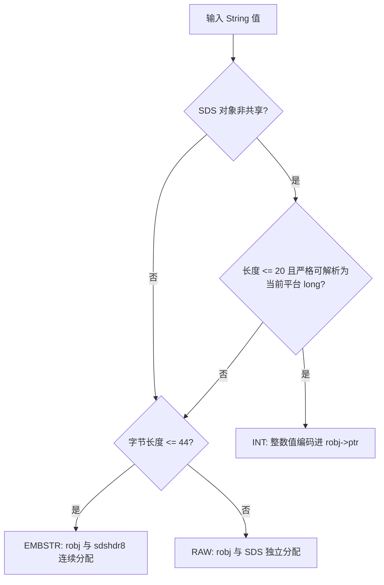

# Redis String 类型的数据存储原理：对象编码与 SDS

Redis 的 String 看起来只是一个二进制安全的字符串值，但落到内存里并不等于一段裸 `char *`。在 Redis 7.4 中，一个 String 值通常由两层结构共同表示：外层是 Redis 对象 `robj`，负责记录类型、编码和对象元信息；内层是具体数据，可能是直接塞进指针里的整数，也可能是 SDS（Simple Dynamic String）。

本文只讨论 Redis 7.4 下 String 值的内存表示、对象编码、SDS 结构和追加扩容。TTL、内存淘汰、持久化、复制、集群，以及位图、位域这类基于 String 的应用场景不展开。

一句话概括：**String 的逻辑类型固定是字符串，但 Redis 会根据值的形态选择更省内存或更适合修改的内部编码；这些编码是实现细节，不是客户端协议承诺。**

## 从 robj 看 String 的第一层包装

Redis 键空间里保存的值不是直接指向业务字符串，而是指向一个 `robj`。对 String 来说，`robj` 的核心作用是回答三个问题：

- `type`：这个对象的逻辑类型是不是 `OBJ_STRING`；
- `encoding`：这个 String 当前用 `INT`、`EMBSTR` 还是 `RAW` 表示；
- `ptr`：指向实际数据，或者在 `INT` 编码下直接保存整数值。

这就解释了为什么 `OBJECT ENCODING key` 能看到 `int`、`embstr`、`raw` 等结果。它观察的是 Redis 当前实现的内部编码，不是 `GET` 返回值的一部分；业务代码不应依赖这个结果做兼容性判断。

## 三种编码分别解决什么问题

String 常见的三种编码是 `INT`、`EMBSTR`、`RAW`。

`INT` 用于某些可以严格解析为整数的短字符串。它不再额外分配一段 SDS 保存字符，而是把整数值编码进 `robj->ptr`。这样 `SET n 100` 这类值可以避免字符串内容的分配开销。注意这里说的是内部表示；执行 `GET n` 时，客户端看到的仍然是字符串语义的 `"100"`。

`EMBSTR` 用于较短、一次创建后通常不直接原地修改的字符串。Redis 7.4 的源码常量 `OBJ_ENCODING_EMBSTR_SIZE_LIMIT` 是 `44`，长度不超过该阈值的非整数 String 可以创建为 EMBSTR。它会一次性分配连续内存，布局近似为：

```text
一块内存: robj + sdshdr8 + buf 数据 + 结尾 \0
```

这种布局减少了分配次数，也让对象头和字符串内容靠得更近。但不要把它理解成“EMBSTR 必然占 64 字节”。源码注释说明 44 这个阈值与 jemalloc 的 64 字节分配档位有关，但真实占用会受平台、编译选项、分配器和 Redis 版本影响。跨版本也不应假设阈值永远不变。

`RAW` 用于较长字符串，或者需要变更的现有字符串。RAW 下 `robj` 和 SDS 是两次独立分配：`robj->ptr` 指向一段 SDS。它比 EMBSTR 多一次分配和一次指针跳转，但适合 `APPEND`、`SETRANGE` 这类会改变内容长度或内容区域的操作。

## Redis 7.4 怎样选择编码

可以把新 String 对象的编码选择理解为下面这条流程。为了便于阅读，图里写的是 Redis 7.4 的实现规则摘要，不代表 Redis 协议对客户端承诺了这些编码。



这里有几个边界很容易被说错。

首先，`INT` 的判断不是“长得像数字就一定是 int”。Redis 7.4 的 `tryObjectEncoding` 会先确认对象是可编码的 SDS 字符串对象，并且引用计数不大于 1；共享对象不能随意改写编码。然后它只在长度不超过 20 字节且 `string2l` 能严格解析为当前平台 `long` 时进入整数编码路径。常见 64 位构建中，`long` 是 64 位；但这仍然是平台相关实现，不应写成跨平台绝对事实。

其次，`EMBSTR` 的阈值在 Redis 7.4 是 44 字节，不是一个协议常量。这个长度按字节计算，不按字符个数计算。中文、emoji 等多字节 UTF-8 内容即使视觉上很短，也可能超过 44 字节。

最后，已有对象在修改时可能被转换。比如一个短字符串刚 `SET` 后是 EMBSTR，随后对同一个键执行 `APPEND`，Redis 需要拿到可变的 SDS 空间，因此会把现有 String 变成 RAW 再追加，即使追加后的总长度仍然不长。

## SDS 保存的是二进制安全的字节串

SDS 是 Redis 自己实现的动态字符串。它对外表现为 `char *`，指针指向 `buf` 开头；在 `buf` 前面，则紧贴着一个头部结构。Redis 7.4 中常见头部包括 `sdshdr8`、`sdshdr16`、`sdshdr32`、`sdshdr64`，区别主要是 `len` 和 `alloc` 字段的宽度不同，用来适配不同大小的字符串。

这些头部有相同的语义：

- `len` 表示逻辑字节长度，也就是当前有效内容长度；
- `alloc` 表示容量，不包含头部，也不包含末尾额外的 `\0`；
- `flags` 的低 3 位表示 SDS 类型，Redis 可据此反推出头部大小；
- `buf` 保存真实字节内容，可以包含中间的 `\0`；
- `buf[len]` 始终保留一个结尾 `\0`，方便在安全场景下复用部分 C 字符串 API。

因此，SDS 同时满足两类需求：Redis 自己通过 `len` 做 O(1) 长度读取和二进制安全处理；需要调用传统 C API 时，又能把 `buf` 当作以 `\0` 结尾的字符串使用。`sdshdr5` 在源码中用于记录布局，但普通追加场景不会把它作为常规结构使用，因为它不能记录空闲容量。

这也是 `STRLEN` 可以 O(1) 返回长度的原因：Redis 不需要从头扫描到结尾 `\0`，直接读 SDS 的 `len`，或者在 `INT` 编码下先计算整数的十进制字符串长度。

## APPEND 时 SDS 如何扩容

`APPEND` 的关键不是每次都重新分配刚好够用的空间。Redis 7.4 的 SDS 扩容函数会先看当前空闲容量是否足够：

```text
如果 avail >= addlen:
  直接复用已有空间，不重新分配
```

如果空闲不够，设当前逻辑长度为 `len`，追加长度为 `addlen`，最低需要的新长度为 `R = len + addlen`。在贪婪扩容路径中，Redis 7.4 使用这条规则：

```text
如果 R < 1MiB:
  请求容量约为 2R
否则:
  请求容量约为 R + 1MiB
```

这里的“请求容量”还不是最终 `alloc`。Redis 会通过内存分配器申请空间，并读取分配器实际给出的 usable size；如果分配器给了更大的可用块，SDS 的 `alloc` 可能比请求值更大。换句话说，`alloc` 是 Redis 可用的容量，不等于业务字符串长度，也不一定等于源码里刚算出的请求值。

这种策略的意义在于连续小 `APPEND`。当容量被适度放大后，后续多次追加可以直接写入剩余空间，摊销意义上接近 O(1)。但一次真正发生扩容时，仍可能需要重新分配并复制已有内容；如果字符串已经很大，这次复制本身就会消耗明显 CPU 和内存带宽。

## 可以这样观察编码变化

下面的示例适合在 Redis CLI 中复制执行。不同平台、不同 `maxmemory` 策略和不同 Redis 版本可能影响内部编码结果；示例重点是观察机制，而不是把输出写进业务约束。

```redis
FLUSHDB

SET s1 12345
OBJECT ENCODING s1
STRLEN s1

SET s2 abc
OBJECT ENCODING s2
APPEND s2 d
OBJECT ENCODING s2
STRLEN s2

SET s3 0123
OBJECT ENCODING s3

SET s4 "hello world"
OBJECT ENCODING s4
APPEND s4 "!"
OBJECT ENCODING s4

INCR counter
GET counter
OBJECT ENCODING counter
```

常见 64 位 Redis 7.4 构建上，`s1` 这类十进制整数值常可观察到 `int`；短的 `s2`、`s4` 初始可能是 `embstr`；执行 `APPEND` 后，已有 String 会为了可变更而转为 `raw`，即使结果只是 `abcd` 或 `hello world!`。

`s3` 用来提醒“可解析为整数”是严格规则。带前导零的字符串通常不会按整数对象保存，因为 Redis 必须保持字符串值的外观语义，不能把 `"0123"` 悄悄变成 `"123"`。

`INCR` 仍然是 String 命令。它按有符号 64 位十进制整数解释值；键不存在时先按 `0` 处理，再执行自增；值不是整数或运算溢出时返回错误。常见 64 位构建中，自增后的整数值可能被编码为 `int`，但这属于内部优化，不是跨平台承诺。

## 工程上应该依赖什么

业务代码应该依赖 Redis 命令语义，而不是依赖对象编码。`OBJECT ENCODING` 更适合排查和学习：它能帮助判断某个值当前大致走了哪条内部路径，但编码可能因版本、平台、配置、命令路径和对象共享状态变化。

String 也不适合无节制地变大。Redis 默认单个 String 值上限是 512MB；这只是硬边界，不是推荐大小。大 String 会放大网络传输、事件循环处理、扩容复制、内存碎片和慢查询风险。实际业务中，如果内容天然很大，通常应考虑拆分、压缩、外部对象存储，或改用更贴合访问模式的数据模型。

最后再回到本文的主线：String 是 Redis 最基础的值类型，但它的存储并不单一。`robj` 决定对象类型和编码，SDS 负责保存二进制安全的动态字节串；`INT`、`EMBSTR`、`RAW` 则是在不同值形态和修改需求之间做出的实现级取舍。理解这些边界，有助于解释内存占用和命令行为，但不应把内部编码当成应用协议。

## 参考资料

- [Redis 官方文档：Strings](https://redis.io/docs/latest/develop/data-types/strings/)
- [Redis 官方文档：SET](https://redis.io/docs/latest/commands/set/)
- [Redis 官方文档：APPEND](https://redis.io/docs/latest/commands/append/)
- [Redis 官方文档：INCR](https://redis.io/docs/latest/commands/incr/)
- [Redis 官方文档：OBJECT ENCODING](https://redis.io/docs/latest/commands/object-encoding/)
- [Redis 官方文档：STRLEN](https://redis.io/docs/latest/commands/strlen/)
- [Redis 7.4 源码：src/object.c](https://github.com/redis/redis/blob/7.4/src/object.c)
- [Redis 7.4 源码：src/sds.h](https://github.com/redis/redis/blob/7.4/src/sds.h)
- [Redis 7.4 源码：src/sds.c](https://github.com/redis/redis/blob/7.4/src/sds.c)
- [Redis 7.4 源码：src/t_string.c](https://github.com/redis/redis/blob/7.4/src/t_string.c)
