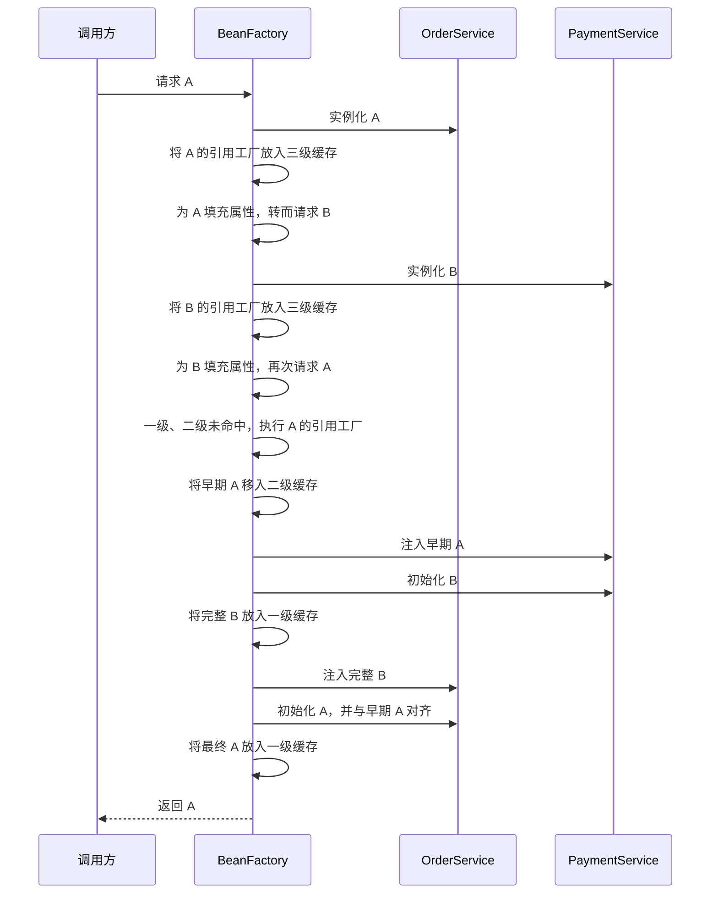

本文以 Spring Framework 6.2.19 为基准，说明 IoC 容器如何通过分阶段创建 Bean、提前暴露引用和三级缓存处理部分循环依赖，并解释 AOP 代理介入后如何保持引用一致。这里的“解决”是指容器能够完成对象创建和依赖注入，不代表这种依赖关系适合作为业务设计。

## 循环依赖发生在哪里

下面两个单例 Bean 通过 Setter 相互依赖：

```java
@Component
public class OrderService {

    private PaymentService paymentService;

    @Autowired
    public void setPaymentService(PaymentService paymentService) {
        this.paymentService = paymentService;
    }
}

@Component
public class PaymentService {

    private OrderService orderService;

    @Autowired
    public void setOrderService(OrderService orderService) {
        this.orderService = orderService;
    }
}
```

假设容器先创建 `OrderService`：它在填充属性时需要 `PaymentService`，于是转而创建后者；`PaymentService` 填充属性时又请求 `OrderService`。如果容器必须等一个 Bean 完成全部初始化后才能返回它，这条调用链就无法结束。

Spring 能继续创建的关键在于：Setter 和字段注入发生在对象实例化之后。`OrderService` 请求 `PaymentService` 之前，自身的原始实例已经存在，因此容器可以先把这个尚未完成属性填充和初始化的实例暴露给 `PaymentService`。

## Spring 能处理的范围

Spring 的提前暴露机制有明确前提：

| 场景 | 结果 | 原因 |
| --- | --- | --- |
| 单例 Bean 通过 Setter 或字段形成闭环 | 通常可以处理 | 对象可以先实例化，再注入依赖 |
| 两个 Bean 通过构造器相互注入 | 无法处理 | 创建任一实例前都必须先取得另一个实例 |
| prototype Bean 形成闭环 | 无法通过三级缓存处理 | prototype 不进入单例缓存，重复创建时会被检测为正在创建 |
| 容器禁止循环引用 | 无法处理 | 不会注册用于提前暴露的工厂 |

“使用了构造器注入”本身不是充分判断条件，关键是闭环能否从某个节点先完成实例化。两个 Bean 相互要求对方作为构造参数，是确定无法打破的典型情况。Spring 官方文档对这种情况会抛出 `BeanCurrentlyInCreationException`，并指出 Setter 注入可以让部分循环引用完成装配。

还要区分 Spring Framework 与 Spring Boot 的默认配置。Spring Framework 6.2.19 中 `allowCircularReferences` 默认为 `true`；Spring Boot 3.5 的 `spring.main.allow-circular-references` 默认为 `false`，它会把该选择应用到容器。不能根据 Spring Framework 的默认值推断 Spring Boot 应用一定允许循环引用。

## Bean 创建为何能够被拆开

与循环依赖直接相关的创建过程可以压缩为三个阶段：

1. **实例化**：调用构造器或工厂方法，得到原始对象。
2. **属性填充**：解析字段、Setter 等注入点并写入依赖。
3. **初始化**：执行 Aware 回调、BeanPostProcessor、初始化方法等，并可能得到代理对象。

`AbstractAutowireCapableBeanFactory#doCreateBean` 的行为可以概括为以下伪代码：

```text
实例 = 实例化 Bean

如果 Bean 是单例、允许循环引用且正在创建：
    注册一个“按需生成早期引用”的工厂

填充属性
结果 = 初始化 Bean
将结果与已经暴露的早期引用对齐
```

提前暴露发生在实例化之后、属性填充之前。被注入的早期引用因此可能指向一个字段尚未填满、初始化回调尚未执行的对象。三级缓存解决的是“引用从哪里取得”，不是“让未初始化对象提前完成初始化”。

## 三级缓存分别保存什么

所谓三级缓存，是 `DefaultSingletonBeanRegistry` 内三个以 Bean 名称为键的容器级数据结构。它们属于一个 `BeanFactory` 的单例注册表，不是业务对象内部的缓存。

| 俗称 | 源码字段 | 保存内容 |
| --- | --- | --- |
| 一级缓存 | `singletonObjects` | 已完成创建并可供后续查找的单例对象，可能是代理对象 |
| 二级缓存 | `earlySingletonObjects` | 已经生成并被取用的早期单例引用，可能是原始对象，也可能是代理对象 |
| 三级缓存 | `singletonFactories` | 用于按需生成早期引用的 `ObjectFactory` |

查找一个正在创建的单例时，容器依次执行以下逻辑：

```text
先查一级缓存
若 Bean 正在创建，再查二级缓存
若允许生成早期引用，再取三级缓存中的工厂并执行
工厂结果移入二级缓存，同时移除对应的三级缓存项
```

同一个早期引用只生成一次。Bean 最终完成后，结果进入一级缓存，对应的二级、三级缓存项被删除。因此这三个容器表达的不是三个副本，而是单例在创建过程中的不同状态。

## A → B → A 的完整过程

以下时序只保留与依赖闭环有关的步骤。图中的“早期 A”可能是原始对象，也可能是提前创建的 AOP 代理。



创建 B 时虽然也注册了三级缓存工厂，但这条路径没有再次请求正在创建的 B，所以该工厂不会被执行。B 完成后直接进入一级缓存。A 的工厂则在 B 回头请求 A 时被执行，闭环由此断开。

## 为什么需要第三级缓存

仅处理没有代理的 Setter 循环依赖时，提前把原始对象放进一个早期对象缓存也能打破闭环。因此，“没有三级缓存就绝对无法解决任何循环依赖”并不准确。

Spring 采用第三级缓存，是为了保存一个延迟执行的早期引用生成过程。它带来两个直接结果：

- 没有发生循环查找时，工厂不会执行，Bean 仍在正常初始化完成后决定是否包装为代理。
- 发生循环查找时，`getEarlyBeanReference` 可以让 `SmartInstantiationAwareBeanPostProcessor` 介入，返回适合提前注入的引用。

二级缓存负责保存工厂的执行结果，保证后续请求取得同一个早期引用；三级缓存负责推迟“该暴露原始对象还是代理对象”的决定。三级缓存不是专门存放 AOP 代理，它存放的是能够生成早期引用的工厂。

理论上也可以在实例化后立即创建代理并放入二级缓存，但这会对没有发生循环依赖的 Bean 也执行早期包装，并把“生成引用”和“保存已生成引用”混在一起。Spring 当前的三级结构将延迟生成、稳定复用和最终发布分开处理。

## AOP 场景如何保持同一个引用

假设 `OrderService` 需要事务或其他 AOP 增强。若容器把原始 `OrderService` 注入 `PaymentService`，随后又在初始化结束时把代理对象放入一级缓存，就会产生两个身份：

- `PaymentService` 持有原始对象，调用不会经过代理增强；
- 其他调用方从容器取得代理对象，调用会经过增强。

Spring 通过早期代理引用避免这种分裂。`AbstractAutowireCapableBeanFactory#getEarlyBeanReference` 会依次调用相关的 `SmartInstantiationAwareBeanPostProcessor`；AOP 的 `AbstractAutoProxyCreator` 可以在这里执行 `wrapIfNecessary`，提前返回代理，并记录原始 Bean 已经生成过早期引用。

初始化完成后的处理分为两步：自动代理器识别该 Bean 已经在早期阶段处理过，避免再次创建另一层代理；Bean 工厂再把最终暴露对象对齐为二级缓存中的早期代理。这样，`PaymentService` 中注入的引用与后来 `getBean` 返回的引用保持一致。

这套机制仍不能保证初始化期间调用是安全的。代理的目标对象此时仍可能缺少其他依赖，初始化方法也可能尚未执行。代理只统一了引用身份，没有改变目标对象的生命周期状态。

## 仍然失败或存在风险的情况

### 相互构造器注入

如果 A 的构造器需要 B，B 的构造器也需要 A，那么容器在得到任一原始实例之前就进入了闭环，没有对象可以注册为早期引用。三级缓存无法凭空创建实例。

### prototype 循环依赖

三级缓存服务于单例注册表。prototype 每次请求都要创建新实例，不会把一个共享的早期对象发布到该注册表；同一 prototype 在当前线程中再次进入创建流程时，容器会抛出 `BeanCurrentlyInCreationException`。

### 禁止循环引用

当 `allowCircularReferences` 为 `false` 时，`doCreateBean` 不会注册早期引用工厂。Spring Boot 应用即使把 `spring.main.allow-circular-references` 改为 `true`，也只是允许容器尝试上述机制，不能让构造器闭环或 prototype 闭环变得可解。

### 初始化期间过早使用依赖

Setter、`@PostConstruct`、自定义 BeanPostProcessor 或初始化期间启动的异步任务，如果立即调用处于同一闭环中的对象，可能观察到未注入字段、未执行完成的初始化逻辑，或者形成依赖创建与业务线程之间的竞态。容器启动成功只证明装配流程完成，不证明早期引用在初始化期间可以承接业务调用。

### 后处理器无法提供一致的早期包装

如果某个自定义后处理器只在初始化后包装 Bean，却没有提供等价的早期引用，依赖方可能已经拿到原始对象，而一级缓存最终准备发布包装对象。Spring 默认不接受这种引用不一致，相关检查可能以 `BeanCurrentlyInCreationException` 终止创建，而不是静默保留两种身份。

## 设计上的处理顺序

三级缓存是容器兼容部分依赖闭环的实现机制，不应成为引入循环依赖的理由。处理现有闭环时，可以按以下顺序判断：

1. 先确认闭环是否来自职责划分。例如订单与支付都依赖一段协调逻辑时，将该逻辑提取到第三个服务，通常可以得到单向依赖。
2. 如果一方只需要通知另一方而不需要同步返回值，可以考虑通过应用事件反转调用方向。
3. 如果依赖只在某个操作发生时才需要，可以评估延迟查找或拆分接口，但应明确由谁负责生命周期和错误处理。
4. 只有无法立即重构的遗留场景，才考虑临时允许 Setter 或字段注入循环依赖，并补充启动测试验证代理与初始化行为。

构造器注入会把不可解的依赖闭环直接暴露出来，也能保证正常取得的对象处于完整状态。将构造器改成 Setter 只是改变了容器能否提前发布对象，没有消除业务模型中的双向耦合。

## 总结

Spring 解决部分循环依赖依赖三个条件：单例对象能够先完成实例化、容器允许提前暴露、依赖注入发生在实例化之后。三级缓存分别承担最终单例发布、早期引用复用和早期引用延迟生成；当 AOP 介入时，早期引用机制还用于保证依赖方与最终调用方取得同一个代理对象。

该机制不能处理相互构造器注入或 prototype 闭环，也不能保证未完成初始化的对象可以安全执行业务逻辑。遇到循环依赖时，首先应修正依赖方向；三级缓存更适合作为理解容器行为和排查启动异常的模型。

## 参考资料

- [Spring Framework 6.2.19：Dependency Injection](https://docs.spring.io/spring-framework/reference/6.2/core/beans/dependencies/factory-collaborators.html)
- [Spring Framework 6.2.19：DefaultSingletonBeanRegistry](https://github.com/spring-projects/spring-framework/blob/v6.2.19/spring-beans/src/main/java/org/springframework/beans/factory/support/DefaultSingletonBeanRegistry.java)
- [Spring Framework 6.2.19：AbstractAutowireCapableBeanFactory](https://github.com/spring-projects/spring-framework/blob/v6.2.19/spring-beans/src/main/java/org/springframework/beans/factory/support/AbstractAutowireCapableBeanFactory.java)
- [Spring Framework 6.2.19：AbstractAutoProxyCreator](https://github.com/spring-projects/spring-framework/blob/v6.2.19/spring-aop/src/main/java/org/springframework/aop/framework/autoproxy/AbstractAutoProxyCreator.java)
- [Spring Boot 3.5：Application Properties](https://docs.spring.io/spring-boot/3.5/appendix/application-properties/index.html)
